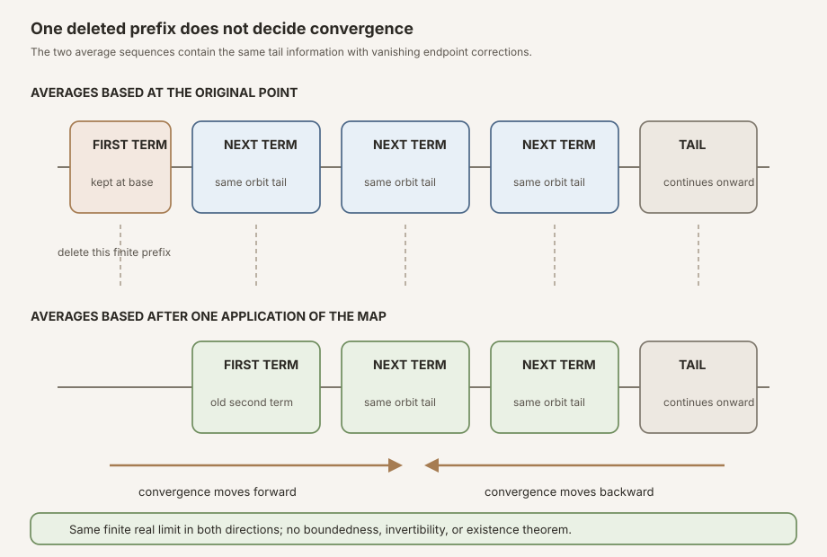
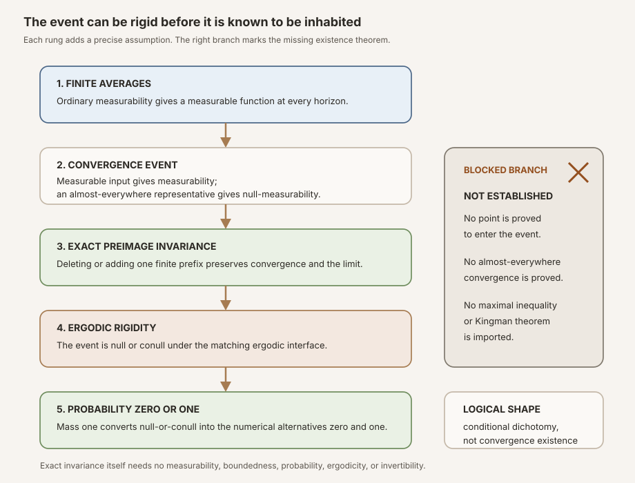


**AI-use disclosure.** Generative-AI tools helped draft, revise, illustrate,
and review this note. The author selected the questions, shaped the
exposition, has inspected the sources and artifacts cited here, and is
responsible for the final text and claims. This is an independent,
non-peer-reviewed Research Note. Verify claims against the cited primary
sources and any released artifacts before relying on them.



**Editorial status.** This teaching chapter is published as an open working
note while human
editorial acceptance and the separate scientific-integrity and zero-context
expert-reader reviews are pending. The checked Lean source is authoritative
for every theorem statement.



**Abstract.** Let \(T:\Omega\to\Omega\) be a discrete-time map and let
\(g:\Omega\to\mathbb R\). Mathlib defines the finite Birkhoff sum and its
totalized average by

\[
S_n g(\omega)=\sum_{j=0}^{n-1}g\bigl(T^j\omega\bigr),
\qquad
A_n g(\omega)=\frac{1}{n}S_n g(\omega),
\]

with \(A_0g=0\). RMT-22 proves ordinary measurability of \(S_n g\) and
\(A_n g\) from ordinary measurability of \(T\) and \(g\). It proves finite
integrability from measure preservation and one-step integrability. No finite
measure or probability assumption is needed for those finite-horizon facts.

The module defines \(E(T,g)\) to be the set of points where
\(n\mapsto A_n g(\omega)\) tends to some finite real number. If \(T\) and
\(g\) are measurable, \(E(T,g)\) is measurable. If \(g\) is only measurable
almost everywhere, a measurable representative and quasi-measure preservation
make \(E(T,g)\) null-measurable. The representative argument takes a
countable intersection over all horizons because Mathlib's upstream
almost-everywhere transport theorem is stated one fixed horizon at a time.

Two exact finite identities compare the averages based at \(\omega\) and at
\(T\omega\). Their coefficients tend to one and their endpoint corrections
tend to zero. Hence convergence at either base point is equivalent to
convergence at the other, with the same finite limit. Therefore

\[
T^{-1}\bigl(E(T,g)\bigr)=E(T,g)
\]

for every function \(T\), even a noninjective, nonmeasurable one. Combining
that exact invariance with a matching ergodic interface gives an
almost-everywhere empty-or-universal dichotomy. Probability normalization
converts the dichotomy to measure zero or one. The conclusion still does not
choose which side holds.

Thin wrappers expose the event for the one-step observable \(X_1\) of the
project's integrable shifted-subadditive candidate and for the one-step
log-positive norm observable of a discrete matrix cocycle. They prove no
convergence existence, almost-everywhere membership, maximal inequality,
pointwise Birkhoff theorem, Kingman theorem, limit-integral identity,
Lyapunov exponent, or Oseledets splitting.


This is the proof-to-prose companion for
<code>formalization/NonlinearDynamics/Random/RandomCocycles/BirkhoffConvergence.lean</code>.
It covers all thirty-seven public declarations in exact source order and all
twelve anonymous compiled boundary probes.

Its immediate predecessor is
[Pack the Marked Starts: Ordered Disjoint Intervals for Subadditive Cocycles in Lean]().
RMT-21 supplies a finite covering inequality but no mechanism making its marked
set large. The earlier interface audit
[Probability and Ergodic Base Interfaces for Matrix Cocycles]()
separates integrability, probability normalization, preservation, and
ergodicity. RMT-22 now gives those interfaces a concrete invariant event while
leaving the missing convergence theorem visible.

Reusable definitions include the
, the
,
and the
.
The parallel textbook treatment is
[Birkhoff Convergence Events Before the Pointwise Ergodic Theorem]().

## Choose a route up

| Route | Begin | Destination |
|---|---|---|
| First encounter | [Time averages ask two different questions](#time-averages-ask-two-different-questions) | Separate existence from rigidity before reading a theorem |
| Finite route | [Reuse Mathlib's finite Birkhoff API](#reuse-mathlibs-finite-birkhoff-api) | Understand totalization, measurability, and integrability |
| Measure route | [Turn pointwise convergence into an event](#turn-pointwise-convergence-into-an-event) | Follow measurable and null-measurable paths |
| Algebra route | [Delete one prefix without changing the limit](#delete-one-prefix-without-changing-the-limit) | Derive both shift identities and their limit consequences |
| Ergodic route | [Climb from exact invariance to conditional rigidity](#climb-from-exact-invariance-to-conditional-rigidity) | Distinguish null-or-conull from probability zero-or-one |
| Project route | [Specialize without importing a theorem](#specialize-without-importing-a-theorem) | Reach candidate and matrix-cocycle wrappers |
| API route | [The complete source-order tour](#the-complete-source-order-tour) | Audit every public declaration |
| Boundary route | [Twelve probes audit the quantifiers](#twelve-probes-audit-the-quantifiers) | Test time zero, identity, noninvertibility, zero measure, and divergence |
| Integrity route | [What this event does not prove](#what-this-event-does-not-prove) | Block pointwise Birkhoff and Kingman overreads |

### Learning objectives

By the summit, a reader should be able to:

1. distinguish a finite Birkhoff sum from a totalized Birkhoff average;
2. explain why the time-zero average is exactly zero;
3. state the hypotheses for finite-horizon measurability;
4. state the different hypotheses for finite-horizon integrability;
5. explain why neither finite theorem needs a probability measure;
6. define the finite-real convergence event without asserting membership;
7. explain why a sequence of measurable real functions has a measurable
   convergence event;
8. distinguish measurable, almost-everywhere measurable, almost-everywhere
   strongly measurable, and integrable observables in this module;
9. explain why quasi-measure preservation is needed to transport null
   exceptions through every iterate;
10. explain why fixed-horizon almost-everywhere equality must be intersected
    over countably many horizons;
11. derive the forward finite-prefix average identity;
12. derive its reverse identity;
13. identify the coefficient sequences tending to one;
14. identify the endpoint terms tending to zero;
15. prove that convergence moves from \(\omega\) to \(T\omega\);
16. prove that convergence moves back without inverting \(T\);
17. distinguish equality of limits from mere equivalence of existence;
18. read exact preimage invariance as a pointwise biconditional;
19. explain why exact event invariance needs no measurable structure;
20. distinguish the measurable/pre-ergodic route from the
    null-measurable/quasi-ergodic route;
21. distinguish almost-everywhere empty-or-universal from numerical
    probability zero-or-one;
22. explain why either dichotomy remains conditional on event membership;
23. explain why the zero-measure dichotomy is true but vacuous;
24. explain why identity dynamics can have universal convergence without
    being ergodic;
25. identify why \(X_0\) is absent from the one-step event;
26. state which candidate fields are and are not used by each wrapper;
27. state why the cocycle event is measurable without generator
    integrability or a nonempty matrix index;
28. distinguish Mathlib's existing bounded shift-difference theorem from
    RMT-22's boundedness-free convergence equivalence;
29. recognize a concrete divergent orbit in the final probes; and
30. list every major analytic theorem that remains unproved.

## Time averages ask two different questions

Imagine following one state \(\omega\) under repeated application of \(T\):

\[
\omega,\quad T\omega,\quad T^2\omega,\quad T^3\omega,\quad\ldots
\]

An observable \(g\) assigns a real reading to each visited state. The average
\(A_n g(\omega)\) asks for the mean of the first \(n\) readings. At least two
questions immediately arise:

1. Does the sequence \(A_n g(\omega)\) converge for this point?
2. If the set of convergent points is invariant and the system is ergodic,
   how large can that set be?

The first is an existence question. The second is a rigidity question.
Birkhoff's 1931 paper is part of the historical origin of modern pointwise
ergodic theory, but its original setting and language should not be silently
identified with every modern abstract formulation
([Birkhoff, 1931](#ref-rmt22-birkhoff)). RMT-22 does not formalize that
historical theorem. It isolates the event needed to state the first question,
then proves a strong conditional answer to the second.

This separation is not pedantry. A set may satisfy

\[
T^{-1}E=E
\]

and therefore be null or conull under an ergodic hypothesis, while nothing yet
shows that it is conull. The alternative \(E=\varnothing\) almost everywhere
remains open. A zero-one theorem does not decide whether the answer is zero or
one.

### Three layers, three jobs

The module is easiest to understand as three layers.

The **finite analytic layer** proves measurability and integrability separately
at every natural horizon. It uses only finite sums, iterated measurability,
measure preservation, and integrability under composition.

The **event layer** forms the set of points where the average sequence tends to
some real limit. It proves ordinary measurability when the observable is
ordinary measurable and null-measurability when only an almost-everywhere
representative is available.

The **rigidity layer** uses finite-prefix algebra to prove exact event
invariance. An ergodic interface can then say that the event is trivial modulo
null sets. Probability normalization is added only when the conclusion is
written numerically as measure zero or one.

No layer secretly performs the job of another. Integrability does not make the
raw representative ordinarily measurable. Ergodicity does not prove
convergence. Probability normalization does not imply ergodicity. Exact
invariance does not imply that the event is inhabited.

### A notation runway

| Symbol or phrase | Meaning in this chapter | What it does not imply |
|---|---|---|
| \(\Omega\) | The type of states or outcomes | No topology, probability, or ergodicity by itself |
| \(T:\Omega\to\Omega\) | One step of the discrete dynamics | No inverse unless separately assumed |
| \(T^j\omega\) | The state after \(j\) iterations | Not an ordinary numerical power |
| \(g:\Omega\to\mathbb R\) | A real observable read along the orbit | No boundedness or measurability by notation alone |
| \(S_n g(\omega)\) | Sum of the first \(n\) readings | No division or limiting claim |
| \(A_n g(\omega)\) | Totalized average of that finite sum | No assertion that \(A_n\) converges |
| \(E(T,g)\) | Points where the averages have some finite real limit | No assertion that the set is inhabited |
| \(\mu\) | A measure on the state space | Not necessarily finite or normalized |
| almost everywhere | Outside a \(\mu\)-null exceptional set | Not a pointwise statement |
| exact invariance | \(T^{-1}E=E\) as literal sets | No measurability, ergodicity, or existence conclusion |

## Reuse Mathlib's finite Birkhoff API

RMT-22 does not define a second notion of time average. It imports Mathlib's
<code>birkhoffSum</code> and <code>birkhoffAverage</code>. At horizon \(n\),
the sum is

\[
S_n g(\omega)=\sum_{j\in\{0,\ldots,n-1\}}
g\bigl(T^j\omega\bigr).
\]

The average is scalar multiplication by the inverse of the natural number
cast into the scalar field. Over the reals this is

\[
A_n g(\omega)=n^{-1}S_n g(\omega).
\]

These definitions and their basic recurrences are in the pinned Mathlib source
([finite Birkhoff sums](#ref-rmt22-basic),
[totalized averages](#ref-rmt22-average)).

### Time zero is totalized, not excluded

Because the inverse of zero in a field is zero and the empty finite sum is
zero,

\[
A_0g(\omega)=0.
\]

This makes the API total on natural horizons. It does not assert a separate
process normalization such as \(X_0=0\), and it does not change a sequence's
limit. The first boundary probe checks the exact equality rather than leaving
it to convention.

At horizon one, the average is \(g(\omega)\). For a constant observable \(c\),
the sequence is therefore zero at horizon zero and \(c\) at every positive
horizon. It still converges to \(c\). This simple example foreshadows the main
idea: a finite prefix can differ without affecting convergence.

### Finite measurability is closure under finite operations

The declaration <code>measurable_birkhoffSum</code> assumes
<code>Measurable T</code> and <code>Measurable g</code>. For each index \(j\),
iterated measurability gives measurability of \(T^j\), composition gives
measurability of \(g\circ T^j\), and <code>Finset.measurable_sum</code> closes
the finite sum.

The next declaration, <code>measurable_birkhoffAverage</code>, rewrites the
average as a constant real scalar times the measurable sum. It includes
\(n=0\) without a separate branch.

Neither theorem mentions a measure. They are statements about the measurable
structure on \(\Omega\) and ordinary measurability of finite functions.

### Finite integrability needs preservation, not probability

The declaration <code>integrable_birkhoffSum</code> changes hypotheses. It
assumes <code>MeasurePreserving T μ μ</code> and <code>Integrable g μ</code>.
Every iterate of a measure-preserving map is measure preserving, so each
composition \(g\circ T^j\) remains integrable. A finite sum of integrable
functions is integrable.

Then <code>integrable_birkhoffAverage</code> closes under multiplication by the
constant \(n^{-1}\). Time zero again needs no exception.

These proofs need no finite total mass and no probability normalization. They
do not need ergodicity. They also prove no uniform estimate in \(n\), no
maximal inequality, and no convergence. They say only that each separately
fixed finite average has a legitimate Lebesgue integral.


**Hypothesis ledger.** Ordinary measurability of the finite average uses
ordinary measurability of \(T\) and \(g\). Finite integrability uses measure
preservation of \(T\) and integrability of \(g\). Probability and ergodicity
enter neither result.


## Turn pointwise convergence into an event

The definition <code>birkhoffConvergenceSet T g</code> is

\[
E(T,g)=
\left\{\omega\in\Omega:\exists c\in\mathbb R,\,
A_n g(\omega)\longrightarrow c\right\}.
\]

The limit is required to be a finite real number because \(c\) has type
<code>ℝ</code>. Divergence to positive or negative infinity does not count.
The definition has no measure argument and needs no measurable-space instance
in its substance. It is just a predicate on points.

The simp theorem <code>mem_birkhoffConvergenceSet_iff</code> exposes that
definition. Although its proof is reflexivity, the named theorem gives later
proofs and users a stable public rewrite rule.

Most importantly, the existential quantifier defines a set without producing a
witness for any point. Writing \(E(T,g)\) does not assert
\(\omega\in E(T,g)\), \(E(T,g)\ne\varnothing\), or that \(E(T,g)\) is
conull.

### Ordinary measurability of the event

If \(T\) and \(g\) are ordinarily measurable, every function
\(\omega\mapsto A_n g(\omega)\) is measurable. The upstream theorem
<code>MeasureTheory.measurableSet_exists_tendsto</code> packages the descriptive
set-theoretic fact that, for a measurable sequence with a suitable Polish
target, the set where some limit exists is measurable. The real numbers meet
that target requirement
([measurable convergence events](#ref-rmt22-convergence-event)).

The declaration <code>measurableSet_birkhoffConvergenceSet</code> applies that
theorem to the measurable finite averages. This is an event-measurability
theorem, not a convergence theorem. It proves the set can be measured, not
that its measure is large.

### Why integrability alone takes the null-measurable route

In Mathlib, <code>Integrable g μ</code> supplies an almost-everywhere strongly
measurable function. It need not certify ordinary measurability of the exact
raw function \(g\) at every point. A null-set modification may be required.

That distinction matters because orbit averages inspect

\[
g(\omega),\quad g(T\omega),\quad g(T^2\omega),\quad\ldots
\]

Changing \(g\) on a null set is harmless only if the preimages of that null
set under all iterates remain null. This is why the representative path asks
for <code>Measure.QuasiMeasurePreserving T μ μ</code>. Ordinary measurability
of \(T\) alone does not control how null exceptions pull back.

### Fixed horizon is not all horizons

Mathlib provides
<code>QuasiMeasurePreserving.birkhoffAverage_ae_eq_of_ae_eq</code>: if
\(g=h\) almost everywhere, then for each fixed \(n\), their horizon-\(n\)
averages agree almost everywhere
([a.e. finite-average transport](#ref-rmt22-qmp)).

The convergence event depends on every horizon simultaneously. RMT-22's
<code>birkhoffConvergenceSet_ae_eq_of_ae_eq</code> therefore cannot select one
fixed \(n\). It uses <code>ae_all_iff</code> to obtain one conull set on which

\[
\forall n\in\mathbb N,\qquad A_n g(\omega)=A_n h(\omega).
\]

This is a countable intersection, so the null exceptions remain controlled.
On that common set, the two sequences are termwise equal and hence converge to
exactly the same finite limits. The result is event equality almost
everywhere:

\[
E(T,g)=E(T,h)\qquad\text{almost everywhere}.
\]

Skipping the countable all-horizon step would be a quantifier error. An
exceptional null set that depends on \(n\) does not by itself give a single
point where every equality holds.

### Three ergonomic corollaries, one proof idea

For <code>nullMeasurableSet_birkhoffConvergenceSet_of_aemeasurable</code>, Lean
chooses the measurable representative <code>hg.mk g</code>. That representative
is ordinarily measurable and equals \(g\) almost everywhere
([measurable representatives](#ref-rmt22-representative)). Its convergence
event is measurable. The event of the raw \(g\) agrees with it almost
everywhere, so the raw event is null-measurable.

The theorem
<code>nullMeasurableSet_birkhoffConvergenceSet_of_aestronglyMeasurable</code>
forwards through <code>hg.aemeasurable</code>. The theorem
<code>nullMeasurableSet_birkhoffConvergenceSet_of_integrable</code> forwards
through <code>hg.aestronglyMeasurable</code>.

The three names preserve useful interfaces. Their mathematical payload is not
three different convergence arguments. It is one representative
argument exposed at the levels users naturally possess.


**Do not strengthen the hypothesis silently.** From
<code>Integrable g μ</code>, the module obtains a null-measurable event under
quasi-measure-preserving dynamics. It does not claim that the raw
representative \(g\) is ordinarily measurable everywhere.


## Delete one prefix without changing the limit

The algebraic heart of RMT-22 is independent of all measure theory. Compare
the orbit beginning at \(\omega\) with the orbit beginning one step later:

\[
\begin{aligned}
&g(\omega),g(T\omega),g(T^2\omega),\ldots,\\
&\phantom{g(\omega),{}}g(T\omega),g(T^2\omega),\ldots.
\end{aligned}
\]

The second row deletes one finite prefix term. The associated averages use
different denominators, so the proof is not literally "the tails are equal."
It records the exact reweighting and then passes to the limit.

<strong>How to read the plate.</strong> The clay block
is the one deleted observation. The blue and green blocks are the common orbit
tail, relabeled because the sample size changes. The forward and backward
arrows are both proved. This is a conceptual diagram, not a claim that either
sequence converges. The result needs no boundedness of the orbit, no inverse
for \(T\), and no measurable structure.

### The forward identity

For every natural \(n\), the declaration
<code>birkhoffAverage_succ_apply_base</code> proves

\[
A_{n+1}g(T\omega)
=\frac{n+2}{n+1}A_{n+2}g(\omega)
-\frac{g(\omega)}{n+1}.
\]

Start from the exact sum relation

\[
S_{n+1}g(T\omega)=S_{n+2}g(\omega)-g(\omega).
\]

Divide by \(n+1\), then rewrite \(S_{n+2}\) as
\((n+2)A_{n+2}\). The use of \(n+1\) and \(n+2\) keeps every denominator
positive, so the identity is valid for every natural \(n\) without a
side-condition.

Suppose \(A_n g(\omega)\to c\). Then the shifted subsequence
\(A_{n+2}g(\omega)\) also tends to \(c\), while

\[
\frac{n+2}{n+1}\longrightarrow1,
\qquad
\frac{g(\omega)}{n+1}\longrightarrow0.
\]

Limit arithmetic yields \(A_{n+1}g(T\omega)\to c\), and deleting its finite
time-zero prefix yields \(A_n g(T\omega)\to c\). This is
<code>tendsto_birkhoffAverage_apply_base</code>.

Notice what did not happen. The proof never bounded \(g(T^j\omega)\) as
\(j\) varies. The only endpoint term is the fixed real number \(g(\omega)\)
divided by a denominator tending to infinity.

### The reverse identity

The declaration <code>birkhoffAverage_succ_succ_apply</code> solves the same
finite equation in the other direction:

\[
A_{n+2}g(\omega)
=\frac{g(\omega)}{n+2}
+\frac{n+1}{n+2}A_{n+1}g(T\omega).
\]

If the averages at \(T\omega\) tend to \(c\), then

\[
\frac{g(\omega)}{n+2}\longrightarrow0,
\qquad
\frac{n+1}{n+2}\longrightarrow1,
\]

so the shifted averages at \(\omega\) tend to \(c\). Restoring two finite
initial terms does not change the limit. The declaration
<code>tendsto_birkhoffAverage_of_apply_base</code> carries out exactly that
argument.

This reverse direction does not apply an inverse map. It reconstructs the
longer prefix at \(\omega\) by adding the single known value \(g(\omega)\) to
the orbit prefix based at \(T\omega\). Consequently \(T\) may be noninjective
or nonsurjective.

### Same limit, not merely simultaneous existence

The theorem <code>tendsto_birkhoffAverage_apply_base_iff</code> packages the
two directions for a specified real \(c\):

\[
A_n g(T\omega)\to c
\quad\Longleftrightarrow\quad
A_n g(\omega)\to c.
\]

This is stronger than saying that both sequences converge or both diverge.
When they converge, Lean records that the limits are identical.

Mathlib already has exact finite shift formulas and results showing a shifted
average difference tends to zero under bounded-orbit or global boundedness
hypotheses
([bounded shift results](#ref-rmt22-bounded-shift)). RMT-22 must therefore not
claim that it invented a shift API. Its narrower addition is the direct
boundedness-free equivalence of convergence to the same finite limit after
adding or deleting one orbit prefix.

### Exact event invariance

Unfold membership in the preimage:

\[
\begin{aligned}
\omega\in T^{-1}E(T,g)
&\Longleftrightarrow T\omega\in E(T,g)\\
&\Longleftrightarrow \exists c,\ A_n g(T\omega)\to c\\
&\Longleftrightarrow \exists c,\ A_n g(\omega)\to c\\
&\Longleftrightarrow \omega\in E(T,g).
\end{aligned}
\]

Set extensionality turns the pointwise biconditional into
<code>preimage_birkhoffConvergenceSet</code>:

\[
T^{-1}E(T,g)=E(T,g).
\]

The theorem explicitly omits the measurable-space instance. It assumes
nothing about \(T\) or \(g\). Exact invariance is finite-sequence algebra,
not a consequence of measure preservation, ergodicity, or invertibility.

## Climb from exact invariance to conditional rigidity

An invariant event becomes rigid only after its measurability status and an
ergodic hypothesis are supplied. RMT-22 deliberately keeps those inputs in
separate theorem arguments. That separation makes it possible to see exactly
where each assumption enters.

<strong>Logical ladder.</strong> The first two rungs
establish that the event can be used in measure theory. The third is a
pointwise equality needing no measure theory. The fourth uses the matching
ergodic interface. The fifth additionally uses mass one. The crossed-out
branch is essential: none of these steps establishes that even one point lies
in the convergence event.

### The ordinarily measurable path

The theorem
<code>birkhoffConvergenceSet_ae_empty_or_univ_of_measurableSet</code> accepts
two explicit inputs:

1. <code>hT : PreErgodic T μ</code>;
2. a proof that <code>birkhoffConvergenceSet T g</code> is measurable.

It supplies the exact preimage equality proved earlier to Mathlib's
<code>PreErgodic.ae_empty_or_univ</code>. The conclusion is

\[
E(T,g)=\varnothing\quad\text{almost everywhere}
\quad\text{or}\quad
E(T,g)=\Omega\quad\text{almost everywhere}.
\]

The pre-ergodic, quasi-ergodic, and probability event interfaces are upstream
Mathlib declarations ([ergodic event APIs](#ref-rmt22-ergodic)). RMT-22's work
at this rung is to construct an event with exactly the regularity and
invariance those declarations require.

The theorem does not require that measurability arose from an ordinarily
measurable \(g\). A caller may have established event measurability by another
route. This keeps the result modular.

### The null-measurable path

The theorem
<code>birkhoffConvergenceSet_ae_empty_or_univ_of_nullMeasurableSet</code>
accepts <code>QuasiErgodic T μ</code> and null-measurability of the event. It
uses <code>QuasiErgodic.ae_empty_or_univ₀</code>. The exact set equality is
converted into the almost-everywhere pointwise invariance proposition that
this interface requires.

This route matters for raw integrable representatives. Their events have been
proved null-measurable, not necessarily ordinarily measurable. Requiring an
ordinary measurable event here would discard the null-set stability supplied
by the representative construction.

The declarations
<code>birkhoffConvergenceSet_ae_empty_or_univ_of_aemeasurable</code>,
<code>birkhoffConvergenceSet_ae_empty_or_univ_of_aestronglyMeasurable</code>,
and <code>birkhoffConvergenceSet_ae_empty_or_univ_of_integrable</code> expose
the null-measurable theorem at three common observable interfaces. The latter
two forward through the same implication chain used earlier.

### Null-or-conull is not zero-or-one until mass is one

For a general measure, saying an event is conull means its complement is null.
Its measure need not be the real number one. It may be any finite total mass or
even infinity. A numerical zero-one law therefore requires
<code>[IsProbabilityMeasure μ]</code>.

The theorem
<code>measure_birkhoffConvergenceSet_eq_zero_or_one_of_measurableSet</code>
uses <code>PreErgodic.prob_eq_zero_or_one</code> directly for a measurable
event with exact invariance.

The theorem
<code>measure_birkhoffConvergenceSet_eq_zero_or_one_of_nullMeasurableSet</code>
first obtains the almost-everywhere empty-or-universal dichotomy. In the empty
branch, almost-everywhere equality with the empty set gives measure zero. In
the universal branch, measure congruence and probability normalization give
measure one.

Finally,
<code>measure_birkhoffConvergenceSet_eq_zero_or_one_of_aemeasurable</code>,
<code>measure_birkhoffConvergenceSet_eq_zero_or_one_of_aestronglyMeasurable</code>,
and <code>measure_birkhoffConvergenceSet_eq_zero_or_one_of_integrable</code>
forward through the same representative ladder.

The result is a dichotomy:

\[
\mu(E(T,g))=0\quad\text{or}\quad\mu(E(T,g))=1.
\]

It is not a proof of the second branch. A pointwise ergodic theorem would add
an existence conclusion showing that, under its own hypotheses, the event is
conull. RMT-22 contains no such step.


**Conditional means conditional.** Event invariance plus ergodicity tells us
that convergence cannot occur on a genuinely intermediate portion of an
ergodic probability space. It does not tell us whether convergence occurs
almost nowhere or almost everywhere.


### Why the zero measure is a valid boundary case

Under the zero measure, every set is null and every two functions are almost
everywhere equal. The empty-or-universal disjunction is therefore true but
places no pointwise constraint on the event. The seventh boundary probe keeps
this case compiled.

This is not a defect in the theorem. Almost-everywhere statements intentionally
forget behavior on null sets, and for the zero measure the entire space is
null. The right lesson is to avoid translating a valid measure-theoretic
statement into a stronger pointwise story.

## Specialize without importing a theorem

The last ten declarations adapt the generic event to two project interfaces.
They are intentionally thin. Their purpose is to make future theorem
statements readable; they add no convergence field to an existing structure.

### The one-step observable of a candidate process

For a real process \(X:\mathbb N\to\Omega\to\mathbb R\), the definition
<code>oneStepBirkhoffConvergenceSet T X</code> is

\[
E(T,X_1).
\]

The definition does not require shifted subadditivity, integrability, or any
law for \(X\). It does not inspect \(X_0\). This is a naming layer for the
one-step observable whose orbit averages will matter in later additive and
subadditive arguments.

Inside the namespace
<code>IsIntegrableSubadditiveProcessCandidate</code>, the theorem
<code>nullMeasurableSet_oneStepBirkhoffConvergenceSet</code> obtains
integrability from <code>hX.integrable 1</code> and combines it with
quasi-measure preservation. The shifted-subadditivity field is not used.

The exact invariance theorem
<code>preimage_oneStepBirkhoffConvergenceSet</code> uses no candidate witness
at all. It is the generic prefix theorem applied to \(X_1\).

The theorem
<code>oneStepBirkhoffConvergenceSet_ae_empty_or_univ</code> combines one-step
integrability with <code>QuasiErgodic</code>. Under a probability instance,
<code>measure_oneStepBirkhoffConvergenceSet_eq_zero_or_one</code> gives the
numeric dichotomy.

None of these declarations asserts that averages of \(X_1\) converge. None
identifies their limit with the normalized process \(X_n/n\). Shifted
subadditivity is present in the receiver package because that is the project's
common process interface, but it is not the missing Kingman theorem.

### The log-positive matrix-cocycle observable

For a discrete matrix cocycle \(C\), the definition
<code>generatorLogPlusBirkhoffConvergenceSet C</code> is

\[
E\bigl(C.\mathrm{base},C.\mathrm{logPlusNormObservable}_1\bigr).
\]

The name "generator" refers to the one-step log-positive norm observable. It
does not say that a Lyapunov exponent exists. Because the observable is already
proved ordinarily measurable and the cocycle stores a measure-preserving base,
<code>measurableSet_generatorLogPlusBirkhoffConvergenceSet</code> needs no
generator-integrability hypothesis and no nonempty matrix-index hypothesis.

The exact theorem
<code>preimage_generatorLogPlusBirkhoffConvergenceSet</code> again uses only
the generic prefix result. The rigidity theorem
<code>generatorLogPlusBirkhoffConvergenceSet_ae_empty_or_univ</code> uses
ordinary event measurability and <code>PreErgodic C.base μ</code>. With a
probability instance,
<code>measure_generatorLogPlusBirkhoffConvergenceSet_eq_zero_or_one</code>
gives the numerical alternative.

The observable is log-positive. It clips all contraction to zero. Even a
future convergence theorem for its Birkhoff averages would not by itself
produce a signed Lyapunov exponent, singular-value spectrum, or Oseledets
splitting.

## The complete source-order tour

The frozen 602-line module has thirty-seven public declarations. The following
map preserves exact source order. The twelve anonymous examples that follow
them are mapped in the next section.

### Items 1-4: finite measurability and integrability

1. <code>measurable_birkhoffSum</code> proves measurability of each finite real
   Birkhoff sum from measurable dynamics and observable.
2. <code>measurable_birkhoffAverage</code> multiplies the sum by the totalized
   inverse horizon and includes time zero.
3. <code>integrable_birkhoffSum</code> transports one-step integrability through
   every preserved iterate and closes a finite sum.
4. <code>integrable_birkhoffAverage</code> closes the finite sum under constant
   scalar multiplication, again including time zero.

### Items 5-11: the event and representative independence

5. <code>birkhoffConvergenceSet</code> defines the points where the real average
   sequence tends to some finite real limit.
6. <code>mem_birkhoffConvergenceSet_iff</code> is the public membership rewrite.
7. <code>measurableSet_birkhoffConvergenceSet</code> proves event measurability
   for ordinarily measurable dynamics and observable.
8. <code>birkhoffConvergenceSet_ae_eq_of_ae_eq</code> takes the countable
   all-horizon intersection and proves almost-everywhere event equality for
   almost-everywhere equal observables under quasi-measure preservation.
9. <code>nullMeasurableSet_birkhoffConvergenceSet_of_aemeasurable</code> replaces
   an a.e. measurable observable by its measurable representative.
10. <code>nullMeasurableSet_birkhoffConvergenceSet_of_aestronglyMeasurable</code>
    forwards from a.e. strong measurability.
11. <code>nullMeasurableSet_birkhoffConvergenceSet_of_integrable</code> forwards
    from integrability through a.e. strong measurability.

### Items 12-17: finite-prefix shift equivalence

12. <code>birkhoffAverage_succ_apply_base</code> expresses the shifted-base
    average through the next original-base average and one vanishing endpoint
    term.
13. <code>tendsto_birkhoffAverage_apply_base</code> transports convergence and
    its exact finite limit from \(\omega\) to \(T\omega\).
14. <code>birkhoffAverage_succ_succ_apply</code> solves the finite identity in
    the reverse direction.
15. <code>tendsto_birkhoffAverage_of_apply_base</code> transports convergence
    and the same limit from \(T\omega\) back to \(\omega\).
16. <code>tendsto_birkhoffAverage_apply_base_iff</code> packages both
    directions for a specified limit.
17. <code>preimage_birkhoffConvergenceSet</code> proves exact preimage
    invariance with no structural assumption on \(T\) or \(g\).

### Items 18-27: ergodic rigidity and probability zero-one laws

18. <code>birkhoffConvergenceSet_ae_empty_or_univ_of_measurableSet</code> uses a
    measurable event and <code>PreErgodic</code> to obtain the a.e. dichotomy.
19. <code>birkhoffConvergenceSet_ae_empty_or_univ_of_nullMeasurableSet</code>
    uses a null-measurable event and <code>QuasiErgodic</code>.
20. <code>birkhoffConvergenceSet_ae_empty_or_univ_of_aemeasurable</code>
    supplies null-measurability from an a.e. measurable observable.
21. <code>birkhoffConvergenceSet_ae_empty_or_univ_of_aestronglyMeasurable</code>
    exposes the same result for a.e. strongly measurable input.
22. <code>birkhoffConvergenceSet_ae_empty_or_univ_of_integrable</code> exposes
    it for an integrable observable.
23. <code>measure_birkhoffConvergenceSet_eq_zero_or_one_of_measurableSet</code>
    adds probability normalization to the measurable/pre-ergodic route.
24. <code>measure_birkhoffConvergenceSet_eq_zero_or_one_of_nullMeasurableSet</code>
    converts the null-measurable a.e. dichotomy to numeric measure alternatives.
25. <code>measure_birkhoffConvergenceSet_eq_zero_or_one_of_aemeasurable</code>
    specializes the probability result to an a.e. measurable observable.
26. <code>measure_birkhoffConvergenceSet_eq_zero_or_one_of_aestronglyMeasurable</code>
    specializes it to an a.e. strongly measurable observable.
27. <code>measure_birkhoffConvergenceSet_eq_zero_or_one_of_integrable</code>
    specializes it to an integrable observable.

### Items 28-32: the one-step process event

28. <code>oneStepBirkhoffConvergenceSet</code> names \(E(T,X_1)\) and leaves
    \(X_0\) irrelevant.
29. <code>IsIntegrableSubadditiveProcessCandidate.nullMeasurableSet_oneStepBirkhoffConvergenceSet</code>
    uses the candidate's integrability field only at horizon one.
30. <code>IsIntegrableSubadditiveProcessCandidate.preimage_oneStepBirkhoffConvergenceSet</code>
    is the unconditional exact preimage equality.
31. <code>IsIntegrableSubadditiveProcessCandidate.oneStepBirkhoffConvergenceSet_ae_empty_or_univ</code>
    combines one-step integrability with quasi-ergodicity.
32. <code>IsIntegrableSubadditiveProcessCandidate.measure_oneStepBirkhoffConvergenceSet_eq_zero_or_one</code>
    adds probability normalization.

### Items 33-37: the discrete matrix-cocycle event

33. <code>DiscreteMatrixCocycle.generatorLogPlusBirkhoffConvergenceSet</code>
    names the event for the one-step log-positive norm observable.
34. <code>DiscreteMatrixCocycle.measurableSet_generatorLogPlusBirkhoffConvergenceSet</code>
    proves ordinary event measurability from the cocycle's existing measurable
    interfaces.
35. <code>DiscreteMatrixCocycle.preimage_generatorLogPlusBirkhoffConvergenceSet</code>
    proves exact invariance without integrability or nonempty index assumptions.
36. <code>DiscreteMatrixCocycle.generatorLogPlusBirkhoffConvergenceSet_ae_empty_or_univ</code>
    combines ordinary measurability, exact invariance, and pre-ergodicity.
37. <code>DiscreteMatrixCocycle.measure_generatorLogPlusBirkhoffConvergenceSet_eq_zero_or_one</code>
    adds probability normalization, still without proving convergence.

## Twelve probes audit the quantifiers

The source ends with twelve anonymous <code>example</code> blocks. They compile
as theorem-sized tests while adding no public names.

### Probe 1: totalization at time zero

For every \(T\), \(g\), and \(\omega\), the average at horizon zero is exactly
zero. The probe calls Mathlib's <code>birkhoffAverage_zero</code>. It does not
refer to \(X_0\) of a separate process.

### Probe 2: the zero observable converges everywhere

Every finite average of the zero observable is zero, so its convergence event
is the universal set for every map \(T\). No measurable structure is used.

### Probe 3: every constant observable converges everywhere

For a constant \(c\), the positive-horizon average is \(c\). The exceptional
time-zero value is one finite prefix, so the sequence tends to \(c\). The probe
uses Mathlib's fixed-composition average theorem after horizon one.

### Probe 4: identity dynamics converges for every observable

Under <code>id</code>, the orbit never leaves \(\omega\), so every
positive-horizon average is \(g(\omega)\). Therefore the event is universal
for an arbitrary function \(g\), even without measurability.

Identity dynamics is not generally ergodic. On a space with nontrivial
measurable sets of intermediate measure, every measurable set is invariant.
This probe separates convergence from ergodicity.

### Probe 5: a noninjective map still has exact event invariance

The constant map from <code>Bool</code> to <code>false</code> is not injective.
Nevertheless the generic preimage theorem applies to every observable. This
directly tests that the reverse convergence implication did not use an inverse.

### Probe 6: replace an a.e. measurable representative

For <code>hg : AEMeasurable g μ</code>, the raw event agrees almost everywhere
with the event of <code>hg.mk g</code> under quasi-measure-preserving dynamics.
This is the representative theorem in its most concrete form.

### Probe 7: zero-measure rigidity is valid and vacuous

For the zero measure and a measurable \(T\), every observable is a.e.
measurable. The convergence event is a.e. empty or a.e. universal. Since both
descriptions can hold under the zero measure, the result carries no pointwise
membership information.

### Probe 8: \(X_0\) does not enter the one-step event

The probe defines \(X_n=1\) when \(n=0\) and \(X_n=0\) otherwise, over the zero
measure and identity map. It packages this as an integrable subadditive-process
candidate, records \(X_0(\omega_0)\ne0\), and still proves that the one-step
event is universal because \(X_1\) is zero.

This prevents a common category mistake: Mathlib's totalized \(A_0=0\) and the
project's process value \(X_0\) are unrelated definitions.

### Probe 9: empty matrix dimension remains legal

For a cocycle indexed by <code>Empty</code>, the generator event is measurable
and exactly invariant. No nonempty-index assumption was inserted merely to
state or measure the event.

### Probe 10: a supplied divergence proof gives nonmembership

If every finite \(c\) fails to be a limit of the average sequence at
\(\omega\), then \(\omega\) is not in the convergence event. This is the
definition read negatively, with no hidden compactness or extended-real limit.

### Probe 11: compute an unbounded arithmetic orbit

Take \(\Omega=\mathbb N\), \(T(k)=k+1\), \(g(k)=k\), and start at zero. The
accompanying formal proof establishes

\[
A_{n+1}g(0)=\frac{n}{2}.
\]

The finite sum is \(0+1+\cdots+n=n(n+1)/2\), divided by \(n+1\).

### Probe 12: the arithmetic orbit diverges

The final anonymous declaration establishes

\[
0\notin E(\operatorname{succ},k\mapsto k).
\]

It assumes a finite limit \(c\), shifts past time zero, rewrites the sequence
as \(n/2\), and combines convergence to \(c\) with divergence to positive
infinity to obtain a contradiction.

This probe is an explicit witness that the generic event need not be universal.
It also explains why exact invariance cannot possibly be an existence theorem.

## How Lean executes the proof

The mathematical spine is short, but several Lean moves carry important
logical information. Seeing those moves makes the source easier to reuse.

### Iterate measurability rather than expanding recursion

<code>hT.iterate j</code> gives measurability of \(T^j\) directly. The finite
sum proof can then be written as a closure argument over
<code>Finset.range n</code> instead of manually unfolding iteration at every
horizon.

### Transport integrability through preserved iterates

<code>(hT.iterate j).integrable_comp_of_integrable hg</code> is the finite
analytic engine. It makes the direction of composition explicit:
\(g\circ T^j\), with both source and target measure equal to \(\mu\).
<code>integrable_finsetSum</code> then closes the finite family.

### Use one conull set for the whole sequence

The representative proof first establishes a proposition of the form

~~~lean
∀ᵐ ω ∂μ, ∀ n : ℕ,
  birkhoffAverage ℝ T g n ω = birkhoffAverage ℝ T h n ω
~~~

The order of quantifiers matters. Lean's <code>ae_all_iff</code> moves from an
a.e. equality for each natural \(n\) to one a.e. statement containing every
\(n\). Only then can <code>Tendsto.congr'</code> compare the whole sequences.

### Shift only after proving a positive-index identity

Both recurrence theorems use \(n+1\) and \(n+2\), so denominators are nonzero.
The limit proofs then use <code>tendsto_add_atTop_iff_nat</code> to add or
delete the finite prefix. This keeps division arithmetic separate from the
topological fact that a finite sequence prefix does not affect a limit.

### Let field arithmetic certify the exact equations

After rewriting with <code>birkhoffSum_succ'</code>, positivity discharges
the denominator obligations. <code>field_simp</code> and ring normalization
close the rational identity. The theorem is exact before any asymptotic
reasoning enters.

### Compose elementary limits

The forward theorem combines a ratio tending to one, a shifted average tending
to \(c\), and a fixed numerator divided by a growing natural tending to zero.
The reverse theorem uses the analogous ratio. Lean's <code>Tendsto.mul</code>,
<code>Tendsto.add</code>, and <code>Tendsto.sub</code> mirror the calculation.

### Keep event equality pointwise until the last line

For exact preimage invariance, <code>Set.ext</code> reduces set equality to one
point. The membership simp theorem exposes the existential limit, and the two
transport theorems solve the directions. No measure-theory automation is
needed because the statement is not measure theoretic.

### Match regularity to the ergodic API

The measurable path calls <code>PreErgodic.ae_empty_or_univ</code>. The
null-measurable path calls <code>QuasiErgodic.ae_empty_or_univ₀</code>.
Keeping both theorem families avoids coercing a null-measurable raw event into
a false ordinary-measurability claim.

## Common wrong turns

### Calling the event a convergence theorem

A set comprehension is not a proof of membership. The event can be defined,
measured, and shown invariant even when it is empty.

### Reading zero-one as one

The disjunction \(\mu(E)=0\lor\mu(E)=1\) does not select its right branch. An
existence theorem is needed to rule out zero.

### Claiming Mathlib lacked shift lemmas

Mathlib already supplies exact finite shift identities and bounded
shift-difference convergence results. The contribution here is the precise
boundedness-free convergence equivalence needed for event invariance.

### Using only one fixed-horizon a.e. equality

Convergence is a property of the entire sequence. A proof for one \(n\), or a
family of a.e. proofs with no countable intersection, is insufficient.

### Treating integrability as ordinary measurability

Integrability supplies a.e. strong measurability. RMT-22 uses a measurable
representative and concludes null-measurability of the raw event.

### Forgetting quasi-measure preservation

An a.e. modification of \(g\) can be encountered after iterating \(T\). Null
exceptions must stay null under the relevant preimages. Arbitrary measurable
dynamics do not promise that.

### Assuming the backward implication needs an inverse

It does not solve \(T\omega'=\omega\). It adds back the one known prefix value
\(g(\omega)\). Noninjective maps are explicitly tested.

### Assuming boundedness of the observable

The correction term uses one fixed value \(g(\omega)\), not a supremum over
the orbit. The divergent arithmetic example has an unbounded observable and
still fits the exact identities.

### Confusing \(A_0\) with \(X_0\)

The average's time-zero value is determined by Mathlib's totalized scalar
inverse. A separate process may have any \(X_0\) allowed by its own interface.

### Treating identity convergence as ergodicity

Identity dynamics gives constant positive-horizon averages at each point, but
it leaves every set invariant. Universal convergence and ergodicity are
different properties.

### Treating the zero measure as pointwise evidence

Every exceptional set is null under the zero measure. A valid a.e. theorem can
be entirely vacuous pointwise.

### Calling Mathlib's martingale inequality Hopf's theorem

Mathlib's declaration named <code>maximal_ineq</code> in the optional-stopping
development is Doob's martingale inequality, not Hopf's maximal ergodic
inequality ([Doob boundary](#ref-rmt22-doob)). A matching name fragment is not
a matching theorem.

### Calling mean convergence pointwise convergence

Mathlib's Hilbert-space mean ergodic development concerns convergence in the
Hilbert-space sense, not almost-everywhere convergence of real orbit averages
([mean-ergodic boundary](#ref-rmt22-mean)). It cannot fill the pointwise gap by
renaming the topology.

### Calling the cocycle wrapper a Lyapunov theorem

The wrapper concerns averages of a log-positive one-step norm observable. It
does not identify normalized product growth, retain negative logarithmic
growth, or construct invariant subspaces.

## What this event does not prove

RMT-22 proves a reusable conditional bridge. Its boundary is part of its
result. It proves neither

\[
\forall\omega,\quad \omega\in E(T,g)
\]

nor

\[
\forall^{\mu}\omega,\quad \omega\in E(T,g).
\]

It proves no convergence-existence theorem, no Hopf maximal inequality, and no
maximal estimate of any kind. It proves no pointwise Birkhoff theorem. It
proves no statement identifying a limit with a conditional expectation or an
invariant function. It proves no integral of a limit and no interchange
between a limit and an integral.

It proves no Kingman subadditive ergodic theorem. Kingman's 1968 paper develops
ergodic theory for subadditive stochastic processes and presents it as a
generalization of stationary laws of large numbers
([Kingman, 1968](#ref-rmt22-kingman)). RMT-22 studies additive Birkhoff
averages of a one-step observable only to isolate their convergence event. It
does not connect that event to \(X_n/n\), the centered process, or the marked
sets in RMT-20 and RMT-21.

It proves no frequency or density theorem for favorable orbit positions. It
does not show that the interval-packing marked set has positive lower density.
It proves no Lyapunov exponent, no signed log-growth limit, no singular-value
rate, no exterior-power theorem, and no Oseledets splitting.

The event's exact invariance is still useful. It completes a theorem-ready
interface: once a future pointwise convergence theorem supplies membership,
the present rigidity lemmas can immediately turn invariance into an ergodic
conclusion without rebuilding finite-prefix algebra.

## Exercises with solutions

### Exercise 1: expand the first three horizons

Write \(A_0g(\omega)\), \(A_1g(\omega)\), and \(A_2g(\omega)\).

**Solution.** They are \(0\), \(g(\omega)\), and
\(\bigl(g(\omega)+g(T\omega)\bigr)/2\). The zero value is totalization; the
other two follow from <code>Finset.range</code> indexing.

### Exercise 2: separate the finite hypotheses

Which hypotheses prove measurability of \(A_n\), and which prove integrability?

**Solution.** Measurability uses ordinary measurability of \(T\) and \(g\).
Integrability uses measure preservation of \(T\) and integrability of \(g\).
Neither uses probability or ergodicity.

### Exercise 3: reject a hidden probability assumption

Why is finite-horizon integrability valid on an infinite measure space?

**Solution.** A finite sum of integrable functions remains integrable, and
measure preservation carries integrability through each iterate. Total mass
does not enter that closure argument.

### Exercise 4: read the existential literally

What does \(\omega\in E(T,g)\) provide?

**Solution.** It provides a finite real \(c\) and a proof that
\(A_n g(\omega)\to c\). The definition by itself provides neither a member
\(\omega\) nor a limit for an unspecified point.

### Exercise 5: distinguish finite and extended limits

Does divergence of \(A_n g(\omega)\) to positive infinity put \(\omega\) in
the event?

**Solution.** No. The witness \(c\) has type <code>ℝ</code>, so only a finite
real limit qualifies.

### Exercise 6: find the countability step

Why is the upstream fixed-\(n\) a.e. equality insufficient?

**Solution.** Convergence uses every term. The exceptional set may depend on
\(n\). Because the horizons are natural numbers, <code>ae_all_iff</code>
intersects countably many conull sets and produces one set where all terms
agree.

### Exercise 7: identify the representative

What is the role of <code>hg.mk g</code>?

**Solution.** It is an ordinarily measurable function equal to \(g\) almost
everywhere. Its convergence event is measurable; representative independence
then proves the raw event is equal to that measurable set modulo null sets.

### Exercise 8: explain quasi-measure preservation

Why does representative independence mention the dynamics?

**Solution.** Orbit averages evaluate \(g\) after iterates of \(T\). A null
set where two representatives differ must have null preimages under those
iterates. Quasi-measure preservation supplies that control.

### Exercise 9: derive the forward identity

Starting from
\(S_{n+1}g(T\omega)=S_{n+2}g(\omega)-g(\omega)\), derive the formula for
\(A_{n+1}g(T\omega)\).

**Solution.** Divide by \(n+1\) and replace
\(S_{n+2}=(n+2)A_{n+2}\). The result is
\((n+2)A_{n+2}/(n+1)-g(\omega)/(n+1)\).

### Exercise 10: derive the reverse identity

Solve the same equation for \(A_{n+2}g(\omega)\).

**Solution.** Add \(g(\omega)\), divide by \(n+2\), and replace
\(S_{n+1}g(T\omega)=(n+1)A_{n+1}g(T\omega)\).

### Exercise 11: locate boundedness

Where does the prefix-shift proof assume a bound on \(g(T^j\omega)\)?

**Solution.** Nowhere. The only deleted term is the fixed real number
\(g(\omega)\), divided by a denominator tending to infinity.

### Exercise 12: avoid an inverse

How does the reverse theorem recover convergence at \(\omega\) without
inverting \(T\)?

**Solution.** It reconstructs each sufficiently long original prefix from the
shifted prefix plus \(g(\omega)\). It never searches for a preimage point.

### Exercise 13: preserve the exact limit

What does the iff theorem preserve beyond convergence existence?

**Solution.** It preserves the exact finite limit \(c\). The two sequences
cannot converge to different real numbers.

### Exercise 14: prove the event equality pointwise

What is the key equivalence for a fixed \(\omega\)?

**Solution.** \(T\omega\in E(T,g)\) iff \(\omega\in E(T,g)\), obtained by
moving the existential limit witness through the two transport lemmas.

### Exercise 15: distinguish the two ergodic routes

When should a caller use the measurable-set theorem rather than the
null-measurable-set theorem?

**Solution.** Use the measurable route when ordinary event measurability is
available and a <code>PreErgodic</code> witness matches it. Use the
null-measurable route for an event known only modulo null sets, with a
<code>QuasiErgodic</code> witness.

### Exercise 16: interpret conull outside probability

If \(E\) is conull, must \(\mu(E)=1\)?

**Solution.** No. It has the same measure as the whole space when measurable
enough, and that total mass need not be one. The numeric zero-one theorem adds
<code>IsProbabilityMeasure</code>.

### Exercise 17: refuse to choose a disjunct

Why does \(\mu(E)=0\lor\mu(E)=1\) not prove convergence almost everywhere?

**Solution.** Almost-everywhere convergence corresponds to the measure-one
branch. The theorem leaves the measure-zero branch possible.

### Exercise 18: test identity dynamics

Why does every observable converge along identity dynamics?

**Solution.** For positive horizons the orbit average is constantly
\(g(\omega)\). This pointwise fact does not make identity dynamics ergodic.

### Exercise 19: test the constant map

What does the Boolean constant-map probe rule out?

**Solution.** It rules out any hidden injectivity or invertibility premise in
exact event invariance.

### Exercise 20: separate \(A_0\) and \(X_0\)

Can the one-step event be universal when \(X_0(\omega_0)\ne0\)?

**Solution.** Yes. The event averages \(X_1\) along the orbit. The compiled
probe sets \(X_1=0\) while retaining a nonzero time-zero process value.

### Exercise 21: audit candidate fields

Which candidate fact makes the one-step event null-measurable?

**Solution.** <code>hX.integrable 1</code>, together with quasi-measure
preservation. Shifted subadditivity is not used for that theorem.

### Exercise 22: audit cocycle dimension

Why does the empty-index cocycle still have a measurable invariant event?

**Solution.** The existing log-positive observable is ordinarily measurable
for every finite index type, including <code>Empty</code>. Event definition
and prefix invariance require no nonempty dimension.

### Exercise 23: compute the arithmetic example

Why is the average of \(0,1,\ldots,n\) equal to \(n/2\)?

**Solution.** The sum is \(n(n+1)/2\), and the prefix contains \(n+1\) terms.
Division cancels the factor \(n+1\).

### Exercise 24: place the missing theorem

What additional conclusion would a pointwise Birkhoff theorem contribute to
this module's ladder?

**Solution.** Under its own assumptions it would show that the convergence
event is conull, selecting the universal branch of the conditional rigidity
dichotomy. It would also normally identify the limit more precisely. RMT-22
does neither.

## Reproducibility and audit ledger

| Artifact | Role | Validation |
|---|---|---|
| <code>BirkhoffConvergence.lean</code> | Thirty-seven public declarations, twelve anonymous compiled probes, and six axiom-print commands | Direct warning-fatal Lean check, build, and axiom audit |
| <code>RandomCocycles.lean</code> | Aggregator import for the new module | Warning-fatal aggregator and root builds |
| This <code>index.md</code> | Declaration-complete proof-to-prose map | Teaching source hygiene and Hugo warnings fatal |
| <code>finite-prefix-shift-equivalence.svg</code> | The two-way finite-prefix convergence argument | UTF-8 XML parse and rendered inspection |
| <code>convergence-event-to-rigidity-ladder.svg</code> | The assumption ladder and blocked existence branch | UTF-8 XML parse and rendered inspection |
| <code>generate-card.sh</code> | Deterministic featured-card generator | CWD-independent <code>--verify</code> byte comparison and 1200x630 dimension check |

From the repository root:

~~~sh
source "$HOME/.elan/env"
cd formalization
lake env lean -DwarningAsError=true \
  NonlinearDynamics/Random/RandomCocycles/BirkhoffConvergence.lean
lake build NonlinearDynamics.Random.RandomCocycles.BirkhoffConvergence
lake env lean -DwarningAsError=true \
  NonlinearDynamics/Random/RandomCocycles.lean
lake env lean -DwarningAsError=true NonlinearDynamics/Random.lean
lake env lean -DwarningAsError=true NonlinearDynamics.lean
cd ..
python3 scripts/check_teaching_source_hygiene.py
make site-check
~~~

The public-surface audit should include:

~~~lean
import NonlinearDynamics

open MeasureTheory Set Filter
open NonlinearDynamics.Random.RandomCocycles

#check measurable_birkhoffAverage
#check birkhoffConvergenceSet
#check birkhoffConvergenceSet_ae_eq_of_ae_eq
#check nullMeasurableSet_birkhoffConvergenceSet_of_integrable
#check tendsto_birkhoffAverage_apply_base_iff
#check preimage_birkhoffConvergenceSet
#check birkhoffConvergenceSet_ae_empty_or_univ_of_integrable
#check measure_birkhoffConvergenceSet_eq_zero_or_one_of_integrable
#check IsIntegrableSubadditiveProcessCandidate.oneStepBirkhoffConvergenceSet_ae_empty_or_univ
#check DiscreteMatrixCocycle.generatorLogPlusBirkhoffConvergenceSet_ae_empty_or_univ
~~~

The integrated source is 602 lines with SHA-256
<code>cec39333cd0751ca7b52283049cf11ec8a8a8870eff3dbeaf32bfda81d111fbd</code>.
That hash records the exact source audited for this chapter. The repository
module remains the authority. The six source-level <code>#print axioms</code>
commands audit representative-independence, measurable-representative,
finite-prefix, generic rigidity, candidate rigidity, and cocycle rigidity
theorems.

This article publishes as an open working note with <code>draft: false</code> and
retains <code>pro_reviewed: false</code>. Automated checks do not replace human
mathematical, source, accessibility, and editorial review.

## The next ridge

RMT-22 has made the convergence event measurable enough to use and exactly
invariant enough to be ergodically rigid. It also includes a formal
arithmetic-orbit proof that a point can lie outside the event. The gap is now
sharper than "we need ergodic theory." We need a theorem that proves
membership under explicit hypotheses.

A natural next analytic slice is a finite Hopf-style maximal inequality with
all sign, truncation, measurability, integrability, and finite-measure
assumptions explicit. Such an inequality is a standard route toward a
pointwise Birkhoff development. It must be formalized rather than confused
with Mathlib's Doob martingale inequality or Hilbert-space mean ergodic
convergence.

That finite slice is developed next in
[Peel the Positive Maximum: A Finite Hopf Lemma in Lean]().
It proves a strict finite maximal-event integral inequality and finite
average-threshold consequences. It still does not prove an infinite-horizon
maximal theorem or pointwise convergence.

Only after a pointwise Birkhoff theorem is available can this branch justify
the frequency of measurable favorable sets along typical orbits. That density
input is what the finite phase-averaging and interval-packing mechanisms from
RMT-20 and RMT-21 still lack. A later Kingman proof must additionally connect
one-step additive averages, centered subadditive processes, finite packing
bounds, normalized sample limits, integrated Fekete rates, and any invariant
limit identification.

For matrix cocycles, further observable work remains. The present
log-positive scalar sees expansion but clips contraction. Signed logarithms,
zero products, negative-tail integrability, singular values, exterior powers,
and invariant splittings require separate definitions and theorems before
Lyapunov or Oseledets language becomes warranted.

## References

The links below were checked on 2026-07-21. The pinned Mathlib 4.32.0 checkout
at commit
<code>81a5d257c8e410db227a6665ed08f64fea08e997</code> is the exact authority for
upstream theorem names used by the frozen proof.

**Mathlib contributors.**
[Finite Birkhoff sums and recurrences](https://github.com/leanprover-community/mathlib4/blob/81a5d257c8e410db227a6665ed08f64fea08e997/Mathlib/Dynamics/BirkhoffSum/Basic.lean#L31-L57),
Mathlib 4.32.0. These lines define <code>birkhoffSum</code> and provide the
finite successor relations reused by RMT-22. The
[exact shifted-sum difference](https://github.com/leanprover-community/mathlib4/blob/81a5d257c8e410db227a6665ed08f64fea08e997/Mathlib/Dynamics/BirkhoffSum/Basic.lean#L98-L103)
is existing upstream algebra.

**Mathlib contributors.**
[Totalized Birkhoff averages](https://github.com/leanprover-community/mathlib4/blob/81a5d257c8e410db227a6665ed08f64fea08e997/Mathlib/Dynamics/BirkhoffSum/Average.lean#L46-L58),
Mathlib 4.32.0. These definitions and simp lemmas record the horizon-zero and
horizon-one behavior. The
[exact finite shifted-average difference](https://github.com/leanprover-community/mathlib4/blob/81a5d257c8e410db227a6665ed08f64fea08e997/Mathlib/Dynamics/BirkhoffSum/Average.lean#L112-L116)
is also upstream.

**Mathlib contributors.**
[Birkhoff averages under quasi-measure-preserving maps](https://github.com/leanprover-community/mathlib4/blob/81a5d257c8e410db227a6665ed08f64fea08e997/Mathlib/Dynamics/BirkhoffSum/QuasiMeasurePreserving.lean#L35-L46),
Mathlib 4.32.0. The relevant theorem transports almost-everywhere equality of
observables to almost-everywhere equality of averages for one fixed horizon.
RMT-22 adds the countable all-horizon step before comparing convergence events.

**Mathlib contributors.**
[Measurability of sequence convergence events](https://github.com/leanprover-community/mathlib4/blob/81a5d257c8e410db227a6665ed08f64fea08e997/Mathlib/MeasureTheory/Constructions/Polish/Basic.lean#L996-L1017),
Mathlib 4.32.0. RMT-22 applies this general Polish-space infrastructure to the
sequence of real finite Birkhoff averages.

**Mathlib contributors.**
[Measurable representatives of almost-everywhere measurable functions](https://github.com/leanprover-community/mathlib4/blob/81a5d257c8e410db227a6665ed08f64fea08e997/Mathlib/MeasureTheory/Measure/MeasureSpaceDef.lean#L425-L442),
Mathlib 4.32.0. These declarations provide <code>AEMeasurable.mk</code>,
<code>measurable_mk</code>, and <code>ae_eq_mk</code> for the ordinary measurable
representative used by the proof.

**Mathlib contributors.**
[Pre-ergodic and quasi-ergodic event rigidity](https://github.com/leanprover-community/mathlib4/blob/81a5d257c8e410db227a6665ed08f64fea08e997/Mathlib/Dynamics/Ergodic/Ergodic.lean#L61-L77),
with the
[null-or-conull and probability interfaces](https://github.com/leanprover-community/mathlib4/blob/81a5d257c8e410db227a6665ed08f64fea08e997/Mathlib/Dynamics/Ergodic/Ergodic.lean#L135-L162),
Mathlib 4.32.0. RMT-22 supplies these APIs with an exact invariant convergence
event; it does not obtain convergence from them.

**Mathlib contributors.**
[Bounded-orbit and globally bounded shifted-average convergence](https://github.com/leanprover-community/mathlib4/blob/81a5d257c8e410db227a6665ed08f64fea08e997/Mathlib/Dynamics/BirkhoffSum/NormedSpace.lean#L68-L100),
Mathlib 4.32.0. These existing declarations are the novelty boundary for
RMT-22's boundedness-free finite-prefix convergence equivalence.

**Mathlib contributors.**
[Doob maximal inequality in the optional-stopping development](https://github.com/leanprover-community/mathlib4/blob/81a5d257c8e410db227a6665ed08f64fea08e997/Mathlib/Probability/Martingale/OptionalStopping.lean#L149-L160),
Mathlib 4.32.0. This is a martingale theorem, not Hopf's maximal ergodic
inequality.

**Mathlib contributors.**
[Hilbert-space mean ergodic theorem scope](https://github.com/leanprover-community/mathlib4/blob/81a5d257c8e410db227a6665ed08f64fea08e997/Mathlib/Analysis/InnerProductSpace/MeanErgodic.lean#L8-L18),
Mathlib 4.32.0. The file describes mean convergence in a Hilbert-space setting,
not pointwise almost-everywhere convergence of real Birkhoff averages.

**George D. Birkhoff.**
[Proof of the Ergodic Theorem](https://doi.org/10.1073/pnas.17.2.656),
*Proceedings of the National Academy of Sciences* 17(12), 656-660, 1931,
with the
[open archival copy](https://pmc.ncbi.nlm.nih.gov/articles/PMC1076138/).
The paper proves almost-everywhere existence of trajectory time fractions in
its invariant-volume dynamical setting and contrasts trajectorywise
convergence with convergence in mean. It is historical primary evidence, not
the literal statement of a modern arbitrary-measure-space Lean theorem.

**J. F. C. Kingman.**
[The ergodic theory of subadditive stochastic processes](https://doi.org/10.1111/j.2517-6161.1968.tb00749.x),
*Journal of the Royal Statistical Society: Series B* 30(3), 499-510, 1968.
The paper develops ergodic theory for subadditive stochastic processes and
presents it as a generalization of stationary laws of large numbers. It is the
historical asymptotic destination, not a theorem proved or imported by RMT-22.

The exact upstream Mathlib revision audited for this chapter is commit
[81a5d257](https://github.com/leanprover-community/mathlib4/tree/81a5d257c8e410db227a6665ed08f64fea08e997),
the revision pinned by <code>formalization/lake-manifest.json</code>.
