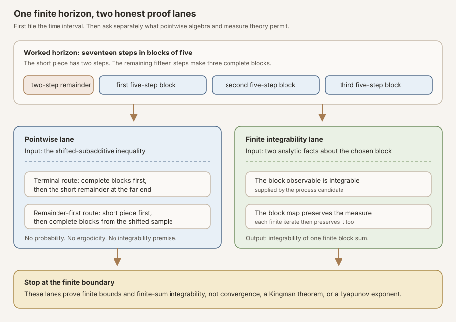


**AI-use disclosure.** Generative-AI tools helped draft, revise, illustrate,
and review this note. The author selected the questions, shaped the
exposition, has inspected the sources and artifacts cited here, and is
responsible for the final text and claims. This is an independent,
non-peer-reviewed Research Note. Verify claims against the cited primary
sources and any released artifacts before relying on them.



**Editorial status.** This teaching chapter remains a draft while human
editorial acceptance and the separate scientific-integrity and zero-context
expert-reader reviews are pending. The checked Lean source is authoritative
for every theorem statement.



**Abstract.** Let \(T:\Omega\to\Omega\) be a discrete-time base map, let
\(\mu\) be a measure, and let \(X_n(\omega)\) be a real-valued process with
the shifted-subadditive law

\[
  X_{m+k}(\omega)
  \le X_k\bigl(T^m\omega\bigr)+X_m(\omega).
\]

Fix a block length \(b\). A horizon made from \(q\) complete blocks and a
remainder \(r\) satisfies a finite inequality whose main term is the
Birkhoff sum of the block observable \(X_b\) under the block map \(T^b\).
The remainder may be terminal,

\[
  X_{bq+r}(\omega)
  \le
  \sum_{j=0}^{q-1}X_b\bigl(T^{bj}\omega\bigr)
  +X_r\bigl(T^{bq}\omega\bigr),
\]

or first,

\[
  X_{r+bq}(\omega)
  \le
  X_r(\omega)
  +\sum_{j=0}^{q-1}X_b\bigl(T^{r+bj}\omega\bigr).
\]

Neither inequality needs \(X_0=0\). A positive exact-block count also needs
no time-zero normalization. The extra equality \(X_0=0\) appears only when
one wants one exact-block theorem that remains valid at \(q=0\), because an
empty Birkhoff sum is zero while subadditivity alone permits \(X_0\gt0\).

The module then proves that a finite block Birkhoff sum is integrable when
the candidate supplies integrability of \(X_b\) and the block map \(T^b\)
preserves \(\mu\). It finally specializes the exact-block bound, the
remainder-first quotient bound, and finite-sum integrability to the
log-positive norm observable of a one-sided matrix cocycle. No probability
normalization, ergodicity, positive matrix dimension, samplewise convergence,
or Lyapunov theorem is used.


This is the proof-to-prose companion for
<code>formalization/NonlinearDynamics/Random/RandomCocycles/SubadditiveFiniteBlocks.lean</code>.
It covers all twelve public declarations and all three private proof helpers
in exact source order. The immediate predecessor is
[Probability and Ergodic Bases in Lean: Three Gates Before Kingman]().
The immediate successor is
[Subtract the Orbit Majorant: Centering Subadditive Cocycles in Lean]().
It specializes the exact-block majorant to one-step blocks, subtracts that
additive orbit budget, and preserves shifted subadditivity and finite-horizon
integrability without calling the residual mean zero or claiming a limit.
Reusable foundations include
,
,
and
.

The parallel textbook treatment is
[Finite-Block Decomposition for Subadditive Processes]().

## Choose a route up

| Route | Begin | Destination |
|---|---|---|
| First encounter | [Why finite blocks come before limits](#why-finite-blocks-come-before-limits) | See the tiling idea without Lean syntax |
| Worked example | [Seventeen steps in blocks of five](#seventeen-steps-in-blocks-of-five) | Expand both remainder orientations by hand |
| Boundary route | [The time-zero trap](#the-time-zero-trap) | Understand exactly where \(X_0=0\) is necessary |
| Lean route | [The three private engines](#the-three-private-engines) | Follow induction, rewriting, and sum orientation |
| API route | [The twelve public declarations](#the-twelve-public-declarations) | Audit every theorem in source order |
| Analysis route | [Integrability belongs to the block map](#integrability-belongs-to-the-block-map) | Separate finite algebra from measure theory |
| Counterexample route | [Five adversarial examples](#five-adversarial-examples) | Test zero blocks, powers, equality, scalars, and empty dimension |
| Integrity route | [What finite blocks do not prove](#what-finite-blocks-do-not-prove) | Block every accidental asymptotic upgrade |

### Learning objectives

By the summit, a reader should be able to:

1. expand Mathlib's finite Birkhoff sum in orbit notation;
2. distinguish the one-step map \(T\) from the block map \(T^b\);
3. derive the terminal-remainder and remainder-first bounds;
4. explain why both generic remainder bounds work with no assumption on
   \(X_0\);
5. explain why a nonzero exact-block count also works without \(X_0=0\);
6. construct the constant-one obstruction at zero block count;
7. read Lean's total natural-number division at \(b=0\);
8. calculate the \(n=17\), \(b=5\) example in both orientations;
9. identify the three private helper theorems and the public declarations
   that consume them;
10. follow the induction step that prepends one full block;
11. recognize why <code>birkhoffSum_succ'</code> rather than only
    <code>birkhoffSum_succ</code> matches that induction;
12. state the exact hypothesis used to integrate a block sum;
13. explain why preservation of \(T^b\) is weaker data than an explicit
    assumption that \(T\) preserves the measure;
14. give an ergodic two-cycle whose square is not ergodic;
15. identify the two cocycle pointwise results that need no
    <code>HasIntegrableGeneratorLogPlus</code> hypothesis;
16. identify the one cocycle result that does need that hypothesis;
17. verify that empty matrix dimension remains supported; and
18. separate these finite estimates from Birkhoff's, Kingman's,
    Furstenberg-Kesten's, and Oseledets' asymptotic conclusions.

## Why finite blocks come before limits

A long piece of orbit is difficult to control all at once. A fixed block
length turns it into repeated copies of one finite observable. If the horizon
is \(n\) and the block length is \(b\), natural-number division provides a
quotient and remainder:

\[
  q=n/b,
  \qquad
  r=n\bmod b,
  \qquad
  n=bq+r.
\]

When \(b\gt0\), the remainder is genuinely shorter: \(r\lt b\). The finite
bound itself does not need that strict inequality. This matters in Lean
because natural-number division is total. The expressions \(n/0\) and
\(n\bmod0\) are defined, so the theorem may quantify over every natural
\(b\) and discuss the degenerate case honestly instead of hiding it behind a
positive-block premise.

The main term is a
. Mathlib defines

\[
  \operatorname{birkhoffSum}(S,f,q,\omega)
  =\sum_{j=0}^{q-1} f\bigl(S^j\omega\bigr).
\]

Here \(S=T^b\) and \(f=X_b\), so

\[
  \operatorname{birkhoffSum}(T^b,X_b,q,\omega)
  =\sum_{j=0}^{q-1}X_b\bigl(T^{bj}\omega\bigr).
\]

The alignment \((T^b)^j=T^{bj}\) is an iterate-composition identity, not a
typographical convention ([Mathlib function iteration](#ref-mathlib-iterate)).
That definition and its zero, successor, and addition identities are the
official API used by the module
([Mathlib Birkhoff sums](#ref-mathlib-birkhoff)). The finite sum is an
algebraic object. Its name does not smuggle in a Birkhoff ergodic theorem.
The module imports the file that defines the sums, not a theorem asserting
convergence of their averages.

The historical reason this finite algebra matters is visible in standard
proofs of the subadditive ergodic theorem. Fixed-block expansions compare a
long subadditive process with orbit sums of a block observable. Lalley's notes
display this strategy and also call out the power-ergodicity trap: even when
\(T\) is ergodic, \(T^b\) need not be ergodic
([Lalley](#ref-lalley)). Steele's proof belongs to the same proof lineage and
uses finite interval decompositions in the service of a genuine asymptotic
theorem ([Steele, 1989](#ref-steele)). RMT-18 freezes only the finite algebraic
layer that can be proved now.

### Lineage, contribution, and nonclaims

The block method is classical. This note does not claim to invent Birkhoff
sums, quotient-and-remainder tilings, or the subadditive ergodic theorem.
Kingman's original paper develops the eventual stochastic-process theorem
([Kingman, 1968](#ref-kingman)). Furstenberg and Kesten provide the historic
random-matrix-product destination that motivates this project
([Furstenberg and Kesten, 1960](#ref-furstenberg-kesten)).

This milestone's contribution is narrower and formalization-specific:

* it matches the project's exact shifted-subadditive orientation;
* it exposes both locations for the finite remainder;
* it proves that those two generic bounds require no time-zero
  normalization;
* it isolates the single zero-count exact-block boundary where \(X_0=0\) is
  indispensable;
* it states integrability against preservation of the block map \(T^b\),
  rather than imposing more one-step structure than the proof consumes; and
* it gives pointwise matrix-cocycle specializations with no irrelevant
  integrability premise.

It does **not** claim:

* convergence of \(X_n/n\) at any sample;
* convergence of Birkhoff averages;
* an almost-everywhere upper bound after dividing and passing to a limit;
* ergodicity of \(T^b\);
* equality between a samplewise limit and an integrated Fekete rate;
* a signed Lyapunov exponent; or
* an invariant splitting of the matrix space.

## The exact objects and assumptions

The generic input comes from RMT-17:

```lean
import NonlinearDynamics.Random.RandomCocycles.SubadditiveFiniteBlocks

open MeasureTheory
open NonlinearDynamics.Random.RandomCocycles
open NonlinearDynamics.Random.RandomCocycles.DiscreteMatrixCocycle

#check @IsIntegrableSubadditiveProcessCandidate
```

Every public <code>#check</code> block below assumes this same import and these
three <code>open</code> commands. They may be copied after this header into a
scratch Lean file. The three private helper names are source-local and are
therefore presented in prose instead of as external import checks.

For a measurable space \(\Omega\), base map \(T\), measure \(\mu\), and
real process \(X\), the structure stores exactly two fields:

1. <code>integrable</code>: every finite-horizon function \(X_n\) is
   integrable with respect to \(\mu\);
2. <code>add_le</code>: for every \(m,k,\omega\),
   \(X_{m+k}(\omega)\le X_k(T^m\omega)+X_m(\omega)\).

The pointwise helper proofs use only <code>add_le</code>. They do not use the
measurable space, the measure, or the <code>integrable</code> field. The public
generic pointwise theorems are methods on the larger structure because that
is the process interface already established by RMT-17, but their proof
dependency remains visibly algebraic.

The finite-sum integrability theorem is different. It uses
<code>hX.integrable b</code> for the block observable and an explicit proof

```lean
hTb : MeasurePreserving (T^[b]) μ μ
```

for the block map. It needs neither <code>IsProbabilityMeasure μ</code> nor
<code>Ergodic T μ</code>. The cocycle specialization obtains the required
block-map preservation by iterating the cocycle's stored one-step
preservation.

| Result family | Shifted subadditivity | \(X_0=0\) | Integrability | Block-map preservation | Probability | Ergodicity |
|---|---:|---:|---:|---:|---:|---:|
| Two remainder bounds | yes | no | no | no | no | no |
| Exact blocks with \(q\ne0\) | yes | no | no | no | no | no |
| Exact blocks for every \(q\) | yes | yes | no | no | no | no |
| Generic finite-sum integrability | not used | no | yes | yes | no | no |
| Cocycle exact-block pointwise bound | cocycle theorem | built-in zero identity | no | no | no | no |
| Cocycle quotient pointwise bound | cocycle theorem | not required by helper | no | no | no | no |
| Cocycle block-sum integrability | candidate bridge | no | yes | supplied by cocycle | no | no |


**Boundary to remember.** The remainder-first generic theorem does not need
\(X_0=0\). At \(q=0\), it simplifies to the reflexive inequality
\(X_r(\omega)\le X_r(\omega)\). Only the exact-block statement that erases
all remainder terms at \(q=0\) asks for time-zero normalization.


## Seventeen steps in blocks of five

Take \(n=17\) and \(b=5\). Natural-number division gives \(q=3\) and
\(r=2\). The terminal-remainder orientation reads

\[
\begin{aligned}
X_{17}(\omega)
&\le
X_5(\omega)
+X_5(T^5\omega)
+X_5(T^{10}\omega)
+X_2(T^{15}\omega).
\end{aligned}
\]

The complete blocks start at times zero, five, and ten. The two-step
remainder starts at time fifteen. This is exactly
<code>le_birkhoffSum_div_add_mod</code> specialized to five and seventeen.

The remainder-first orientation reads

\[
\begin{aligned}
X_{17}(\omega)
&\le
X_2(\omega)
+X_5(T^2\omega)
+X_5(T^7\omega)
+X_5(T^{12}\omega).
\end{aligned}
\]

Now the two-step remainder stays at the original sample. The block orbit
begins after that remainder, then advances in jumps of five. This is
<code>le_mod_add_birkhoffSum_div</code> at the same values.

The two upper bounds need not be equal. They evaluate different finite pieces
at different orbit points. Subadditivity licenses both tilings, but it does
not assert that every tiling gives the same numerical upper bound. Equality
does occur for an additive process, which will become one of the adversarial
checks below.



<p class="figure-note"><strong>Figure:</strong> The same finite horizon can be read with the short remainder first or last. Shifted subadditivity alone controls either pointwise route. The separate analytic lane asks whether the block observable is integrable and whether the block map preserves the measure. The diagram contains no limit arrow because this module proves none.</p>

### Why two orientations are useful

The terminal remainder is the most direct output of induction on the number
of complete blocks. Each induction step peels off one block at the beginning
and leaves a shorter block-and-remainder problem at the shifted sample.

The remainder-first form is often better when the remainder should remain a
bounded finite-time disturbance at the original sample. One first splits
\(r+bq\) at time \(r\), then bounds the positive number of complete blocks at
the shifted point \(T^r\omega\). At \(q=0\), no full block exists, and the
whole statement closes by simplification.

Neither orientation dominates the other in all applications. Exposing both
at the API level avoids asking later proofs to reverse orbit order by informal
algebra.

## The time-zero trap

Set \(m=k=0\) in shifted subadditivity. Since \(T^0\omega=\omega\), we get

\[
  X_0(\omega)\le X_0(\omega)+X_0(\omega).
\]

Subtracting \(X_0(\omega)\) proves only

\[
  0\le X_0(\omega).
\]

It does not prove equality with zero. This small distinction controls the
exact-block boundary. A Birkhoff sum with zero terms is exactly zero, so a
uniform theorem

\[
  X_{bq}(\omega)
  \le
  \sum_{j=0}^{q-1}X_b(T^{bj}\omega)
\]

at \(q=0\) would say \(X_0(\omega)\le0\). Combined with the forced
nonnegativity, that is precisely \(X_0(\omega)=0\).

### The constant-one obstruction

Let every process value be one:

\[
  X_n(\omega)=1
\]

for every \(n\) and \(\omega\). On a one-point probability space with the
identity base, every \(X_n\) is integrable, the base preserves the measure,
and shifted subadditivity holds because \(1\le1+1\). Yet at \(q=0\),

\[
  X_{b\cdot0}(\omega)=1,
  \qquad
  \operatorname{birkhoffSum}(T^b,X_b,0,\omega)=0.
\]

The desired exact-block inequality is false. Probability normalization and
measure preservation do not repair it. This counterexample is why
<code>le_birkhoffSum_blocks_of_zero</code> visibly asks for
<code>X 0 = 0</code>.

Now inspect the generic remainder-first formula at the same \(q=0\):

\[
  X_{r+b\cdot0}(\omega)
  \le X_r(\omega)+0.
\]

It reduces to equality for the constant-one process. There is no missing
normalization. The terminal-remainder formula likewise reduces to
\(X_r(\omega)\le0+X_r(\omega)\). The obstruction is local to erasing the
last time-zero term from a zero-count exact-block statement.

## The three private engines

The file begins with three private theorems. They are implementation details,
not exported API, but they explain nearly every later proof. Keeping them
private prevents the public namespace from exposing versions parameterized by
a raw inequality when the project already has a named process structure.

### Private helper A: blocks plus a terminal remainder

The source-local declaration is
<code>le_birkhoffSum_blocks_add_remainder_of_add_le</code>. It assumes only a
function-level law

```lean
hadd : ∀ m k ω, X (m + k) ω ≤ X k (T^[m] ω) + X m ω
```

and proves the terminal-remainder bound by induction on \(q\). The zero case
is simplification: \(b\cdot0+r=r\), the empty Birkhoff sum is zero, and the
zero iterate of the block map leaves \(\omega\) unchanged.

For the successor step, arithmetic first rewrites

\[
  b(q+1)+r=b+(bq+r).
\]

Shifted subadditivity peels off the first block:

\[
  X_{b+(bq+r)}(\omega)
  \le X_{bq+r}(T^b\omega)+X_b(\omega).
\]

The induction hypothesis applies at \(T^b\omega\). Mathlib's
<code>birkhoffSum_succ'</code> then identifies the new sum as the first block
value plus a shorter sum beginning at the shifted sample. The iterate rewrite
<code>Function.iterate_succ_apply</code> aligns the terminal remainder. A final
<code>ring</code> closes only the additive rearrangement; it proves no dynamic
fact.

### Private helper B: a positive number of exact blocks

The source-local declaration is
<code>le_birkhoffSum_blocks_succ_of_add_le</code>. Its inputs are the same raw
<code>hadd</code> law, a block length \(b\), a predecessor count \(q\), and a
sample \(\omega\). Its conclusion is

\[
  X_{b(q+1)}(\omega)
  \le \operatorname{birkhoffSum}(T^b,X_b,q+1,\omega).
\]

The helper obtains this exact-block estimate by feeding
remainder \(b\) and block count \(q\) into helper A. The identity
\(bq+b=b(q+1)\) turns the terminal remainder into the final complete block.
The theorem <code>birkhoffSum_succ</code> turns the corresponding right side
into a sum with \(q+1\) terms.

The crucial point is logical, not syntactic: there is at least one complete
block. No time-zero process value remains to be discarded, so no
normalization appears.

### Private helper C: a remainder followed by blocks

The source-local declaration is
<code>le_remainder_add_birkhoffSum_blocks_of_add_le</code>. Its inputs are the
raw <code>hadd</code> law, \(r,b,q\), and \(\omega\). Its conclusion is the
remainder-first inequality displayed in declaration 7 below.

This helper proves the complementary orientation. It splits on \(q\). At
zero blocks, simplification proves the reflexive result and never inspects
\(X_0\). At \(q+1\), shifted subadditivity first separates the remainder:

\[
  X_{r+b(q+1)}(\omega)
  \le X_{b(q+1)}(T^r\omega)+X_r(\omega).
\]

Helper B bounds the positive exact-block term at the shifted sample. Commuting
the two real summands produces the public remainder-first order. This proof
architecture is the checked reason that the remainder-first theorem needs no
time-zero hypothesis.

The three helpers use no measure-theoretic field. Their dependencies are
natural arithmetic, function iteration, finite sums, order-compatible
addition, and the raw shifted inequality.

## The twelve public declarations

The following map is in exact source order. The declaration numbers are used
throughout the remainder of the chapter.

| No. | Declaration | What it establishes | Essential proof dependency |
|---:|---|---|---|
| 1 | <code>zero_nonneg</code> | \(0\le X_0(\omega)\) | <code>add_le 0 0</code> plus linear arithmetic |
| 2 | <code>zero_eq_zero_iff_nonpos</code> | \(X_0=0\) iff \(X_0\le0\) pointwise | declaration 1 and function extensionality |
| 3 | <code>le_birkhoffSum_blocks_add_remainder</code> | terminal-remainder finite bound | private helper A |
| 4 | <code>le_birkhoffSum_div_add_mod</code> | quotient-and-remainder terminal form | declaration 3 and <code>Nat.div_add_mod</code> |
| 5 | <code>le_birkhoffSum_blocks_of_ne_zero</code> | exact blocks for \(q\ne0\) | successor witness and private helper B |
| 6 | <code>le_birkhoffSum_blocks_of_zero</code> | exact blocks for every \(q\) under \(X_0=0\) | case split and private helper B |
| 7 | <code>le_remainder_add_birkhoffSum_blocks</code> | generic remainder-first bound | private helper C |
| 8 | <code>le_mod_add_birkhoffSum_div</code> | quotient-and-remainder first form | declaration 7 and <code>Nat.mod_add_div</code> |
| 9 | <code>integrable_birkhoffSum_blocks</code> | finite block sum is integrable | finite-sum integrability and iterated block preservation |
| 10 | <code>logPlusNormObservable_nat_mul_le_birkhoffSum</code> | cocycle exact-block pointwise bound | cocycle subadditivity and time-zero identity |
| 11 | <code>logPlusNormObservable_le_mod_add_blockBirkhoffSum</code> | cocycle remainder-first quotient bound | cocycle subadditivity and private helper C |
| 12 | <code>HasIntegrableGeneratorLogPlus.integrable_blockBirkhoffSum</code> | cocycle finite block sum is integrable | candidate bridge and iterated base preservation |

### Declaration 1: time zero is nonnegative

```lean
#check @IsIntegrableSubadditiveProcessCandidate.zero_nonneg
```

The signature takes a process candidate <code>hX</code> and a sample
<code>ω</code>, then returns <code>0 ≤ X 0 ω</code>. The proof asks the
candidate for <code>hX.add_le 0 0 ω</code>. Simplification knows that zero plus
zero is zero and that the zero iterate is the identity. The remaining real
inequality has the form \(x\le x+x\), which <code>linarith</code> rearranges to
\(0\le x\).

No integrability fact is read. In particular, the theorem remains
mathematically pointwise even though the candidate also stores analytic data.
It is deliberately non-strict. The constant-one process shows the result
cannot be strengthened to equality.

### Declaration 2: nonpositive means normalized

```lean
#check @IsIntegrableSubadditiveProcessCandidate.zero_eq_zero_iff_nonpos
```

This theorem states a function equality on the left and a pointwise inequality
on the right:

\[
  X_0=0
  \quad\Longleftrightarrow\quad
  \forall\omega,\ X_0(\omega)\le0.
\]

The forward direction rewrites by the function equality and closes by
reflexivity. The reverse direction uses <code>funext</code> to reduce function
equality to one sample at a time. At that sample, the supplied nonpositivity
and declaration 1's nonnegativity give both inequalities needed by
<code>le_antisymm</code>.

This declaration is a diagnostic equivalence. It does not infer normalization
from integrability, probability, or measure preservation. A caller must still
provide the nonpositive side or the equality itself.

### Declaration 3: blocks followed by a remainder

```lean
#check @IsIntegrableSubadditiveProcessCandidate.le_birkhoffSum_blocks_add_remainder
```

The full mathematical signature is

\[
  X_{bq+r}(\omega)
  \le
  \operatorname{birkhoffSum}(T^b,X_b,q,\omega)
  +X_r\bigl((T^b)^q\omega\bigr).
\]

Lean's expression <code>((T^[b])^[q] ω)</code> keeps the iterate nesting
literal. Mathematically it is the orbit point after \(bq\) one-step updates.
The proof is a direct application of private helper A to
<code>hX.add_le</code>. Because the helper treats \(r\) as an arbitrary
natural number, no claim that \(r\lt b\) appears.

This generality is useful. The theorem can model any chosen tail length, not
only a Euclidean remainder. It also remains valid at \(q=0\) and \(b=0\).

### Declaration 4: terminal Euclidean remainder

```lean
#check @IsIntegrableSubadditiveProcessCandidate.le_birkhoffSum_div_add_mod
```

Declaration 4 substitutes \(q=n/b\) and \(r=n\bmod b\) into declaration 3.
The library identity <code>Nat.div_add_mod</code> rewrites the left side back
to \(X_n\). The exact result is

\[
  X_n(\omega)
  \le
  \operatorname{birkhoffSum}
    \bigl(T^b,X_b,n/b,\omega\bigr)
  +X_{n\bmod b}
    \bigl((T^b)^{n/b}\omega\bigr).
\]

There is no premise \(b\ne0\). In Lean's natural-number arithmetic,
\(n/0=0\) and \(n\bmod0=n\). Therefore the right side becomes an empty sum
plus \(X_n(\omega)\), and the theorem is reflexive. A positive block length is
needed only for the additional fact \(n\bmod b\lt b\), not for this inequality
or its type correctness. The official natural-division documentation is the
reference for these total operations ([Lean natural division](#ref-nat-div)).

### Declaration 5: nonzero exact-block count

```lean
#check @IsIntegrableSubadditiveProcessCandidate.le_birkhoffSum_blocks_of_ne_zero
```

The inputs are \(b\), \(q\), a proof <code>hq : q ≠ 0</code>, and
\(\omega\). The conclusion contains no remainder:

\[
  X_{bq}(\omega)
  \le
  \operatorname{birkhoffSum}(T^b,X_b,q,\omega).
\]

Lean turns the nonzero natural number into a successor using
<code>Nat.exists_eq_succ_of_ne_zero</code>. Private helper B then supplies the
bound. This path is stronger than imposing \(X_0=0\): every positive block
count is handled for every shifted-subadditive process candidate, including
the constant-one process.

The hypothesis concerns the **count** \(q\), not the length \(b\). A positive
number of zero-length blocks is permitted. The theorem is still true because
subadditivity repeatedly bounds \(X_0\) by sums of copies of \(X_0\), whose
nonnegativity was established in declaration 1.

### Declaration 6: exact blocks uniformly through zero

```lean
#check @IsIntegrableSubadditiveProcessCandidate.le_birkhoffSum_blocks_of_zero
```

This version removes the nonzero-count premise and instead takes
<code>hX0 : X 0 = 0</code>. The proof splits on \(q\). At zero, simplification
uses <code>hX0</code> to identify the left side with zero. At a successor,
private helper B proves the result without using <code>hX0</code> at all.

The case split documents the assumption boundary in executable form. The
normalization is consumed only by the zero branch. It is not a hidden global
premise of the finite-block induction.

For the matrix cocycle later in the file, the log-positive norm observable has
an independently checked time-zero identity. That identity makes declaration
6's uniform form available, though the final cocycle proof chooses the private
successor helper directly after splitting on \(q\).

### Declaration 7: the remainder comes first

```lean
#check @IsIntegrableSubadditiveProcessCandidate.le_remainder_add_birkhoffSum_blocks
```

The exact conclusion is

\[
  X_{r+bq}(\omega)
  \le
  X_r(\omega)
  +\operatorname{birkhoffSum}
    \bigl(T^b,X_b,q,T^r\omega\bigr).
\]

This public theorem is private helper C applied to <code>hX.add_le</code>.
There is no <code>hX0</code> argument. The block sum is evaluated at
\(T^r\omega\), which means its terms occur at times
\(r,r+b,\ldots,r+b(q-1)\). That orientation is not cosmetic. Starting the
sum at \(\omega\) would describe a different tiling.

At \(q=0\), the theorem is \(X_r\le X_r+0\). At positive \(q\), the helper
splits at \(r\) and invokes the positive-count exact-block result. These two
branches are why no time-zero normalization is needed.

### Declaration 8: Euclidean remainder first

```lean
#check @IsIntegrableSubadditiveProcessCandidate.le_mod_add_birkhoffSum_div
```

Declaration 8 substitutes \(r=n\bmod b\) and \(q=n/b\) into declaration 7,
then rewrites with <code>Nat.mod_add_div</code>. Its output is the form used in
the \(17=2+5\cdot3\) example:

\[
  X_n(\omega)
  \le
  X_{n\bmod b}(\omega)
  +\operatorname{birkhoffSum}
    \bigl(T^b,X_b,n/b,T^{n\bmod b}\omega\bigr).
\]

Again, \(b=0\) is valid. The remainder becomes \(n\), the quotient becomes
zero, and the sum is empty. The theorem reduces to \(X_n\le X_n\). The doc
comment explicitly separates that total theorem from the optional strict
remainder fact <code>Nat.mod_lt</code>, which would require positive \(b\).

### Declaration 9: integrability belongs to the block map

```lean
#check @IsIntegrableSubadditiveProcessCandidate.integrable_birkhoffSum_blocks
```

This is the first declaration in the module that uses the candidate's
<code>integrable</code> field. Its inputs include

```lean
hTb : MeasurePreserving (T^[b]) μ μ
```

and its conclusion is

```lean
Integrable (birkhoffSum (T^[b]) (X b) q) μ
```

The proof unfolds the Birkhoff sum into a finite sum over
<code>Finset.range q</code>. The theorem <code>integrable_finsetSum</code>
reduces the goal to one summand for each \(j\). That summand is the
composition

\[
  X_b\circ (T^b)^j.
\]

The candidate gives integrability of \(X_b\). The proof
<code>hTb.iterate j</code> says the \(j\)-fold iterate of the block map also
preserves \(\mu\). Mathlib's
<code>MeasurePreserving.integrable_comp_of_integrable</code> transports
integrability through that iterate. The final sum is finite, so the proof is
complete. The upstream interfaces are documented in Mathlib's
[measure-preserving API](#ref-mathlib-preserving) and
[integrability API](#ref-mathlib-integrable).

The assumption is intentionally <code>MeasurePreserving (T^[b]) μ μ</code>,
not <code>MeasurePreserving T μ μ</code>. One-step preservation is sufficient
because it can be iterated, but it is not required by this theorem. This
matters at \(b=0\): \(T^0\) is the identity and preserves every measure even
if \(T\) does not. It also matters whenever preservation of a particular
power is known directly.

Probability and ergodicity play no role. Integrability is a finite-sum
property here, not a limit claim.

### Declaration 10: exact blocks for cocycle growth

```lean
#check @DiscreteMatrixCocycle.logPlusNormObservable_nat_mul_le_birkhoffSum
```

Now let \(C\) be a one-sided discrete matrix cocycle and write
\(G_n=C.\operatorname{logPlusNormObservable}(n)\). Declaration 10 states

\[
  G_{bq}(\omega)
  \le
  \operatorname{birkhoffSum}(C.\mathrm{base}^b,G_b,q,\omega).
\]

Read the signature carefully: the receiver is <code>C</code> itself. There is
no <code>hC : C.HasIntegrableGeneratorLogPlus</code>. The proof splits on
\(q\). At zero, the checked cocycle identity \(G_0=0\) closes the goal. At a
successor, private helper B consumes only
<code>C.logPlusNormObservable_add_le</code>.

This formulation preserves the strongest honest scope. Pointwise finite
subadditivity is already available for every cocycle in the module's matrix
setting. Adding integrability to the theorem would obscure that fact and make
later callers carry irrelevant evidence.

The declaration assumes <code>Fintype ι</code> and
<code>DecidableEq ι</code> because the underlying finite matrix norm
observable uses them. It does not assume <code>Nonempty ι</code>. Empty matrix
index types remain valid.

### Declaration 11: remainder-first cocycle growth

```lean
#check @DiscreteMatrixCocycle.logPlusNormObservable_le_mod_add_blockBirkhoffSum
```

This specialization gives

\[
\begin{aligned}
G_n(\omega)
\le{}&G_{n\bmod b}(\omega)\\
&+\operatorname{birkhoffSum}
  \bigl(C.\mathrm{base}^b,G_b,n/b,
    C.\mathrm{base}^{n\bmod b}\omega\bigr).
\end{aligned}
\]

Like declaration 10, it is a method on <code>C</code>, not on an integrability
hypothesis. The proof rewrites the horizon with <code>Nat.mod_add_div</code>
and applies private helper C directly to
<code>C.logPlusNormObservable_add_le</code>. It does not need the cocycle's
time-zero identity because the generic remainder-first helper does not.

That last sentence is an important correction to a tempting but overly strong
design: it would be easy to route the proof through a normalized generic
candidate and accidentally make <code>HasIntegrableGeneratorLogPlus</code>
look necessary. The frozen theorem exposes the weaker true boundary.

### Declaration 12: integrable cocycle block sums

```lean
#check @HasIntegrableGeneratorLogPlus.integrable_blockBirkhoffSum
```

The final declaration moves to the hypothesis namespace. It receives

```lean
hC : C.HasIntegrableGeneratorLogPlus
```

and proves integrability of the block Birkhoff sum for every \(b,q\). The
bridge <code>hC.isIntegrableSubadditiveProcessCandidate</code> supplies the
generic process candidate. The cocycle's stored one-step measure preservation
is iterated to obtain
<code>C.base_preserving.iterate b</code>, exactly the block-map preservation
proof required by declaration 9.

This is the only cocycle declaration in RMT-18 that needs
<code>HasIntegrableGeneratorLogPlus</code>. The reason is transparent: a
finite sum of measurable-looking terms is not automatically integrable. The
one-step hypothesis was previously propagated to every finite horizon, and
that analytic result is now consumed at block length \(b\).

## Integrability belongs to the block map

There are three maps worth keeping separate:

1. the one-step map \(T\);
2. the block map \(S=T^b\);
3. the \(j\)-fold block iterate \(S^j=(T^b)^j\).

Declaration 9 assumes that map 2 preserves \(\mu\). Its proof obtains
preservation of map 3 by iteration. It never goes backward to infer anything
about map 1. This one-way dependency is mathematically important.

Suppose \(b=2\) and a transformation swaps two components in a way that fails
some desired one-step property, while its square is the identity. The block
map can have more structure than the original map. In the other direction,
if \(T\) preserves \(\mu\), Mathlib proves that every iterate preserves it,
so the cocycle specialization can discharge the block premise uniformly.

Measure preservation transports an integrable observable along the orbit
without changing the measure used for integration. It does not say the
observable has constant pointwise value. It does not say different block
terms are independent. It does not say time averages converge. Those are
separate properties and the Lean type contains none of them.

### Ergodicity does not pass automatically to powers

Let \(\Omega=\{0,1\}\) with the uniform probability measure, and let \(T\)
swap the two points. The only subsets invariant under the swap are the empty
set and the whole space, so \(T\) is ergodic. But \(T^2\) is the identity.
Every subset is invariant under the identity, including either singleton of
probability one half, so \(T^2\) is not ergodic.

This two-cycle is the smallest concrete warning against applying an ergodic
theorem to the block map merely because the original map is ergodic. Lalley's
fixed-block discussion flags exactly this power-ergodicity complication
([Lalley](#ref-lalley)). RMT-18 avoids the issue because declaration 9 asks
only for measure preservation of \(T^b\), which does pass to powers from
one-step preservation.

## Five adversarial examples

The fastest way to learn an interface is to try to delete each assumption.
These examples are not decorations. They explain why the signatures have the
shape they do.

### 1. Constant one defeats the zero-count exact-block theorem

As shown above, \(X_n=1\) is integrable and shifted-subadditive on the
one-point probability space, but \(X_0=1\). It satisfies declarations 1, 3,
4, 5, 7, 8, and 9 whenever the map premise is supplied. It cannot satisfy the
conclusion of declaration 6 at \(q=0\) without the explicit normalization.

### 2. Total division makes \(b=0\) a theorem, not an exception

At \(b=0\), Lean computes \(n/0=0\) and \(n\bmod0=n\). Both quotient forms
reduce to reflexivity. The statement does not claim a short remainder in this
case. If a later proof needs \(n\bmod b\lt b\), it must separately assume
\(b\gt0\) and apply <code>Nat.mod_lt</code>.

### 3. Additivity turns every finite upper bound into equality

Suppose

\[
  X_{m+k}(\omega)=X_k(T^m\omega)+X_m(\omega)
\]

for every input. Induction then gives equality in both block decompositions.
An ordinary additive orbit sum is the canonical example:

\[
  X_n(\omega)=\sum_{j=0}^{n-1}f(T^j\omega).
\]

This control checks the orientation. If a proposed formula placed the shifted
remainder or the first block at the wrong orbit point, the additive case would
expose the error immediately.

### 4. Scalar cocycles show the matrix theorem is not dimension magic

Take a one-dimensional matrix index. Each cocycle value is a scalar complex
multiplier, and the induced infinity norm is absolute value. The log-positive
observable becomes a finite scalar growth cost. Declarations 10 through 12
still apply. Their block logic comes from cocycle multiplication and norm
submultiplicativity, not from a special high-dimensional phenomenon.

### 5. Empty matrix dimension remains valid

Take an empty finite index type. The project has explicit conventions for the
empty matrix norm observable, and none of the RMT-18 signatures asks for
<code>Nonempty ι</code>. The two pointwise cocycle bounds and the integrability
specialization still typecheck. This edge case is valuable because it proves
the block layer has not silently imported a positivity-of-dimension premise
from an unrelated matrix argument.

## Lean proofcraft: why the source looks this way

The mathematics is short enough to write on one board, but formalization must
choose exact rewrite orientations. Several proof patterns are worth carrying
forward.

### Generalize the sample in the induction

Private helper A says

```lean
induction q generalizing ω with
```

because the induction hypothesis must later be applied at
<code>T^[b] ω</code>, not only at the original sample. Without
<code>generalizing ω</code>, Lean would freeze the sample too early and the
successor step would be unusable.

### Match the sum identity to the block peeled off

Mathlib provides two successor views. Informally,

\[
\begin{aligned}
S_{q+1}(\omega)&=S_q(\omega)+f(S^q\omega),\\
S_{q+1}(\omega)&=f(\omega)+S_q(S\omega).
\end{aligned}
\]

The induction peels off the first block, so the second orientation,
<code>birkhoffSum_succ'</code>, matches the proof state. Private helper B uses
<code>birkhoffSum_succ</code> when it interprets the old terminal block as the
new last term. Choosing the fitting identity avoids a thicket of commutativity
rewrites.

### Use exact natural identities, not informal division algebra

The two quotient theorems deliberately use different library identities:

* <code>Nat.div_add_mod</code> for \(b(n/b)+(n\bmod b)=n\);
* <code>Nat.mod_add_div</code> for \((n\bmod b)+b(n/b)=n\).

The order matches the left side of the corresponding generic theorem. No
subtraction, positivity premise, or conversion to integers is needed.

### Keep analytic transport out of pointwise helpers

The private helpers are parameterized by <code>hadd</code> rather than a full
candidate. This makes their dependency audit obvious. The measurable space
and measure appear only after the namespace opens for public declarations,
and actual integration occurs only in declaration 9.

### Compile the public surface, not only the file

The direct leaf check is:

```sh
cd formalization
source "$HOME/.elan/env"
lake env lean -DwarningAsError=true \
  NonlinearDynamics/Random/RandomCocycles/SubadditiveFiniteBlocks.lean
```

An import smoke test should also import the root library and run
<code>#check</code> on all twelve declarations. That catches an aggregator
omission or namespace mismatch that a direct leaf build could miss.

## Common wrong turns

| Wrong turn | Why it fails | Correct repair |
|---|---|---|
| Require \(X_0=0\) for the remainder-first bound | The \(q=0\) branch is already reflexive | Keep declaration 7 normalization-free |
| Remove \(X_0=0\) from the uniform exact-block theorem | Constant one gives \(1\nleq0\) at \(q=0\) | Use declaration 5 for \(q\ne0\), or retain declaration 6's premise |
| Require \(b\gt0\) for the quotient inequalities | Natural division is total and the inequalities remain true at zero | Add positivity only when a strict short-remainder fact is needed |
| Assume <code>MeasurePreserving T</code> in declaration 9 | The proof consumes only preservation of \(T^b\) | State the block-map premise and derive it from one-step preservation when available |
| Add probability or ergodicity to finite-sum integrability | Neither participates in finite transport or finite addition | Keep the theorem at raw-measure generality |
| Add <code>HasIntegrableGeneratorLogPlus</code> to declarations 10 and 11 | Their proofs use only pointwise cocycle subadditivity and a zero identity where needed | Make them methods on the cocycle itself |
| Treat a Birkhoff sum as a Birkhoff theorem | A finite sum has no convergence content | Reserve theorem language for a checked asymptotic result |
| Infer ergodicity of \(T^b\) from ergodicity of \(T\) | The two-cycle swap has nonergodic square | Use only measure preservation here; handle power ergodicity separately if ever needed |
| Call log-positive growth a signed Lyapunov exponent | Negative logarithmic contraction has been clipped to zero | Add a signed or extended-log layer before exponent claims |
| Exclude the empty matrix dimension without proof need | No theorem requires a nonempty index | Preserve the general finite index type |

The symbol \(\nleq\) in the counterexample row means “is not less than or
equal to.” It is a mathematical diagnosis, not a Lean token. Executable Lean
uses <code>¬ (1 ≤ 0)</code> or a numerical tactic.

## What finite blocks do not prove

The finite estimates resemble lines inside proofs of larger ergodic theorems.
Resemblance is not implication. RMT-18 proves none of the following:

1. that \(X_n(\omega)/n\) converges for any \(\omega\);
2. that its limsup is bounded by an expected block cost;
3. that a Birkhoff average under \(T^b\) converges;
4. that a limit is invariant under \(T\);
5. that ergodicity makes a future limit constant;
6. that the limit's integral equals the deterministic Fekete rate;
7. that raw log norms have an integrable negative part;
8. that singular-value growth converges;
9. that a top Lyapunov exponent exists; or
10. that an Oseledets filtration or splitting exists.

Kingman's paper is cited for the eventual theorem, not as evidence that this
module has already proved it. Lalley and Steele are cited for proof context,
especially the fixed-block strategy and its complications, not as imported
Lean dependencies. Furstenberg-Kesten is cited for random-product history,
not as a result silently inherited by the cocycle specialization.

The exact output is more modest and more reusable: every finite horizon can be
compared with a chosen block observable, the remainder can be placed where a
later proof needs it, and the resulting finite sum has a checked integrability
interface.

## Exercises with solutions

### Exercise 1: expand a Birkhoff sum

Expand
\(\operatorname{birkhoffSum}(T^4,X_4,3,\omega)\).

**Solution.** By definition it is
\(X_4(\omega)+X_4(T^4\omega)+X_4(T^8\omega)\). The sum has three terms; the
block map advances the sample by four one-step iterates each time.

### Exercise 2: find the terminal remainder

Write declaration 4 explicitly for \(n=17\) and \(b=5\).

**Solution.** Since \(17/5=3\) and \(17\bmod5=2\),
\[
X_{17}(\omega)\le X_5(\omega)+X_5(T^5\omega)+X_5(T^{10}\omega)
+X_2(T^{15}\omega).
\]

### Exercise 3: put the same remainder first

Write declaration 8 for the same numbers.

**Solution.** The result is
\[
X_{17}(\omega)\le X_2(\omega)+X_5(T^2\omega)+X_5(T^7\omega)
+X_5(T^{12}\omega).
\]
The block orbit starts after the two-step remainder.

### Exercise 4: test zero complete blocks

What do declarations 3 and 7 become when \(q=0\)?

**Solution.** Declaration 3 becomes
\(X_r(\omega)\le0+X_r(\omega)\). Declaration 7 becomes
\(X_r(\omega)\le X_r(\omega)+0\). Both are reflexive and neither uses
\(X_0\).

### Exercise 5: derive nonnegativity at time zero

Use shifted subadditivity with \(m=k=0\) to derive declaration 1.

**Solution.** It gives \(X_0\le X_0+X_0\) at the same sample. Subtracting
\(X_0\) from both sides gives \(0\le X_0\).

### Exercise 6: reject an equality upgrade

Why does exercise 5 not prove \(X_0=0\)?

**Solution.** Every positive number satisfies \(x\le x+x\). The constant-one
process is an explicit integrable shifted-subadditive candidate with
\(X_0=1\).

### Exercise 7: locate the exact normalization use

In declaration 6's proof, which branch consumes <code>hX0 : X 0 = 0</code>?

**Solution.** Only the \(q=0\) branch. The successor branch is private helper
B and needs no normalization.

### Exercise 8: prefer the nonzero theorem

Suppose \(q\ne0\) but nothing is known about \(X_0\). Which declaration gives
the exact-block bound?

**Solution.** Declaration 5,
<code>le_birkhoffSum_blocks_of_ne_zero</code>. It turns \(q\) into a successor
and applies the positive-count helper.

### Exercise 9: compute the zero divisor case

Simplify declaration 4 at \(b=0\).

**Solution.** Natural-number division gives \(n/0=0\) and \(n\bmod0=n\).
The zero-term Birkhoff sum vanishes, both iterates of the zero block map are
identities at count zero, and the result is \(X_n(\omega)\le X_n(\omega)\).

### Exercise 10: identify a genuinely short remainder

What extra premise is needed to prove \(n\bmod b\lt b\)?

**Solution.** A positive block length, represented in Lean by
<code>0 < b</code>. The finite inequality itself needs no such premise.

### Exercise 11: explain <code>generalizing ω</code>

Why does private helper A generalize the sample during induction on \(q\)?

**Solution.** The successor step applies the induction hypothesis at
\(T^b\omega\). If \(\omega\) were fixed by the induction, that shifted
application would not match.

### Exercise 12: choose the successor identity

Why is <code>birkhoffSum_succ'</code> natural after peeling the first block?

**Solution.** It writes a \(q+1\)-term sum as the value at the original sample
plus a \(q\)-term sum at the once-shifted sample, exactly matching the
induction's structure.

### Exercise 13: list declaration 9's analytic inputs

What facts establish integrability of each block summand?

**Solution.** The candidate supplies <code>Integrable (X b) μ</code>. The
premise says \(T^b\) preserves \(\mu\), so every iterate \((T^b)^j\) also
preserves \(\mu\). Integrability transports through composition, and a finite
sum of integrable functions is integrable.

### Exercise 14: delete probability

Can declaration 9 be applied on a measure whose total mass is not one?

**Solution.** Yes. It has no <code>IsProbabilityMeasure μ</code> premise. It
requires only candidate integrability and preservation by the block map.

### Exercise 15: distinguish preservation from ergodicity

For the uniform two-point swap, why is \(T\) ergodic but \(T^2\) not?

**Solution.** The swap leaves only the empty set and whole space strictly
invariant, while its square is the identity and leaves each singleton
invariant. Each singleton has probability one half, so the identity is not
ergodic.

### Exercise 16: test an additive process

If shifted subadditivity is equality at every split, what happens to the two
finite block inequalities?

**Solution.** Every induction inequality becomes equality. Both tilings equal
the same additive orbit sum, though they group its terms differently.

### Exercise 17: find the unnecessary cocycle premise

Do declarations 10 and 11 require
<code>C.HasIntegrableGeneratorLogPlus</code>?

**Solution.** No. Declaration 10 uses the cocycle's pointwise
log-positive-subadditivity and its time-zero identity. Declaration 11 uses only
the pointwise subadditivity through private helper C.

### Exercise 18: find the necessary cocycle premise

Which cocycle declaration does require generator log-positive integrability,
and why?

**Solution.** Declaration 12. It proves an <code>Integrable</code> conclusion,
so it needs the previously checked bridge from one-step integrability to
integrability of every finite-horizon block observable.

### Exercise 19: inspect empty dimension

Which new premise would have excluded an empty matrix index, and is it
present?

**Solution.** A premise such as <code>Nonempty ι</code> would exclude it. None
is present. The module keeps only <code>Fintype ι</code> and
<code>DecidableEq ι</code> for the finite matrix observable.

### Exercise 20: reject the Birkhoff-theorem overread

Does integrability of every finite Birkhoff sum prove convergence of its
normalized averages?

**Solution.** No. Finite-sum integrability holds one \(q\) at a time. A
pointwise or mean ergodic theorem needs additional hypotheses and a separate
limit proof.

### Exercise 21: reject the power-ergodicity overread

If <code>Ergodic T μ</code> is available, may a future proof immediately use an
ergodic theorem for <code>T^[b]</code>?

**Solution.** No. The two-cycle example shows that an ergodic map can have a
nonergodic power. A future proof must avoid that step or supply an appropriate
stronger hypothesis.

### Exercise 22: place RMT-18 inside a Kingman proof

Which part of a future subadditive ergodic proof does this module resemble,
and which part remains absent?

**Solution.** It supplies fixed-block finite upper bounds and integrability of
their finite sums. It does not supply convergence of Birkhoff averages,
control of remainders after normalization, a lower bound for the liminf,
invariance of a limit, or identification of that limit with the integrated
rate.

## Reproducibility and audit ledger

| Artifact | Role | Validation |
|---|---|---|
| <code>SubadditiveFiniteBlocks.lean</code> | Twelve public declarations and three private helpers | Direct warning-fatal Lean check |
| <code>RandomCocycles.lean</code> | Aggregator import | Root-library build and import smoke test |
| This <code>index.md</code> | Declaration-complete proof-to-prose map | Coverage manifest, source hygiene, Hugo warnings fatal |
| <code>blocks-and-remainder-proof-route.svg</code> | Prose-only conceptual route | UTF-8 XML parse and rendered inspection |
| <code>generate-card.sh</code> | Deterministic featured-card generator | <code>--verify</code> byte comparison and 1200x630 dimension check |

The local commands are:

```sh
source "$HOME/.elan/env"
cd formalization
lake env lean -DwarningAsError=true \
  NonlinearDynamics/Random/RandomCocycles/SubadditiveFiniteBlocks.lean
cd ..
python3 scripts/check_lean_notebook_coverage.py
python3 scripts/check_teaching_source_hygiene.py
make site-check
```

The article remains <code>draft: true</code> and
<code>pro_reviewed: false</code>. Automated source and render checks do not
replace the pending human editorial decision or the two separate review
passes required by the Development Notebook guide.

## The next ridge

RMT-18 leaves the project at an honest finite boundary. We can tile every
horizon, orient the remainder either way, and integrate every finite block
sum under the exact preservation premise. The immediate RMT-19 successor
subtracts the additive one-step orbit majorant, proves the residual
nonpositive at positive horizons, preserves shifted subadditivity, and records
an exact normalized identity. That centering is pointwise compensation, not
expectation subtraction or a mean-zero construction.

The next layer after centering should also remain finite: phase averaging must
reconcile block-map sums with the one-step base without assuming that
ergodicity passes from \(T\) to \(T^b\). Only then should a future Kingman
layer select a precise theorem statement compatible with the project's
indexing and shifted orientation. It must decide whether subadditivity holds
everywhere or almost everywhere, what negative-part or lower-bound assumptions
are needed, what kind of convergence is claimed, how the invariant
sigma-algebra enters, and when ergodicity is used.

For matrix products, a further design choice remains. The log-positive
observable is ideal for upper-tail integrability but clips negative logarithmic
growth. A signed Lyapunov exponent needs a different observable and may need
invertibility, negative-tail control, singular values, or exterior powers.
The Furstenberg-Kesten and Oseledets destinations therefore cannot be reached
by renaming the present finite bound.

What has been gained is the proof skeleton's first reliable beam. Later work
will not have to rediscover how blocks and remainders align in Lean, which
assumption repairs zero exact blocks, or which map must preserve the measure.
The remaining difficulty is now visible rather than hidden behind notation.

## References

The links below were checked on 2026-07-21. The pinned local Mathlib 4.32.0
checkout at commit
<code>81a5d257c8e410db227a6665ed08f64fea08e997</code> remains the exact API
authority for Lean declarations.

<a id="ref-mathlib-birkhoff"></a>
**Mathlib contributors.**
[Birkhoff sums](https://leanprover-community.github.io/mathlib4_docs/Mathlib/Dynamics/BirkhoffSum/Basic.html),
Mathlib 4 documentation, with the
[pinned source](https://github.com/leanprover-community/mathlib4/blob/81a5d257c8e410db227a6665ed08f64fea08e997/Mathlib/Dynamics/BirkhoffSum/Basic.lean#L31-L57).
This official source defines <code>birkhoffSum</code> and the zero, successor,
and addition identities used by the private helpers.

<a id="ref-mathlib-iterate"></a>
**Mathlib contributors.**
[Function iteration](https://leanprover-community.github.io/mathlib4_docs/Mathlib/Logic/Function/Iterate.html),
Mathlib 4 documentation, with the
[pinned source](https://github.com/leanprover-community/mathlib4/blob/81a5d257c8e410db227a6665ed08f64fea08e997/Mathlib/Logic/Function/Iterate.lean#L54-L87).
This official source defines the iterate notation and composition identities
used to align block shifts.

<a id="ref-mathlib-preserving"></a>
**Mathlib contributors.**
[Measure-preserving maps](https://leanprover-community.github.io/mathlib4_docs/Mathlib/Dynamics/Ergodic/MeasurePreserving.html),
Mathlib 4 documentation. The pinned file defines
<code>MeasurePreserving</code> at
[lines 43 through 48](https://github.com/leanprover-community/mathlib4/blob/81a5d257c8e410db227a6665ed08f64fea08e997/Mathlib/Dynamics/Ergodic/MeasurePreserving.lean#L43-L48)
and proves iterate preservation at
[lines 193 through 196](https://github.com/leanprover-community/mathlib4/blob/81a5d257c8e410db227a6665ed08f64fea08e997/Mathlib/Dynamics/Ergodic/MeasurePreserving.lean#L193-L196).

<a id="ref-mathlib-integrable"></a>
**Mathlib contributors.**
[Integrable functions](https://leanprover-community.github.io/mathlib4_docs/Mathlib/MeasureTheory/Function/L1Space/Integrable.html),
Mathlib 4 documentation. The pinned source provides
<code>MeasurePreserving.integrable_comp</code> and
<code>MeasurePreserving.integrable_comp_of_integrable</code> at
[lines 381 through 390](https://github.com/leanprover-community/mathlib4/blob/81a5d257c8e410db227a6665ed08f64fea08e997/Mathlib/MeasureTheory/Function/L1Space/Integrable.lean#L381-L390),
and <code>integrable_finsetSum</code> at
[lines 439 through 449](https://github.com/leanprover-community/mathlib4/blob/81a5d257c8e410db227a6665ed08f64fea08e997/Mathlib/MeasureTheory/Function/L1Space/Integrable.lean#L439-L449).
Together these official interfaces warrant the transported-summand and finite-
sum steps in declaration 9.

<a id="ref-nat-div"></a>
**Lean contributors.**
[Natural-number division](https://leanprover-community.github.io/mathlib4_docs/Init/Data/Nat/Div/Basic.html),
Lean and Mathlib documentation. This official page documents total natural
quotient and remainder operations and the identities used by declarations 4
and 8.

<a id="ref-lalley"></a>
**Steven P. Lalley.**
[“Kingman's Subadditive Ergodic Theorem”](https://galton.uchicago.edu/~lalley/Courses/Graz/Kingman.pdf),
lecture notes, accessed 2026-07-21. These notes are cited specifically for the
fixed-block proof strategy and the warning that ergodicity of a map does not
imply ergodicity of every power. RMT-18 does not formalize the limit theorem
stated there.

<a id="ref-kingman"></a>
**J. F. C. Kingman.**
[“The Ergodic Theory of Subadditive Stochastic Processes”](https://doi.org/10.1111/j.2517-6161.1968.tb00749.x),
<em>Journal of the Royal Statistical Society: Series B</em> 30(3), 499-510,
1968. This primary source is cited for the eventual subadditive stochastic
process theorem. The current module proves only finite block estimates.

<a id="ref-steele"></a>
**J. Michael Steele.**
[“Kingman's Subadditive Ergodic Theorem”](https://www.numdam.org/item/AIHPB_1989__25_1_93_0/),
<em>Annales de l'Institut Henri Poincaré, Probabilités et Statistiques</em>
25(1), 93-98, 1989. This paper is cited for proof lineage and finite interval
decomposition context, not as a theorem imported into Lean.

<a id="ref-furstenberg-kesten"></a>
**Harry Furstenberg and Harry Kesten.**
[“Products of Random Matrices”](https://doi.org/10.1214/aoms/1177705909),
<em>The Annals of Mathematical Statistics</em> 31(2), 457-469, 1960. This
primary source supplies the historical random-matrix-product destination. Its
probabilistic limit theorem is not formalized here.
