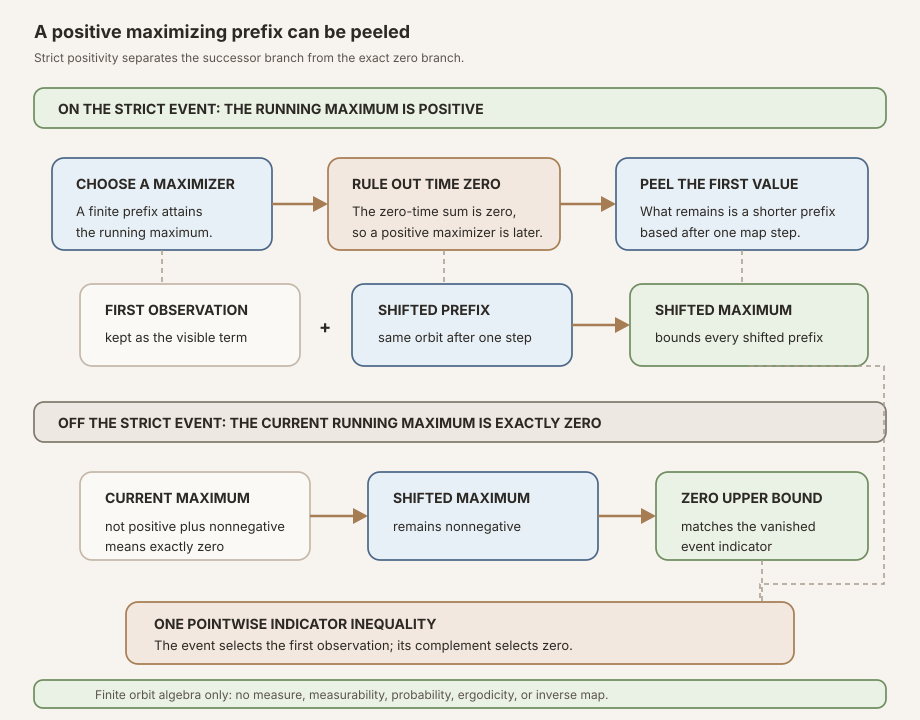
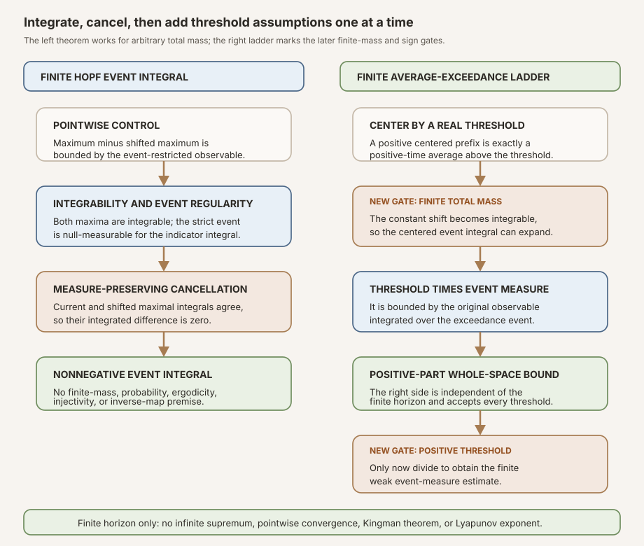


**AI-use disclosure.** Generative-AI tools helped draft, revise, illustrate,
and review this note. The author selected the questions, shaped the
exposition, has inspected the sources and artifacts cited here, and is
responsible for the final text and claims. This is an independent,
non-peer-reviewed Research Note. Verify claims against the cited primary
sources and any released artifacts before relying on them.



**Editorial status.** This teaching chapter remains a draft while human
editorial acceptance and the separate scientific-integrity and zero-context
expert-reader reviews are pending. The checked Lean source is authoritative
for every theorem statement.



**Abstract.** Let \(T:\Omega\to\Omega\) be a discrete-time map, let
\(g:\Omega\to\mathbb R\), and write

\[
S_k g(\omega)=\sum_{j=0}^{k-1}g\bigl(T^j\omega\bigr).
\]

For a fixed horizon \(N\), RMT-23 defines the nonempty finite running maximum

\[
M_N g(\omega)=\max_{0\le k\le N}S_k g(\omega)
\]

and its strict positivity event \(E_N(g)=\{\omega:0\lt M_Ng(\omega)\}\).
Time zero is included, so \(S_0=0\) and \(M_N\ge0\). Strict positivity is
therefore essential: the nonnegative event would be the whole space.

On \(E_N(g)\), a positive maximizing index cannot be zero. Writing it as
\(j+1\) gives

\[
M_Ng(\omega)\le g(\omega)+M_Ng(T\omega).
\]

Off the event, the first maximum is zero and the shifted maximum is
nonnegative. The two cases combine into the pointwise indicator inequality

\[
M_Ng(\omega)-M_Ng(T\omega)
\le \mathbf 1_{E_N(g)}(\omega)g(\omega).
\]

If \(T\) preserves an arbitrary measure \(\mu\) and \(g\) is integrable, both
maximal functions are integrable and their integrals cancel. Hence

\[
0\le\int_{E_N(g)}g\,d\mu.
\]

No finite-measure, probability, ergodicity, or invertibility premise appears.
Ordinary measurability of the chosen representative of \(g\) is also not
required: integrability supplies the almost-everywhere measurability needed by
the null-measurable event and integral APIs.

For a threshold \(a\in\mathbb R\), the module defines the finite average
exceedance event by applying the strict maximal construction to \(g-a\). At
every positive index, positivity of the centered sum is equivalent to the
Birkhoff average exceeding \(a\). Under finite total measure, the constant
observable \(a\) is integrable, and the Hopf lemma yields

\[
a\,\mu_{\mathbb R}(E_{N,a})\le\int_{E_{N,a}}g\,d\mu.
\]

This inequality is valid for positive, zero, and negative \(a\). Replacing
\(g\) by its positive part produces a horizon-independent right side. The
final division into a weak measure bound requires exactly \(0\lt a\).

The module proves no infinite-horizon supremum inequality, no almost-everywhere
convergence of Birkhoff averages, no pointwise ergodic theorem, no Kingman
theorem, no Lyapunov exponent, and no Oseledets splitting.


This is the proof-to-prose companion for
<code>formalization/NonlinearDynamics/Random/RandomCocycles/FiniteHopfMaximal.lean</code>.
It covers all twenty-five documented public declarations in exact source order,
the private integral-cancellation helper in its actual position, and all eleven
anonymous compiled boundary probes.

Its immediate predecessor is
[Convergence Without Existence: Birkhoff Events and Ergodic Rigidity in Lean]().
That chapter built a measurable convergence event and proved it invariant, but
did not prove that any point enters it. The present finite maximal lemma is the
first analytic estimate aimed at the missing existence direction. It still
does not cross that gap by itself.

The underlying finite sums reuse the
. The distinction between raw
measure preservation, probability normalization, and ergodicity remains the
one developed in the

entry. A later pointwise theorem would return to the
.
The stable definition introduced by this milestone is the
.
The parallel textbook treatment is
[Finite Maximal Ergodic Inequalities: From Orbit Maxima to Threshold Events]().

## Choose a route up

| Route | Begin | Destination |
|---|---|---|
| First encounter | [Why watch the largest partial sum?](#why-watch-the-largest-partial-sum) | See why a running maximum detects a positive excursion that the terminal sum can miss |
| Historical route | [Four sources, four different theorem shapes](#four-sources-four-different-theorem-shapes) | Separate Yosida–Kakutani, Hopf, Garsia, and Keane–Petersen from the exact Lean slice |
| Finite-order route | [Build a maximum that remembers time zero](#build-a-maximum-that-remembers-time-zero) | Understand <code>Finset.sup'</code>, nonnegativity, monotonicity, and edge horizons |
| Event route | [Strict positivity keeps the event informative](#strict-positivity-keeps-the-event-informative) | Derive the positive-index witness and nested events |
| Proof route | [Peel a positive maximizing index](#peel-a-positive-maximizing-index) | Prove the central pointwise indicator inequality |
| Measure route | [Integrate and cancel the shifted maximum](#integrate-and-cancel-the-shifted-maximum) | Reach the finite Hopf-style lemma without probability or invertibility |
| Threshold route | [Center first, divide last](#center-first-divide-last) | Reach finite average-exceedance and weak measure estimates |
| API route | [The complete source-order tour](#the-complete-source-order-tour) | Audit every public declaration and the private helper |
| Boundary route | [Eleven probes test the theorem's edges](#eleven-probes-test-the-theorems-edges) | Check zero, one, identity, infinite measure, noninvertibility, and failed preservation |
| Integrity route | [The exact premise and nonclaim ledger](#the-exact-premise-and-nonclaim-ledger) | Prevent finite estimates from being narrated as asymptotic theorems |

### Learning objectives

By the summit, a reader should be able to:

1. define the finite running maximum of Birkhoff sums through a horizon;
2. explain why the index set is nonempty for every natural horizon;
3. explain why including time zero forces the maximum to be nonnegative;
4. distinguish the running maximum from the positive part of the terminal sum;
5. state why increasing the horizon can only increase the maximum;
6. compute the maximum at horizons zero and one;
7. separate ordinary measurability of the maximum from its integrability;
8. explain how measure preservation propagates one-step integrability through finite sums;
9. define the strict finite Hopf event;
10. explain why a nonnegative event would be universal;
11. turn strict event membership into a positive-time witness;
12. explain why the witnessing index cannot be zero;
13. choose an actual maximizing index from a finite supremum;
14. peel a positive successor sum into the first value and a shifted sum;
15. prove the pointwise inequality on the event;
16. prove its zero-indicator branch off the event;
17. combine both branches as one indicator inequality;
18. distinguish measurable from null-measurable event interfaces;
19. explain why integrability is enough for the main set integral;
20. derive equality of shifted and unshifted maximal integrals from measure preservation;
21. explain why this cancellation needs no inverse map;
22. derive the nonnegative event integral;
23. define average exceedance through the centered observable \(g-a\);
24. prove that a centered positive sum is a positive-time average exceedance;
25. identify exactly where finite total mass first enters;
26. derive the threshold times measure lower bound for every real threshold;
27. explain why replacing \(g\) by its positive part gives a uniform right side;
28. identify exactly where positivity of the threshold first enters;
29. read all eleven boundary probes as tests of the theorem's quantifiers; and
30. list the infinite-horizon, convergence, subadditive, and cocycle conclusions still absent.

## Why watch the largest partial sum?

Take one orbit

\[
\omega,\quad T\omega,\quad T^2\omega,\quad\ldots
\]

and read a real observable along it. The finite sum \(S_k g(\omega)\) records
the accumulated reading through time \(k-1\). A terminal sum at one chosen
horizon can hide the path taken to reach it. For example, a sequence of
readings may begin with a strong positive excursion and later fall below zero.
The terminal sum then says nothing about the earlier excursion.

The running maximum remembers whether *any* prefix became positive:

\[
M_Ng(\omega)=\max\{S_0g(\omega),S_1g(\omega),\ldots,S_Ng(\omega)\}.
\]

This is not the positive part of \(S_N\). The positive part asks only for
\(\max(S_N,0)\). The running maximum asks for the largest value among every
prefix. Confusing those two objects destroys the proof. Garsia's notation in
the closest primary source denotes a running maximum; it must not be read as
the positive part of the terminal sum
([Garsia, 1965, p. 381](#ref-rmt23-garsia)).

The time-zero sum is deliberately included. Mathlib's
<code>birkhoffSum</code> gives \(S_0=0\), so the running maximum is never
negative. This convention has two benefits. It avoids a separate empty-index
maximum at \(N=0\), and it makes the off-event branch exact: if the maximum is
not positive, then it must equal zero.

The price is equally important. The event must use strict positivity. Since
\(M_N\ge0\) everywhere, the set where \(0\le M_N\) is always the entire state
space. One of the compiled probes states exactly that universal-set identity.

### A small orbit example

Suppose the first three readings are

\[
g(\omega)=-2,\qquad g(T\omega)=5,\qquad g(T^2\omega)=-10.
\]

The prefix sums at times zero through three are \(0,-2,3,-7\). The terminal
sum is negative, and its positive part is zero. The running maximum is three,
so the point belongs to the strict maximal event. The positive excursion is
real finite-time information even though it does not survive to the terminal
horizon.

This numerical illustration is not an empirical result and does not appear as
a theorem. Its only job is to keep the two maximum conventions distinct.

## Four sources, four different theorem shapes

The name “Hopf-style” records mathematical lineage without claiming that the
Lean statement is a transcription of one historical theorem. The relevant
sources differ in horizon, normalization, transformation assumptions, and
proof architecture.

### Yosida and Kakutani: the name and an early point-transformation theorem

Yosida and Kakutani's 1939 paper states its setting on page 165: a one-to-one
measure-preserving point transformation, with no assumption that the total
measure is finite. The same page labels its second theorem as new and says that
they will call it the “Maximal Ergodic Theorem”
([Yosida and Kakutani, 1939, p. 165](#ref-rmt23-yosida)). Pages 166 and 167
develop a maximal-interval selection argument
([open scan](#ref-rmt23-yosida)).

That paper is essential historical evidence, but it is not the literal source
of the Lean proof. Its theorem is phrased using infinite-horizon average
objects, its transformation is one-to-one, and its interval argument is not
the finite running-maximum cancellation implemented here. RMT-23 drops
injectivity and stops at a fixed horizon.

### Hopf: broader operator lineage

Hopf's 1954 article, *The General Temporally Discrete Markoff Process*, is the
broader operator-theoretic source behind the later theorem name
([Hopf, 1954](#ref-rmt23-hopf)). The journal record verifies the title, author,
volume, issue, year, and page range 13–45. The available article-level archive
did not provide a freely inspectable internal theorem page during this audit,
so this chapter does not attach a theorem number or page-specific statement to
Hopf. It cites the article for lineage only.

### Garsia: the closest finite proof source

Garsia's two-page 1965 note is the closest source for the formal architecture.
On page 381 he considers a positive norm-nonincreasing linear operator on
\(L^1\), defines \(S_0(f)=0\), defines finite partial sums, takes their running
maximum through \(n\), and uses the strict set where that maximum is positive.
His displayed theorem integrates \(f\) nonnegatively over that set. The basic
pointwise step is the operator inequality saying that \(f\) dominates the
running maximum minus its image under the operator
([Garsia, 1965, p. 381](#ref-rmt23-garsia)).

RMT-23 specializes that operator picture to the Koopman operator associated
with a point map. If \(U h=h\circ T\), then measure preservation makes \(U\)
integral-preserving on integrable functions. The Lean inequality

\[
M_Ng-M_Ng\circ T\le\mathbf 1_{E_N(g)}g
\]

is the point-map version of Garsia's core comparison. The Lean proof is still
its own checked artifact: it works through Mathlib's finite supremum,
measurability, null-measurability, Bochner integral, and pushforward APIs.

### Keane and Petersen: a later finite-to-infinite route

Keane and Petersen begin on a probability space with a possibly noninvertible
measure-preserving transformation. On pages 248 and 249 they define finite
maxima of averages, strict finite events, and then pass toward an
infinite-horizon maximal theorem and a pointwise ergodic theorem
([Keane and Petersen, 2006, pp. 248–249](#ref-rmt23-keane-petersen)). Their
proof organizes orbit segments into bounded strings; it is not the same finite
integral-cancellation proof as RMT-23.

The source is valuable for what comes next. It shows one historical route from
finite events toward an infinite theorem and pointwise convergence. RMT-23
formalizes only the finite estimate needed before such a passage can be
audited. It does not import their limiting argument, bounded approximation, or
dominated-convergence steps.

### Lineage ledger

| Source | Transformation or operator | Horizon and event | Role here | Not silently imported |
|---|---|---|---|---|
| Yosida–Kakutani 1939 | One-to-one measure-preserving point map; total mass need not be finite | Infinite-horizon average formulation | Historical naming and early maximal-interval proof | Injectivity, their exact asymptotic statement, or their interval proof |
| Hopf 1954 | Broader temporally discrete Markov/operator setting | Article-level lineage | Source of the operator tradition | An unverified theorem number or internal page claim |
| Garsia 1965 | Positive norm-nonincreasing linear operator on \(L^1\) | Finite running partial-sum maximum and strict positive event | Closest pointwise and integral proof architecture | The full abstract operator theorem as a project API |
| Keane–Petersen 2006 | Possibly noninvertible measure-preserving map on a probability space | Finite average maxima followed by infinite limits | Guide to a later finite-to-infinite development | Probability, bounded approximation, dominated convergence, or pointwise convergence |

## Build a maximum that remembers time zero

The first public declaration is the finite maximal function itself:

~~~lean
def finiteBirkhoffSumMax (T : Ω → Ω) (g : Ω → ℝ) (N : ℕ) : Ω → ℝ :=
  fun ω ↦
    (Finset.range (N + 1)).sup' Finset.nonempty_range_add_one
      (fun k ↦ birkhoffSum T g k ω)
~~~

<code>Finset.range (N + 1)</code> contains exactly the natural numbers strictly
below \(N+1\), hence the horizons zero through \(N\). The proof term
<code>Finset.nonempty_range_add_one</code> certifies that this set is nonempty.
That witness licenses <code>Finset.sup'</code>, a supremum over a known
nonempty finite set. There is no artificial default value from an
<code>OrderBot</code> instance.

The implementation follows the mathematical object directly. It does not
convert the finite set into a list, sort the values, or choose an arbitrary
sentinel. The pinned Mathlib finite-lattice API supplies induction, evaluation,
strict-witness, and maximizing-index lemmas for exactly this construction
([finite supremum API](#ref-rmt23-finset-sup)).

### Every prefix lies below the maximum

<code>birkhoffSum_le_finiteBirkhoffSumMax</code> says that if \(k\le N\), then

\[
S_k g(\omega)\le M_Ng(\omega).
\]

The proof turns \(k\le N\) into membership in
<code>Finset.range (N + 1)</code>, then applies <code>Finset.le_sup'</code>.
This lemma becomes the reusable comparison at time zero, under horizon
extension, and after peeling a positive maximizing index.

### Time zero forces nonnegativity

<code>finiteBirkhoffSumMax_nonneg</code> specializes the preceding comparison
to \(k=0\). Since the zero-horizon Birkhoff sum is zero,

\[
0=S_0g(\omega)\le M_Ng(\omega).
\]

No measurability, measure, or dynamical assumption is involved. This is finite
order algebra.

### Larger horizons retain every earlier candidate

<code>finiteBirkhoffSumMax_mono</code> proves

\[
M_Mg(\omega)\le M_Ng(\omega)\qquad\text{when }M\le N.
\]

The proof asks the smaller finite supremum for an index at which its maximum is
attained. That index lies below \(M\), hence below \(N\), so the universal
prefix comparison bounds its value by the larger maximum. Finite attainment,
not compactness or topology, does all the work.

### The zero horizon is exact

<code>finiteBirkhoffSumMax_zero</code> is a simplification theorem:

\[
M_0g(\omega)=0.
\]

At horizon zero, the index set contains only zero and the only Birkhoff sum is
zero. This equality later makes the strict event empty without an integral
argument.

## Measurability and integrability are different gates

The pointwise maximum exists for every map and observable. Using it under an
integral requires analytic evidence, and RMT-23 provides two deliberately
different routes.

### Ordinary measurability

<code>measurable_finiteBirkhoffSumMax</code> assumes ordinary measurability of
both \(T\) and \(g\). The preceding RMT-22 module proves that every finite
Birkhoff sum is measurable under those hypotheses. Mathlib's
<code>Finset.measurable_range_sup''</code> then packages the finite pointwise
maximum as a measurable function
([measurable finite suprema](#ref-rmt23-measurable-sup)).

This theorem is the clean route when the chosen representative of \(g\) is
ordinarily measurable. It does not assume integrability, preservation, finite
measure, probability, or ergodicity.

### Integrability under preservation

<code>integrable_finiteBirkhoffSumMax</code> instead assumes

~~~lean
(hT : MeasurePreserving T μ μ) (hg : Integrable g μ)
~~~

for one arbitrary measure \(\mu\). The imported finite-sum theorem propagates
the integrability of \(g\) through every iterate and every finite sum. The new
proof uses <code>Finset.sup'_induction</code>: the pointwise supremum of two
integrable real functions is integrable, and each leaf Birkhoff sum is
integrable. Finally, <code>Finset.sup'_apply</code> aligns the supremum of
functions with its pointwise evaluation.

This route deliberately does not request ordinary measurability of \(g\).
Mathlib's <code>Integrable</code> includes almost-everywhere strong
measurability and finite integral norm. That is enough for the null-measurable
event and indicator integral used by the main theorem.

Measure preservation carries measurability of \(T\), but it carries more than
measurability: it makes every orbit shift preserve the source measure. That is
why it supports finite-sum integrability and later integral cancellation.

### What remains absent

Neither theorem assumes that \(\mu(\Omega)=1\). Neither assumes that total mass
is finite. Neither assumes ergodicity or any mixing property. Integrability of
one observable is not stationarity or independence. Finite integrability also
does not imply convergence of normalized sums.

## Strict positivity keeps the event informative

The next definition is

~~~lean
def finiteHopfEvent (T : Ω → Ω) (g : Ω → ℝ) (N : ℕ) : Set Ω :=
  { ω | 0 < finiteBirkhoffSumMax T g N ω }
~~~

The word *finite* matters twice. The maximum ranges over finitely many
horizons, and the event records a positive excursion before one fixed cutoff.
It is not an event defined by a supremum over all time.

### Two event-regularity routes

<code>measurableSet_finiteHopfEvent</code> combines ordinary measurability of
the maximum with measurability of a strict real inequality. Its assumptions
are ordinary measurability of \(T\) and \(g\).

<code>nullMeasurableSet_finiteHopfEvent_of_integrable</code> is weaker in the
right direction for the main theorem. Measure preservation and integrability
make the maximal function almost-everywhere measurable, so its strict
positivity event is null-measurable. A null-measurable set may differ from an
ordinary measurable set on a null exception. That is sufficient for
indicators, restrictions, and set integrals modulo null sets.

The theorem does not manufacture an ordinarily measurable version of the raw
event. It exposes exactly the regularity the integral proof consumes.

### A positive event has a positive-time witness

<code>mem_finiteHopfEvent_iff</code> states

\[
\omega\in E_N(g)
\quad\Longleftrightarrow\quad
\exists k,\ 1\le k\le N\ \text{and}\ 0\lt S_kg(\omega).
\]

The forward proof turns positivity of the finite supremum into a member whose
value is positive using <code>Finset.lt_sup'_iff</code>. The candidate index is
at most \(N\). It cannot be zero, because \(S_0=0\) contradicts strict
positivity. The reverse proof places any positive witness below the finite
maximum.

This equivalence performs an important logical cleanup. Event membership is
not merely “the maximum is positive.” It supplies a positive natural time that
can later be decomposed as a successor.

### Events grow with the horizon

<code>finiteHopfEvent_mono</code> transports monotonicity of the maximal
function to set inclusion:

\[
M\le N\quad\Longrightarrow\quad E_M(g)\subseteq E_N(g).
\]

The theorem is finite and pointwise. It does not form the union over all
horizons or prove anything about the measure of that union.

### Horizons zero and one

<code>finiteHopfEvent_zero</code> proves \(E_0(g)=\varnothing\). Strictness is
what makes this exact.

<code>mem_finiteHopfEvent_one_iff</code> proves

\[
\omega\in E_1(g)\quad\Longleftrightarrow\quad 0\lt g(\omega).
\]

There is only one positive index at horizon one, and its Birkhoff sum is the
one-step observable itself.

<strong>Figure:</strong> The upper lane shows the event branch. Strict positivity forces the maximizing horizon to be a successor, so the first observation can be peeled away and the remaining prefix is bounded by the shifted running maximum. The lower lane shows the complement branch: the current maximum equals zero, the shifted maximum is nonnegative, and the indicator vanishes. Together the lanes give one pointwise inequality. This is a conceptual diagram with no empirical quantities.

## Peel a positive maximizing index

The proof now reaches its algebraic heart. The task is to compare the maximum
at \(\omega\) with the maximum at \(T\omega\). A maximizing prefix at the
original point contains one first observation plus a shorter prefix based at
the shifted point.

### On the event

<code>finiteBirkhoffSumMax_le_on_finiteHopfEvent</code> assumes
\(\omega\in E_N(g)\) and proves

\[
M_Ng(\omega)\le g(\omega)+M_Ng(T\omega).
\]

The proof asks <code>Finset.exists_mem_eq_sup'</code> for an index \(k\) that
attains the maximum. Since the maximum is positive, the corresponding sum is
positive. The case \(k=0\) collapses to the impossible inequality
\(0\lt0\). Therefore \(k=j+1\) for some \(j\).

Mathlib's successor identity for Birkhoff sums is

\[
S_{j+1}g(\omega)=g(\omega)+S_jg(T\omega).
\]

The remainder index \(j\) is no larger than \(N\), so
\(S_jg(T\omega)\le M_Ng(T\omega)\). Substituting the maximizing equality
finishes the event branch. The exact finite sum definition and successor
identities come from pinned Mathlib
([Birkhoff-sum API](#ref-rmt23-birkhoff)).

Notice what is *not* used. The map need not be measurable. It need not be
injective or invertible. No measure exists in this theorem's statement. The
proof compares two finite lists of real numbers linked by the orbit recursion.

### Off the event

Suppose \(\omega\notin E_N(g)\). The maximum is not positive, but it is always
nonnegative. Antisymmetry therefore gives

\[
M_Ng(\omega)=0.
\]

The shifted maximum remains nonnegative, so

\[
M_Ng(\omega)-M_Ng(T\omega)=-M_Ng(T\omega)\le0.
\]

The indicator of \(E_N(g)\) is also zero off the event. This branch is the
reason including the zero-time sum is so convenient.

### One inequality carries both branches

<code>finiteBirkhoffSumMax_sub_comp_le_indicator</code> combines the cases:

\[
M_Ng(\omega)-M_Ng(T\omega)
\le \bigl(E_N(g).\operatorname{indicator}g\bigr)(\omega).
\]

On the event, the indicator returns \(g(\omega)\) and the peeling theorem
supplies the bound. Off the event, the indicator returns zero and the
nonnegative shifted maximum supplies the bound.

The theorem is pointwise for every \(\omega\). It is stronger than an
almost-everywhere inequality and costs no analytic assumptions. Measurability
and integrability enter only when both sides are integrated.

## Integrate and cancel the shifted maximum

The private helper
<code>integral_comp_of_measurePreserving</code> appears next in the source. It
states that if \(T\) preserves \(\mu\) and \(g\) is integrable, then

\[
\int g(T\omega)\,d\mu(\omega)=\int g(\omega)\,d\mu(\omega).
\]

This is not a change-of-variables theorem requiring an inverse. The proof uses
the pushforward measure. Mathlib's <code>integral_map</code> identifies the
integral of \(g\circ T\) under \(\mu\) with the integral of \(g\) under
<code>Measure.map T μ</code>, given the relevant almost-everywhere
measurability. The field <code>hT.map_eq</code> rewrites that pushforward back
to \(\mu\)
([Bochner integral under a map](#ref-rmt23-integral-map)).

The helper is private because it is proof-local infrastructure, not a new
project-wide API. Mathlib already exposes general measure-preserving
composition facts, including propagation of integrability
([integrable composition](#ref-rmt23-integrable-comp)).

### The finite Hopf-style maximal ergodic lemma

<code>integral_finiteHopfEvent_nonneg</code> is the core public theorem:

~~~lean
theorem integral_finiteHopfEvent_nonneg
    (hT : MeasurePreserving T μ μ) (hg : Integrable g μ) (N : ℕ) :
    0 ≤ ∫ ω in finiteHopfEvent T g N, g ω ∂μ
~~~

Its proof has five auditable stages.

1. Abbreviate the finite maximal function by \(M\) and its strict event by
   \(E\).
2. Prove \(M\) integrable. Measure preservation then makes \(M\circ T\)
   integrable as well.
3. Obtain null-measurability of \(E\). This makes the indicator
   \(\mathbf 1_Eg\) integrable even if the raw representative of \(g\) was not
   ordinarily measurable.
4. Integrate the pointwise inequality:

   \[
   \int(M-M\circ T)\,d\mu\le\int\mathbf 1_Eg\,d\mu.
   \]

5. Use preservation to identify the two maximal integrals. The left side is
   zero. Mathlib's null-measurable indicator identity rewrites the right side
   as the set integral \(\int_Eg\,d\mu\)
   ([indicator and set-integral API](#ref-rmt23-set-integral)).

The result follows:

\[
0\le\int_{E_N(g)}g\,d\mu.
\]

### Why the assumptions are genuinely lean

The measure may have infinite total mass. The count-measure probe later gives
an explicit infinite-measure instance. It may also be the zero measure. No
<code>IsFiniteMeasure</code>, <code>IsProbabilityMeasure</code>, or
sigma-finiteness typeclass appears.

The map may be noninjective. A constant Boolean map preserves a Dirac measure
and satisfies the theorem. Preservation is expressed by pushforward equality,
which does not require an inverse.

Ergodicity is absent. The identity map is measure preserving and the theorem
applies to it for every integrable observable, even when that identity system
is far from ergodic.

Preservation is not cosmetic. A separate probe constructs a measurable map
and integrable observable for which preservation fails and the event integral
is negative. The proof's cancellation step identifies exactly what breaks.

<strong>Figure:</strong> The left column follows the main finite theorem from a pointwise indicator bound through integrability and measure-preserving cancellation to a nonnegative event integral. The right column applies the result to the observable shifted by a real threshold, expands the constant set integral under finite total mass, replaces the observable by its positive part, and divides only after adding a positive-threshold premise. The figure is conceptual; the complete formulas and assumptions remain in the text.

## Center first, divide last

The final eight public declarations turn the finite sum theorem into a finite
average-exceedance interface. The order of operations is the key: subtract the
threshold from the observable first, apply the maximal lemma, and divide by the
threshold only at the very end.

### Define exceedance through a centered observable

<code>finiteBirkhoffAverageExceedanceSet</code> is

~~~lean
def finiteBirkhoffAverageExceedanceSet
    (T : Ω → Ω) (g : Ω → ℝ) (N : ℕ) (a : ℝ) : Set Ω :=
  finiteHopfEvent T (fun ω ↦ g ω - a) N
~~~

At a positive horizon \(k\), finite additivity gives

\[
S_k(g-a)(\omega)=S_kg(\omega)-k a.
\]

Because \(k\gt0\), the centered sum is positive exactly when

\[
a\lt\frac{S_kg(\omega)}{k}=A_kg(\omega).
\]

The use of positive indices is essential. At time zero, division is totalized
but carries no threshold information.

### Membership and monotonicity

<code>mem_finiteBirkhoffAverageExceedanceSet_iff</code> states the precise
event meaning:

\[
\omega\in E_{N,a}
\quad\Longleftrightarrow\quad
\exists k,\ 1\le k\le N\ \text{and}\ a\lt A_kg(\omega).
\]

The Lean proof rewrites the centered Birkhoff sum, evaluates the constant
orbit sum as \(k a\), and uses positivity of the natural index cast to justify
division. It assumes no sign for \(a\).

<code>finiteBirkhoffAverageExceedanceSet_mono</code> says these events increase
with the cutoff \(N\), directly by monotonicity of finite Hopf events.

### Measurable and null-measurable routes

<code>measurableSet_finiteBirkhoffAverageExceedanceSet</code> assumes ordinary
measurability of \(T\) and \(g\). Subtracting a measurable constant preserves
ordinary measurability, so the strict event is measurable.

<code>nullMeasurableSet_finiteBirkhoffAverageExceedanceSet</code> assumes
measure preservation, integrability of \(g\), and
<code>[IsFiniteMeasure μ]</code>. Finite total mass first appears because the
constant function \(\omega\mapsto a\) must be integrable. Then \(g-a\) is
integrable and the earlier null-measurable event theorem applies.

Finite total mass is weaker than probability normalization. No mass-one
identity is used. It also prevents the real-valued measure
\(\mu_{\mathbb R}(E)\) from encountering an infinite mass in the later formula.
Mathlib defines <code>μ.real E</code> as the real conversion of the extended
nonnegative measure; the finite-measure premise keeps this conversion in its
ordinary finite regime
([real-valued measure](#ref-rmt23-measure-real)).

### The centered integral lower bound

<code>finiteBirkhoffAverageExceedanceSet_integral_lower_bound</code> applies the
main theorem to \(g-a\):

\[
0\le\int_{E_{N,a}}(g-a)\,d\mu.
\]

Linearity and the constant set-integral formula give

\[
\int_{E_{N,a}}(g-a)\,d\mu
{} =\int_{E_{N,a}}g\,d\mu-a\,\mu_{\mathbb R}(E_{N,a}).
\]

Rearranging yields

\[
a\,\mu_{\mathbb R}(E_{N,a})
\le\int_{E_{N,a}}g\,d\mu.
\]

The theorem accepts every real \(a\). For \(a=0\), the left side is zero. For
negative \(a\), the inequality remains valid but should not be narrated as a
useful upper bound on event size. No division has occurred.

### A horizon-independent positive-part bound

<code>finiteBirkhoffAverageExceedanceSet_posPart_bound</code> continues with two
order comparisons. Pointwise,

\[
g(\omega)\le\max(g(\omega),0).
\]

The positive part is nonnegative, so its integral over a subset is no larger
than its integral over the whole space. Therefore

\[
a\,\mu_{\mathbb R}(E_{N,a})
\le\int_\Omega\max(g,0)\,d\mu.
\]

Mathlib supplies integrability of the positive part of an integrable real
function and the required set-integral monotonicity lemmas
([positive parts and monotone set integrals](#ref-rmt23-positive-part)). The
right side no longer depends on \(N\). The theorem still assumes no sign for
\(a\).

### Positivity enters at division

<code>measureReal_finiteBirkhoffAverageExceedanceSet_le</code> finally assumes
\(0\lt a\) and divides the previous inequality by \(a\):

\[
\mu_{\mathbb R}(E_{N,a})
\le\frac{\int_\Omega\max(g,0)\,d\mu}{a}.
\]

This is the finite weak maximal estimate. The positivity premise belongs
exactly here because order-preserving division by a real scalar requires a
positive denominator. Adding \(0\lt a\) to earlier theorems would make their
interfaces unnecessarily strong; omitting it here would make the division
invalid.

The estimate is finite in \(N\). It has the correct uniform right side for a
later increasing-event passage, but that passage is not part of this module.

## The exact premise and nonclaim ledger

The theorem family has four layers. Reading them together prevents assumptions
from leaking backward and conclusions from leaking forward.

| Layer | Main declarations | Exact positive assumptions | Explicitly absent |
|---|---|---|---|
| Finite order algebra | <code>finiteBirkhoffSumMax</code> through <code>finiteBirkhoffSumMax_zero</code> | A map, a real observable, a natural horizon; an index bound where stated | Measurability, measure, integrability, preservation, finite mass, probability, ergodicity, invertibility |
| Regularity and event algebra | Measurable/integrable maximum, event regularity, membership, monotonicity, horizon identities, peeling, indicator inequality | Ordinary measurability for the measurable route; preservation plus integrability for the integrable route; no analytic premise for raw event algebra | Probability, ergodicity, injectivity, surjectivity, inverse dynamics, convergence |
| Finite Hopf integral | <code>integral_finiteHopfEvent_nonneg</code> | <code>MeasurePreserving T μ μ</code>, <code>Integrable g μ</code>, finite horizon | Finite total mass, probability normalization, sigma-finiteness, ergodicity, invertibility, ordinary measurability of the chosen \(g\) representative |
| Threshold and weak estimate | Average-exceedance declarations | Finite total mass, preservation, integrability; additionally \(0\lt a\) only for the final divided bound | Probability, ergodicity, infinite-horizon supremum, almost-everywhere convergence |

### The main theorem really does not claim

- that \(E_N(g)\) has positive measure;
- that \(E_N(g)\) tends to a measurable infinite-horizon event;
- that the measures of the finite events converge;
- that a supremum over all \(N\) is integrable;
- that Birkhoff averages converge at any point;
- that the Birkhoff convergence event from RMT-22 is conull;
- that a pointwise Birkhoff theorem has been proved;
- that the limit, if it exists, equals a conditional expectation;
- that the transformation is ergodic or mixing;
- that an additive result automatically proves a subadditive Kingman theorem;
- that the project's log-positive cocycle observable has a samplewise growth rate;
- that a signed Lyapunov exponent or an Oseledets splitting exists.

### Why “finite Hopf-style lemma” is the honest name

“Finite” fixes the horizon. “Hopf-style” acknowledges the operator lineage and
the pointwise maximum-minus-shift proof. “Lemma” signals that this is an
analytic component of a longer pointwise development, not the final maximal
ergodic theorem in infinite time. The name avoids attributing the exact Lean
statement to a historical source whose hypotheses or proof differ.

## The complete source-order tour

The following inventory follows the frozen 509-line module exactly. The
private helper is included where it occurs, between public declarations 16 and
17.

### Finite maximum declarations

1. <code>finiteBirkhoffSumMax</code> defines the running maximum of the Birkhoff
   sums at horizons zero through \(N\), using a proof-carrying nonempty finite
   supremum.
2. <code>birkhoffSum_le_finiteBirkhoffSumMax</code> bounds every prefix with
   index at most \(N\) by that maximum.
3. <code>finiteBirkhoffSumMax_nonneg</code> inserts the zero-horizon sum to prove
   pointwise nonnegativity.
4. <code>finiteBirkhoffSumMax_mono</code> proves monotonicity when the horizon is
   enlarged.
5. <code>finiteBirkhoffSumMax_zero</code> computes the zero-horizon maximum as
   zero and is tagged for simplification.
6. <code>measurable_finiteBirkhoffSumMax</code> obtains ordinary measurability
   from ordinary measurability of the map and observable.
7. <code>integrable_finiteBirkhoffSumMax</code> obtains integrability from
   measure preservation and integrability of the one-step observable, without
   a finite-measure assumption.

### Strict event declarations

8. <code>finiteHopfEvent</code> defines the strict positivity event of the
   finite running maximum.
9. <code>measurableSet_finiteHopfEvent</code> gives the ordinary measurable-set
   route.
10. <code>nullMeasurableSet_finiteHopfEvent_of_integrable</code> gives the
    null-measurable route used by the integral theorem.
11. <code>mem_finiteHopfEvent_iff</code> converts membership into existence of a
    positive Birkhoff sum at an index between one and \(N\).
12. <code>finiteHopfEvent_mono</code> proves that the finite events increase with
    the horizon.
13. <code>finiteHopfEvent_zero</code> computes the zero-horizon event as empty.
14. <code>mem_finiteHopfEvent_one_iff</code> identifies the one-horizon event
    with strict positivity of \(g\).

### Pointwise and integrated Hopf declarations

15. <code>finiteBirkhoffSumMax_le_on_finiteHopfEvent</code> chooses a positive
    maximizing successor index and peels its first orbit value.
16. <code>finiteBirkhoffSumMax_sub_comp_le_indicator</code> joins the event and
    complement branches into the pointwise maximum-minus-shift indicator
    inequality.

The private helper <code>integral_comp_of_measurePreserving</code> proves
integral invariance under composition from <code>integral_map</code> and
<code>hT.map_eq</code>. It is not counted among the twenty-five public
declarations.

17. <code>integral_finiteHopfEvent_nonneg</code> integrates the pointwise
    inequality, cancels the two maximal-function integrals, and rewrites the
    indicator integral as the set integral.

### Average-threshold declarations

18. <code>finiteBirkhoffAverageExceedanceSet</code> defines finite average
    exceedance by applying the strict event to \(g-a\).
19. <code>mem_finiteBirkhoffAverageExceedanceSet_iff</code> identifies event
    membership with a positive-time average exceeding the threshold.
20. <code>finiteBirkhoffAverageExceedanceSet_mono</code> proves horizon
    monotonicity.
21. <code>measurableSet_finiteBirkhoffAverageExceedanceSet</code> supplies the
    ordinary measurable-set route.
22. <code>nullMeasurableSet_finiteBirkhoffAverageExceedanceSet</code> supplies
    the finite-measure, integrable null-measurable route.
23. <code>finiteBirkhoffAverageExceedanceSet_integral_lower_bound</code> expands
    the centered event integral to put threshold times real measure below the
    integral of \(g\) on the event, for every real threshold.
24. <code>finiteBirkhoffAverageExceedanceSet_posPart_bound</code> replaces the
    event integral by the whole-space integral of the positive part, still for
    every real threshold.
25. <code>measureReal_finiteBirkhoffAverageExceedanceSet_le</code> assumes a
    positive threshold and divides to obtain the finite weak measure estimate.

The three final <code>#print axioms</code> commands inspect the core event
integral, the centered lower bound, and the divided weak estimate. They are
audit commands, not additional declarations.

## Eleven probes test the theorem's edges

The source ends with eleven anonymous examples. They compile with the module
and therefore test actual elaboration, not informal intention.

### Probe 1: horizon zero is empty

For arbitrary \(T\) and \(g\), the first probe reuses
<code>finiteHopfEvent_zero</code>. It confirms that no hidden positivity appears
from totalization.

### Probe 2: horizon one sees exactly \(g\gt0\)

The second probe reuses <code>mem_finiteHopfEvent_one_iff</code>. It checks the
indexing convention: one Birkhoff step contains the observation at the current
point.

### Probe 3: the zero observable never enters

For every horizon, the strict event of the identically zero observable is
empty. This checks that the supremum and strict inequality do not create a
spurious witness.

### Probe 4: the nonnegative event is universal

The set

\[
\{\omega:0\le M_Ng(\omega)\}
\]

is the whole space. This probe is the executable reason not to define the Hopf
event with a weak inequality.

### Probe 5: identity dynamics needs no ergodicity

For the identity map, every integrable \(g\) satisfies the main nonnegative
event-integral theorem under any measure. The probe confirms that the theorem
does not consume ergodicity.

### Probe 6: the zero measure is allowed

An arbitrary measurable map, the zero observable, and the zero measure satisfy
the theorem. The result is mathematically degenerate but type-correct. No
nonzero-mass or probability assumption is hidden.

### Probe 7: infinite counting measure is allowed

The count measure on the natural numbers is not finite. The probe constructs
an integrable observable supported at zero, with value one there, and applies
the theorem to identity dynamics. This is direct evidence that the core finite
Hopf lemma does not require finite total mass.

### Probe 8: a noninjective preserving map is allowed

On the Boolean type, the constant map to <code>false</code> is not injective
but preserves the Dirac measure at <code>false</code>. The theorem applies at
horizon three. This blocks any accidental invertibility narrative.

### Probe 9: preservation cannot simply be deleted

The next Boolean example uses the Dirac measure at <code>true</code>, a map
that sends every point to <code>false</code>, and an observable equal to minus
one at <code>true</code> and two at <code>false</code>. The map is measurable
and the observable is integrable, but the map does not preserve the Dirac
measure. At horizon two, <code>true</code> enters the strict event while the
set integral is negative.

This is a boundary countermodel, not a proof that preservation is the only
possible sufficient hypothesis. It shows that the public conclusion fails if
preservation is dropped while the displayed remaining conditions are kept.

### Probe 10: the centered lower bound accepts a negative threshold

Under finite measure, the integral lower bound is instantiated at \(a=-1\).
The example checks the declaration's true quantifier: positivity is not needed
before division.

### Probe 11: the weak bound exposes positive division

The final probe restates the weak measure estimate with an explicit
\(0\lt a\) hypothesis. It confirms that positivity enters exactly at the final
interface.

### What the probes collectively rule out

| Potential accidental premise or convention | Probe evidence |
|---|---|
| Positive horizon required for the core theorem | Horizon zero compiles and gives the empty event |
| Weak event inequality is informative | The corresponding event is proved universal |
| Observable must be nonzero | Zero observable compiles and gives an empty event |
| Ergodicity required | Identity dynamics compiles |
| Nonzero or finite total mass required | Zero measure and infinite counting measure both compile |
| Injectivity or invertibility required | Constant noninjective Dirac-preserving map compiles |
| Preservation is unused decoration | A nonpreserving counterexample makes the conclusion false |
| Threshold must be positive in the centered integral theorem | The negative-threshold instance compiles |
| Division can be stated without a sign premise | The final interface explicitly requires \(0\lt a\) |

## Proof engineering lessons

RMT-23 is short by the standards of the surrounding subadditive development,
but it exposes several reusable Lean techniques.

### Use a nonempty finite supremum when zero is a real candidate

One tempting definition is a fold with default zero. That would happen to
produce the same real value here because time zero is present, but it would
hide the structural reason. <code>sup'</code> records nonemptiness explicitly
and gives the exact witness APIs needed later. The proof does not depend on a
default-order convention.

### Extract a maximizing index only when needed

Most properties of the maximum use order lemmas and do not need to choose an
index. The proof extracts a maximizer only for horizon monotonicity and the
peeling step. This keeps finite choice local and makes the positive-index
argument visible.

### Separate event regularity from pointwise event algebra

The event definition, membership theorem, monotonicity, edge horizons, and
pointwise inequality need no measure. Measurability appears in separate
declarations. This avoids forcing analytic assumptions into reusable finite
algebra.

### Prefer null-measurability when that is all integration needs

An integrable function comes with almost-everywhere strong measurability, not
necessarily ordinary measurability of the chosen representative. Requiring an
ordinary measurable \(g\) in the main theorem would strengthen the interface
without helping the proof. The null-measurable event route matches Mathlib's
indicator and set-integral APIs directly.

### Cancel through pushforward equality, not an inverse

Writing an informal substitution such as “let \(y=T\omega\)” can smuggle in
bijectivity. The Lean proof cannot do that. It builds the equality through
<code>Measure.map T μ</code> and rewrites with preservation. This is both more
general and more honest.

### Keep the sign gate at the operation that consumes it

Centering by \(a\), integrating, and bounding by the positive part work for
every real \(a\). Only division changes order according to the sign of \(a\).
The source therefore adds \(0\lt a\) only to the final theorem. This is a model
for assumption-minimal APIs elsewhere in the project.

### Failure modes the source avoids

1. **Terminal-positive-part confusion.** The running maximum is over every
   partial sum, not \(\max(S_N,0)\).
2. **Weak-event collapse.** Defining the event by \(0\le M_N\) makes it
   universal because time zero is included.
3. **Zero-index peeling.** A maximizing index can be peeled only after strict
   positivity proves it is a successor.
4. **Ordinary-measurability inflation.** Integrability already supplies the
   almost-everywhere regularity needed for the main integral.
5. **Hidden inverse substitution.** Integral cancellation comes from
   pushforward equality, not from solving \(T\omega=y\).
6. **Premature finite measure.** The core theorem works on infinite measures;
   finite mass is introduced only for constant centering.
7. **Premature positive threshold.** The centered inequalities accept all real
   thresholds; positivity is needed only for division.
8. **Finite-to-infinite overreach.** Uniform finite estimates do not themselves
   prove the measurability, continuity from below, integrability, or convergence
   steps required by an infinite-horizon theorem.

## Worked derivation without Lean syntax

Fix \(\omega\) and \(N\). There are two cases.

If \(M_Ng(\omega)\gt0\), choose \(k\le N\) with
\(S_kg(\omega)=M_Ng(\omega)\). Strict positivity implies \(k=j+1\). Then

\[
\begin{aligned}
M_Ng(\omega)
&=S_{j+1}g(\omega)\\
&=g(\omega)+S_jg(T\omega)\\
&\le g(\omega)+M_Ng(T\omega).
\end{aligned}
\]

Rearranging gives

\[
M_Ng(\omega)-M_Ng(T\omega)\le g(\omega).
\]

If \(M_Ng(\omega)\) is not positive, nonnegativity forces it to be zero. Hence

\[
M_Ng(\omega)-M_Ng(T\omega)=-M_Ng(T\omega)\le0.
\]

The indicator of the strict event selects the right side appropriate to each
case. Integrate. Preservation gives

\[
\int M_Ng\circ T\,d\mu=\int M_Ng\,d\mu,
\]

so the integrated left side is zero. The indicator integral is the set
integral over the strict event. That proves the core lemma.

For the threshold corollary, replace \(g\) by \(g-a\). The strict event becomes
the set where some positive-time average exceeds \(a\). Then

\[
0\le\int_{E_{N,a}}(g-a)\,d\mu
{} =\int_{E_{N,a}}g\,d\mu-a\,\mu_{\mathbb R}(E_{N,a}).
\]

Move the constant term to the other side. Bound \(g\) by its positive part.
Only if \(a\gt0\), divide by \(a\). Every public theorem corresponds to one of
these logically separate moves.

## Exercises with solutions

### Exercise 1: distinguish two maxima

For prefix sums \(0,4,-3\), compute the running maximum through time two and
the positive part of the terminal sum.

**Solution.** The running maximum is four. The terminal sum is minus three, so
its positive part is zero. The objects differ.

### Exercise 2: explain nonemptiness

Why can <code>finiteBirkhoffSumMax</code> use <code>sup'</code> even when
\(N=0\)?

**Solution.** <code>Finset.range (N + 1)</code> contains zero for every natural
\(N\). At \(N=0\), it is the singleton containing zero.

### Exercise 3: locate nonnegativity

Which candidate proves \(M_N\ge0\)?

**Solution.** The time-zero Birkhoff sum. It equals zero and is one of the
values over which the maximum is taken.

### Exercise 4: test a weak event

What is the event \(\{\omega:0\le M_Ng(\omega)\}\)?

**Solution.** It is the whole space, because the maximum is pointwise
nonnegative.

### Exercise 5: find the witness at horizon one

Why is \(E_1(g)=\{\omega:0\lt g(\omega)\}\)?

**Solution.** The available sums are \(S_0=0\) and \(S_1=g\). Their maximum is
strictly positive exactly when \(g\) is strictly positive.

### Exercise 6: peel the maximizing prefix

Suppose the maximum is attained at \(k=j+1\). What identity exposes the first
observation?

**Solution.** \(S_{j+1}g(\omega)=g(\omega)+S_jg(T\omega)\).

### Exercise 7: explain the index bound after peeling

If \(j+1\le N\), why may the proof bound \(S_jg(T\omega)\) by the shifted
maximum through \(N\)?

**Solution.** The inequality implies \(j\le N\), so \(j\) is one of the
candidate horizons in \(M_Ng(T\omega)\).

### Exercise 8: solve the off-event branch

Why is the current maximum exactly zero off the strict event?

**Solution.** Off the event it is not positive. The time-zero candidate makes
it nonnegative. A real number that is both nonpositive and nonnegative equals
zero.

### Exercise 9: name the cancellation mechanism

Why does preservation identify the integrals of \(M_Ng\circ T\) and \(M_Ng\)?

**Solution.** Integration after composition equals integration against the
pushforward measure, and <code>MeasurePreserving</code> identifies that
pushforward with the original measure.

### Exercise 10: reject an inverse assumption

Does the preceding argument require solving for a preimage of each point?

**Solution.** No. Pushforward equality is enough. The map may be noninjective
and nonsurjective away from the support of the preserved measure.

### Exercise 11: place ordinary measurability

Why is ordinary measurability of \(g\) absent from the core integral theorem?

**Solution.** <code>Integrable g μ</code> supplies almost-everywhere strong
measurability. That regularity is enough to make the maximal function
integrable, the strict event null-measurable, and the event indicator
integrable.

### Exercise 12: place finite mass

Why does finite total mass enter when the observable is centered by \(a\)?

**Solution.** The constant function with value \(a\) must be integrable so that
\(g-a\) is integrable and its set integral can be expanded. A general constant
need not be integrable on an infinite-measure space.

### Exercise 13: convert centered sums to averages

For \(k\gt0\), show that \(S_k(g-a)\gt0\) is equivalent to \(A_kg\gt a\).

**Solution.** Expand \(S_k(g-a)=S_kg-ka\), move \(ka\) across the inequality,
and divide by the positive real number \(k\).

### Exercise 14: test the zero threshold

What does the centered lower bound say when \(a=0\)?

**Solution.** It says \(0\le\int_{E_{N,0}}g\,d\mu\), recovering the core Hopf
inequality for the unshifted observable under this corollary's stronger
finite-measure premise.

### Exercise 15: test a negative threshold

Why does the lower bound remain valid for \(a\lt0\), while the final weak
measure estimate does not use that case?

**Solution.** Centering and integral rearrangement do not divide by \(a\).
The final estimate divides by \(a\) while preserving order, which requires a
positive denominator.

### Exercise 16: find the horizon-independent quantity

Which term in the weak bound does not depend on \(N\)?

**Solution.** The whole-space integral of the positive part,
\(\int\max(g,0)\,d\mu\).

### Exercise 17: audit the infinite-measure probe

What does the counting-measure example establish?

**Solution.** It exhibits a nonfinite measure, an integrable nonzero
observable, and measure-preserving dynamics for which the core theorem
applies. Thus finite total mass is not a hidden core premise.

### Exercise 18: audit the nonpreserving probe

What may be concluded from the Boolean counterexample with a negative event
integral?

**Solution.** The displayed conclusion does not follow from mere
measurability of the map and integrability of the observable. It does not prove
that measure preservation is logically necessary among every conceivable
alternative hypothesis.

### Exercise 19: separate finite and infinite maxima

Does monotonicity of \(E_N\) by itself prove an infinite-horizon maximal
inequality?

**Solution.** No. A later proof must define the union or supremum, establish
its regularity, pass the finite inequalities to the limit, and justify each
measure or integral convergence step.

### Exercise 20: place the pointwise theorem

Does the finite weak estimate prove that Birkhoff averages converge almost
everywhere?

**Solution.** No. A pointwise proof needs additional approximation and
oscillation or density arguments. RMT-23 supplies one maximal component, not
the convergence theorem.

## Reproducibility and audit ledger

| Artifact | Role | Validation |
|---|---|---|
| <code>FiniteHopfMaximal.lean</code> | Twenty-five documented public declarations, one private integral helper, eleven anonymous probes, and three axiom-print commands | Direct warning-fatal Lean check, aggregator/root build, boundary review, and axiom audit |
| <code>RandomCocycles.lean</code> | Aggregator import for the new module | Warning-fatal aggregator and root checks |
| This <code>index.md</code> | Declaration-complete and probe-complete proof-to-prose map | Teaching source hygiene, coverage manifest, and Hugo warnings fatal |
| <code>positive-maximizer-peeling.svg</code> | Event/complement proof split and positive-index peeling | UTF-8 XML parse and rendered inspection |
| <code>integration-cancellation-threshold-ladder.svg</code> | Integral cancellation and threshold assumption ladder | UTF-8 XML parse and rendered inspection |
| <code>generate-card.sh</code> | Deterministic featured-card generator | CWD-independent <code>--verify</code> byte comparison and 1200x630 dimension check |

From the repository root:

~~~sh
source "$HOME/.elan/env"
cd formalization
lake env lean -DwarningAsError=true \
  NonlinearDynamics/Random/RandomCocycles/FiniteHopfMaximal.lean
lake build NonlinearDynamics.Random.RandomCocycles.FiniteHopfMaximal
lake env lean -DwarningAsError=true \
  NonlinearDynamics/Random/RandomCocycles.lean
lake env lean -DwarningAsError=true NonlinearDynamics/Random.lean
lake env lean -DwarningAsError=true NonlinearDynamics.lean
cd ..
python3 scripts/check_teaching_source_hygiene.py
python3 scripts/check_lean_notebook_coverage.py
make site-check
~~~

The public-surface audit should include:

~~~lean
import NonlinearDynamics

open MeasureTheory Set
open NonlinearDynamics.Random.RandomCocycles

#check finiteBirkhoffSumMax
#check finiteBirkhoffSumMax_nonneg
#check finiteHopfEvent
#check mem_finiteHopfEvent_iff
#check finiteBirkhoffSumMax_sub_comp_le_indicator
#check integral_finiteHopfEvent_nonneg
#check finiteBirkhoffAverageExceedanceSet
#check mem_finiteBirkhoffAverageExceedanceSet_iff
#check finiteBirkhoffAverageExceedanceSet_integral_lower_bound
#check finiteBirkhoffAverageExceedanceSet_posPart_bound
#check measureReal_finiteBirkhoffAverageExceedanceSet_le
~~~

The integrated source is 509 lines with SHA-256
<code>3f385c36fae5d0483ea592468d4d79d197e74a4e241b63f859b0aaace03a8b58</code>.
That hash freezes the exact Lean authority audited by this chapter. The source
contains no proof hole or custom axiom. Its three <code>#print axioms</code>
commands inspect the core finite Hopf theorem, the centered threshold lower
bound, and the divided weak estimate.

This article remains <code>draft: true</code> and
<code>pro_reviewed: false</code>. Deterministic builds, declaration coverage,
source hygiene, and visual inspection do not replace human mathematical,
historical, accessibility, and editorial review.

## The next ridge

The finite events \(E_{N,a}\) are increasing in \(N\), and their measure has a
right-hand bound independent of \(N\) when \(a\gt0\). Their increasing-event
passage is now formalized in the successor chapter,
[From Every Finite Horizon to One Infinite Event in Lean]().
That chapter defines the infinite event, proves its measurable and
null-measurable presentations, identifies it with the union of the finite
events, and passes the finite bound through extended and real measure
continuity with the explicit sufficient finiteness premise visible.

An infinite maximal inequality would still not finish the pointwise Birkhoff
theorem. A complete route needs a dense class on which convergence is already
known, control of approximation errors by the maximal estimate, and a closed
or otherwise stable convergence set. The precise Koopman and function-space
interfaces must be audited against pinned Mathlib before choosing that slice.

The subadditive program remains further away. A pointwise additive theorem can
eventually supply frequencies or averages for measurable favorable sets, but
Kingman's theorem must also connect centered subadditive processes, phase
averaging, interval packing, finite maximal control, invariant limits, and the
integrated Fekete rate. No one of those finite components can be renamed as a
samplewise growth theorem.

For matrix cocycles, the current observable is log-positive and therefore
clips contraction. Signed logarithms, zero-product behavior, negative-tail
integrability, singular values, exterior powers, and invariant splittings
remain separate prerequisites before Lyapunov-exponent or Oseledets language
is justified.

## References

The primary-source links below were checked on 2026-07-21. The exact Mathlib
authority is version 4.32.0 at commit
<code>81a5d257c8e410db227a6665ed08f64fea08e997</code>.

**Kosaku Yosida and Shizuo Kakutani.**
[Birkhoff's Ergodic Theorem and the Maximal Ergodic Theorem](https://doi.org/10.3792/pia/1195579375),
*Proceedings of the Imperial Academy* 15(6), 165–168, 1939, with the
[open archival scan](https://www.jstage.jst.go.jp/article/pjab1912/15/6/15_6_165/_pdf/-char/en).
Page 165 gives the one-to-one measure-preserving setting, explicitly does not
assume finite total measure, labels Theorem 2 new, and introduces the name
“Maximal Ergodic Theorem.” Pages 166–167 contain the maximal-interval proof.
The paper's infinite-horizon average formulation is historical lineage, not
the exact RMT-23 theorem or proof.

**Eberhard Hopf.**
[The General Temporally Discrete Markoff Process](https://doi.org/10.1512/iumj.1954.3.53002),
*Journal of Rational Mechanics and Analysis* 3(1), 13–45, 1954; see also the
[journal record](https://iumj.org/article/961/). The article is cited for the
broader operator-theoretic lineage. The archive exposed article-level metadata
but not a freely inspectable internal theorem page during this audit, so no
theorem number or page-specific mathematical claim is assigned to it here.

**Adriano M. Garsia.**
[A Simple Proof of E. Hopf's Maximal Ergodic Theorem](https://doi.org/10.1512/iumj.1965.14.14027),
*Journal of Mathematics and Mechanics* 14(3), 381–382, 1965; see the
[journal record](https://iumj.org/article/1584/). Page 381 states the finite
operator theorem with \(S_0=0\), the running maximum over indices zero through
\(n\), the strict positive event, the nonnegative event integral, and the
pointwise maximum-minus-shift inequality. It is the closest proof source for
RMT-23. Its running-maximum notation is not the positive part of the terminal
sum.

**Michael Keane and Karl Petersen.**
[Easy and Nearly Simultaneous Proofs of the Ergodic Theorem and Maximal Ergodic Theorem](https://doi.org/10.1214/074921706000000266),
*IMS Lecture Notes–Monograph Series* 48, 248–251, 2006, with
[arXiv:math/0608251v1](https://arxiv.org/abs/math/0608251), submitted
2006-08-10. Pages 248–249 use a probability space, permit a noninvertible
measure-preserving transformation, form strict finite maximal-average events,
and begin the passage to the infinite theorem. The final peer-reviewed version
is cited as the version of record; the arXiv copy is linked for open access.

**Mathlib contributors.**
[Finite Birkhoff sums and successor decompositions](https://github.com/leanprover-community/mathlib4/blob/81a5d257c8e410db227a6665ed08f64fea08e997/Mathlib/Dynamics/BirkhoffSum/Basic.lean#L31-L57),
Mathlib 4.32.0. These lines define <code>birkhoffSum</code>, identify its zero
and one horizons, and provide both successor recursions. RMT-23 uses the
first-term peeling identity <code>birkhoffSum_succ'</code>.

**Mathlib contributors.**
[Nonempty finite-supremum induction and application](https://github.com/leanprover-community/mathlib4/blob/81a5d257c8e410db227a6665ed08f64fea08e997/Mathlib/Data/Finset/Lattice/Fold.lean#L579-L592),
[pointwise evaluation](https://github.com/leanprover-community/mathlib4/blob/81a5d257c8e410db227a6665ed08f64fea08e997/Mathlib/Data/Finset/Lattice/Fold.lean#L685-L688),
and
[strict witnesses and maximizing indices](https://github.com/leanprover-community/mathlib4/blob/81a5d257c8e410db227a6665ed08f64fea08e997/Mathlib/Data/Finset/Lattice/Fold.lean#L731-L750),
Mathlib 4.32.0. These declarations support integrability induction, event
membership, and positive-maximizer peeling.

**Mathlib contributors.**
[Measurability of finite range suprema](https://github.com/leanprover-community/mathlib4/blob/81a5d257c8e410db227a6665ed08f64fea08e997/Mathlib/MeasureTheory/Order/Lattice.lean#L199-L217),
Mathlib 4.32.0. RMT-23 combines this API with the finite Birkhoff-sum
measurability theorem imported from RMT-22.

**Mathlib contributors.**
[Integrability under a measure-preserving composition](https://github.com/leanprover-community/mathlib4/blob/81a5d257c8e410db227a6665ed08f64fea08e997/Mathlib/MeasureTheory/Function/L1Space/Integrable.lean#L381-L394),
Mathlib 4.32.0. This API carries the finite maximal function through one
application of the base map.

**Mathlib contributors.**
[Bochner integrals under measurable pushforward](https://github.com/leanprover-community/mathlib4/blob/81a5d257c8e410db227a6665ed08f64fea08e997/Mathlib/MeasureTheory/Integral/Bochner/Basic.lean#L1032-L1055),
Mathlib 4.32.0. The private cancellation helper combines
<code>integral_map</code> with <code>MeasurePreserving.map_eq</code>; it does not
use an inverse transformation.

**Mathlib contributors.**
[Indicators of null-measurable sets and set integrals](https://github.com/leanprover-community/mathlib4/blob/81a5d257c8e410db227a6665ed08f64fea08e997/Mathlib/MeasureTheory/Integral/Bochner/Set.lean#L170-L190)
and
[constant set integrals](https://github.com/leanprover-community/mathlib4/blob/81a5d257c8e410db227a6665ed08f64fea08e997/Mathlib/MeasureTheory/Integral/Bochner/Set.lean#L527-L536),
Mathlib 4.32.0. These APIs convert the integrated indicator into the event
integral and expand the centered constant term.

**Mathlib contributors.**
[Integrability of the positive part](https://github.com/leanprover-community/mathlib4/blob/81a5d257c8e410db227a6665ed08f64fea08e997/Mathlib/MeasureTheory/Function/L1Space/Integrable.lean#L940-L951)
and
[monotonicity of restricted integrals](https://github.com/leanprover-community/mathlib4/blob/81a5d257c8e410db227a6665ed08f64fea08e997/Mathlib/MeasureTheory/Integral/Bochner/Set.lean#L739-L762),
Mathlib 4.32.0. They justify the horizon-independent positive-part bound.

**Mathlib contributors.**
[Definition of the real-valued measure projection](https://github.com/leanprover-community/mathlib4/blob/81a5d257c8e410db227a6665ed08f64fea08e997/Mathlib/MeasureTheory/Measure/MeasureSpaceDef.lean#L99-L107),
Mathlib 4.32.0. <code>μ.real s</code> is the real conversion of the extended
nonnegative value <code>μ s</code>; RMT-23's threshold layer assumes finite total
measure.

The exact upstream revision audited for this chapter is commit
[81a5d257](https://github.com/leanprover-community/mathlib4/tree/81a5d257c8e410db227a6665ed08f64fea08e997),
the revision pinned by <code>formalization/lake-manifest.json</code>.
