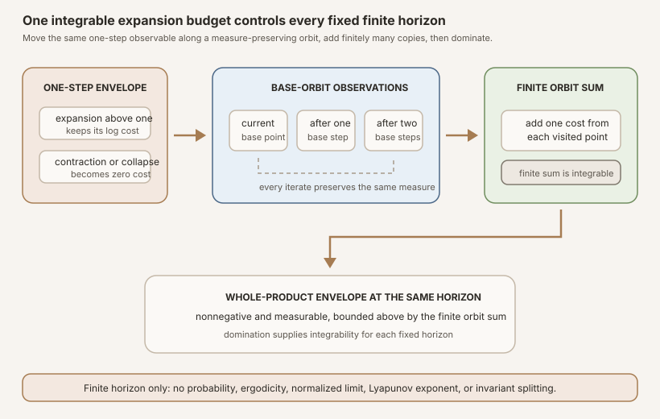


**AI-use disclosure.** Generative-AI tools helped draft, revise, illustrate,
and review this note. The author selected the questions, shaped the
exposition, has inspected the sources and artifacts cited here, and is
responsible for the final text and claims. This is an independent,
non-peer-reviewed Research Note. Verify claims against the cited primary
sources and any released artifacts before relying on them.



**Editorial status.** This teaching chapter remains a draft while human
editorial acceptance and the separate scientific-integrity and zero-context
expert-reader reviews are pending. The checked Lean source is authoritative
for every theorem statement.



**Abstract.** Let \(C\) be the one-sided complex matrix cocycle from RMT-13,
let \(T\) be its measure-preserving base, and write
\(\Phi(k,\omega)\) for its time-\(k\) matrix. RMT-14 defined the finite-time
norm

\[
  N_k(\omega)=\lVert\Phi(k,\omega)\rVert_{\infty\to\infty}.
\]

RMT-15 applies Mathlib's real positive logarithm,
\(\log^+ x=\max\{0,\log x\}\), and defines

\[
  G_k(\omega)=\log^+N_k(\omega).
\]

This observable is real valued, continuous in \(N_k\), nonnegative, and
measurable. Norm submultiplicativity and the later-block-left cocycle split
give

\[
  G_{m+k}(\omega)
  \le G_k(T^m\omega)+G_m(\omega).
\]

Iterating the one-step case produces the finite orbit sum

\[
  S_k(\omega)=\sum_{j=0}^{k-1}G_1(T^j\omega)
\]

and the pointwise majorization \(G_k(\omega)\le S_k(\omega)\). The module then
introduces one explicit hypothesis,

\[
  \operatorname{Integrable}(G_1,\mu).
\]

Every \(T^j\) preserves \(\mu\), so each pullback
\(G_1\circ T^j\) is integrable. A finite sum of those terms is integrable, and
the nonnegative measurable function \(G_k\) is integrable by domination.

The positive logarithm is an integrability envelope, not the RMT-14 extended
log-norm observable and not a Lyapunov exponent. It maps every
\(N_k(\omega)\le 1\) to zero. In particular, strict contraction, norm one,
and singular collapse all become zero. The module assumes no probability
measure, ergodicity, negative-part or inverse integrability, and proves no
asymptotic limit, Kingman theorem, Furstenberg-Kesten theorem, Oseledets
splitting, random Jacobian, or nonlinear derivative statement.


This is the proof-to-prose companion for
<code>formalization/NonlinearDynamics/Random/RandomCocycles/LogPlusIntegrability.lean</code>.
It covers all sixteen public declarations in exact source order. There are no
private declarations in the module.

The immediate predecessor,
[Finite-Time Cocycle Norms in Lean](),
fixed the maximum absolute row-sum norm and the extended-real logarithm that
sends a zero matrix to bottom. Reusable foundations include
,
,
,
and
.
The parallel textbook treatment is
[Finite-Horizon Log-Positive Cocycle Integrability]().
The immediate successor,
[Integrated Log-Positive Growth in Lean](),
integrates these envelopes against the raw measure, proves scalar
subadditivity under the same explicit one-step hypothesis, and applies
Mathlib's deterministic Fekete theorem. That next result is still neither a
samplewise theorem nor a Lyapunov exponent.

## Choose a route up

| Route | Begin | Destination |
|---|---|---|
| First encounter | [Why keep only positive logarithmic growth?](#why-keep-only-positive-logarithmic-growth) | Understand the expansion envelope and what it erases |
| Comparison route | [Two logarithms, two jobs](#two-logarithms-two-jobs) | Separate the extended log observable from the real log-positive envelope |
| Dynamics route | [The cocycle split becomes log-positive subadditivity](#the-cocycle-split-becomes-log-positive-subadditivity) | Preserve the base shift and matrix order |
| Orbit-sum route | [Unroll the horizon into one-step costs](#unroll-the-horizon-into-one-step-costs) | Derive the finite majorant by induction |
| Measure route | [Measure preservation transports integrability](#measure-preservation-transports-integrability) | See why no independence or probability normalization is needed |
| Lean route | [The complete declaration map](#the-complete-declaration-map) | Audit all sixteen declarations in source order |
| Boundary route | [The empty dimension is still a theorem branch](#the-empty-dimension-is-still-a-theorem-branch) | Check time zero and all horizons without a hidden positive-dimension premise |
| Integrity route | [Exactly what the module does not prove](#exactly-what-the-module-does-not-prove) | Keep finite-horizon \(L^1\) control separate from asymptotic dynamics |

### Learning objectives

By the summit, a reader should be able to:

1. define Mathlib's \(\log^+\) on real inputs;
2. explain why \(\log^+0=0\) is useful for upper integrability control;
3. explain why the same convention cannot record contraction or collapse;
4. distinguish \(G_k\) from RMT-14's extended log-norm observable;
5. compute \(G_k\) in collapse, contraction, neutral, and expansion examples;
6. prove nonnegativity and ordinary measurability of \(G_k\);
7. preserve the shifted later block in the two-time cocycle inequality;
8. use monotonicity and the product estimate for \(\log^+\);
9. define the one-step orbit sum \(S_k\);
10. read the empty-sum and successor-sum identities;
11. derive \(G_k\le S_k\) by natural-number induction;
12. distinguish ordinary measurability from integrability;
13. state the explicit one-step integrability hypothesis;
14. explain how measure preservation transports an \(L^1\) function;
15. explain why a finite sum of orbit pullbacks is integrable;
16. read the final domination proof through the real absolute value;
17. identify every ambient typeclass assumption;
18. explain why the proof works for a raw measure, not only a probability;
19. evaluate the observables in empty matrix dimension;
20. run and audit the Lean module from the command line; and
21. list the missing hypotheses before any asymptotic or derivative claim.

### Lineage, contribution, and boundary

Positive logarithmic moments are classical inputs in random matrix product
theory. Furstenberg and Kesten study normalized growth of random products
under probabilistic assumptions, and Kingman develops an ergodic theory for
subadditive stochastic processes. Those works explain the historical
importance of controlling positive logarithmic growth
([Furstenberg and Kesten, 1960](#ref-furstenberg-kesten);
[Kingman, 1968](#ref-kingman)).

RMT-15 does not formalize either paper. Its local contribution is the
finite-horizon bridge those later theories would need: one exact real-valued
envelope, one explicit one-step \(L^1\) predicate, one finite orbit-sum
majorant, and a checked propagation proof for every natural horizon. The
module neither chooses nor proves an asymptotic theorem.

## Why keep only positive logarithmic growth?

A matrix norm measures amplification. Its logarithm changes multiplicative
growth into additive growth:

\[
  \log(ab)=\log a+\log b
\]

for positive \(a\) and \(b\). But the ordinary logarithm has a negative tail
near zero. A product that contracts very strongly has a very negative log
norm, and a product that becomes exactly zero wants the value
\(-\infty\).

Suppose the immediate question is narrower:

> Is the upward growth cost integrable?

Then negative values do not threaten the positive tail. The standard envelope

\[
  \log^+x=\max\{0,\log x\}
\]

discards them. For a nonnegative matrix norm \(x\),

\[
  \log^+x=
  \begin{cases}
    0, & 0\le x\le 1,\\
    \log x, & 1\le x.
  \end{cases}
\]

Mathlib defines <code>Real.posLog</code> exactly as the maximum of zero and
the total real logarithm. The notation <code>log⁺</code> is activated by
<code>open scoped Real</code>
([Mathlib positive-log documentation](#ref-mathlib-poslog)).

### Four scales, one warning

Take four hypothetical finite-time norms:

| Norm \(N_k(\omega)\) | Dynamical reading | Extended log from RMT-14 | Positive log in RMT-15 |
|---:|---|---:|---:|
| \(0\) | exact singular collapse | \(\bot\) | \(0\) |
| \(1/4\) | strict contraction | \(\log(1/4)\lt 0\) | \(0\) |
| \(1\) | neutral scale | \(0\) | \(0\) |
| \(e^3\) | expansion | \(3\) | \(3\) |

The values are illustrative calculations, not measurements. They make the
semantic boundary visible: RMT-15 keeps the last row's expansion cost and
flattens the first three rows.


**Do not call \(G_k\) the finite-time Lyapunov observable.** A Lyapunov growth
rate must distinguish contraction from neutral evolution, and exact collapse
can matter decisively. The positive logarithm does not retain that
information. It is an upper-tail integrability envelope.


Figure: each one-step expansion cost is observed at a successive base point. Their finite sum is an integrable majorant once the one-step cost is integrable and the base preserves the measure. Contraction and collapse both enter the envelope as zero. The plate stops before probability, ergodicity, time normalization, limits, exponents, or invariant splittings.

## Two logarithms, two jobs

RMT-14 and RMT-15 intentionally expose different observables.

Let

\[
  E_k(\omega)
  =\operatorname{ENNReal.log}
    \bigl(\lVert\Phi(k,\omega)\rVert_{\mathrm e}\bigr)
  \in\overline{\mathbb R}
\]

be the RMT-14 extended log-norm observable, and let

\[
  G_k(\omega)=\log^+\lVert\Phi(k,\omega)\rVert\in\mathbb R
\]

be the new envelope.

| Question | \(E_k\) | \(G_k\) |
|---|---|---|
| Codomain | extended real | real |
| Zero matrix | bottom | zero |
| Strict contraction | negative finite value | zero |
| Norm one | zero | zero |
| Expansion | positive logarithm | positive logarithm |
| Main local role | honest finite-time logarithmic scale | positive-tail \(L^1\) control |
| Integrability proved here | no | yes, under an explicit one-step hypothesis |

The two observables do not serve the same formal role. The extended version
remembers the lower endpoint and contraction. The positive version is
easier to dominate by a nonnegative real function and is tailored to an
upper-integrability statement.

There is also no theorem in this module equating \(G_k\) with the positive
part of \(E_k\). Such a bridge might be formulated later, but it would need
careful endpoint and coercion bookkeeping. RMT-15 works directly with the
already real-valued norm \(N_k\).

## The finite-horizon setup

The ambient data are:

* an outcome or base-state type \(\Omega\);
* a measurable space on \(\Omega\);
* a finite decidable matrix index type \(\iota\);
* an arbitrary measure \(\mu\) on \(\Omega\); and
* a <code>DiscreteMatrixCocycle</code> \(C\).

The cocycle stores a measurable base map \(T:\Omega\to\Omega\), a proof that
\(T\) preserves \(\mu\), and a measurable complex matrix generator. Its
finite value obeys

\[
  \Phi(m+k,\omega)
  =\Phi(k,T^m\omega)\Phi(m,\omega).
\]

The matrix norm chosen in RMT-14 is the maximum absolute row-sum operator
norm. Define

\[
  N_k(\omega)=\lVert\Phi(k,\omega)\rVert,
  \qquad
  G_k(\omega)=\log^+N_k(\omega).
\]

Nothing in those definitions turns \(\mu\) into a probability measure. The
type <code>Measure Ω</code> permits finite, infinite, zero, and probability
measures. Integrability is always stated with the actual \(\mu\).

## The cocycle split becomes log-positive subadditivity

RMT-14 proved

\[
  N_{m+k}(\omega)
  \le N_k(T^m\omega)N_m(\omega).
\]

Both sides are nonnegative. Mathlib proves that \(\log^+\) is monotone on the
nonnegative axis, so

\[
  \log^+N_{m+k}(\omega)
  \le
  \log^+\bigl(N_k(T^m\omega)N_m(\omega)\bigr).
\]

Mathlib also proves the product estimate

\[
  \log^+(xy)\le\log^+x+\log^+y
\]

for all real \(x,y\). Combining the two gives

\[
  G_{m+k}(\omega)
  \le G_k(T^m\omega)+G_m(\omega).
\]

The order is not cosmetic. The first term on the right is the later
\(k\)-step block, observed after the first \(m\) base steps. The second term
is the earlier \(m\)-step prefix. Real addition is commutative, but the matrix
identity that produced the bound is not.


**Why an inequality, not an equality?** Even when both matrix factors are
nonzero, operator norms need only be submultiplicative. Then
\(\log^+(xy)\le\log^+x+\log^+y\) may also be strict when one factor expands
and the other contracts. The module proves the upper bound needed for an
integrability envelope.


## Unroll the horizon into one-step costs

The key finite sum is

\[
  S_k(\omega)=\sum_{j=0}^{k-1}G_1(T^j\omega).
\]

It charges one log-positive generator norm at each point visited by the base
orbit. There are exactly \(k\) terms.

For the first few horizons,

\[
\begin{aligned}
  S_0(\omega)&=0,\\
  S_1(\omega)&=G_1(\omega),\\
  S_2(\omega)&=G_1(\omega)+G_1(T\omega),\\
  S_3(\omega)&=G_1(\omega)+G_1(T\omega)+G_1(T^2\omega).
\end{aligned}
\]

The successor law is

\[
  S_{k+1}(\omega)=S_k(\omega)+G_1(T^k\omega).
\]

Now apply the two-time inequality with \(m=k\) and the later length equal to
one:

\[
  G_{k+1}(\omega)
  \le G_1(T^k\omega)+G_k(\omega).
\]

If the induction hypothesis gives \(G_k(\omega)\le S_k(\omega)\), then

\[
\begin{aligned}
  G_{k+1}(\omega)
  &\le G_1(T^k\omega)+G_k(\omega)\\
  &\le G_1(T^k\omega)+S_k(\omega)\\
  &=S_{k+1}(\omega).
\end{aligned}
\]

At \(k=0\), both \(G_0\) and \(S_0\) are zero. Therefore

\[
  G_k(\omega)\le S_k(\omega)
\]

for every natural horizon and every base point.

### Why this is a useful majorant

The left side is a norm of an entire matrix product followed by a nonlinear
function. The right side is a finite sum of copies of one fixed observable
along the base orbit. Measure preservation knows exactly how to transport
that one-step observable. This converts a product-level integrability problem
into repeated use of a one-step hypothesis.

The argument is finite. It uses neither a limit nor a uniform bound in \(k\).
The integral of \(S_k\) may grow with \(k\), and the module does not estimate
that growth.

## Measurability comes before integrability

An integrability proof needs a measurable representative and finite integral
control. RMT-15 proves ordinary measurability for both \(G_k\) and \(S_k\).

For \(G_k\), the chain is

\[
  \omega
  \longmapsto N_k(\omega)
  \longmapsto \log^+N_k(\omega).
\]

RMT-14 supplies measurability of \(N_k\). Mathlib supplies continuity of
\(\log^+\), hence its measurability. Composition closes the proof.

For \(S_k\), each base iterate \(T^j\) is measurable because it is measure
preserving. Therefore

\[
  \omega\longmapsto G_1(T^j\omega)
\]

is measurable. A finite sum of measurable real functions is measurable.

Measurability alone gives no finite integral. A measurable function can have
an infinite \(L^1\) norm. That is why declaration 13 introduces an explicit
hypothesis rather than attempting to derive it from the cocycle structure.

## Measure preservation transports integrability

The sole new analytic premise is

\[
  \operatorname{Integrable}(G_1,\mu).
\]

In Lean this becomes the proposition
<code>HasIntegrableGeneratorLogPlus C</code>. It is a definition, not a
structure field, an instance, or a theorem forced by measurability.

Mathlib defines <code>Integrable f μ</code> as almost-everywhere strong
measurability together with a finite integral of the norm of \(f\)
([Mathlib integrability documentation](#ref-mathlib-integrable)). For a
real-valued nonnegative function such as \(G_1\), that is the expected finite
positive integral condition.

If \(T^j\) preserves \(\mu\), pulling back an integrable function by \(T^j\)
preserves integrability:

\[
  G_1\in L^1(\mu)
  \quad\Longrightarrow\quad
  G_1\circ T^j\in L^1(\mu).
\]

Conceptually, measure preservation says the pullback sees the same measured
distribution of values. Formally, the proof invokes
<code>MeasurePreserving.integrable_comp_of_integrable</code> with RMT-13's
theorem that every natural base iterate preserves \(\mu\).

Since \(S_k\) is a finite sum of those pullbacks,

\[
  S_k\in L^1(\mu).
\]

Finally,

\[
  0\le G_k(\omega)\le S_k(\omega).
\]

The norm of a nonnegative real is itself, so the pointwise majorization is
also the norm bound required by <code>Integrable.mono'</code>. Ordinary
measurability of \(G_k\) supplies its almost-everywhere strong measurability.
Thus

\[
  G_k\in L^1(\mu)
\]

for every finite \(k\).

### What measure preservation does not supply

Measure preservation does not prove the starting hypothesis
\(G_1\in L^1(\mu)\). It only transports an already integrable observable. It
also supplies none of the following:

* total mass one;
* ergodicity;
* mixing;
* independence of successive matrices;
* a tail estimate;
* a finite negative logarithmic moment; or
* a time-normalized limit.

Measure preservation does imply that \(A\circ T^j\) has the same pushforward
measure as \(A\), because \(T^j\) preserves \(\mu\). RMT-15 does
not export that equality as a separately named theorem, and equal marginals
would not imply independence or any joint-law factorization.

On an infinite measure space, even a nonzero constant function may fail to be
integrable. The explicit predicate prevents the base invariance proof from
hiding that issue.

## A physical reading, with the bridge left explicit

Imagine a nonlinear discrete system \(x_{n+1}=F(x_n)\). If differentiability
and a chain rule have been established, the derivative of a \(k\)-step orbit
can be a product of Jacobian matrices. The finite-time norm then bounds the
amplification of infinitesimal perturbations, and

\[
  \log^+\lVert D F^k(x)\rVert
\]

records only the expansion part of that bound.

The orbit sum says that total finite-horizon expansion is no larger than the
sum of one-step expansion budgets encountered along the orbit. This resembles
an energy or resource ledger: a step with norm at most one contributes no
positive cost, while a step with norm above one contributes its logarithmic
excess.

That picture is motivation only. The checked cocycle stores arbitrary
measurable complex matrices. RMT-15 does not define \(F\), tangent spaces,
derivatives, Jacobians, smoothness, or a chain rule. Calling its generator a
Jacobian requires a separate Lean bridge.

## The empty dimension is still a theorem branch

The index type \(\iota\) is finite and decidable, but it is not globally
assumed nonempty. When \(\iota\) is empty, there is exactly one square matrix.
It is both the empty identity matrix and the zero matrix. Under the selected
row-sum norm, its norm is zero.

Therefore every finite-time positive-log observable is zero:

\[
  G_k(\omega)=\log^+0=0.
\]

At time zero the proof cannot simply use the positive-dimensional fact that
the identity has norm one. It splits on whether \(\iota\) is empty:

* in the empty branch, \(N_0=0\) and \(\log^+0=0\);
* in the nonempty branch, \(N_0=1\) and \(\log^+1=0\).

Both branches reach the same theorem \(G_0=0\), but for different reasons.
This is a good example of why formalization exposes boundary assumptions that
informal notation often suppresses.

The orbit sums are also zero in empty dimension. The module exports the
stronger all-horizon result for \(G_k\); the corresponding orbit-sum fact
follows by simplification but is not a separate public declaration.

## The complete declaration map

All declarations below live in
<code>NonlinearDynamics.Random.RandomCocycles.DiscreteMatrixCocycle</code>.
The ambient variables are

~~~lean
universe uΩ uι

variable {Ω : Type uΩ} {ι : Type uι} [MeasurableSpace Ω]
  [Fintype ι] [DecidableEq ι] {μ : Measure Ω}
~~~

Every occurrence of \(C\) has type
<code>DiscreteMatrixCocycle (ι := ι) μ</code>. That structure already
contains a \(\mu\)-preserving measurable base and a measurable generator.
There is no ambient <code>ProbabilityMeasure μ</code>,
<code>Nonempty ι</code>, ergodicity instance, or invertibility premise.

### Declaration ledger

| No. | Lean declaration | Kind | Additional premise | Mathematical role |
|---:|---|---|---|---|
| 1 | <code>logPlusNormObservable</code> | definition | none | \(G_k=\log^+N_k\) |
| 2 | <code>logPlusNormObservable_nonneg</code> | theorem | none | \(0\le G_k\) |
| 3 | <code>logPlusNormObservable_zero</code> | simp theorem | none | \(G_0=0\) in every finite dimension |
| 4 | <code>logPlusNormObservable_one</code> | simp theorem | none | \(G_1=\log^+\lVert A\rVert\) |
| 5 | <code>measurable_logPlusNormObservable</code> | theorem | none | ordinary measurability of \(G_k\) |
| 6 | <code>logPlusNormObservable_add_le</code> | theorem | none | shifted two-time subadditivity |
| 7 | <code>logPlusNormObservable_eq_zero_of_isEmpty</code> | simp theorem | <code>IsEmpty ι</code> | all horizons vanish in empty dimension |
| 8 | <code>orbitLogPlusSum</code> | definition | none | finite orbit sum \(S_k\) |
| 9 | <code>orbitLogPlusSum_zero</code> | simp theorem | none | \(S_0=0\) |
| 10 | <code>orbitLogPlusSum_succ</code> | simp theorem | none | append the newest one-step term |
| 11 | <code>measurable_orbitLogPlusSum</code> | theorem | none | ordinary measurability of \(S_k\) |
| 12 | <code>logPlusNormObservable_le_orbitLogPlusSum</code> | theorem | none | \(G_k\le S_k\) |
| 13 | <code>HasIntegrableGeneratorLogPlus</code> | definition | none | explicit \(G_1\in L^1(\mu)\) predicate |
| 14 | <code>HasIntegrableGeneratorLogPlus.integrable_at_base_iterate</code> | theorem | predicate | every \(G_1\circ T^j\) is integrable |
| 15 | <code>HasIntegrableGeneratorLogPlus.integrable_orbitLogPlusSum</code> | theorem | predicate | every finite \(S_k\) is integrable |
| 16 | <code>HasIntegrableGeneratorLogPlus.integrable_logPlusNormObservable</code> | theorem | predicate | every finite \(G_k\) is integrable |

The next sections follow this exact order.

### Declaration 1: <code>logPlusNormObservable</code>

~~~lean
def logPlusNormObservable
    (C : DiscreteMatrixCocycle (ι := ι) μ) (k : ℕ) : Ω → ℝ :=
  fun ω ↦ log⁺ (C.normObservable k ω)
~~~

This is a function of the base point. It stays in \(\mathbb R\), unlike the
extended observable from RMT-14. The definition makes no integrability claim.

### Declaration 2: <code>logPlusNormObservable_nonneg</code>

~~~lean
theorem logPlusNormObservable_nonneg
    (C : DiscreteMatrixCocycle (ι := ι) μ) (k : ℕ) (ω : Ω) :
    0 ≤ C.logPlusNormObservable k ω
~~~

The proof is exactly Mathlib's <code>Real.posLog_nonneg</code>. The theorem is
pointwise and needs no measure calculation.

### Declaration 3: <code>logPlusNormObservable_zero</code>

~~~lean
@[simp] theorem logPlusNormObservable_zero
    (C : DiscreteMatrixCocycle (ι := ι) μ) :
    C.logPlusNormObservable 0 = fun _ ↦ 0
~~~

The proof splits with <code>isEmpty_or_nonempty ι</code>. In empty dimension
it rewrites the time-zero norm with
<code>normObservable_eq_zero_of_isEmpty</code> and uses
<code>Real.posLog_zero</code>. In positive dimension it uses
<code>normObservable_zero</code> and <code>Real.posLog_one</code>.

### Declaration 4: <code>logPlusNormObservable_one</code>

~~~lean
@[simp] theorem logPlusNormObservable_one
    (C : DiscreteMatrixCocycle (ι := ι) μ) :
    C.logPlusNormObservable 1 = fun ω ↦ log⁺ ‖C.generator ω‖
~~~

RMT-13 identifies the one-step cocycle value with the generator, and RMT-14
identifies the one-step norm observable with its norm. Simplification exposes
the one-step integrability target.

### Declaration 5: <code>measurable_logPlusNormObservable</code>

~~~lean
theorem measurable_logPlusNormObservable
    (C : DiscreteMatrixCocycle (ι := ι) μ) (k : ℕ) :
    Measurable (C.logPlusNormObservable k)
~~~

The proof composes <code>C.measurable_normObservable k</code> with
<code>Real.continuous_posLog.measurable</code>. This is ordinary
measurability, stronger than the almost-everywhere measurability later needed
for integrability.

### Declaration 6: <code>logPlusNormObservable_add_le</code>

~~~lean
theorem logPlusNormObservable_add_le
    (C : DiscreteMatrixCocycle (ι := ι) μ) (m k : ℕ) (ω : Ω) :
    C.logPlusNormObservable (m + k) ω ≤
      C.logPlusNormObservable k (C.base^[m] ω) +
        C.logPlusNormObservable m ω
~~~

The proof has two inequalities:

1. <code>Real.posLog_le_posLog</code> lifts RMT-14's norm bound through
   monotonicity on nonnegative inputs.
2. <code>Real.posLog_mul</code> bounds the positive log of the product by the
   sum of positive logs.

No factor is assumed nonzero. If a block norm is zero, its positive logarithm
is zero and the upper bound remains valid.

### Declaration 7: <code>logPlusNormObservable_eq_zero_of_isEmpty</code>

~~~lean
@[simp] theorem logPlusNormObservable_eq_zero_of_isEmpty [IsEmpty ι]
    (C : DiscreteMatrixCocycle (ι := ι) μ) (k : ℕ) :
    C.logPlusNormObservable k = fun _ ↦ 0
~~~

RMT-14 proves every norm observable is zero in empty dimension. Simplification
then uses \(\log^+0=0\). This theorem covers all horizons, not only time zero.

### Declaration 8: <code>orbitLogPlusSum</code>

~~~lean
def orbitLogPlusSum
    (C : DiscreteMatrixCocycle (ι := ι) μ) (k : ℕ) : Ω → ℝ :=
  fun ω ↦ ∑ j ∈ Finset.range k,
    C.logPlusNormObservable 1 (C.base^[j] ω)
~~~

<code>Finset.range k</code> contains \(0,\ldots,k-1\). The double-binder form
in Lean is a finite sum over membership in that range.

### Declaration 9: <code>orbitLogPlusSum_zero</code>

~~~lean
@[simp] theorem orbitLogPlusSum_zero
    (C : DiscreteMatrixCocycle (ι := ι) μ) :
    C.orbitLogPlusSum 0 = fun _ ↦ 0
~~~

The range at zero is empty, and the empty real sum is zero.

### Declaration 10: <code>orbitLogPlusSum_succ</code>

~~~lean
@[simp] theorem orbitLogPlusSum_succ
    (C : DiscreteMatrixCocycle (ι := ι) μ) (k : ℕ) :
    C.orbitLogPlusSum (k + 1) = fun ω ↦
      C.orbitLogPlusSum k ω +
        C.logPlusNormObservable 1 (C.base^[k] ω)
~~~

The proof is the finite-sum identity
<code>Finset.sum_range_succ</code>. The term at index \(k\) is appended to the
previous prefix.

### Declaration 11: <code>measurable_orbitLogPlusSum</code>

~~~lean
theorem measurable_orbitLogPlusSum
    (C : DiscreteMatrixCocycle (ι := ι) μ) (k : ℕ) :
    Measurable (C.orbitLogPlusSum k)
~~~

For each \(j\), the base iterate is measurable because
<code>C.base_preserving.measurable.iterate j</code> is measurable. Compose it
with declaration 5 at horizon one, then use
<code>Finset.measurable_sum</code>.

### Declaration 12: <code>logPlusNormObservable_le_orbitLogPlusSum</code>

~~~lean
theorem logPlusNormObservable_le_orbitLogPlusSum
    (C : DiscreteMatrixCocycle (ι := ι) μ) (k : ℕ) (ω : Ω) :
    C.logPlusNormObservable k ω ≤ C.orbitLogPlusSum k ω
~~~

The proof is induction on \(k\). The zero case simplifies. At a successor,
declaration 6 treats an earlier length \(k\) followed by a later length one,
the induction hypothesis bounds the prefix, and declaration 10 identifies the
sum. One final
<code>add_comm</code> matches the order in which the two inequalities present
their real summands.

### Declaration 13: <code>HasIntegrableGeneratorLogPlus</code>

~~~lean
def HasIntegrableGeneratorLogPlus
    (C : DiscreteMatrixCocycle (ι := ι) μ) : Prop :=
  Integrable (C.logPlusNormObservable 1) μ
~~~

This definition names the sole added analytic hypothesis. By declaration 4 it
is equivalently the integrability of
\(\omega\mapsto\log^+\lVert C.\mathrm{generator}(\omega)\rVert\), although
the module does not export that equivalence as a separate theorem.

### Declaration 14: <code>integrable_at_base_iterate</code>

~~~lean
theorem HasIntegrableGeneratorLogPlus.integrable_at_base_iterate
    {C : DiscreteMatrixCocycle (ι := ι) μ}
    (hC : C.HasIntegrableGeneratorLogPlus) (j : ℕ) :
    Integrable (fun ω ↦
      C.logPlusNormObservable 1 (C.base^[j] ω)) μ
~~~

The proof changes the lambda into the composition
\(G_1\circ T^j\). RMT-13 proves that \(T^j\) preserves \(\mu\), and Mathlib's
<code>integrable_comp_of_integrable</code> transports <code>hC</code>.

### Declaration 15: <code>integrable_orbitLogPlusSum</code>

~~~lean
theorem HasIntegrableGeneratorLogPlus.integrable_orbitLogPlusSum
    {C : DiscreteMatrixCocycle (ι := ι) μ}
    (hC : C.HasIntegrableGeneratorLogPlus) (k : ℕ) :
    Integrable (C.orbitLogPlusSum k) μ
~~~

Unfold the sum. Declaration 14 proves every summand is integrable, and
<code>integrable_finsetSum</code> closes the finite sum.

### Declaration 16: <code>integrable_logPlusNormObservable</code>

~~~lean
theorem HasIntegrableGeneratorLogPlus.integrable_logPlusNormObservable
    {C : DiscreteMatrixCocycle (ι := ι) μ}
    (hC : C.HasIntegrableGeneratorLogPlus) (k : ℕ) :
    Integrable (C.logPlusNormObservable k) μ
~~~

This is the summit theorem. Its majorant is declaration 15. Declaration 5
supplies the target's almost-everywhere strong measurability. Pointwise,
declaration 2 rewrites the real norm as the function itself:

\[
  \lVert G_k(\omega)\rVert_{\mathbb R}
  =\lvert G_k(\omega)\rvert
  =G_k(\omega).
\]

Declaration 12 then proves
\(\lVert G_k(\omega)\rVert\le S_k(\omega)\).
Mathlib's <code>Integrable.mono'</code> concludes integrability.

## Proof architecture at a glance

~~~text
RMT-14 measurable norm N_k
            |
            v
continuous real positive log
            |
            v
measurable, nonnegative G_k
            |
            +---- cocycle norm split + posLog product inequality
            |                         |
            |                         v
            |                  G_(m+k) <= shifted G_k + G_m
            |                         |
            |                         v
            |                  induction: G_k <= S_k
            |
one-step hypothesis G_1 in L1(mu)
            |
            v
measure-preserving pullback along every T^j
            |
            v
each orbit term is integrable
            |
            v
finite sum S_k is integrable
            |
            v
domination: every finite-horizon G_k is integrable
~~~

The left branch supplies the measurable target and pointwise bound. The right
branch supplies an integrable majorant. The final theorem joins them.

## Running and auditing the Lean

From the repository root on macOS or Linux:

~~~sh
source "$HOME/.elan/env"
cd formalization
lake env lean NonlinearDynamics/Random/RandomCocycles/LogPlusIntegrability.lean
cd ..
~~~

A successful invocation exits silently with status zero. Back at the
repository root, the broader repository build is:

~~~sh
make lean
~~~

To inspect the public contract in a scratch file, import the module and ask
Lean for representative declarations:

~~~lean
import NonlinearDynamics.Random.RandomCocycles.LogPlusIntegrability

#check NonlinearDynamics.Random.RandomCocycles.DiscreteMatrixCocycle.logPlusNormObservable
#check NonlinearDynamics.Random.RandomCocycles.DiscreteMatrixCocycle.logPlusNormObservable_add_le
#check NonlinearDynamics.Random.RandomCocycles.DiscreteMatrixCocycle.orbitLogPlusSum
#check NonlinearDynamics.Random.RandomCocycles.DiscreteMatrixCocycle.logPlusNormObservable_le_orbitLogPlusSum
#check NonlinearDynamics.Random.RandomCocycles.DiscreteMatrixCocycle.HasIntegrableGeneratorLogPlus
#check NonlinearDynamics.Random.RandomCocycles.DiscreteMatrixCocycle.HasIntegrableGeneratorLogPlus.integrable_logPlusNormObservable
~~~

The source imports RMT-14 and
<code>Mathlib.Analysis.SpecialFunctions.Log.PosLog</code>. The latter import
is deliberate: it provides the definition, notation, continuity,
nonnegativity, monotonicity, and product estimate used by the module.

## Common proof and interpretation traps

### Trap 1: treating \(\log^+\) as an honest logarithm

The equation \(\log(xy)=\log x+\log y\) does not become an equality for
\(\log^+\). The available statement is an inequality. Flattening negative
values destroys additivity.

### Trap 2: inferring that a zero envelope means neutral dynamics

\(G_k(\omega)=0\) means only that \(N_k(\omega)\le1\). The matrix may be
norm preserving, strictly contracting, or zero.

### Trap 3: forgetting the shifted base point

The later block begins at \(T^m\omega\). Writing
\(G_{m+k}\le G_k(\omega)+G_m(\omega)\) would erase the cocycle's orbit
geometry.

### Trap 4: deriving integrability from measurability

Declarations 5 and 11 prove measurability only. Declaration 13 is a genuine
new premise.

### Trap 5: deriving integrability from measure preservation

Measure preservation transports integrability; it does not create it. The
one-step cost must already be integrable.

### Trap 6: silently assuming total mass one

The module uses a raw <code>Measure Ω</code>. No expectation notation or
probability normalization appears.

### Trap 7: assuming independence

The orbit observations can be strongly dependent. The finite-sum
integrability proof needs no independence because \(L^1\) is closed under
finite sums.

### Trap 8: assuming a uniform-in-time estimate

For every fixed \(k\), the module proves \(G_k\in L^1\). It does not produce a
single integrable function dominating all \(k\), a bound independent of
\(k\), or convergence as \(k\to\infty\).

### Trap 9: forgetting the negative side

Integrability of \(\log^+\lVert A\rVert\) controls upward growth. It says
nothing about \(\log^+\lVert A^{-1}\rVert\), negative logarithmic growth, or
singular collapse.

### Trap 10: calling the generator a Jacobian

An arbitrary measurable complex matrix field is not automatically the
derivative of a nonlinear system.

## Exactly what the module does not prove

The following nonclaims are part of the contract:

1. \(\mu\) is not proved or assumed to be a probability measure.
2. The base transformation is not assumed ergodic.
3. No mixing, stationarity beyond measure preservation, independence, or
   identical-distribution theorem is supplied.
4. No normalized quantity \(k^{-1}G_k\) is defined.
5. No almost-sure, in-probability, or \(L^1\) limit is proved.
6. Kingman's subadditive ergodic theorem is not imported or applied.
7. The Furstenberg-Kesten theorem is not formalized or applied.
8. No Lyapunov exponent is defined.
9. No deterministic almost-sure growth rate is proved.
10. No Oseledets theorem, invariant filtration, or invariant splitting is
    present.
11. No two-sided time or inverse cocycle is defined.
12. No integrability of \(\log^+\lVert A^{-1}\rVert\) is assumed or proved.
13. No negative-part integrability is proved.
14. A zero matrix is not distinguished from a strict contraction by \(G_k\).
15. No Jacobian, derivative cocycle, tangent bundle, or chain rule is present.
16. No random differential equation or stochastic differential equation is
    modeled.
17. No dimension-uniform estimate is claimed.
18. No optimality or equality case for the orbit-sum majorant is proved.
19. No integral identity for \(S_k\) is exported.
20. No theorem identifies this envelope with the RMT-14 extended observable.

These omissions are not defects in the finite-horizon theorem. They mark the
interfaces that future modules must formalize explicitly.

## Exercises with solutions

### Exercise 1: compute the envelope

Compute \(\log^+x\) for \(x=0\), \(x=e^{-2}\), \(x=1\), and \(x=e^2\).

**Solution.**

\[
  \log^+0=0,\qquad
  \log^+(e^{-2})=0,\qquad
  \log^+1=0,\qquad
  \log^+(e^2)=2.
\]

The first three inputs all lie at or below one.

### Exercise 2: find the information loss

Can \(G_k(\omega)=0\) prove that \(\Phi(k,\omega)\) is invertible?

**Solution.** No. A zero matrix and an invertible strict contraction both
have positive logarithm zero.

### Exercise 3: preserve the shift

Write declaration 6 at \(m=2\) and \(k=3\).

**Solution.**

\[
  G_5(\omega)\le G_3(T^2\omega)+G_2(\omega).
\]

The later three-step block begins after the earlier two-step prefix.

### Exercise 4: expand the orbit sum

Write \(S_4(\omega)\).

**Solution.**

\[
  S_4(\omega)
  =G_1(\omega)+G_1(T\omega)+G_1(T^2\omega)+G_1(T^3\omega).
\]

### Exercise 5: identify the induction split

Which substitution into declaration 6 starts the successor step for
\(G_{k+1}\)?

**Solution.** Set the earlier length to \(m=k\) and the later length to one.
This gives

\[
  G_{k+1}(\omega)\le G_1(T^k\omega)+G_k(\omega).
\]

### Exercise 6: separate two uses of the base map

Why is the base iterate needed once for measurability and again for
integrability?

**Solution.** Measurability of \(T^j\) lets us compose it with \(G_1\) to
obtain a measurable summand. Measure preservation of \(T^j\) is stronger and
transports the finite \(L^1\) integral.

### Exercise 7: reject an independence premise

Where does independence enter the proof of declaration 15?

**Solution.** Nowhere. Each finite summand is integrable, and finite sums of
integrable real functions are integrable regardless of dependence.

### Exercise 8: inspect a raw infinite measure

If \(\mu(\Omega)=\infty\) and \(G_1(\omega)=1\) everywhere, is declaration 13
automatic?

**Solution.** No. The integral of the constant one function is infinite.
Measure preservation does not make it integrable.

### Exercise 9: explain the norm rewrite

Why does declaration 16 use nonnegativity before applying domination?

**Solution.** <code>Integrable.mono'</code> asks for a bound on the norm of
the target. Since \(G_k\ge0\),
\(\lVert G_k(\omega)\rVert=\lvert G_k(\omega)\rvert=G_k(\omega)\), so the
already proved inequality \(G_k\le S_k\) has the required shape.

### Exercise 10: test empty dimension

What are \(G_7(\omega)\) and \(S_7(\omega)\) when \(\iota\) is empty?

**Solution.** Every cocycle norm is zero, so every positive-log term is zero.
Thus both values are zero.

### Exercise 11: compare the two zeros

What do RMT-14 and RMT-15 return when \(\Phi(k,\omega)=0\)?

**Solution.** RMT-14's extended log-norm observable returns bottom. RMT-15's
real positive-log envelope returns zero.

### Exercise 12: locate the probability gap

Which Lean assumption would show that \(\mu\) has total mass one?

**Solution.** A suitable probability-measure wrapper or typeclass would be
needed. No such assumption appears in this module.

### Exercise 13: locate the ergodicity gap

Does <code>MeasurePreserving</code> imply ergodicity?

**Solution.** No. Measure preservation says measured sets are transported
without changing the measure. Ergodicity is an additional statement about
invariant sets.

### Exercise 14: reject a Lyapunov conclusion

Why does integrability of every fixed \(G_k\) not produce a Lyapunov exponent?

**Solution.** A Lyapunov exponent concerns normalized long-time logarithmic
growth. The module defines no normalized sequence and proves no convergence
theorem. Moreover, \(G_k\) has erased negative growth.

### Exercise 15: identify the derivative gap

What must be formalized before interpreting the generator as \(DF\)?

**Solution.** At minimum, one needs a nonlinear state space and map,
differentiability, a coordinate or tangent-space identification, measurability
of the derivative field, and a chain rule matching the cocycle product order.

### Exercise 16: audit the hypothesis count

How many new integrability hypotheses are introduced?

**Solution.** One:
<code>HasIntegrableGeneratorLogPlus C</code>. All finite-horizon
integrability results are derived from it.

## The next ridge

RMT-15 now provides the positive-tail \(L^1\) input and a finite-horizon
subadditive envelope. A responsible asymptotic step must first choose the
actual process whose normalized limit is sought. The real positive part
\(G_k\) is not enough to represent contraction. RMT-14's extended observable
retains collapse as bottom but raises different integrability and codomain
questions.

If the next target is a subadditive ergodic theorem, the project must match
the exact shifted indexing convention, add whatever probability or finite
measure assumptions the chosen theorem needs, state stationarity and
ergodicity at the correct strength, and verify the theorem's integrability
hypotheses. A deterministic limit under ergodicity is a further conclusion,
not a synonym for measure preservation.

If the next target is a multiplicative ergodic theorem, more structure is
needed: a suitable matrix or linear-map cocycle interface, dimension
conditions, a treatment of singular values or exterior powers, and possibly
inverse-log integrability depending on the theorem variant. If the target is
nonlinear dynamics, a separate derivative-cocycle bridge must come first.

The finite-horizon envelope is therefore a staging theorem. It makes the
positive-growth hypothesis reusable and checked while leaving every
asymptotic choice visible.

## References

The links below were checked on 2026-07-21. The pinned local Mathlib 4.32.0
checkout remains the exact API authority for the Lean proof.

**Mathlib contributors.**
[Mathlib 4.32.0 release](https://github.com/leanprover-community/mathlib4/releases/tag/v4.32.0),
2026. This is the dependency release selected by
<code>formalization/lakefile.toml</code>.

**Mathlib contributors.**
[The positive part of the logarithm](https://leanprover-community.github.io/mathlib4_docs/Mathlib/Analysis/SpecialFunctions/Log/PosLog.html),
Mathlib 4 documentation. This official page defines
<code>Real.posLog</code> and the notation <code>log⁺</code>, proves
nonnegativity, continuity, monotonicity on nonnegative inputs, the zero
criterion, and the product upper bound used by RMT-15.

**Mathlib contributors.**
[Integrable functions](https://leanprover-community.github.io/mathlib4_docs/Mathlib/MeasureTheory/Function/L1Space/Integrable.html),
Mathlib 4 documentation. This official page defines
<code>Integrable</code> and documents the measure-preserving composition,
finite-sum, and domination tools used in declarations 14 through 16.

**Harry Furstenberg and Harry Kesten.**
["Products of Random Matrices"](https://doi.org/10.1214/aoms/1177705909),
*The Annals of Mathematical Statistics* 31(2), 457-469, 1960. This original
paper is cited as historical motivation for normalized logarithmic growth of
random matrix products. RMT-15 proves no result from it.

**J. F. C. Kingman.**
["The Ergodic Theory of Subadditive Stochastic Processes"](https://doi.org/10.1111/j.2517-6161.1968.tb00749.x),
*Journal of the Royal Statistical Society: Series B* 30(3), 499-510, 1968.
This original paper locates the later asymptotic theory. RMT-15 proves only a
finite pointwise subadditive inequality and finite-horizon integrability.
