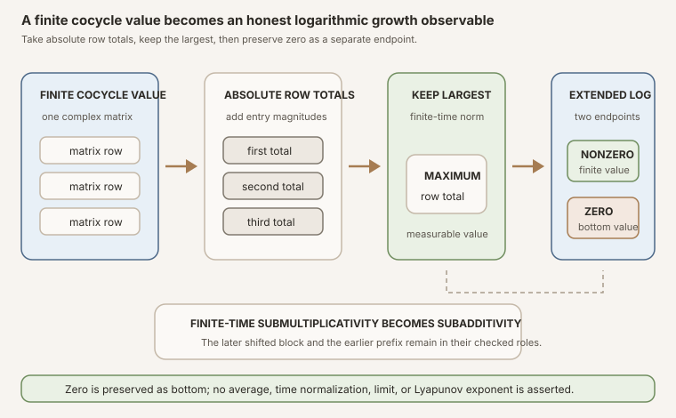


**AI-use disclosure.** Generative-AI tools helped draft, revise, illustrate,
and review this note. The author selected the questions, shaped the
exposition, has inspected the sources and artifacts cited here, and is
responsible for the final text and claims. This is an independent,
non-peer-reviewed Research Note. Verify claims against the cited primary
sources and any released artifacts before relying on them.



**Editorial status.** This teaching chapter remains a draft while human
editorial acceptance and the separate scientific-integrity and zero-context
expert-reader reviews are pending. The checked Lean source is authoritative
for every theorem statement.



**Abstract.** Let \(C\) be the one-sided complex matrix cocycle built in
RMT-13, and write its time-\(k\) value at \(\omega\) as
\(\Phi(k,\omega)\). RMT-14 selects Mathlib's operator norm induced by the
vector supremum norm. For a finite square matrix, this is the maximum absolute
row sum:

\[
  N_k(\omega)
  =\lVert \Phi(k,\omega)\rVert_{\infty\to\infty}
  =\max_i\sum_j \lvert \Phi(k,\omega)_{ij}\rvert.
\]

The module proves the exact row-sum formula, positive-dimensional time-zero
normalization, one-step generator identity, finite-time submultiplicativity,
and ordinary measurability. The measurability proof is deliberately
entrywise: measurable complex entries give measurable entry norms, finite row
sums, a finite supremum, and finally a real-valued norm. It does not silently
identify the project's entrywise matrix measurable space with a topology
installed by a scoped norm instance.

The logarithmic observable takes values in the extended real numbers:

\[
  L_k(\omega)=\log_{\mathrm{ext}} N_k(\omega)
  :=\operatorname{ENNReal.log}\!\left(\lVert
  \Phi(k,\omega)\rVert_{\mathrm e}\right).
\]

Here the extended nonnegative norm is fed to Mathlib's extended logarithm.
Consequently \(L_k(\omega)=\bot\) exactly when the cocycle matrix is zero.
This avoids the unrelated total-function convention
\(\operatorname{Real.log}(0)=0\). Monotonicity, matrix-norm
submultiplicativity, and the unconditional extended logarithm product law
give

\[
  L_{m+k}(\omega)
  \le L_k(T^m\omega)+L_m(\omega)
\]

even when one block vanishes. The module proves measurability but no
integrability. It is finite-time infrastructure, not a subadditive ergodic
theorem, multiplicative ergodic theorem, Lyapunov exponent, or invariant
splitting.


This is the proof-to-prose companion for
<code>formalization/NonlinearDynamics/Random/RandomCocycles/NormObservables.lean</code>.
It covers all fourteen public declarations in exact source order. There are no
private declarations in the module.

The immediate predecessor,
[One-Sided Discrete Matrix Cocycles in Lean](),
constructs \(\Phi(k,\omega)\), proves its later-block-left time split, and
establishes ordinary measurability of every finite value. Reusable terminology
is developed under
,
,
and
.
The parallel textbook treatment is
[Finite-Time Norm and Extended-Log-Norm Observables for Matrix Cocycles]().

## Choose a route up

| Route | Begin | Destination |
|---|---|---|
| First encounter | [From a matrix action to one growth number](#from-a-matrix-action-to-one-growth-number) | Understand what the selected norm controls and what it forgets |
| Norm route | [The maximum absolute row-sum formula](#the-maximum-absolute-row-sum-formula) | Derive the exact finite formula behind the scoped Lean norm |
| Dynamics route | [Submultiplicativity follows the cocycle split](#submultiplicativity-follows-the-cocycle-split) | Keep the shifted later block and multiplication order correct |
| Measurability route | [Measurability is rebuilt entry by entry](#measurability-is-rebuilt-entry-by-entry) | Follow entries, absolute values, row sums, finite suprema, and coercion |
| Logarithm route | [Why the logarithm lives in the extended reals](#why-the-logarithm-lives-in-the-extended-reals) | Preserve the zero matrix as bottom instead of calling it growth zero |
| Boundary route | [Positive and empty dimensions are different branches](#positive-and-empty-dimensions-are-different-branches) | See why identity norm one needs <code>Nonempty</code> and empty products stay valid |
| Lean route | [The complete declaration map](#the-complete-declaration-map) | Audit all fourteen declarations in source order |
| Integrity route | [Strict finite-time nonclaims](#strict-finite-time-nonclaims) | Separate the observable layer from integrability and asymptotic theory |

### Learning objectives

By the summit, a reader should be able to:

1. state the exact maximum absolute row-sum norm selected by the module;
2. explain why that norm is induced by the vector supremum norm;
3. distinguish it from the Frobenius, spectral, and entrywise supremum norms;
4. compute the norm of a small complex matrix from its rows;
5. explain what finite-time perturbation control the norm supplies;
6. identify the extra theorem needed before calling the cocycle a derivative
   or Jacobian cocycle;
7. state the norm observable at an arbitrary finite time;
8. explain why time-zero norm one requires a nonempty index type;
9. recover the generator norm at time one;
10. derive submultiplicativity from the exact RMT-13 cocycle identity;
11. keep the later shifted block on the left in that inequality;
12. reconstruct norm measurability from measurable matrix entries;
13. explain why the proof avoids an unproved Borel-space identification;
14. distinguish a nonnegative real norm from its extended nonnegative
    representation;
15. explain why <code>ENNReal.log</code> sends zero to extended-real bottom;
16. contrast that convention with <code>Real.log 0 = 0</code> in Lean;
17. prove that bottom occurs exactly at a zero cocycle value;
18. understand why the extended logarithm product law is unconditional;
19. derive finite-time log subadditivity even when a factor vanishes;
20. distinguish measurability from integrability;
21. evaluate every exported observable when the matrix index type is empty;
22. read every typeclass assumption in the declaration ledger; and
23. list the missing hypotheses and theorems before any Lyapunov conclusion.

### Lineage, contribution, and boundary

Norm growth in products of matrices is classical. Furstenberg and Kesten's
1960 paper studies long products under probabilistic assumptions, while
Kingman's 1968 work supplies a general subadditive ergodic framework. Those
sources explain why logarithmic norm observables matter historically, but
RMT-14 proves neither result and imports neither theorem
([Furstenberg and Kesten, 1960](#ref-furstenberg-kesten);
[Kingman, 1968](#ref-kingman)).

The local contribution is narrower: a convention-complete, finite-time Lean
layer above the already checked cocycle. It freezes one norm, makes its
coordinate formula public, proves measurability without smuggling in a
topological compatibility claim, selects an exact zero convention for the
logarithm, proves the resulting subadditive inequality, and retains both
positive- and zero-dimensional matrix spaces.

## From a matrix action to one growth number

Suppose a state perturbation \(v\) is carried forward by the cocycle value
\(\Phi(k,\omega)\). If vectors carry the supremum norm, then the induced
operator norm gives

\[
  \lVert \Phi(k,\omega)v\rVert_\infty
  \le N_k(\omega)\lVert v\rVert_\infty.
\]

This is a finite-time upper bound. If \(N_k(\omega)\) is large, some direction
may be strongly amplified. If it is small, every input vector is controlled
in that norm. The single number forgets the direction of strongest action,
the geometry of invariant subspaces, cancellations among entries, and the
rest of the singular-value profile.

In nonlinear dynamics, a derivative cocycle can transport an infinitesimal
perturbation along an orbit. That physical picture motivates norm growth, but
the present Lean structure stores an arbitrary measurable complex matrix
generator. No theorem here identifies it with a derivative, proves
differentiability of a nonlinear map, or relates matrix dimension to a tangent
space. The physics is an intended consumer, not a premise hidden in the API.

Figure: the checked pipeline first compresses a finite cocycle matrix to absolute row totals and then keeps the largest row. The extended logarithm has two explicit branches: a nonzero norm gives a finite extended-real value, while zero gives bottom. The plate shows no probability average, time normalization, limit, exponent, or invariant direction.

## The maximum absolute row-sum formula

For a finite matrix \(M=(M_{ij})\), define

\[
  \lVert M\rVert_{\infty\to\infty}
  =\max_i\sum_j\lvert M_{ij}\rvert.
\]

This is the operator norm induced by the supremum norm on coordinate vectors.
For every row \(i\), the triangle inequality gives

\[
  \left\lvert\sum_j M_{ij}v_j\right\rvert
  \le\left(\sum_j\lvert M_{ij}\rvert\right)\lVert v\rVert_\infty.
\]

Taking the maximum over rows bounds the output supremum norm. In a nonempty
finite coordinate space, a suitable choice of phases reaches the largest row
sum, so this formula agrees with the induced operator norm. Mathlib exposes
that agreement in its matrix norm API
([Mathlib matrix norm documentation](#ref-mathlib-matrix-norm)).

### A checkable complex example

Consider

\[
  M=
  \begin{bmatrix}
  1 & -2\\
  \mathrm{i} & \tfrac12
  \end{bmatrix}.
\]

The first absolute row sum is \(1+2=3\). The second is
\(1+\tfrac12=\tfrac32\). Therefore

\[
  \lVert M\rVert_{\infty\to\infty}=3.
\]

These are toy values for teaching, not measurements or empirical claims.


**Norm-selection trap.** A finite matrix supports several natural norms. The
scope <code>Matrix.Norms.Operator</code> activates the maximum-row-sum norm for
this module. It is not the Frobenius norm, the maximum entry magnitude, the
spectral radius, or the Euclidean spectral norm. The exact exported row-sum
theorem prevents notation alone from hiding that choice.


### Declaration 1: <code>normObservable</code>

The first definition turns each finite cocycle value into a real number:

~~~lean
def normObservable (C : DiscreteMatrixCocycle (ι := ι) μ) (k : ℕ) : Ω → ℝ :=
  fun ω ↦ ‖C.value k ω‖
~~~

The output is a function of the initial outcome \(\omega\). Time \(k\) is a
fixed natural-number parameter. Nothing is integrated, averaged, normalized
by \(k\), or sent to a limit.

### Declaration 2: <code>normObservable_eq_rowSumSup</code>

The second declaration publishes the exact coordinate meaning:

\[
  N_k(\omega)
  =\max_{i\in\iota}\sum_{j\in\iota}
  \lvert \Phi(k,\omega)_{ij}\rvert.
\]

Lean represents each absolute entry by its nonnegative norm
<code>‖...‖₊</code>, forms a finite sum, then uses
<code>Finset.univ.sup</code> over rows. The final nonnegative real is coerced
to a real. The proof is exactly Mathlib's
<code>Matrix.linfty_opNorm_def</code> specialized to the cocycle value.

Publishing the formula serves two purposes. Readers can audit the norm
convention without tracing scoped instances, and the later measurability proof
has a finite coordinate expression it can rebuild from already checked
measurable operations.

## Time zero and one expose the normalization

### Declaration 3: <code>normObservable_zero</code>

When \(\iota\) is nonempty, the time-zero cocycle value is the identity matrix,
and its induced infinity norm is one:

\[
  N_0(\omega)=1.
\]

The theorem is an equality of functions, not merely a pointwise statement.
Lean uses function extensionality and simplifies the RMT-13 time-zero value.
The signature includes <code>[Nonempty ι]</code>. That assumption is
mathematical, not proof noise: it guarantees that the identity has at least
one diagonal entry equal to one.

### Declaration 4: <code>normObservable_one</code>

At time one, the cocycle value is the generator itself, so

\[
  N_1(\omega)=\lVert C.\operatorname{generator}(\omega)\rVert.
\]

This identity needs no positive-dimensional hypothesis. In empty dimension,
both sides are the norm of the unique empty matrix and are therefore zero.

## Submultiplicativity follows the cocycle split

RMT-13 proved the exact finite-time identity

\[
  \Phi(m+k,\omega)
  =\Phi(k,T^m\omega)\Phi(m,\omega).
\]

The earlier \(m\)-step block acts first from the right. The later \(k\)-step
block begins at the shifted base point \(T^m\omega\) and acts from the left.
Applying matrix norm submultiplicativity gives

\[
  N_{m+k}(\omega)
  \le N_k(T^m\omega)N_m(\omega).
\]

### Declaration 5: <code>normObservable_add_le</code>

The Lean proof has two essential moves. It rewrites the cocycle value using
<code>C.value_add</code>, then closes the goal with <code>norm_mul_le</code>.
There is no induction in this module because RMT-13 already paid the algebraic
cost of proving the cocycle identity.

The order still matters. The inequality is scalar and its final product is
commutative, but each scalar norm must be attached to the correct matrix block
and base point. Writing the later block at \(\omega\) instead of
\(T^m\omega\) would be false for a changing environment.

At \(m=0\), the right factor is the time-zero norm. In positive dimension it
is one. In empty dimension all three norms are zero, so the inequality remains
valid without <code>Nonempty</code>. At \(k=0\), the later block is the
identity at the shifted base point in positive dimension, while the same
empty-dimensional convention again yields zero throughout.


**Finite control is not a growth rate.** Submultiplicativity supplies a family
of inequalities indexed by finite \(m\), \(k\), and \(\omega\). It does not
prove convergence of \(k^{-1}\log N_k(\omega)\), integrability, stationarity,
or outcome independence. Those are separate assumptions and theorems.


## Measurability is rebuilt entry by entry

The cocycle structure uses the project's entrywise measurable space for
complex matrices. The selected norm arrives through a scoped analytic
instance. It would be tempting to say that every norm is continuous and hence
measurable, but that shortcut would require a checked theorem identifying the
project-owned matrix measurable space with the Borel measurable space induced
by this particular norm topology.

RMT-14 makes no such identification. Instead, it proves measurability from the
row-sum formula using operations whose compatibility with the project matrix
measurable space is already explicit.

### Declaration 6: <code>measurable_normObservable</code>

Fix \(k\). The proof climbs through five finite stages:

1. <code>C.measurable_value k</code> gives ordinary measurability of the
   complex matrix-valued function.
2. <code>RandomMatrix.measurable_entry</code> extracts every coordinate
   \(\omega\mapsto\Phi(k,\omega)_{ij}\) measurably.
3. <code>.nnnorm</code> turns each complex entry into a measurable
   nonnegative real magnitude.
4. <code>Finset.measurable_sum</code> builds each finite row sum.
5. An induction over a finite row set uses measurable binary maximum to build
   <code>Finset.sup</code>; coercion then returns a measurable real function.

The final <code>convert</code> step aligns that explicit finite supremum with
<code>Matrix.linfty_opNorm_def</code>. This is a proof of ordinary
measurability on \(\Omega\), stronger than an almost-everywhere statement and
independent of the measure \(\mu\)'s total mass.

### The empty finite supremum is part of the proof

The finite-supremum induction begins at the empty row set, where the
nonnegative-real supremum is zero. This is not merely an implementation detail.
It is exactly the boundary behavior later exported for empty matrix dimension.
The measurability theorem therefore needs no <code>Nonempty ι</code>.

### What is and is not measurable here

The theorem proves measurability of \(N_k:\Omega\to\mathbb R\) for each fixed
natural \(k\). It does not put a measurable structure on the pair
\((k,\omega)\), prove integrability of \(N_k\), prove measurability of a
time supremum, or establish any uniform-in-time bound.

## Why the logarithm lives in the extended reals

For a positive real \(x\), logarithms convert multiplication into addition:

\[
  \log(xy)=\log x+\log y.
\]

Matrix products can vanish. A zero generator, a singular factor, or a product
of nonzero matrices with incompatible image and kernel can produce the zero
matrix. If \(N_k(\omega)=0\), the physically and analytically meaningful
logarithmic endpoint is negative infinity.

Lean's <code>Real.log</code> is a total function and simplifies
<code>Real.log 0</code> to zero. That convention is useful for a total real
function, but it would collapse two opposite growth statements:

- norm one has logarithm zero;
- norm zero would also be assigned real logarithm zero.

RMT-14 instead uses Mathlib's <code>ENNReal.log</code>. Its input is an
extended nonnegative real and its output is an <code>EReal</code>, the real
line completed with bottom and top. The official Mathlib API defines
<code>log 0 = ⊥</code>, proves strict monotonicity, and makes the logarithm of
a product an unconditional sum
([extended logarithm documentation](#ref-mathlib-ennreal-log)).

### Declaration 7: <code>logNormObservable</code>

The definition is short because the convention is carried by the types:

~~~lean
def logNormObservable (C : DiscreteMatrixCocycle (ι := ι) μ) (k : ℕ) : Ω → EReal :=
  fun ω ↦ ENNReal.log ‖C.value k ω‖ₑ
~~~

The notation <code>‖M‖ₑ</code> packages the nonnegative norm as an extended
nonnegative real. For these finite matrices it does not invent an infinite
matrix norm. It chooses the domain on which the extended logarithm has an
exact zero endpoint.

### Declaration 8: <code>logNormObservable_eq_bot_iff</code>

The next theorem identifies the boundary completely:

\[
  L_k(\omega)=\bot
  \quad\Longleftrightarrow\quad
  \Phi(k,\omega)=0.
\]

Mathlib first reduces extended log bottom to extended norm zero. The norm
zero criterion then reduces the matrix to zero. This is pointwise and exact.
It does not say that the zero event has measure zero, positive measure, or any
particular probability.

### Declaration 9: <code>logNormObservable_zero</code>

In positive dimension, time-zero norm is one, so time-zero log norm is zero:

\[
  L_0(\omega)=0.
\]

Like its norm counterpart, the theorem needs <code>[Nonempty ι]</code>. In
empty dimension the identity matrix is also the zero matrix, so its extended
log norm is bottom instead.

### Declaration 10: <code>logNormObservable_one</code>

At one step,

\[
  L_1(\omega)
  =\operatorname{ENNReal.log}
    \lVert C.\operatorname{generator}(\omega)\rVert_{\mathrm e}.
\]

No nonvanishing hypothesis appears. A zero generator value produces bottom,
exactly as the definition intends.

## Extended-log measurability preserves bottom

### Declaration 11: <code>measurable_logNormObservable</code>

The proof reuses declaration 6. A measurable real norm is mapped to an
extended nonnegative real with <code>ennreal_ofReal</code>. Then Mathlib's
<code>Measurable.ennreal_log</code> proves the extended logarithm measurable
([extended log and exponential documentation](#ref-mathlib-ennreal-log-exp)).

The simplifier theorem <code>ofReal_norm</code> connects the norm's
nonnegativity to the <code>‖M‖ₑ</code> notation. Bottom remains an ordinary
value of the codomain <code>EReal</code>, so zero matrices do not need to be
removed from the domain before measurability can be stated.

This theorem is still not an integrability theorem. Extended-real functions
that are measurable may take bottom, may have infinite positive or negative
parts, and need not satisfy whichever integrability notion a future ergodic
argument requires.

## The logarithm turns finite products into a subadditive process

Combine the cocycle split and matrix norm inequality:

\[
  \lVert \Phi(m+k,\omega)\rVert_{\mathrm e}
  \le
  \lVert \Phi(k,T^m\omega)\rVert_{\mathrm e}
  \lVert \Phi(m,\omega)\rVert_{\mathrm e}.
\]

Monotonicity of <code>ENNReal.log</code> preserves the inequality. Its product
law then gives a sum:

\[
  L_{m+k}(\omega)
  \le L_k(T^m\omega)+L_m(\omega).
\]

### Declaration 12: <code>logNormObservable_add_le</code>

The proof mirrors that mathematics in three checked steps:

1. rewrite the total value with <code>C.value_add</code>;
2. lift <code>nnnorm_mul_le</code> through monotonicity of the extended
   logarithm;
3. rewrite the logarithm of the product with
   <code>ENNReal.log_mul_add</code>.

The theorem needs no assumption that either matrix block is nonzero. If one
block is zero, the full product is zero, the left side is bottom, and the
extended arithmetic still validates the inequality. This is the main reason
to choose <code>EReal</code> before entering any asymptotic theory.


**Subadditive-process trap.** Declaration 12 proves the pointwise algebraic
inequality that a subadditive ergodic theorem would consume. It does not prove
that the family satisfies the theorem's integrability, stationarity,
probability, or finiteness hypotheses, and it does not invoke an ergodic
theorem. A theorem-shaped input is not yet its conclusion.


## Positive and empty dimensions are different branches

For a nonempty index type, the identity matrix has one on its diagonal and
operator norm one. For an empty index type, there are no rows and no entries.
There is exactly one empty matrix. It is simultaneously the additive zero and
the multiplicative identity because two functions on an empty domain are
equal.

The maximum over an empty collection of nonnegative row sums is zero. Thus,
for every \(k\) and \(\omega\),

\[
  \Phi(k,\omega)=0,
  \qquad
  N_k(\omega)=0,
  \qquad
  L_k(\omega)=\bot.
\]

This explains why the general definitions, measurability results, and
subadditive inequalities need no positive-dimension assumption, while the two
time-zero normalizations do.

### Declaration 13: <code>normObservable_eq_zero_of_isEmpty</code>

Under <code>[IsEmpty ι]</code>, the theorem proves equality of functions:

\[
  N_k=\bigl(\omega\mapsto 0\bigr).
\]

The proof first shows every cocycle value is the zero matrix by matrix
extensionality. Any requested row index can be eliminated because the index
type is empty. Simplifying the norm then gives zero.

### Declaration 14: <code>logNormObservable_eq_bot_of_isEmpty</code>

The final theorem proves

\[
  L_k=\bigl(\omega\mapsto\bot\bigr)
\]

for every finite time. Rather than recomputing the logarithm, it uses
declaration 8 and proves that the cocycle matrix is zero by the same empty-index
extensionality argument.

### Why not ban dimension zero?

Keeping the empty type valid makes theorem assumptions honest. Results that
only need finiteness should say so. Results that normalize the identity to one
must say they need a coordinate. This prevents a global
<code>[Nonempty ι]</code> assumption from hiding the exact logical location of
positive dimension, and it lets downstream constructions choose their own
dimension policy.

## Assumption ledger

The module works inside one namespace and fixes the following shared context:

| Assumption or datum | Used for | Not supplied by it |
|---|---|---|
| <code>[MeasurableSpace Ω]</code> | State ordinary measurability on the environment | A measure, topology, probability law, or integrability |
| <code>[Fintype ι]</code> | Finite row sums, finite row supremum, and finite square matrices | Positive dimension |
| <code>[DecidableEq ι]</code> | Matrix identity and multiplication infrastructure inherited by the cocycle | Any dynamical or probabilistic property |
| <code>μ : Measure Ω</code> | Parameterize the inherited cocycle structure | Total mass one or sigma-finiteness |
| <code>C : DiscreteMatrixCocycle μ</code> | Supply a measure-preserving base, measurable complex generator, and derived finite values | Ergodicity, mixing, independence, invertibility, or integrability |
| <code>[Nonempty ι]</code> | Declarations 3 and 9 only, to normalize the time-zero identity | Any conclusion at later times |
| <code>[IsEmpty ι]</code> | Declarations 13 and 14 only, to expose the exact zero-dimensional branch | A contradiction with the general interface |

The scalar field is already \(\mathbb C\) in the inherited
<code>DiscreteMatrixCocycle</code>. This module does not generalize the
observable to arbitrary normed semirings. The pointwise norm inequality may
have a broader algebraic life, but the present interface deliberately stays on
the checked measurable complex matrix foundation.

### Declaration-by-declaration assumption summary

| Declaration | Additional local assumption | Output level |
|---|---|---|
| 1. <code>normObservable</code> | None | Definition, real-valued finite-time function |
| 2. <code>normObservable_eq_rowSumSup</code> | None | Pointwise exact norm formula |
| 3. <code>normObservable_zero</code> | <code>[Nonempty ι]</code> | Function equality at time zero |
| 4. <code>normObservable_one</code> | None | Function equality at time one |
| 5. <code>normObservable_add_le</code> | None | Pointwise finite-time inequality |
| 6. <code>measurable_normObservable</code> | None | Ordinary measurability |
| 7. <code>logNormObservable</code> | None | Definition, extended-real-valued function |
| 8. <code>logNormObservable_eq_bot_iff</code> | None | Pointwise exact boundary criterion |
| 9. <code>logNormObservable_zero</code> | <code>[Nonempty ι]</code> | Function equality at time zero |
| 10. <code>logNormObservable_one</code> | None | Function equality at time one |
| 11. <code>measurable_logNormObservable</code> | None | Ordinary measurability |
| 12. <code>logNormObservable_add_le</code> | None | Pointwise extended-real inequality |
| 13. <code>normObservable_eq_zero_of_isEmpty</code> | <code>[IsEmpty ι]</code> | Function equality in empty dimension |
| 14. <code>logNormObservable_eq_bot_of_isEmpty</code> | <code>[IsEmpty ι]</code> | Function equality in empty dimension |

No declaration adds a <code>ProbabilityMeasure</code>, an ergodicity
hypothesis, an invertible base, or a nonzero-determinant hypothesis.

## The complete declaration map

The table below follows the source exactly. Names are not grouped by topic at
the expense of order.

| # | Public declaration | Checked content | Main proof engine |
|---:|---|---|---|
| 1 | <code>normObservable</code> | The real maximum-row-sum norm of <code>C.value k ω</code> | Definition under the scoped matrix operator norm |
| 2 | <code>normObservable_eq_rowSumSup</code> | Exact maximum of finite absolute row sums | <code>Matrix.linfty_opNorm_def</code> |
| 3 | <code>normObservable_zero</code> | Time-zero norm is the constant one in positive dimension | Function extensionality and simplification |
| 4 | <code>normObservable_one</code> | Time-one norm is the generator norm | Function extensionality and RMT-13 one-step simplification |
| 5 | <code>normObservable_add_le</code> | Shifted finite cocycle norm is submultiplicative | <code>C.value_add</code> and <code>norm_mul_le</code> |
| 6 | <code>measurable_normObservable</code> | Every fixed-time real norm is measurable | Entry measurability, nonnegative norms, finite sums, finite-sup induction, and row-sum identification |
| 7 | <code>logNormObservable</code> | Extended logarithm of the extended nonnegative matrix norm | Definition with <code>ENNReal.log</code> |
| 8 | <code>logNormObservable_eq_bot_iff</code> | Log norm is bottom exactly at a zero matrix value | Extended log zero criterion and norm zero criterion via <code>simp</code> |
| 9 | <code>logNormObservable_zero</code> | Time-zero log norm is constant zero in positive dimension | Function extensionality and simplification |
| 10 | <code>logNormObservable_one</code> | Time-one log norm is the generator's extended log norm | Function extensionality and RMT-13 one-step simplification |
| 11 | <code>measurable_logNormObservable</code> | Every fixed-time extended log norm is measurable | Declaration 6, <code>ennreal_ofReal</code>, and <code>ennreal_log</code> |
| 12 | <code>logNormObservable_add_le</code> | Extended log norms obey the shifted subadditive inequality | Cocycle split, <code>nnnorm_mul_le</code>, log monotonicity, and <code>ENNReal.log_mul_add</code> |
| 13 | <code>normObservable_eq_zero_of_isEmpty</code> | Every finite-time norm is constant zero in empty dimension | Matrix extensionality and empty-index elimination |
| 14 | <code>logNormObservable_eq_bot_of_isEmpty</code> | Every finite-time log norm is constant bottom in empty dimension | Declaration 8 plus empty-index matrix extensionality |

### Namespace and dot notation

All fourteen declarations live in
<code>NonlinearDynamics.Random.RandomCocycles.DiscreteMatrixCocycle</code>.
Because the cocycle is the first explicit argument, Lean supports dot notation:

~~~lean
import NonlinearDynamics.Random.RandomCocycles.NormObservables

open Matrix MeasureTheory
open scoped Matrix.Norms.Operator

noncomputable section

#check NonlinearDynamics.Random.RandomCocycles.DiscreteMatrixCocycle.normObservable
#check NonlinearDynamics.Random.RandomCocycles.DiscreteMatrixCocycle.logNormObservable
#check NonlinearDynamics.Random.RandomCocycles.DiscreteMatrixCocycle.logNormObservable_add_le
~~~

This snippet is complete as a Lean file. It inspects the three declarations
without constructing a concrete cocycle.

## Run the checked module

From the repository root:

~~~sh
source "$HOME/.elan/env"
cd formalization
lake env lean -DwarningAsError=true NonlinearDynamics/Random/RandomCocycles/NormObservables.lean
lake build NonlinearDynamics.Random.RandomCocycles.NormObservables
~~~

The first command checks the source file directly and promotes warnings to
errors. The second builds the named module through Lake's dependency graph.
To build the complete formalization and teaching site from the repository
root, run:

~~~sh
source "$HOME/.elan/env"
make check
~~~

The toolchain and Mathlib revision are pinned by
<code>formalization/lean-toolchain</code> and
<code>formalization/lakefile.toml</code>. The pinned local checkout is the API
authority if current online documentation differs.

## Failure modes this interface blocks

| Tempting shortcut | Why it fails | Checked replacement |
|---|---|---|
| Call the matrix norm "the spectral norm" | The active scoped norm is the maximum absolute row sum induced by vector supremum norm | Export <code>normObservable_eq_rowSumSup</code> |
| Prove norm measurability from continuity alone | The project matrix measurable space has not been silently identified with the Borel space from this scoped norm | Rebuild the formula entrywise in <code>measurable_normObservable</code> |
| Use <code>Real.log ‖M‖</code> | Lean's total real logarithm sends zero to zero, erasing annihilation | Use <code>ENNReal.log ‖M‖ₑ : EReal</code> |
| Assume the cocycle never vanishes | Singular and even nonzero factors can yield a zero product | Prove an unconditional bottom criterion and inequality |
| Drop the shifted base point | The later block begins at \(T^m\omega\), not at the original outcome | Rewrite with <code>C.value_add</code> first |
| Globally assume <code>Nonempty ι</code> | Most of the API is valid in empty dimension | Require it only for time-zero norm-one and log-zero theorems |
| Claim identity norm one for an empty matrix | In empty dimension identity equals zero and the empty row supremum is zero | Export both <code>IsEmpty</code> boundary theorems |
| Infer integrability from measurability | A measurable extended-real function can still have bottom values or nonintegrable tails | Stop at ordinary measurability |
| Divide by time at \(k=0\) | The module has not defined normalized growth, and division by zero would need a separate policy | Keep \(k\) finite and unnormalized |
| Invoke a subadditive ergodic theorem immediately | Probability, stationarity details, integrability, and the exact theorem interface remain unproved | Treat declaration 12 as one finite-time input only |

## Physics and mathematics interpretation

### Finite-time amplification

If the generator later becomes a Jacobian along a nonlinear orbit, the matrix
product is the chain-rule candidate for tangent transport. Then \(N_k\) bounds
how much an initial coordinatewise perturbation can grow after \(k\) steps.
The logarithm converts multiplicative amplification into additive scale, which
is why normalized logarithms appear in Lyapunov theory.

RMT-14 formalizes only the matrix side of that sentence. A later derivative
bridge must define the nonlinear state space, differentiability assumptions,
coordinate representation, chain rule, and equality between the derivative
iterate and this generator-presented product. Without that bridge, calling
<code>C.generator</code> a Jacobian would be an interpretation, not a theorem.

### Contraction to zero

If a finite product annihilates every vector, its operator norm is zero. The
extended log norm is bottom, representing the endpoint below every finite real
number. This is stronger information than "very negative": it records exact
finite-time annihilation.

It does not tell us how often annihilation occurs. That question would require
a probability measure or at least a raw measure query about the zero event.
The structure's measure-preserving base alone does not assign total mass one
and does not force that event to be negligible.

### Coordinate dependence

The maximum-row-sum norm depends on the chosen coordinate presentation. In a
fixed finite dimension, many norms are equivalent for asymptotic exponential
rates under suitable hypotheses, but RMT-14 neither proves such equivalence nor
defines a rate. The advantage here is computational and formal clarity: the
norm has a finite row-sum formula, is submultiplicative, and is measurable by
the existing entrywise interface.

### Bottom is a value, not a proof failure

<code>EReal</code> is the extended real line with bottom and top
([Mathlib extended-real documentation](#ref-mathlib-ereal)). A bottom-valued
observable is still a total measurable function. This design lets theorem
statements include zero matrices rather than hiding them behind a partial
logarithm or a nonzero side condition.

## Strict finite-time nonclaims

RMT-14 does **not** prove or define:

- integrability of \(N_k\), \(L_k\), their positive parts, or their negative
  parts;
- almost-everywhere finiteness of \(L_k\) as an ordinary real number;
- that the cocycle value is nonzero or invertible at any time;
- that the zero event has measure zero, positive measure, or a probability;
- a probability measure on \(\Omega\) or a proof that \(\mu(\Omega)=1\);
- sigma-finiteness, finite measure, or any total-mass hypothesis;
- ergodicity, mixing, independence, identical distribution, stationarity in
  law, or a Bernoulli base;
- a two-sided cocycle, negative time, or invertibility of the base map;
- a normalized quantity \(k^{-1}L_k\), including a convention at \(k=0\);
- convergence in any mode as \(k\to\infty\);
- a deterministic or outcome-dependent Lyapunov exponent;
- a Furstenberg-Kesten theorem, Kingman subadditive ergodic theorem, or
  multiplicative ergodic theorem;
- an Oseledets filtration, splitting, invariant direction, stable bundle,
  unstable bundle, dominated splitting, or hyperbolicity;
- equality between the maximum-row-sum norm and the Euclidean spectral norm,
  Frobenius norm, spectral radius, or largest singular value;
- dimension-independent constants comparing different matrix norms;
- continuity in \(\omega\), continuity in a parameter, or differentiability;
- a Jacobian or derivative representation of the generator;
- a nonlinear map, flow, ordinary differential equation, stochastic
  differential equation, or chain-rule theorem;
- a law of the norm observable, expectation, moment, tail bound, concentration
  estimate, or large-deviation principle;
- any statement uniform in time, matrix dimension, environment, or cocycle;
  or
- any infinite-dimensional operator result.

The exact theorem is finite and sharp: two measurable observables, their
normalizations and boundary values, and the pointwise inequalities inherited
from the finite cocycle equation.

## Exercises with solutions

### Exercise 1: compute a row-sum norm

For

\[
  A=
  \begin{bmatrix}
  2 & -1\\
  0 & 4
  \end{bmatrix},
\]

compute the selected norm.

**Solution.** The absolute row sums are \(3\) and \(4\), so the maximum
absolute row-sum norm is \(4\).

### Exercise 2: distinguish norms

Does declaration 2 identify \(N_k\) with the largest singular value?

**Solution.** No. It identifies the norm with the maximum absolute row sum,
the operator norm induced by vector supremum norm. The Euclidean spectral norm
is a different choice.

### Exercise 3: read time one

If the generator is zero at \(\omega\), what are \(N_1(\omega)\) and
\(L_1(\omega)\)?

**Solution.** The one-step matrix is zero, so the norm is zero and the extended
log norm is bottom.

### Exercise 4: preserve the base shift

Write the norm inequality at \(m=2\) and \(k=3\).

**Solution.** It is

\[
  N_5(\omega)\le N_3(T^2\omega)N_2(\omega).
\]

The later three-step block begins after the first two base steps.

### Exercise 5: identify the measurable building blocks

Why does the proof use nonnegative real entry norms before coercing back to
real numbers?

**Solution.** Finite sums and finite suprema of nonnegative values match
Mathlib's exact row-sum formula directly. Their measurability can be built from
entry measurability, and the final coercion to real numbers is measurable.

### Exercise 6: reject a continuity shortcut

Why does the source not simply call a theorem saying norms are continuous?

**Solution.** The cocycle values use the project's entrywise matrix measurable
space, while the norm is installed by a scoped analytic instance. The module
does not assume or prove that these structures form the relevant Borel pair,
so it proves measurability from coordinates instead.

### Exercise 7: compare two zeros

Why is <code>Real.log 0 = 0</code> unsuitable for this observable?

**Solution.** Norm one also has logarithm zero. Using the total real
logarithm would therefore make a zero matrix and a norm-preserving unit scale
indistinguishable at the endpoint. <code>ENNReal.log</code> sends zero to
bottom instead.

### Exercise 8: inspect empty dimension

What is the time-zero cocycle value when \(\iota\) is empty?

**Solution.** It is the unique empty matrix. That matrix is both identity and
zero. Its row-sum norm is zero, and its extended log norm is bottom.

### Exercise 9: locate <code>Nonempty</code>

Which exported results require positive dimension?

**Solution.** Only <code>normObservable_zero</code> and
<code>logNormObservable_zero</code>. The definitions, inequalities,
measurability theorems, one-step identities, boundary criterion, and explicit
empty-dimensional results do not.

### Exercise 10: test a vanishing product

Can two nonzero square matrices have zero product, and does declaration 12
still apply?

**Solution.** Yes. The image of the right factor can lie in the kernel of the
left factor. Declaration 12 is unconditional, so the full log norm becomes
bottom and the inequality remains valid.

### Exercise 11: separate measurability and integrability

Does <code>measurable_logNormObservable</code> prove the log norm has finite
expectation?

**Solution.** No. The theorem assumes no probability normalization and proves
no positive- or negative-part integral bound. It only proves ordinary
measurability.

### Exercise 12: locate the future theorem input

Which declaration resembles the subadditivity hypothesis of a subadditive
ergodic theorem?

**Solution.** <code>logNormObservable_add_le</code>. A future application must
still match the exact indexing convention and supply the theorem's measure,
stationarity, integrability, and other hypotheses.

### Exercise 13: reject a derivative claim

Does the name "cocycle" prove that the generator is a Jacobian?

**Solution.** No. The structure stores an arbitrary measurable complex matrix
generator. A derivative interpretation needs a separately formalized
nonlinear map, differentiability, coordinate identification, and chain rule.

### Exercise 14: inspect the top endpoint

Can the finite matrix norm itself be top?

**Solution.** The matrix norm is a real number and is therefore finite. It is
embedded in the extended nonnegative reals to obtain the exact logarithmic
zero endpoint. The module does not produce top from a finite matrix norm.

## The next ridge

RMT-14 now supplies the finite-time algebra and measurability that a growth
theory can consume. The next responsible layer must decide exactly which
extended-real or real-valued process enters the limit theorem, what
integrability condition controls its positive and negative parts, whether
zero matrices are allowed with bottom values, and how the raw measure becomes
a probability measure if the chosen theorem requires one.

A subadditive ergodic application must also match the shifted indexing
\(L_{m+k}(\omega)\le L_k(T^m\omega)+L_m(\omega)\) to the theorem's convention.
If a deterministic almost-sure exponent is desired, ergodicity must be added
explicitly. If an Oseledets splitting is desired, the project will need a
substantially stronger multiplicative interface, often including
invertibility or a carefully chosen noninvertible variant and appropriate
log-integrability.

The derivative branch remains separate. It can later prove that Jacobians of
a differentiable nonlinear system generate this cocycle and then import the
finite-time estimates. Until that bridge is checked, RMT-14 should be read as
abstract complex matrix dynamics.

The immediate successor,
[Finite-Horizon Log-Positive Cocycle Integrability in Lean](),
defines the real positive-log envelope, bounds each finite horizon by a sum of
one-step costs along the measure-preserving base orbit, and propagates one
explicit generator integrability hypothesis to every fixed finite time. It
also makes the information loss explicit: contraction and singular collapse
both map to zero, so the envelope is not the Lyapunov observable and supplies
no asymptotic limit.

## References

The links below were checked on 2026-07-21. The pinned local Mathlib 4.32.0
checkout remains the exact API authority for the Lean proof.

**Mathlib contributors.**
[Mathlib 4.32.0 release](https://github.com/leanprover-community/mathlib4/releases/tag/v4.32.0),
2026. This is the dependency release selected by
<code>formalization/lakefile.toml</code>.

**Mathlib contributors.**
[Matrices as normed spaces](https://leanprover-community.github.io/mathlib4_docs/Mathlib/Analysis/Matrix/Normed.html),
Mathlib 4 documentation. This official page defines the scoped maximum-row-sum
matrix norm, states <code>Matrix.linfty_opNorm_def</code>, proves matrix
submultiplicativity through its normed-ring instance, and identifies the norm
with the operator norm on supremum-normed coordinate functions.

**Mathlib contributors.**
[Extended nonnegative real logarithm](https://leanprover-community.github.io/mathlib4_docs/Mathlib/Analysis/SpecialFunctions/Log/ENNRealLog.html),
Mathlib 4 documentation. This official page defines
<code>ENNReal.log : ENNReal → EReal</code>, including log zero as bottom,
monotonicity, the exact bottom criterion, and the unconditional product-to-sum
law.

**Mathlib contributors.**
[Extended logarithm and exponential](https://leanprover-community.github.io/mathlib4_docs/Mathlib/Analysis/SpecialFunctions/Log/ENNRealLogExp.html),
Mathlib 4 documentation. This official page proves continuity and measurability
of the extended logarithm and supplies <code>Measurable.ennreal_log</code>.

**Mathlib contributors.**
[The extended real numbers](https://leanprover-community.github.io/mathlib4_docs/Mathlib/Data/EReal/Basic.html),
Mathlib 4 documentation. This official page defines <code>EReal</code> as the
real line completed with bottom and top and records its order and coercion
infrastructure.

**Harry Furstenberg and Harry Kesten.**
["Products of Random Matrices"](https://doi.org/10.1214/aoms/1177705909),
*The Annals of Mathematical Statistics* 31(2), 457-469, 1960. This original
paper is cited as historical motivation for normalized logarithmic growth of
random matrix products. RMT-14 proves no asymptotic result from it.

**J. F. C. Kingman.**
["The Ergodic Theory of Subadditive Stochastic Processes"](https://doi.org/10.1111/j.2517-6161.1968.tb00749.x),
*Journal of the Royal Statistical Society: Series B* 30(3), 499-510, 1968.
This original paper is cited to locate the later subadditive-ergodic ridge.
RMT-14 proves only the finite pointwise inequality that such a future layer
may consume.
