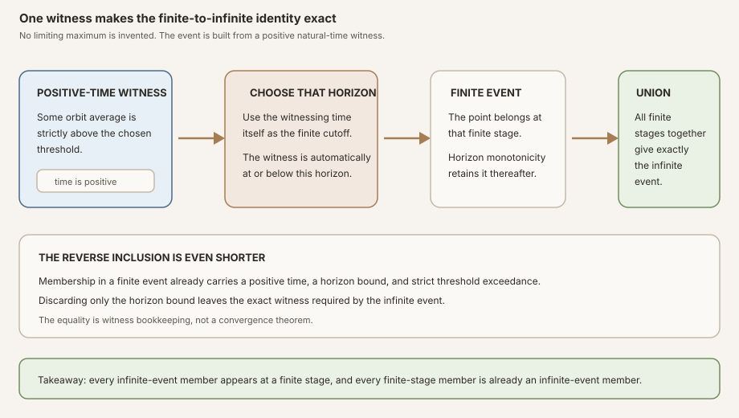
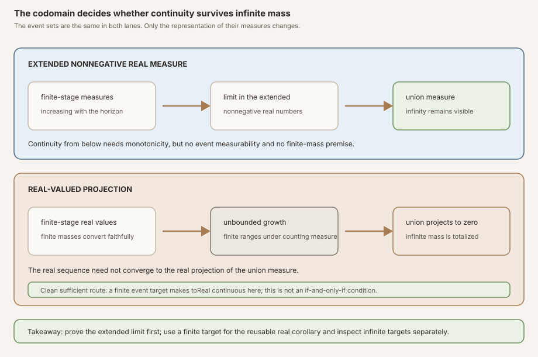
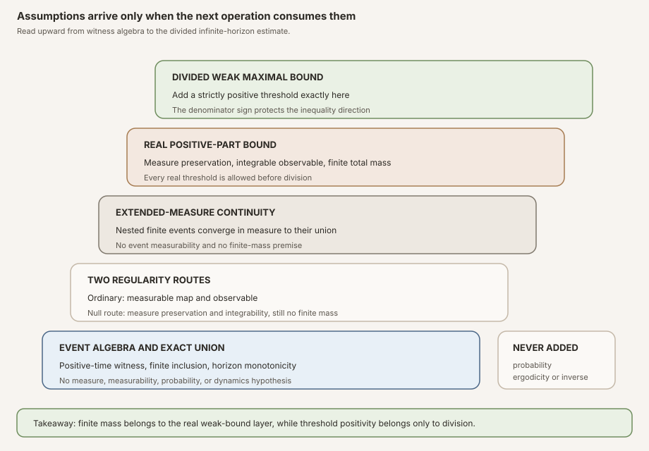


**AI-use disclosure.** Generative-AI tools helped draft, revise, illustrate,
and review this note. The author selected the questions, shaped the
exposition, has inspected the sources and artifacts cited here, and is
responsible for the final text and claims. This is an independent,
non-peer-reviewed Research Note. Verify claims against the cited primary
sources and any released artifacts before relying on them.



**Editorial status.** This teaching chapter remains a draft while human
editorial acceptance and the separate scientific-integrity and zero-context
expert-reader reviews are pending. The checked Lean source is authoritative
for every theorem statement.



**Abstract.** Let \(T:\Omega\to\Omega\) be a discrete-time map, let
\(g:\Omega\to\mathbb R\), and for positive \(k\) write

\[
A_k g(\omega)=\frac{1}{k}\sum_{j=0}^{k-1}g\bigl(T^j\omega\bigr).
\]

For a real threshold \(a\), the finite and infinite exceedance events are

\[
E_N(a)=\{\omega:\exists k,\ 1\le k\le N\text{ and }a\lt A_kg(\omega)\},
\]

\[
E(a)=\{\omega:\exists k,\ 1\le k\text{ and }a\lt A_kg(\omega)\}.
\]

RMT-24 defines \(E(a)\) directly by the positive-time witness. It introduces
no real-valued infinite running maximum. Choosing \(N=k\) from an infinite
witness, and forgetting the horizon bound in the reverse direction, proves

\[
E(a)=\bigcup_{N=0}^{\infty}E_N(a).
\]

The finite events are increasing. Mathlib's continuity-from-below theorem
therefore gives convergence of their measures in the extended nonnegative
reals, including the possibility of infinite mass. This step requires neither
ordinary measurability of the events nor finite total measure.

The conversion to real numbers is a separate theorem. Mathlib defines
<code>μ.real s</code> as the real projection of the extended value
<code>μ s</code>, and that projection sends infinity to zero. Consequently,
real-measure continuity is proved only under the local premise

\[
\mu(E(a))\ne\infty.
\]

An explicit counting-measure probe proves that this premise cannot simply be
omitted from a general conversion theorem: finite initial ranges have real
measures growing without bound, while their infinite union has infinite
extended measure and real projection zero. A companion infinite-mass event
probe has an eventually zero real sequence and a zero real target, confirming
that local finiteness is sufficient rather than necessary in every instance.

Under finite total mass, measure preservation, and integrability of \(g\), the
finite RMT-23 estimate passes through the real-measure limit:

\[
a\,\mu_{\mathbb R}(E(a))
\le \int_{\Omega}\max(g,0)\,d\mu.
\]

This multiplication form holds for every real \(a\). Only the final division
uses \(0\lt a\):

\[
\mu_{\mathbb R}(E(a))
\le \frac{\int_{\Omega}\max(g,0)\,d\mu}{a}.
\]

The module proves no integral inequality over the infinite event itself, no
pointwise or almost-everywhere convergence, no conditional-expectation
identification, no strong \(L^p\) estimate, no Kingman theorem, no Lyapunov
exponent, and no Oseledets splitting.


This is the proof-to-prose companion for
<code>formalization/NonlinearDynamics/Random/RandomCocycles/InfiniteHopfMaximal.lean</code>.
It covers all ten documented public declarations in exact source order and all
ten anonymous compiled boundary probes. The module contains no private helper.

Its immediate predecessor is
[Peel the Positive Maximum: A Finite Hopf Lemma in Lean]().
That chapter proves one uniform estimate at every finite horizon. The present
chapter supplies the increasing-event passage that the predecessor explicitly
left open.

The underlying orbit notation is the
. The finite analytic input is
the
.
The stable event introduced here is the
.
The parallel textbook treatment is
[From Finite Maximal Bounds to an Infinite Weak Estimate]().

## Choose a route up

| Route | Begin | Destination |
|---|---|---|
| First encounter | [Why an infinite event is needed](#why-an-infinite-event-is-needed) | See why no fixed horizon captures all first crossings |
| Definition route | [Define the event by a witness](#define-the-event-by-a-witness) | Understand why the formalization avoids an artificial real infinite maximum |
| Set route | [The union equality is exact](#the-union-equality-is-exact) | Move between one positive witness and one finite stage |
| Regularity route | [Two routes make the event usable](#two-routes-make-the-event-usable) | Separate ordinary measurability from null measurability |
| Measure route | [Continuity belongs first in the extended codomain](#continuity-belongs-first-in-the-extended-codomain) | Pass increasing finite events to their union without a finiteness gate |
| Countermodel route | [The real projection breaks at infinity](#the-real-projection-breaks-at-infinity) | Compare failed and successful infinite-mass real limits |
| Inequality route | [Pass the uniform finite bound to the limit](#pass-the-uniform-finite-bound-to-the-limit) | Reach the multiplication form and divide only at a positive threshold |
| API route | [The complete source-order tour](#the-complete-source-order-tour) | Audit all ten public declarations |
| Boundary route | [Ten probes patrol the quantifiers](#ten-probes-patrol-the-quantifiers) | Test zero horizon, zero observable, zero measure, infinite measure, and noninvertibility |
| Integrity route | [Premise and nonclaim ledger](#premise-and-nonclaim-ledger) | Keep an infinite weak estimate distinct from pointwise convergence |

### Learning objectives

By the summit, a reader should be able to:

1. state the positive-time infinite average-exceedance event;
2. explain why time zero cannot witness membership;
3. distinguish an existential event from a real-valued infinite supremum;
4. recover one finite horizon from any infinite-event witness;
5. forget a finite horizon bound to obtain an infinite-event witness;
6. prove the exact union identity in both directions;
7. explain why finite-event inclusion is a corollary of that union identity;
8. derive ordinary measurability from measurable dynamics and observable;
9. derive null measurability from measure preservation and integrability;
10. explain why the null-measurable proof does not center by a constant;
11. explain why countable positive times are represented by a subtype;
12. state continuity from below in extended nonnegative real measure;
13. identify the monotonicity input to that theorem;
14. explain why no measurable-set premise is used by the checked continuity theorem;
15. define the real-valued measure projection used by Mathlib;
16. explain what that projection does to infinite mass;
17. reconstruct the counting-measure counterexample;
18. explain why local finiteness is a clean sufficient premise for the reusable real-limit theorem but not necessary for every particular sequence;
19. separate local event finiteness from finite total mass;
20. pass a horizon-uniform inequality through a convergent sequence;
21. explain the role of <code>le_of_tendsto'</code>;
22. identify why the multiplication estimate accepts every real threshold;
23. identify why division requires a strictly positive threshold;
24. explain why finite total mass appears in the weak-bound layer;
25. state why probability normalization, ergodicity, and invertibility are absent;
26. read all ten probes as quantifier tests rather than decorative examples;
27. list all ten declarations in source order; and
28. state the pointwise Birkhoff ingredients that remain unproved.

## Why an infinite event is needed

RMT-23 controls a finite event \(E_N(a)\) for every natural \(N\). The right
side of its positive-part estimate does not depend on \(N\). That uniformity is
exactly what makes an infinite-horizon passage plausible, but it does not make
the passage automatic.

A point may cross the threshold for the first time at time one, time one
hundred, or at some much later positive time. No fixed \(N\) sees all such
points. The desired event must permit a different finite witness for each
point:

\[
E(a)=\{\omega:\exists k\ge1,\ a\lt A_kg(\omega)\}.
\]

The word *infinite* refers to the unbounded menu of possible finite witness
times. Every witness is still a natural number. RMT-24 proves no statement
about an average at an infinite time, because there is no such index in the
definition.

### A waiting-time example

Suppose the first four averages of one orbit stay at or below the threshold,
while the fifth lies strictly above it. The point is absent from
\(E_0(a),E_1(a),\ldots,E_4(a)\), enters \(E_5(a)\), and remains in every later
finite event by horizon monotonicity. The infinite event remembers that it
eventually entered one finite stage.

This is a logical example, not an empirical datum. It illustrates why the
union is the right object and why no common finite horizon can replace it.

<strong>Figure:</strong> The forward route chooses the witnessing time itself as a finite horizon. The reverse route discards only the finite horizon bound. The resulting equality is exact witness bookkeeping, not a convergence theorem and not an assertion that a real-valued infinite maximum exists.

## Prior work, this milestone, and what is not claimed

### Yosida and Kakutani: the early infinite-horizon theorem

Yosida and Kakutani's 1939 paper assumes an integrable real observable and a
one-to-one measure-preserving transformation, while explicitly declining to
assume finite total measure. Its Theorem 2 is the closest early
infinite-horizon maximal-ergodic theorem shape, and pages 166–167 organize the
proof through finite maximal intervals
([Yosida and Kakutani, 1939, pp. 165–167](#ref-rmt24-yosida)).

That theorem is stronger and different from RMT-24, and its maximal-interval
argument is not the Lean proof used here. RMT-24 permits noninjective
measure-preserving maps, but its final real-valued positive-part weak bound
assumes finite total measure. The historical source therefore warrants the
lineage and the finite-to-infinite question, not a claim that this module
formalizes Yosida and Kakutani's theorem verbatim.

### Closest finite input

Garsia's 1965 two-page proof states a finite running-maximum theorem for an
operator and derives a nonnegative integral over the strict positivity event
([Garsia, 1965, p. 381](#ref-rmt24-garsia)). RMT-23 formalizes the corresponding
finite orbit-map cancellation architecture and then centers by a constant
threshold. RMT-24 imports that checked finite module as its only project
dependency.

### Keane and Petersen: the closest finite-event organization

Keane and Petersen begin with a probability space, an integrable observable,
and a possibly noninvertible measure-preserving transformation. On page 248
they define positive-time finite maximal averages and their supremum over all
finite horizons. Pages 248–249 use finite strict events and then let the
horizon tend to infinity
([Keane and Petersen, 2006, pp. 248–249](#ref-rmt24-keane-petersen)).

Their theorem is stronger and differently shaped. It permits an almost-everywhere
invariant threshold function whose positive part is integrable, proves a
nonnegative integral over the infinite event, and is used immediately in their
pointwise ergodic argument. Their
finite proof uses positive strings inside long orbit sums, truncation, and
dominated convergence. RMT-24 does none of those things. It fixes a real
constant threshold, passes RMT-23's already checked positive-part measure
bound through continuity from below, and stops at a weak measure estimate.

### This milestone's formal contribution

- It defines the unbounded positive-time exceedance event without an infinite
  real supremum.
- It proves the exact increasing-union presentation by finite-horizon events
  and finite-stage inclusion.
- It gives separate ordinary-measurable and null-measurable interfaces.
- It extracts extended-measure continuity as a standalone theorem with no
  finiteness gate.
- It gives a real-measure continuity corollary under the clean sufficient
  premise of local finite event mass.
- It passes the uniform finite positive-part inequality to the infinite event.
- It divides only under a positive threshold.
- It compiles paired infinite-mass probes showing both why no unconditional
  general real-conversion theorem is valid and why local finiteness is not
  necessary for every particular family.

### Not claimed

- No theorem says the Birkhoff averages converge at any point.
- No theorem proves almost-everywhere membership in the earlier
  .
- No infinite-event integral Hopf lemma is formalized.
- No conditional expectation or invariant limit is identified.
- No strong \(L^p\) maximal inequality is proved.
- No density argument, Koopman approximation theorem, Banach principle, or
  oscillation estimate is supplied.
- No Kingman theorem, samplewise cocycle growth rate, Lyapunov exponent, or
  Oseledets splitting follows.

## Define the event by a witness

The first declaration is deliberately direct:

~~~lean
def birkhoffAverageExceedanceSet
    (T : Ω → Ω) (g : Ω → ℝ) (a : ℝ) : Set Ω :=
  {ω | ∃ k, 1 ≤ k ∧ a < birkhoffAverage ℝ T g k ω}
~~~

The event stores three pieces of information:

1. a natural witness \(k\);
2. the positivity proof \(1\le k\); and
3. strict threshold exceedance at that time.

No measurable space, measure, integrability hypothesis, or property of \(T\)
is needed to form this set. It is pure orbit algebra.

### Why not define an infinite real maximum?

One could try to write a real-valued function called the supremum of all
positive-time averages. That choice immediately raises questions absent from
the target theorem. Is the supremum finite? What should happen when the
averages are unbounded above? Should the codomain be \(\mathbb R\), the extended
reals, or an order completion? Which measurability API is then required?

The weak bound needs only the superlevel event. An existential witness gives
that event without solving any of those unrelated representation problems.
The design is smaller and mathematically exact.

### Why positive time is part of the data

Mathlib totalizes the time-zero Birkhoff average to zero
([Mathlib's finite-average definition and boundary lemmas](#ref-rmt24-birkhoff-average)). If time zero were
allowed, every negative threshold would be exceeded even before reading the
observable. RMT-24 wants the ordinary positive-time maximal event, so it stores
\(1\le k\) explicitly.

That choice also makes the zero-observable probes informative. For
\(g=0\), a nonnegative threshold produces the empty event, while a negative
threshold produces the whole space by the witness \(k=1\).

### The membership theorem is intentionally reflexive

The second declaration,
<code>mem_birkhoffAverageExceedanceSet_iff</code>, unfolds membership to the
same existential statement. Its proof is <code>rfl</code>. A reflexive theorem
is still useful public API: later proofs and readers can rewrite membership by
name without depending on the implementation of the set literal.

The declaration is marked <code>@[simp]</code>. It therefore participates in
controlled simplification, while the definition itself can remain the stable
abstraction boundary.

## The union equality is exact

The third declaration is
<code>birkhoffAverageExceedanceSet_eq_iUnion_finite</code>:

\[
E(a)=\bigcup_{N\in\mathbb N}E_N(a).
\]

The proof uses extensionality. Fix \(\omega\) and compare membership on both
sides.

### Infinite witness to finite stage

Suppose \(\omega\in E(a)\). The membership theorem gives

\[
\exists k,\quad 1\le k\quad\text{and}\quad a\lt A_kg(\omega).
\]

Choose \(N=k\). The same \(k\) satisfies the finite membership theorem because
\(k\le N\) is now reflexivity. Thus \(\omega\in E_k(a)\), and hence it lies in
the union.

### Finite stage to infinite witness

Suppose \(\omega\) lies in the union. Then it lies in some \(E_N(a)\), so the
finite membership theorem gives \(k\), \(1\le k\), \(k\le N\), and strict
exceedance. The infinite event does not ask for an upper horizon bound. Drop
only \(k\le N\) and reuse the rest.

Nothing in either direction takes a limit of orbit averages. The theorem is a
logical equivalence between two ways of arranging existential quantifiers.

### Every finite stage is included

The fourth declaration,
<code>finiteBirkhoffAverageExceedanceSet_subset</code>, proves

\[
E_N(a)\subseteq E(a).
\]

Rather than repeat the witness proof, Lean rewrites the target using the union
equality and applies <code>subset_iUnion</code> at the chosen horizon. This is a
small canonization choice: one central identity owns the set bookkeeping, and
the inclusion becomes a reusable corollary.

## Two routes make the event usable

The same mathematical event can be regular enough for different purposes
under different hypotheses. RMT-24 keeps the routes separate.

### Ordinary measurability

The fifth declaration,
<code>measurableSet_birkhoffAverageExceedanceSet</code>, assumes
<code>Measurable T</code> and <code>Measurable g</code>. It rewrites the
infinite event as the countable union of finite events. RMT-23 already proved
each finite event measurable under those two premises. A countable union of
measurable sets is measurable.

No measure, finite total mass, preservation, probability, or ergodicity is
present. This route is appropriate when the chosen representatives of both
the map and observable are ordinarily measurable.

### Null measurability from integrability

The sixth declaration,
<code>nullMeasurableSet_birkhoffAverageExceedanceSet_of_integrable</code>, has a
different interface:

~~~lean
theorem nullMeasurableSet_birkhoffAverageExceedanceSet_of_integrable
    (hT : MeasurePreserving T μ μ) (hg : Integrable g μ) (a : ℝ) :
    NullMeasurableSet (birkhoffAverageExceedanceSet T g a) μ
~~~

Integrability gives almost-everywhere strong measurability of \(g\), not
necessarily ordinary measurability of its chosen representative. Measure
preservation propagates integrability to every finite Birkhoff average. The
strict superlevel set of an almost-everywhere measurable average against a
constant is null measurable. A countable union preserves null measurability
([Mathlib's null-measurable countable union API](#ref-rmt24-null-union)).

### Why the proof indexes positive naturals directly

The proof rewrites the event as a union over the subtype

\[
\{k:\mathbb N\mid 1\le k\}.
\]

Each member of that countable type carries its positivity proof. This makes
the event at one index exactly the strict superlevel set of one integrable
Birkhoff average. The construction then uses
<code>nullMeasurableSet_lt</code> with a measurable constant on the left and
the average's almost-everywhere measurability on the right.

### Why not reuse the centered finite-event theorem?

RMT-23 represents a finite threshold event through the centered observable
\(g-a\). Its null-measurable theorem assumes finite total mass because the
constant \(a\) must be integrable. That would be too strong here. The infinite
event is already defined by uncentered averages, and every average of an
integrable \(g\) is integrable under preservation. Building the countable union
from those averages avoids adding finite mass merely for event regularity.

This assumption reduction is substantive. Null measurability of the infinite
event remains available on counting measure and other infinite measures, even
though the later real weak bound does not.

## Continuity belongs first in the extended codomain

Measures naturally take values in the extended nonnegative reals
\(\mathbb R_{\ge0}\cup\{\infty\}\). The seventh declaration,
<code>tendsto_measure_finiteBirkhoffAverageExceedanceSet</code>, states

\[
\mu(E_N(a))\longrightarrow\mu(E(a))
\]

in that codomain.

The proof rewrites \(E(a)\) as the union of the finite events and applies
Mathlib's <code>tendsto_measure_iUnion_atTop</code>. Its only set-theoretic
input is monotonicity:

\[
M\le N\quad\Longrightarrow\quad E_M(a)\subseteq E_N(a).
\]

RMT-23 already proved this finite horizon monotonicity. The pinned Mathlib
theorem explicitly accepts increasing sets that are not necessarily measurable
([Mathlib continuity from below](#ref-rmt24-continuity-below)). The RMT-24
declaration therefore requests neither ordinary nor null measurability of the
events. It also requests no finite-mass premise. If the union has infinite
measure, infinity is a legitimate limit in the extended codomain.

<strong>Figure:</strong> The upper lane keeps infinity as a genuine value, so continuity from below remains faithful. The lower lane applies the totalized real projection. Finite stages may grow without bound while the infinite union projects to zero. The event sets do not change; only the codomain does.

### No event regularity is consumed here

This is an easy place to overstate the proof. The project has just built two
event-regularity theorems, but the extended continuity proof uses neither one.
They are still valuable for later set integrals, almost-everywhere reasoning,
and public interfaces. They are simply not premises of this declaration.

### Extended measure is not an implementation nuisance

The value infinity is mathematically necessary for arbitrary measures. Keeping
it visible permits the clean theorem: nested event measures converge to the
union measure without a side condition. Only a later request for a real-valued
inequality creates the need to cross a boundary.

## The real projection breaks at infinity

Mathlib defines

~~~lean
protected def Measure.real (μ : Measure α) (s : Set α) : ℝ :=
  (μ s).toReal
~~~

The definition's own documentation says that infinite-measure sets map to zero
([Mathlib's <code>Measure.real</code> definition](#ref-rmt24-measure-real)).
This totalization is useful because the function always returns a real number.
It also means the function is not faithful at infinity.

### The local continuity theorem

The eighth declaration,
<code>tendsto_measureReal_finiteBirkhoffAverageExceedanceSet</code>, assumes

\[
\mu(E(a))\ne\infty
\]

and concludes

\[
\mu_{\mathbb R}(E_N(a))\longrightarrow
\mu_{\mathbb R}(E(a)).
\]

The proof composes the extended-measure convergence theorem with
<code>ENNReal.tendsto_toReal</code>. The latter is a continuity theorem at a
finite extended value and takes exactly the premise that the target is not
infinity
([Mathlib's finite-point real projection](#ref-rmt24-to-real)).

The premise is local. It asks only that this particular infinite event have
finite measure. The whole space may still have infinite measure. Later,
<code>[IsFiniteMeasure μ]</code> supplies the premise automatically for the
weak-bound theorem, but the continuity lemma itself exposes the weaker fact.

### The counting-measure counterexample

The final boundary probe makes the failure executable. Let

\[
s_N=\{0,1,\ldots,N-1\}\subseteq\mathbb N
\]

under counting measure. The sets are increasing and their union is all of
\(\mathbb N\). Each finite range has extended and real measure \(N\). The union
has infinite extended measure, so its real projection is zero:

\[
\operatorname{count}_{\mathbb R}(s_N)=N,
\qquad
\operatorname{count}_{\mathbb R}(\mathbb N)=0.
\]

The sequence \(N\) does not converge to zero. Thus continuity from below in
extended measure does not survive the real projection at infinite mass.
Mathlib's exact finite- and infinite-set counting formulas support both sides
of the compiled probe
([Mathlib counting measure](#ref-rmt24-count)).


**The dangerous inference.** From

\[
\mu(E_N)\longrightarrow\mu(E)
\]

in extended nonnegative reals, one may not conclude

\[
\mu_{\mathbb R}(E_N)\longrightarrow\mu_{\mathbb R}(E)
\]

when \(\mu(E)=\infty\). The real projection does not approximate infinity by
large real numbers. It assigns infinity the totalized value zero.


### Sufficient does not mean necessary

The finite-target premise is the exact argument consumed by
<code>ENNReal.tendsto_toReal</code>, and it gives a small, reusable theorem.
It is not a necessary condition for every particular increasing family. On
\(\mathbb N\) with counting measure, take identity dynamics, \(g=2\), and
\(a=1\). Then \(E_0(1)=\varnothing\), while \(E_N(1)=E(1)=\mathbb N\) for
every \(N\ge1\). The union has infinite extended measure, but every real
measure in the eventual sequence and its target is the totalized value zero.
Real-measure convergence therefore holds in this infinite-mass event family.
The ninth compiled probe checks exactly this case.

The finite-range countermodel and the constant-event example answer different
questions. The first refutes any unconditional theorem that maps arbitrary
extended continuity through <code>toReal</code>. The second prevents the
sufficient finite-target premise from being misreported as an if-and-only-if
condition. Infinite target mass requires case-specific information; it does
not force either success or failure after totalization.

## Pass the uniform finite bound to the limit

RMT-23 proves, for every finite horizon \(N\),

\[
a\,\mu_{\mathbb R}(E_N(a))
\le I_g,
\qquad
I_g:=\int_{\Omega}\max(g(\omega),0)\,d\mu(\omega).
\]

The right side is independent of \(N\). That fact, combined with real-measure
continuity under finite event mass, is the entire analytic bridge used by
RMT-24.

### The multiplication form

The ninth declaration,
<code>birkhoffAverageExceedanceSet_posPart_bound</code>, assumes

- <code>[IsFiniteMeasure μ]</code>;
- <code>MeasurePreserving T μ μ</code>; and
- <code>Integrable g μ</code>.

It concludes

\[
a\,\mu_{\mathbb R}(E(a))\le I_g
\]

for every \(a\in\mathbb R\). There is no sign hypothesis on \(a\).

Finite total mass plays two honest roles in the imported proof chain. First,
RMT-23 centers by the constant \(a\), and an arbitrary constant is integrable
on a finite measure space. Second, finite total mass discharges the local
premise \(\mu(E(a))\ne\infty\) consumed by the named real-measure corollary. RMT-24 does
not pretend that either use is available on an arbitrary infinite measure.

### How <code>le_of_tendsto'</code> closes the proof

Let

\[
x_N=a\,\mu_{\mathbb R}(E_N(a)).
\]

Real-measure continuity and continuity of multiplication show

\[
x_N\longrightarrow a\,\mu_{\mathbb R}(E(a)).
\]

The finite theorem says \(x_N\le I_g\) for every \(N\). Mathlib's
<code>le_of_tendsto'</code> says that a limit of values all lying below a fixed
upper bound also lies below that bound
([Mathlib's closed-order limit rule](#ref-rmt24-le-of-tendsto)). Lean applies
that rule directly. No integral limit, monotone convergence theorem, dominated
convergence theorem, or event-indicator convergence appears.

That proof architecture is intentionally modest. It transfers a scalar order
inequality. It does not prove

\[
0\le\int_{E(a)}(g-a)\,d\mu
\]

or any other infinite-event set-integral statement.

### Positive threshold enters only at division

The tenth and final declaration,
<code>measureReal_birkhoffAverageExceedanceSet_le</code>, adds

\[
0\lt a
\]

and proves

\[
\mu_{\mathbb R}(E(a))
\le \frac{I_g}{a}.
\]

Lean uses <code>le_div_iff₀</code> with the positivity proof, commutes the
product, and invokes the multiplication theorem. This is exactly where the
denominator sign matters. Adding positivity to the earlier theorem would be an
unnecessary strengthening of its premises; omitting positivity here would make
the order-preserving division step invalid.

<strong>Figure:</strong> The ladder records the exact premise boundary of each operation. Witness algebra needs no measure. Event regularity has two separate routes. Extended-measure continuity needs only nested sets. Finite mass appears for the real positive-part bound, and threshold positivity appears only for division. Probability, ergodicity, and invertibility never enter.

## Premise and nonclaim ledger

### Declaration-level assumption floor

| Layer | Exact declarations | Premises consumed | Premises deliberately absent |
|---|---|---|---|
| Event algebra | <code>birkhoffAverageExceedanceSet</code>, <code>mem_birkhoffAverageExceedanceSet_iff</code>, <code>birkhoffAverageExceedanceSet_eq_iUnion_finite</code>, <code>finiteBirkhoffAverageExceedanceSet_subset</code> | A type, a map, an observable, a real threshold, and finite Birkhoff-average algebra | Measurable space, measure, measurability, preservation, integrability, finite mass, probability, ergodicity, inverse |
| Ordinary regularity | <code>measurableSet_birkhoffAverageExceedanceSet</code> | Measurable space, <code>Measurable T</code>, <code>Measurable g</code> | A measure, preservation, integrability, finite mass, probability, ergodicity |
| Null regularity | <code>nullMeasurableSet_birkhoffAverageExceedanceSet_of_integrable</code> | Measure space, <code>MeasurePreserving T μ μ</code>, <code>Integrable g μ</code> | Ordinary measurability of the chosen \(g\), finite mass, probability, ergodicity, inverse |
| Extended continuity | <code>tendsto_measure_finiteBirkhoffAverageExceedanceSet</code> | A measure and horizon monotonicity inherited from the finite events | Event measurability, map measurability as an explicit argument, preservation, integrability, finite mass |
| Real continuity | <code>tendsto_measureReal_finiteBirkhoffAverageExceedanceSet</code> | Extended continuity plus \(\mu(E(a))\ne\infty\) | Finite total mass of the whole space, preservation, integrability, probability, ergodicity |
| Infinite multiplication bound | <code>birkhoffAverageExceedanceSet_posPart_bound</code> | Finite measure, measure preservation, integrable \(g\), arbitrary real \(a\) | Positive threshold, probability normalization, ergodicity, injectivity, surjectivity, inverse |
| Divided weak bound | <code>measureReal_birkhoffAverageExceedanceSet_le</code> | Previous row plus \(0\lt a\) | Probability normalization, ergodicity, injectivity, surjectivity, inverse |

The table distinguishes explicit theorem arguments from background type
structure. A theorem mentioning a measure necessarily lives over a measurable
space because <code>Measure Ω</code> needs one. That does not mean the proof
assumes the event is measurable.

### Local finiteness versus finite total mass

These are different hypotheses:

\[
\mu(E(a))\ne\infty
\qquad\text{and}\qquad
\mu(\Omega)\ne\infty.
\]

The second implies the first by monotonicity, but not conversely. The real
continuity theorem keeps the weaker event-specific condition. The infinite
positive-part theorem takes the stronger finite-measure typeclass because its
imported finite centered inequality also needs constants to be integrable.

### Measure preservation is not ergodicity

Preservation says the measure is unchanged by one application of \(T\). It
supports integrability of orbit averages and the finite RMT-23 estimate.
Ergodicity would constrain invariant events or observables, but RMT-24 does
not use such rigidity. The noninjective Dirac probe further confirms that
preservation is not being used as a disguised inverse.

### The theorem really does not claim

| Tempting overread | What is actually checked |
|---|---|
| The averages converge because an infinite event is controlled | Only one strict superlevel event has a weak measure estimate |
| The infinite running maximum is a finite real random variable | No infinite maximum is defined, and no finiteness theorem for one is stated |
| The infinite event carries a nonnegative centered integral | Only the positive-part measure bound is passed to the union |
| Real measure is automatically continuous from below after totalization | A finite target gives the reusable corollary; paired infinite-mass probes show that an ungated limit can either fail or succeed |
| Null measurability requires finite total mass | The null-measurable event theorem works on explicitly nonfinite counting measure |
| The system is probabilistic | The weak theorem needs finite mass, not mass one |
| The system is ergodic | No ergodicity premise or conclusion occurs |
| The dynamics are invertible | A constant noninjective map preserving a Dirac measure satisfies the theorem |
| A weak \(L^1\) estimate is a strong \(L^p\) estimate | No norm of a maximal function is defined or bounded |
| This is the pointwise Birkhoff theorem | Approximation, density, oscillation, and convergence-existence arguments remain open |

## The complete source-order tour

The source contains ten documented public declarations, no private helper, and
ten anonymous probes. The table below follows the actual source order.

| No. | Declaration | Statement role | Proof architecture |
|---:|---|---|---|
| 1 | <code>birkhoffAverageExceedanceSet</code> | Defines the strict threshold event using one positive natural-time witness | Set comprehension, no analytic structure |
| 2 | <code>mem_birkhoffAverageExceedanceSet_iff</code> | Exposes exact membership | Reflexivity; marked as a simplification theorem |
| 3 | <code>birkhoffAverageExceedanceSet_eq_iUnion_finite</code> | Identifies the event with the union of all finite events | Extensionality; choose horizon \(N=k\) forward, discard \(k\le N\) backward |
| 4 | <code>finiteBirkhoffAverageExceedanceSet_subset</code> | Embeds every finite event in the infinite event | Rewrite by the union identity and select one union component |
| 5 | <code>measurableSet_birkhoffAverageExceedanceSet</code> | Gives ordinary measurability | Countable union of RMT-23 measurable finite events |
| 6 | <code>nullMeasurableSet_birkhoffAverageExceedanceSet_of_integrable</code> | Gives null measurability without finite mass | Union over positive naturals; integrable averages; null-measurable strict superlevels |
| 7 | <code>tendsto_measure_finiteBirkhoffAverageExceedanceSet</code> | Gives extended-measure continuity from below | Exact union identity plus finite-event monotonicity and Mathlib continuity |
| 8 | <code>tendsto_measureReal_finiteBirkhoffAverageExceedanceSet</code> | Converts continuity to real measures under local finiteness | Compose extended convergence with continuity of <code>ENNReal.toReal</code> at a finite target |
| 9 | <code>birkhoffAverageExceedanceSet_posPart_bound</code> | Passes the finite positive-part estimate to the infinite event | Multiply the real-measure limit by \(a\), then apply <code>le_of_tendsto'</code> to the uniform finite bounds |
| 10 | <code>measureReal_birkhoffAverageExceedanceSet_le</code> | Divides into the positive-threshold weak estimate | Apply positive-denominator order equivalence and the multiplication theorem |

### Declarations 1–4: the event is pure set algebra

The first four declarations are intentionally free of measure theory. They
establish the object and the exact bridge to the predecessor's finite events.
This is the reusable core for any later probability, finite-measure, or
sigma-finite specialization.

### Declarations 5–6: regularity routes do not collapse into one another

The ordinary theorem is stronger about representatives and weaker about
dynamics: it asks only that \(T\) and \(g\) be measurable. The null theorem is
relative to a measure: it asks for preservation and integrability, then uses
almost-everywhere measurability. Neither theorem is a redundant restatement of
the other.

### Declarations 7–8: codomain first, conversion second

The seventh theorem states the mathematically natural extended-measure limit.
The eighth is explicitly a conversion corollary. Keeping them separate makes
the infinity boundary visible in both the source and generated documentation.

### Declarations 9–10: multiplication first, division second

The ninth theorem preserves the full real-threshold domain of the finite
estimate. The tenth adds positivity at the exact order-sensitive operation.
This mirrors RMT-23's finite API and makes threshold assumptions auditable.

## Ten probes patrol the quantifiers

Anonymous <code>example</code> declarations compile against the same imports as
the module. They are not part of the named API, but they test whether the
public statements behave at boundaries and whether tempting extra premises are
actually absent.

### Probe 1: an infinite witness has a finite home

From membership in \(E(a)\), the first probe extracts some \(N\) with
membership in \(E_N(a)\). It chooses the witness time itself. This is the
constructive core of one direction of the union equality.

### Probe 2: horizon zero is empty

For arbitrary \(T\), \(g\), and \(a\),

\[
E_0(a)=\varnothing.
\]

The finite event requires \(1\le k\le0\), an impossible witness. This confirms
that the unbounded union starts harmlessly with an empty stage.

### Probe 3: zero observable and a nonnegative threshold

For \(g=0\) and \(0\le a\), every positive-time average is zero, so no strict
exceedance exists:

\[
E(a)=\varnothing.
\]

The proof computes the average exactly and contradicts strict inequality.

### Probe 4: zero observable and a negative threshold

For \(g=0\) and \(a\lt0\), time one witnesses every point:

\[
E(a)=\Omega.
\]

Together, probes three and four audit strictness, positive time, and the sign
boundary at zero.

### Probe 5: the zero measure satisfies the multiplication bound

For an arbitrary measurable \(T\), arbitrary \(g\), and arbitrary threshold,
the zero measure satisfies the infinite positive-part bound. The observable is
integrable under the zero measure, and the map preserves it. This confirms that
nonzero mass is not a premise.

### Probe 6: null measurability genuinely survives infinite total mass

On \(\mathbb N\) with counting measure and identity dynamics, the probe assumes
only that \(g\) is integrable. It proves the conjunction

\[
\neg\operatorname{IsFiniteMeasure}(\operatorname{count})
\quad\text{and}\quad
E(a)\text{ is null measurable}.
\]

The explicit nonfiniteness proof prevents this from being a weak example that
merely happens not to mention the typeclass.

### Probe 7: positive division is a public specialization

The seventh probe restates the final weak estimate under a finite measure,
preservation, integrability, and \(0\lt a\). It confirms that the intended
positive-threshold interface elaborates directly.

### Probe 8: invertibility is absent, and the event is nonvacuous

On <code>Bool</code>, let \(T\) send both points to <code>false</code> and use
the Dirac measure at <code>false</code>. The map is not injective but preserves
the measure. With the constant observable \(g=2\) and threshold \(a=1\), every
positive-time average exceeds the threshold, so the event has strictly
positive real Dirac mass. The weak estimate also compiles as the nonvacuous
inequality \(1\le2\).

This is stronger boundary evidence than using the zero observable, whose
event would be empty at a positive threshold. It demonstrates the theorem on a
positive-mass event under genuinely noninvertible dynamics.

### Probe 9: infinite mass does not force real-limit failure

On \(\mathbb N\) with counting measure, identity dynamics, constant observable
two, and threshold one, the infinite event is the whole space. Every finite
event from horizon one onward is also the whole space. The extended target is
infinite, yet the real measures are eventually all zero and converge to the
target's totalized real value zero.

This probe is the converse guardrail to the finite-range countermodel. It shows
that local finiteness is a sufficient premise for declaration eight, not a
necessary condition for every particular event family.

### Probe 10: real continuity can fail at infinite mass

The final probe constructs the finite ranges \(s_N\subseteq\mathbb N\), proves
they are monotone, proves their union is the whole space, and refutes

\[
\operatorname{count}_{\mathbb R}(s_N)
\longrightarrow
\operatorname{count}_{\mathbb R}(\mathbb N).
\]

It computes the left sequence as \(N\), the target as zero, and uses the
metric definition of convergence to derive a contradiction from a sufficiently
large index. This probe shows why declaration eight cannot simply delete its
finite-target premise and remain valid for every increasing family.

### What the probes collectively establish

| Interface risk | Compiled evidence |
|---|---|
| The infinite event might contain a genuinely nonfinite witness | Every member enters some finite event |
| Horizon zero might contribute a hidden witness | Its finite event is empty |
| Strictness or positive-time indexing might be wrong | The zero-observable event flips exactly at threshold zero |
| Nonzero measure might be required | The zero-measure bound compiles |
| Null measurability might secretly need finite mass | Counting measure is proved nonfinite in the same probe |
| Threshold positivity might be hidden earlier | The multiplication theorem accepts arbitrary \(a\); the division probe supplies positivity explicitly |
| Invertibility might be hidden in preservation | A noninjective Dirac-preserving map has a strictly positive-mass exceedance event |
| Local finiteness might be misread as necessary | An infinite-mass constant event family has an eventually zero real-measure sequence and a zero real target |
| Real continuity might hold for every infinite-mass family | The increasing counting-range counterexample refutes that unconditional claim |

## Proof engineering lessons

### Define only the object the theorem consumes

The target is a superlevel event, so the source defines a superlevel event.
An infinite supremum would introduce codomain and finiteness obligations that
the weak estimate never uses. Witness-first design keeps the interface small
without weakening the mathematical claim.

### Make the finite bridge an equality, not two ad hoc implications

The exact union theorem is more reusable than a one-off witness extraction.
It powers finite inclusion, measurability, extended continuity, and the public
explanation. Canonical bridges reduce later proof duplication.

### Do not inherit an avoidable assumption from a predecessor

RMT-23's centered finite null-measurability theorem needs finite mass. RMT-24
could have reused it and accepted the stronger premise. Instead, the proof
returns to uncentered finite averages, whose integrability follows without
finite mass. That keeps event regularity as general as the mathematics allows.

### Keep extended values until the last responsible moment

Continuity from below is clean in the natural measure codomain. Premature
conversion to reals would either create a false theorem or hide a finiteness
premise. The source proves the extended theorem first and gives a separately
named finite-target conversion.

### Compile the countermodel beside the theorem

The counting-measure probe does more than explain a warning in prose. It makes
the failure of ungated real continuity part of the checked artifact. A future
refactor that tries to delete every guard from a general conversion theorem
must confront the executable counterexample.

### Pass order bounds without claiming integral convergence

The final proof needs only: every finite left side lies below a fixed right
side, and the left sides converge. <code>le_of_tendsto'</code> is the exact
tool. Invoking dominated or monotone convergence for event integrals would be
both heavier and a claim about objects this module does not define.

### Separate multiplication from positive division

The order statement before division remains valid at zero and negative
thresholds. The source preserves that generality. The sign gate belongs on the
corollary whose proof actually divides.

### Failure modes the source avoids

1. **Artificial infinite maximum.** No real-valued supremum is introduced
   merely to name its strict superlevel set.
2. **Time-zero contamination.** Every witness includes \(1\le k\).
3. **Union without a witness bridge.** Both set inclusions are proved exactly.
4. **Ordinary-measurability inflation.** Integrability supplies a separate
   null-measurable route.
5. **Inherited finite-mass inflation.** The null route uses uncentered
   integrable averages instead of centered constants.
6. **Premature real projection.** Extended continuity is its own theorem.
7. **Infinity erasure.** The reusable real-continuity corollary exposes a
   clean finite-target premise.
8. **Limit overclaim.** Only scalar inequalities, not event integrals, pass to
   the limit.
9. **Premature threshold sign.** Positivity appears only at division.
10. **Weak-to-pointwise overreach.** No convergence-existence conclusion is
    drawn.

## Worked derivation without Lean syntax

Fix a real threshold \(a\). For each finite \(N\), let

\[
E_N(a)=\{\omega:\exists k,\ 1\le k\le N,\ a\lt A_kg(\omega)\},
\]

and let

\[
E(a)=\{\omega:\exists k,\ 1\le k,\ a\lt A_kg(\omega)\}.
\]

### Step 1: identify the union

If \(\omega\in E(a)\), choose a witness \(k\). Then \(\omega\in E_k(a)\), so
\(\omega\) belongs to the union of the finite events.

Conversely, if \(\omega\in E_N(a)\) for some \(N\), the same positive witness
\(k\) proves \(\omega\in E(a)\). Hence

\[
E(a)=\bigcup_N E_N(a).
\]

The finite events are monotone because allowing a larger horizon retains every
earlier witness.

### Step 2: take measure in its native codomain

Continuity from below gives

\[
\mu(E_N(a))\longrightarrow\mu(E(a))
\]

in the extended nonnegative reals. If \(\mu(E(a))=\infty\), that statement is
still meaningful and correct.

### Step 3: cross to real values only at a finite target

Assume \(\mu(E(a))\ne\infty\). The extended-to-real projection is continuous at
that value, so

\[
\mu_{\mathbb R}(E_N(a))
\longrightarrow
\mu_{\mathbb R}(E(a)).
\]

Without the premise, the counting-range example shows that this inference can
fail.

### Step 4: preserve the finite upper bound

Now assume the whole measure is finite, \(T\) preserves it, and \(g\) is
integrable. RMT-23 gives, for every \(N\),

\[
a\,\mu_{\mathbb R}(E_N(a))\le I_g.
\]

Multiplication by the constant \(a\) is continuous, so the left sides tend to
\(a\,\mu_{\mathbb R}(E(a))\). Closedness of the order relation gives

\[
a\,\mu_{\mathbb R}(E(a))\le I_g.
\]

No sign of \(a\) has been used.

### Step 5: divide only when the order permits it

If \(0\lt a\), divide by \(a\) without reversing the inequality:

\[
\mu_{\mathbb R}(E(a))\le\frac{I_g}{a}.
\]

This is the infinite-horizon weak maximal estimate checked by RMT-24. The
derivation controls the size of an exceedance event. It says nothing about
whether the sequence of averages has a limit.

## Read the Lean surface directly

The following block is executable as a public-surface smoke test after
importing the root library. It names every declaration without replacing proof
terms by ellipses.

~~~lean
import NonlinearDynamics

open MeasureTheory Set Filter
open scoped ENNReal
open NonlinearDynamics.Random.RandomCocycles

#check birkhoffAverageExceedanceSet
#check mem_birkhoffAverageExceedanceSet_iff
#check birkhoffAverageExceedanceSet_eq_iUnion_finite
#check finiteBirkhoffAverageExceedanceSet_subset
#check measurableSet_birkhoffAverageExceedanceSet
#check nullMeasurableSet_birkhoffAverageExceedanceSet_of_integrable
#check tendsto_measure_finiteBirkhoffAverageExceedanceSet
#check tendsto_measureReal_finiteBirkhoffAverageExceedanceSet
#check birkhoffAverageExceedanceSet_posPart_bound
#check measureReal_birkhoffAverageExceedanceSet_le
~~~

Three details are worth watching in the printed types.

First, the first four declarations do not acquire measure-theory premises just
because the file later opens a measure-theory namespace. Second, the extended
continuity theorem does not request either event-regularity theorem. Third, the
positive-threshold proof appears only in the final declaration.

### Reading the continuity composition

The real continuity proof has only two mathematical moves:

1. obtain convergence in extended measure from
   <code>tendsto_measure_finiteBirkhoffAverageExceedanceSet</code>; and
2. compose it with <code>ENNReal.tendsto_toReal hfinite</code>.

The final <code>simpa</code> unfolds <code>Measure.real</code> and function
composition. It does not discharge finiteness by automation. The caller must
supply the local premise, or the finite-measure typeclass must supply it later.

### Reading the limit-order proof

The positive-part theorem applies <code>le_of_tendsto'</code> to a product
limit:

- the constant sequence tends to \(a\);
- the real finite-event measures tend to the real infinite-event measure; and
- every finite product is bounded by the same whole-space positive-part
  integral.

The theorem is short because RMT-23 packaged the finite inequality at exactly
the right level. Short source here records successful modularization, not a
missing analytic argument.

## Exercises with solutions

### Exercise 1: locate a delayed witness

Suppose a point first exceeds the threshold at time seven. Which finite events
contain it?

**Solution.** It is absent from horizons zero through six. It belongs to
\(E_7(a)\) and every \(E_N(a)\) with \(7\le N\), because the same witness
remains within each later horizon.

### Exercise 2: compute the zero horizon

Why is \(E_0(a)\) empty for every map, observable, and threshold?

**Solution.** Membership would require a natural \(k\) with
\(1\le k\le0\). No such natural exists. The observable value and dynamics are
irrelevant.

### Exercise 3: choose the finite stage

Given \(\omega\in E(a)\) with witness \(k\), what horizon proves membership in
the union most directly?

**Solution.** Choose \(N=k\). The finite upper bound becomes \(k\le k\), so the
same witness proves \(\omega\in E_k(a)\).

### Exercise 4: prove the reverse inclusion

Which part of finite-event membership is discarded when proving
\(E_N(a)\subseteq E(a)\)?

**Solution.** Only the upper bound \(k\le N\). Positive time and strict
threshold exceedance are exactly the data required by the infinite event.

### Exercise 5: test strictness with the zero observable

For \(g=0\), describe \(E(a)\) when \(a=0\) and when \(a=-1\).

**Solution.** At \(a=0\), strict exceedance \(0\lt0\) is false, so the event is
empty. At \(a=-1\), time one has average zero and \(-1\lt0\), so the event is
the whole space.

### Exercise 6: reject an infinite-time reading

Does membership in \(E(a)\) assert that an average is evaluated at an infinite
time?

**Solution.** No. It asserts the existence of one natural \(k\ge1\). The set
of possible witness times is unbounded, but each actual witness is finite.

### Exercise 7: place ordinary measurability

What hypotheses make \(E(a)\) ordinarily measurable in RMT-24?

**Solution.** Ordinary measurability of both \(T\) and \(g\). Each finite event
is then measurable, and the infinite event is their countable union. No measure
preservation or finite mass is needed for this route.

### Exercise 8: place null measurability

What alternative hypotheses make \(E(a)\) null measurable relative to
\(\mu\)?

**Solution.** <code>MeasurePreserving T μ μ</code> and
<code>Integrable g μ</code>. Preservation makes each finite Birkhoff average
integrable; its strict superlevel set is null measurable; and the countable
union remains null measurable.

### Exercise 9: explain the positive-natural subtype

Why does the null-measurable proof use the subtype of naturals satisfying
\(1\le k\)?

**Solution.** Each index then carries the proof that it is a valid
positive-time witness. The union component can be stated directly as the
strict superlevel set of that one average, with no separate zero-time branch.

### Exercise 10: avoid centered integrability

Why would applying the finite centered null-measurability theorem directly add
an unwanted assumption?

**Solution.** Centering uses \(g-a\). On a general infinite measure space, the
constant \(a\) need not be integrable. The direct infinite-event proof uses the
uncentered integrable averages instead and therefore keeps finite mass absent.

### Exercise 11: identify the input to continuity from below

Which set property does
<code>tendsto_measure_finiteBirkhoffAverageExceedanceSet</code> supply to
Mathlib?

**Solution.** Monotonicity in the horizon:
\(M\le N\) implies \(E_M(a)\subseteq E_N(a)\). Together with the exact union
identity, that is enough for the checked continuity theorem.

### Exercise 12: audit event measurability in the extended limit

Does the extended-measure continuity theorem use either ordinary or null
measurability of \(E_N(a)\)?

**Solution.** No. The pinned Mathlib theorem used here is stated for increasing
sets that are not necessarily measurable. The RMT-24 proof supplies
monotonicity and the union identity only.

### Exercise 13: compute the projection of infinity

What is <code>ENNReal.toReal ∞</code>, and therefore
<code>μ.real s</code> when \(\mu(s)=\infty\)?

**Solution.** It is zero. <code>Measure.real</code> is a totalized real-valued
projection, not an embedding of the extended nonnegative reals.

### Exercise 14: rebuild the continuity counterexample

Under counting measure, what are the real measures of
\(s_N=\{0,\ldots,N-1\}\) and of \(\bigcup_Ns_N\)?

**Solution.** The finite range has real measure \(N\). The union is all
of \(\mathbb N\), whose extended measure is infinity and whose real projection
is zero. Thus the finite real measures do not converge to the real measure of
the union.

### Exercise 15: separate sufficiency from necessity

Can the real continuity theorem apply when \(\mu(\Omega)=\infty\), and is its
local finite-event premise necessary for every particular sequence?

**Solution.** Yes, if the particular event \(E(a)\) has finite measure. The
theorem's premise is local. Finite total mass is a sufficient but stronger
condition used by the later weak-bound theorem. Local event finiteness is also
only sufficient for the general real-limit corollary: the constant-two
counting-measure probe has an infinite union but an eventually zero real
sequence converging to its zero real target.

### Exercise 16: close an order bound at a limit

Suppose \(x_N\to x\) and \(x_N\le C\) for every \(N\). Which fact does RMT-24
use to conclude \(x\le C\)?

**Solution.** Closedness of the order relation, exposed by
<code>le_of_tendsto'</code>. The result is a limit-order fact, not an integral
convergence theorem.

### Exercise 17: inspect the zero-threshold multiplication form

What information does the infinite multiplication theorem carry when \(a=0\)?

**Solution.** It reduces to
\(0\le\int\max(g,0)\,d\mu\). This is valid but generally vacuous about the
measure of \(E(0)\). It must not be narrated as a useful zero-threshold weak
measure bound.

### Exercise 18: inspect a negative threshold

Why is the multiplication theorem still valid for \(a\lt0\), while the divided
weak theorem does not use that case?

**Solution.** The finite centered inequality and passage to the limit do not
divide by \(a\). Division by a negative number would reverse the order, so the
stated weak upper bound requires \(a\gt0\).

### Exercise 19: audit the noninjective probe

Why does the constant-two Boolean probe give stronger evidence than a
zero-observable probe at threshold one?

**Solution.** The constant-two event is the whole space and has strictly
positive real Dirac mass. The theorem is therefore exercised on a nonvacuous
event under a noninjective preserving map, not merely on an empty event.

### Exercise 20: audit the zero measure

Does the positive-part theorem require \(\mu(\Omega)\gt0\)?

**Solution.** No. The zero measure is finite, every observable is integrable
with respect to it, and every measurable map preserves it. Both sides of the
bound totalize correctly.

### Exercise 21: compare the primary source

Name two differences between Keane and Petersen's theorem and RMT-24.

**Solution.** Their paper works on a probability space and permits an
almost-everywhere invariant threshold function whose positive part is
integrable. It proves a nonnegative integral over the infinite maximal event
and uses it toward pointwise convergence. RMT-24 works at the finite-measure
level for a real constant threshold, passes a positive-part weak measure
bound, and proves no pointwise theorem.

### Exercise 22: reject an infinite-event integral claim

Does
\(a\,\mu_{\mathbb R}(E(a))\le\int\max(g,0)\,d\mu\)
imply that
\(\int_{E(a)}(g-a)\,d\mu\ge0\)?

**Solution.** Not from the checked declarations alone. The former is a scalar
measure bound obtained as a limit of finite upper bounds. The latter is a
different set-integral statement requiring its own regularity, integrability,
and limit argument.

### Exercise 23: locate the pointwise gap

What broad ingredients remain before a pointwise Birkhoff theorem can use this
weak maximal estimate?

**Solution.** A later milestone must identify a dense or otherwise suitable
class where convergence is known, control approximation errors using maximal
estimates, and prove the convergence property is stable under that
approximation. The exact Koopman, function-space, and almost-everywhere
interfaces still need to be selected and checked.

### Exercise 24: reconstruct the whole assumption ladder

Place the following premises at the first checked layer that consumes them: measurable
\(T,g\); measure preservation and integrability; finite event mass; finite
total mass; positive threshold.

**Solution.** Measurable \(T,g\) first appear in the ordinary event theorem.
Preservation and integrability first appear in the null-measurable route.
Finite event mass first appears in the reusable theorem that converts extended
continuity to real continuity. Finite total mass first appears in the infinite positive-part
bound, which imports centered finite estimates and discharges event
finiteness. A positive threshold first appears at division into the final weak
bound.

## Reproducibility and audit ledger

| Artifact | Role | Validation |
|---|---|---|
| <code>InfiniteHopfMaximal.lean</code> | Ten documented public declarations, ten anonymous boundary probes, no private helper, and five axiom-print commands | Direct warning-fatal Lean check, aggregator/root build, premise review, paired infinite-mass review, and axiom audit |
| <code>RandomCocycles.lean</code> | Aggregator import for the module | Warning-fatal aggregator and root checks |
| This <code>index.md</code> | Declaration-complete and probe-complete proof-to-prose map | Teaching source hygiene, coverage manifest, and Hugo warnings fatal |
| <code>witness-to-increasing-union.svg</code> | Exact positive-witness and finite-union bridge | UTF-8 XML parse and rendered visual inspection |
| <code>measure-real-continuity-gate.svg</code> | Extended-measure continuity and real-projection failure | UTF-8 XML parse and rendered visual inspection |
| <code>finite-to-infinite-assumption-ladder.svg</code> | Exact premise placement through the divided bound | UTF-8 XML parse and rendered visual inspection |
| <code>generate-card.sh</code> | Deterministic featured-card generator | Caller-independent <code>--verify</code> byte comparison and 1200x630 dimension check |

From the repository root:

~~~sh
source "$HOME/.elan/env"
cd formalization
lake env lean -DwarningAsError=true \
  NonlinearDynamics/Random/RandomCocycles/InfiniteHopfMaximal.lean
lake build NonlinearDynamics.Random.RandomCocycles.InfiniteHopfMaximal
lake env lean -DwarningAsError=true \
  NonlinearDynamics/Random/RandomCocycles.lean
lake env lean -DwarningAsError=true NonlinearDynamics/Random.lean
lake env lean -DwarningAsError=true NonlinearDynamics.lean
cd ..
python3 scripts/check_teaching_source_hygiene.py
python3 scripts/check_lean_notebook_coverage.py
make site-check
git diff --check
~~~

Verify the Notebook assets from an unrelated working directory:

~~~sh
repo_root="$(pwd)"
cd /private/tmp
"$repo_root/site/content/development-notebook/2026/07/infinite-horizon-birkhoff-average-exceedance-bounds-in-lean/generate-card.sh" --verify
shellcheck "$repo_root/site/content/development-notebook/2026/07/infinite-horizon-birkhoff-average-exceedance-bounds-in-lean/generate-card.sh"
xmllint --noout \
  "$repo_root"/site/content/development-notebook/2026/07/infinite-horizon-birkhoff-average-exceedance-bounds-in-lean/*.svg
~~~

The integrated Lean source is 342 lines with SHA-256
<code>80b56f91d3c54b69f0ef589f9732aed3abf8ee76ba0de2e937ab86f93f054032</code>.
That hash freezes the exact authority audited by this chapter.

### Axiom ledger

The source prints the axiom footprints of:

1. <code>nullMeasurableSet_birkhoffAverageExceedanceSet_of_integrable</code>;
2. <code>tendsto_measure_finiteBirkhoffAverageExceedanceSet</code>;
3. <code>tendsto_measureReal_finiteBirkhoffAverageExceedanceSet</code>;
4. <code>birkhoffAverageExceedanceSet_posPart_bound</code>; and
5. <code>measureReal_birkhoffAverageExceedanceSet_le</code>.

Across those prints, the footprint is confined to Mathlib's standard
<code>propext</code>, <code>Classical.choice</code>, and
<code>Quot.sound</code>. The source contains no <code>sorry</code>,
<code>admit</code>, unsafe declaration, or project-specific axiom.

### Provenance and review status

The mathematical route was selected from the dependency-ordered project
checkpoint. The exact statements and proofs were developed against Lean 4.32.0
and the pinned Mathlib 4.32.0 source. Boundary assumptions were tested by the
ten compiled probes, including paired infinite-mass examples in which the
real limit respectively succeeds and fails.
The exposition was informalized only after the Lean interface compiled and was
canonized.

This page remains <code>draft: true</code> and
<code>pro_reviewed: false</code>. Deterministic builds, source coverage, axiom
printing, and visual inspection do not substitute for the pending human
mathematical, historical, accessibility, and editorial reviews.

## The next ridge

RMT-24 supplies one of the analytic controls needed by a pointwise Birkhoff
theorem, but it does not choose or prove the remaining approximation route.
The next milestone must audit the pinned library before fixing a statement.

One classical strategy begins with a class of observables for which averages
converge for algebraic reasons, then approximates a general integrable
observable and controls the approximation error with a weak maximal estimate.
Formalizing that plan requires exact answers to several questions:

- Which dense class is available in the chosen function space?
- Which Koopman or coboundary interface is already present in Mathlib?
- Is density in \(L^1\), \(L^2\), or another topology the right bridge?
- How will representatives and almost-everywhere equality be managed?
- Which maximal estimate controls the difference of two representatives?
- Which set of convergent points is shown closed or stable under the chosen
  approximation?
- What finite-measure or probability normalization is genuinely needed?
- What is the exact invariant or conditional-expectation limit statement?

Only after those interfaces compile can the project select the honest
pointwise theorem. Ergodic rigidity may then specialize an invariant limit to
a constant on an ergodic probability space, but it cannot be inserted before
convergence exists.

The subadditive route remains later. A pointwise additive theorem is one input
to Kingman-style arguments, not the whole theorem. The existing phase
averaging, interval packing, centering, finite maximal control, and integrated
Fekete rate still need a checked assembly that produces a samplewise limit.
Matrix-cocycle Lyapunov language remains further downstream because signed
logarithmic growth, zero products, negative-tail integrability, singular
values, and invariant splittings are not yet formalized.

## References

Primary-source links and the pinned Mathlib source were checked on 2026-07-21.
The exact Mathlib authority is version 4.32.0 at commit
<code>81a5d257c8e410db227a6665ed08f64fea08e997</code>.

**Kosaku Yosida and Shizuo Kakutani.**
[Birkhoff's Ergodic Theorem and the Maximal Ergodic Theorem](https://doi.org/10.3792/pia/1195579375),
*Proceedings of the Imperial Academy* 15(6), 165–168, 1939, with the
[open archival scan](https://www.jstage.jst.go.jp/article/pjab1912/15/6/15_6_165/_pdf/-char/en).
Page 165 assumes an integrable real observable and a one-to-one
measure-preserving transformation, explicitly without finite total measure,
and states Theorem 2 in an infinite-horizon maximal form. Pages 166–167 use
finite maximal intervals. RMT-24 does not formalize that theorem or proof: it
allows noninjective maps but proves only the finite-measure constant-threshold
positive-part weak corollary.

**Adriano M. Garsia.**
[A Simple Proof of E. Hopf's Maximal Ergodic Theorem](https://doi.org/10.1512/iumj.1965.14.14027),
*Journal of Mathematics and Mechanics* 14(3), 381–382, 1965; see the
[journal record](https://iumj.org/article/1584/). Page 381 states the finite
operator theorem with the zero partial sum, the running maximum through a
finite horizon, the strict positivity event, the nonnegative event integral,
and the maximum-minus-shift pointwise inequality. RMT-23 is the closer
proof-to-Lean companion; RMT-24 imports its finite result.

**Michael Keane and Karl Petersen.**
[Easy and Nearly Simultaneous Proofs of the Ergodic Theorem and Maximal Ergodic Theorem](https://doi.org/10.1214/074921706000000266),
*IMS Lecture Notes–Monograph Series* 48, 248–251, 2006, with
[arXiv:math/0608251v1](https://arxiv.org/abs/math/0608251), submitted
2006-08-10. Page 248 fixes a probability space, an integrable observable, and
a possibly noninvertible measure-preserving transformation; defines finite and
infinite positive-time maximal averages; and states the theorem for an
almost-everywhere invariant threshold function whose positive part is
integrable. Pages 248–249 prove finite-event estimates and
pass the horizon to infinity. The paper then derives pointwise convergence.
RMT-24 formalizes only the constant-threshold increasing-event weak-bound
slice, not their infinite-event integral theorem or pointwise argument. The
peer-reviewed DOI is the version of record; arXiv version 1 is linked for open
access.

**Mathlib contributors.**
[Finite Birkhoff-average definition and zero/one horizons](https://github.com/leanprover-community/mathlib4/blob/81a5d257c8e410db227a6665ed08f64fea08e997/Mathlib/Dynamics/BirkhoffSum/Average.lean#L34-L59),
Mathlib 4.32.0. These lines define the average as the inverse natural scalar
times the finite Birkhoff sum. RMT-24 excludes the totalized zero-time value
from its witness event.

**Mathlib contributors.**
[Countable unions of null-measurable sets](https://github.com/leanprover-community/mathlib4/blob/81a5d257c8e410db227a6665ed08f64fea08e997/Mathlib/MeasureTheory/Measure/NullMeasurable.lean#L128-L135)
and
[strict superlevels of almost-everywhere strongly measurable functions](https://github.com/leanprover-community/mathlib4/blob/81a5d257c8e410db227a6665ed08f64fea08e997/Mathlib/MeasureTheory/Function/StronglyMeasurable/AEStronglyMeasurable.lean#L584-L591),
Mathlib 4.32.0. RMT-24 combines these interfaces with integrability of each
finite Birkhoff average to avoid a finite-measure premise on event regularity.

**Mathlib contributors.**
[Continuity from below for increasing sets](https://github.com/leanprover-community/mathlib4/blob/81a5d257c8e410db227a6665ed08f64fea08e997/Mathlib/MeasureTheory/Measure/MeasureSpace.lean#L646-L653),
Mathlib 4.32.0. The theorem's documentation explicitly permits sets that are
not necessarily measurable, and the codomain retains infinite measure.

**Mathlib contributors.**
[Continuity of the extended-nonnegative-real projection at finite values](https://github.com/leanprover-community/mathlib4/blob/81a5d257c8e410db227a6665ed08f64fea08e997/Mathlib/Topology/Instances/ENNReal/Lemmas.lean#L99-L107),
Mathlib 4.32.0. The checked API takes the target premise that the extended
value is not infinity.

**Mathlib contributors.**
[Definition of <code>Measure.real</code>](https://github.com/leanprover-community/mathlib4/blob/81a5d257c8e410db227a6665ed08f64fea08e997/Mathlib/MeasureTheory/Measure/MeasureSpaceDef.lean#L99-L107),
Mathlib 4.32.0. The documentation states that infinite-measure sets map to
zero. This totalization is the reason declaration eight retains local
finiteness.

**Mathlib contributors.**
[Counting measure on finite and infinite sets](https://github.com/leanprover-community/mathlib4/blob/81a5d257c8e410db227a6665ed08f64fea08e997/Mathlib/MeasureTheory/Measure/Count.lean#L43-L65),
Mathlib 4.32.0. The finite-range and infinite-universe formulas drive the
paired infinite-mass probes for successful and failed real-measure limits.

**Mathlib contributors.**
[Closed-order limit rules](https://github.com/leanprover-community/mathlib4/blob/81a5d257c8e410db227a6665ed08f64fea08e997/Mathlib/Topology/Order/OrderClosed.lean#L128-L140),
Mathlib 4.32.0. The theorem <code>le_of_tendsto'</code> passes a fixed upper
bound from every finite-stage scalar to its limit.

The exact upstream revision audited for this chapter is commit
[81a5d257](https://github.com/leanprover-community/mathlib4/tree/81a5d257c8e410db227a6665ed08f64fea08e997),
the revision pinned by <code>formalization/lake-manifest.json</code>.
