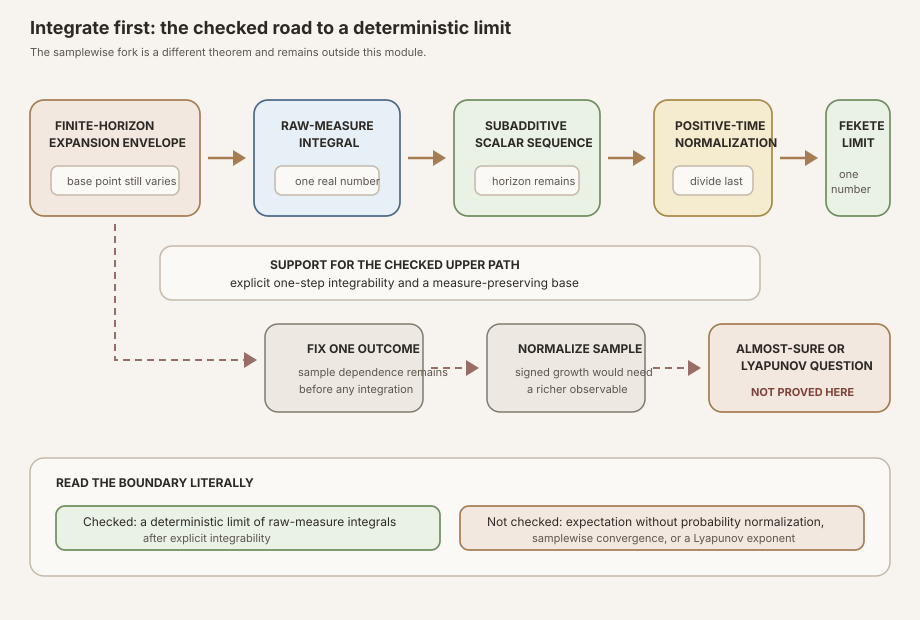


**AI-use disclosure.** Generative-AI tools helped draft, revise, illustrate,
and review this note. The author selected the questions, shaped the
exposition, has inspected the sources and artifacts cited here, and is
responsible for the final text and claims. This is an independent,
non-peer-reviewed Research Note. Verify claims against the cited primary
sources and any released artifacts before relying on them.



**Editorial status.** This teaching chapter remains a draft while human
editorial acceptance and the separate scientific-integrity and zero-context
expert-reader reviews are pending. The checked Lean source is authoritative
for every theorem statement.



**Abstract.** Let \(C\) be the one-sided complex matrix cocycle developed in
RMT-13, let \(T\) be its measure-preserving base, and let
\(\Phi(k,\omega)\) be its time-\(k\) product. RMT-15 defined the nonnegative
finite-horizon envelope

\[
  G_k(\omega)=\log^+\lVert\Phi(k,\omega)\rVert
\]

and proved that an explicit one-step assumption

\[
  \operatorname{Integrable}(G_1,\mu)
\]

propagates to every fixed horizon. RMT-16 integrates before it normalizes:

\[
  I_k=\int_\Omega G_k(\omega)\,d\mu(\omega),
  \qquad
  Q_k=\frac{I_k}{k}.
\]

Measure preservation removes the shifted base point from an integral. The
RMT-15 pointwise inequality therefore descends to

\[
  I_{m+k}\le I_m+I_k.
\]

Mathlib packages this as a subadditive real sequence. Its deterministic
Fekete theorem then proves that \(Q_k\) converges to the infimum of the
positive-time ratios.

This limit is deliberately narrow. The measure is not assumed to have mass
one, so \(I_k\) is a raw-measure integral rather than an expectation. The
theorem takes a limit of integrals rather than a samplewise limit. It assumes
no ergodicity and uses neither Kingman's subadditive ergodic theorem nor a
multiplicative ergodic theorem. Finally, \(G_k\) maps contraction, norm one,
and singular collapse to zero. Its limit is an integrated upper-growth
envelope, not a Lyapunov exponent.


This is the proof-to-prose companion for
<code>formalization/NonlinearDynamics/Random/RandomCocycles/IntegratedLogPlusGrowth.lean</code>.
It covers all thirteen public declarations in exact source order. There are
no private declarations in the module.

The immediate predecessor is
[Finite-Horizon Log-Positive Cocycle Integrability in Lean]().
Its finite-horizon integrability predicate is the analytic floor beneath every
meaningful bound and limit in this chapter. Reusable foundations include
,
,
and
.
The parallel textbook treatment is
[Integrated Log-Positive Cocycle Growth and Its Deterministic Fekete Limit]().

## Choose a route up

| Route | Begin | Destination |
|---|---|---|
| First encounter | [Three objects, three types](#three-objects-three-types) | Separate sample growth, its integral, and its normalized scalar sequence |
| Measure route | [The totalized integral trap](#the-totalized-integral-trap) | See why a defined integral is not yet a meaningful moment |
| Dynamics route | [A shifted block loses its shift after integration](#a-shifted-block-loses-its-shift-after-integration) | Use measure preservation without assuming invertibility |
| Sequence route | [Pointwise subadditivity descends to numbers](#pointwise-subadditivity-descends-to-numbers) | Reach Mathlib's deterministic subadditive-sequence API |
| Limit route | [Fekete, not Kingman](#fekete-not-kingman) | Read the positive-index infimum and convergence theorem |
| Lean route | [The complete declaration map](#the-complete-declaration-map) | Audit all thirteen declarations in source order |
| Calibration route | [What finite scalar rescaling changes](#what-finite-scalar-rescaling-changes) | Distinguish an integral from an expectation |
| Integrity route | [Exactly what the module does not prove](#exactly-what-the-module-does-not-prove) | Keep the theorem away from samplewise and Lyapunov overclaims |

### Learning objectives

By the summit, a reader should be able to:

1. distinguish \(G_k(\omega)\), \(I_k\), and \(Q_k\) by both meaning and type;
2. explain Mathlib's totalized real-valued integral;
3. identify which declarations make sense without an integrability hypothesis;
4. explain why those unconditional declarations can still be analytically
   uninformative;
5. use measure preservation to remove a finite base iterate inside an
   integral;
6. integrate a finite orbit sum term by term;
7. transfer a pointwise finite-horizon bound into a scalar integral bound;
8. transfer shifted pointwise subadditivity into ordinary sequence
   subadditivity;
9. read Mathlib's <code>Subadditive</code> predicate;
10. explain why normalized time zero is a Lean convention rather than an
    average;
11. read <code>Subadditive.lim</code> as an infimum over positive indices;
12. distinguish deterministic Fekete convergence from Kingman's theorem;
13. explain why raw-measure scaling prevents automatic expectation language;
14. explain why log-positive growth cannot detect contraction or collapse;
15. identify every ambient typeclass assumption and every missing dynamical
    assumption;
16. run the module and compile an independent signature audit; and
17. state the next hypotheses needed before a samplewise or Lyapunov theorem.

### Lineage, contribution, and boundary

In the real-valued form used here, [Fekete's classical result](#ref-fekete)
says that a subadditive numerical sequence whose normalized positive-time
range is bounded below has a finite asymptotic rate given by the infimum of
its positive-time ratios. Mathlib exposes precisely this deterministic
sequence theorem through its
[<code>Subadditive</code> API](#ref-mathlib-subadditive). RMT-16 uses it after
all dependence on \(\omega\) has been integrated away.

That order matters. [Kingman's subadditive ergodic theorem](#ref-kingman)
instead studies a family of random or measurable functions and derives
samplewise conclusions under additional measure-theoretic hypotheses.
[Furstenberg and Kesten](#ref-furstenberg-kesten) and the multiplicative
ergodic tradition address logarithmic growth of matrix products under still
richer assumptions. Those theories motivate the road, but none is formalized
here.

The local contribution is exact and reusable: construct a real-valued
sequence from the RMT-15 envelopes, prove its scalar subadditivity using the
measure-preserving base, package it for Mathlib, define its Fekete rate, and
obtain convergence. This is the project's first normalized asymptotic result
for these cocycles, but it remains an integrated positive-growth result.

## Three objects, three types

The easiest conceptual mistake is to use one word, "growth," for three
different objects. Keep this ledger visible:

| Symbol | Lean object | Type | What varies? |
|---|---|---|---|
| \(G_k(\omega)\) | <code>C.logPlusNormObservable k ω</code> | \(\mathbb R\) | horizon and base point |
| \(I_k\) | <code>C.integratedLogPlusNorm k</code> | \(\mathbb R\) | horizon only |
| \(Q_k\) | <code>C.normalizedIntegratedLogPlusNorm k</code> | \(\mathbb R\) | horizon only |

The first is a measurable function of the base point. The second is a single
real number obtained by integrating that function against \(\mu\). The third
divides that number by the horizon. Formally,

\[
  G_k:\Omega\to\mathbb R,
  \qquad
  I_k=\int_\Omega G_k\,d\mu,
  \qquad
  Q_k=I_k/k.
\]

RMT-16 follows one direction only:

\[
  G_k(\omega)
  \longrightarrow
  I_k
  \longrightarrow
  Q_k
  \longrightarrow
  \lim_{k\to\infty}Q_k.
\]

It never fixes \(\omega\) and asks for the limit of \(G_k(\omega)/k\). It
also never exchanges a limit and an integral. The sample variable is gone
before normalization begins.



<p class="figure-note">Figure: the checked path integrates first and takes a deterministic limit of real numbers. The lower fork marks the separate, unproved samplewise question. Explicit integrability supports the checked path; probability normalization, ergodicity, and Lyapunov conclusions do not appear.</p>

## The totalized integral trap

Mathlib's [Bochner integral](#ref-mathlib-bochner) is a total function. For real-valued functions,
<code>MeasureTheory.integral</code> returns the ordinary Bochner integral when
the function is integrable. If the function is not integrable, the API sets
the integral to zero. The official theorem <code>integral_undef</code> records
that convention.

This design keeps definitions total and theorem statements composable. It
also creates a teaching hazard. The expression

\[
  I_k=\int_\Omega G_k\,d\mu
\]

has a real value before anyone proves \(G_k\) integrable. If \(G_k\) is not
integrable, that value is zero by convention, not the finite analytic moment
one hoped to construct.

The first four declarations are therefore logically valid without an
integrability premise:

* the definition of \(I_k\);
* the identity \(I_0=0\);
* the inequality \(0\le I_k\); and
* invariance of the totalized integral under a finite base iterate.

The last inequality uses the nonnegativity of \(G_k\). In the nonintegrable
branch, the totalized integral is zero, so the theorem remains true. It does
not prove that the integral is analytically meaningful or finite in the
usual sense.

The normalized definition, normalized nonnegativity theorem, and range
lower-bound theorem in declarations 9 through 11 are likewise total and
unconditional. Their values become part of the analytically meaningful
Fekete result only when paired with the explicit integrability hypothesis.


**A defined integral is not an integrability proof.** Declaration 4's shift
identity is also unconditional: ordinary measurability, change of variables,
and preservation of the mapped measure suffice. In a nonintegrable case, the
identity may merely say zero equals zero under Mathlib's totalization.
Declarations 5 through 8 and 12 through 13 use
<code>C.HasIntegrableGeneratorLogPlus</code>. That RMT-15 hypothesis says the
one-step envelope is integrable and propagates integrability to every finite
horizon.


An adversarial example makes the distinction sharp. Let \(\mu\) be an
infinite measure and let \(G_1(\omega)=1\) everywhere. The function is not
integrable. Mathlib's totalized integral nevertheless returns zero. Calling
that value a finite growth moment would conceal the failed hypothesis.
This is an illustrative stress test, not a declaration in the Lean module.

## A shifted block loses its shift after integration

RMT-15 proved the pointwise two-time inequality

\[
  G_{m+k}(\omega)
  \le
  G_k(T^m\omega)+G_m(\omega).
\]

The later \(k\)-step block begins at \(T^m\omega\). That shift cannot be
deleted pointwise. It disappears only after integration because every finite
iterate \(T^m\) preserves \(\mu\):

\[
  \int_\Omega G_k(T^m\omega)\,d\mu(\omega)
  {}=
  \int_\Omega G_k(\omega)\,d\mu(\omega).
\]

Lean realizes this equality through the pushforward measure. The official
[measure-preserving map API](#ref-mathlib-measure-preserving) supplies

\[
  (T^m)_*\mu=\mu.
\]

The proof invokes <code>integral_map</code>, so it provides measurability of
the iterate and strong measurability of the integrand under the mapped
measure. Ordinary measurability of \(G_k\), already proved in RMT-15, supplies
the second obligation. No integrability proof is needed for this totalized
change-of-variables identity.

No inverse map appears. Measure preservation is enough for this pullback
integral identity; the base need not be invertible. No independence or
ergodicity appears either.

## A finite orbit sum integrates exactly

RMT-15's finite majorant is

\[
  S_k(\omega)=\sum_{j=0}^{k-1}G_1(T^j\omega).
\]

Each summand is integrable under
<code>HasIntegrableGeneratorLogPlus</code>. A finite sum may therefore be
integrated term by term. Measure preservation makes every term have the same
integral:

\[
\begin{aligned}
  \int_\Omega S_k\,d\mu
  &=\sum_{j=0}^{k-1}\int_\Omega G_1(T^j\omega)\,d\mu(\omega)\\
  &=\sum_{j=0}^{k-1}I_1\\
  &=kI_1.
\end{aligned}
\]

This equality does not use independence. All summands may be maximally
dependent because linearity of a finite integral and measure preservation
are sufficient.

RMT-15 also proved \(G_k(\omega)\le S_k(\omega)\). Both sides are integrable,
so <code>integral_mono</code> gives

\[
  I_k\le kI_1.
\]

The theorem is a finite-horizon upper bound. For positive \(k\), one may
derive \(Q_k\le I_1\), but RMT-16 does not export that derived inequality as a
separate declaration.

## Pointwise subadditivity descends to numbers

Integrate the shifted pointwise inequality. The integrability hypothesis
justifies monotonicity of the integral and the splitting of an integral of a
sum:

\[
\begin{aligned}
  I_{m+k}
  &\le
  \int_\Omega
    \bigl(G_k(T^m\omega)+G_m(\omega)\bigr)\,d\mu(\omega)\\
  &=
  \int_\Omega G_k(T^m\omega)\,d\mu(\omega)+I_m\\
  &=I_k+I_m\\
  &=I_m+I_k.
\end{aligned}
\]

The final commutation is ordinary addition of real numbers. It does not alter
the cocycle product order that produced the original shifted inequality.

Mathlib defines

\[
  \operatorname{Subadditive}(I)
  \quad\text{to mean}\quad
  \forall m\,k,\ I_{m+k}\le I_m+I_k.
\]

Declaration 8 packages declaration 7 in exactly that interface. Once the
sample dependence has been removed, the rest of the proof is deterministic
real analysis.

## Normalize only after integrating

The normalized sequence is

\[
  Q_k=\frac{I_k}{k}.
\]

In Lean, the natural number \(k\) is coerced to a real number. At \(k=0\),
real division is total and \(0/0=0\). Since \(I_0=0\), the formal value is
\(Q_0=0\).


**Time zero is not an average.** The value \(Q_0=0\) is Lean's totalized
division convention. It has no interpretation as growth per unit time.
Mathlib's Fekete rate uses positive indices, and convergence along
<code>atTop</code> is unchanged by any finite collection of initial values.


Because \(I_k\ge0\) and the real coercion of \(k\) is nonnegative, \(Q_k\ge0\).
Zero is therefore a lower bound for the entire range of \(Q\), including the
time-zero convention. That lower-bound theorem is the final input needed by
Mathlib's convergence result.

## Fekete, not Kingman

For a subadditive sequence \(u:\mathbb N\to\mathbb R\), Mathlib's
[subadditive-sequence API](#ref-mathlib-subadditive) defines
<code>Subadditive.lim</code> as the infimum of the normalized positive-index
values:

\[
  \inf_{n\ge1}\frac{u_n}{n}.
\]

RMT-16 names this number

\[
  \gamma_+(C,\mu)
  =\operatorname{integratedLogPlusGrowthRate}(C,h_C).
\]

The notation \(\gamma_+\) is explanatory prose only; the Lean API uses the
long descriptive name. Given scalar subadditivity and the lower bound on the
normalized range, Mathlib's <code>Subadditive.tendsto_lim</code> proves

\[
  Q_k\longrightarrow\gamma_+(C,\mu)
  \qquad\text{as }k\to\infty.
\]

This is Fekete's deterministic conclusion. The converging objects are real
numbers. The proof does not consider exceptional base points, invariant
sets, sigma-algebras, or ergodic components.

The infimum need not be attained at a finite index. Nor does subadditivity
make the sequence \(Q_k\) monotone. The theorem supplies a limit, not a rate
of convergence.

Kingman's theorem asks a different question. It begins with a subadditive
measurable process before integration and can derive almost-everywhere
behavior under additional hypotheses. RMT-16 neither invokes nor simulates
that argument. Its order of operations is:

1. prove finite-horizon integrability;
2. integrate each horizon;
3. prove subadditivity of the resulting numbers;
4. normalize those numbers; and
5. apply deterministic Fekete convergence.

## What finite scalar rescaling changes

The ambient measure has type <code>Measure Ω</code>. There is no
<code>IsProbabilityMeasure μ</code> assumption. Consequently, the word
"expectation" would be incorrect in the declaration map, theorem summary,
card, or figure.

Consider a one-point base with identity dynamics, a scalar generator of norm
\(e^a\) for \(a\ge0\), and measure \(c\delta_\ast\), where \(c\) is a
finite nonnegative scalar. An elementary
calculation gives

\[
  G_k=ka,
  \qquad
  I_k=cka,
  \qquad
  Q_k=ca.
\]

When \(c=1\), the measure is a probability and the integral agrees with an
expectation. When \(c=2\), the rate doubles. When \(c=0\), the integrated rate
is zero even though the sample matrix product expands. This calibration is
illustrative and is not formalized as a theorem in RMT-16.

The example exposes the exact semantics. The new rate belongs to the pair of
a cocycle and its chosen raw measure. Under finite scalar
rescaling, the raw integral and this calibration rate rescale with the
measure. RMT-16 does not export a separate rescaling theorem; this paragraph
is a contextual calculation using the standard scalar law for integrals.
A later probability-layer
API may specialize it to normalized measures and then use expectation
language.

## What the positive logarithm still erases

Integration and deterministic convergence do not restore information that
\(G_k\) discarded. For every norm at most one,

\[
  \log^+\lVert\Phi(k,\omega)\rVert=0.
\]

Strict contraction, neutral norm, and exact singular collapse all contribute
the same value. A product alternating scalar factors \(2\) and \(1/2\) makes
the issue concrete: one-step positive costs may be nonzero even when a
two-step product is neutral. The orbit-sum majorant is an upper envelope, not
an equality describing signed logarithmic growth.

Therefore the integrated Fekete rate is not a top Lyapunov exponent. A
Lyapunov exponent must track signed logarithmic growth sample by sample and
requires a theorem that constructs the relevant limit. Singular products,
negative tails, inverse control, and invariant directions may also matter,
depending on the chosen theorem.

## The complete declaration map

The module has thirteen public declarations. The order is part of the proof
story: total definitions first, then integrability-backed transport and
bounds, then the scalar sequence interface, and finally the limit.

| # | Lean declaration | Mathematical content | Main dependency |
|---:|---|---|---|
| 1 | <code>integratedLogPlusNorm</code> | \(I_k=\int G_k\,d\mu\) | RMT-15 observable |
| 2 | <code>integratedLogPlusNorm_zero</code> | \(I_0=0\) | time-zero envelope |
| 3 | <code>integratedLogPlusNorm_nonneg</code> | \(0\le I_k\) | totalized integral nonnegativity |
| 4 | <code>integral_logPlusNormObservable_at_base_iterate_eq</code> | \(\int G_k\circ T^j\,d\mu=I_k\) | ordinary measurability, totalized change of variables, and measure preservation |
| 5 | <code>HasIntegrableGeneratorLogPlus.integral_orbitLogPlusSum_eq</code> | \(\int S_k\,d\mu=kI_1\) | finite-sum integration and declaration 4 |
| 6 | <code>HasIntegrableGeneratorLogPlus.integratedLogPlusNorm_le_nat_mul</code> | \(I_k\le kI_1\) | pointwise majorant and declaration 5 |
| 7 | <code>HasIntegrableGeneratorLogPlus.integratedLogPlusNorm_add_le</code> | \(I_{m+k}\le I_m+I_k\) | shifted pointwise inequality and declaration 4 |
| 8 | <code>HasIntegrableGeneratorLogPlus.subadditive_integratedLogPlusNorm</code> | <code>Subadditive I</code> | declaration 7 |
| 9 | <code>normalizedIntegratedLogPlusNorm</code> | \(Q_k=I_k/k\) | real division |
| 10 | <code>normalizedIntegratedLogPlusNorm_nonneg</code> | \(0\le Q_k\) | declaration 3 |
| 11 | <code>bddBelow_normalizedIntegratedLogPlusNorm</code> | the range of \(Q\) is bounded below | declaration 10 |
| 12 | <code>integratedLogPlusGrowthRate</code> | Fekete infimum of positive-time ratios | declaration 8 and an integrability proof |
| 13 | <code>HasIntegrableGeneratorLogPlus.tendsto_normalizedIntegratedLogPlusNorm</code> | \(Q_k\to\gamma_+\) | declarations 8, 11, and Mathlib Fekete convergence |

The ambient parameters remain deliberately sparse:

```lean
variable {Ω : Type uΩ} {ι : Type uι} [MeasurableSpace Ω]
  [Fintype ι] [DecidableEq ι] {μ : Measure Ω}
```

There is no positive-dimension assumption on \(\iota\), no probability
typeclass on \(\mu\), and no ergodicity or invertibility premise.

## Declaration 1: integrate the finite-horizon envelope

```lean
def integratedLogPlusNorm
    (C : DiscreteMatrixCocycle (ι := ι) μ) (k : ℕ) : ℝ :=
  ∫ ω, C.logPlusNormObservable k ω ∂μ
```

This definition turns the measurable function \(G_k:\Omega\to\mathbb R\)
into the scalar \(I_k\in\mathbb R\). The measure is an implicit part of
<code>C</code>'s type, so the Lean name does not repeat it.

Two absences are important. First, the definition takes no integrability
proof because Mathlib's integral is totalized. Second, it takes no probability
normalization proof. The output is therefore a raw-measure integral. It may
coincide with an expectation in a later probability specialization, but that
interpretation is not available from this signature.

The declaration is <code>noncomputable</code>. Its purpose is theorem-level
analysis, not numerical quadrature or executable simulation.

## Declaration 2: time zero integrates to zero

```lean
@[simp] theorem integratedLogPlusNorm_zero
    (C : DiscreteMatrixCocycle (ι := ι) μ) :
    C.integratedLogPlusNorm 0 = 0
```

RMT-15 proved that the time-zero log-positive norm observable is the zero
function. Unfolding declaration 1 therefore leaves the integral of zero,
which <code>simp</code> evaluates to zero.

The <code>@[simp]</code> attribute makes the result available to later
simplification. It also establishes the numerator used in the normalized
time-zero convention. This theorem needs no integrability hypothesis because
the zero function is integrable and its integral is unambiguous.

It proves only a time-zero identity. It says nothing about whether a positive
horizon has an analytically meaningful integral.

## Declaration 3: nonnegativity survives totalization

```lean
theorem integratedLogPlusNorm_nonneg
    (C : DiscreteMatrixCocycle (ι := ι) μ) (k : ℕ) :
    0 ≤ C.integratedLogPlusNorm k
```

The function \(G_k\) is pointwise nonnegative. Mathlib's
<code>integral_nonneg</code> lifts that fact to its real-valued integral.

This theorem intentionally has no <code>HasIntegrableGeneratorLogPlus</code>
premise. In the integrable branch it is ordinary nonnegativity of a Bochner
integral. In the nonintegrable branch the totalized integral is zero, so the
same conclusion still holds.

The declaration must not be paraphrased as "\(G_k\) is integrable and has a
nonnegative integral." Integrability is not part of either its hypotheses or
its conclusion.

## Declaration 4: remove a finite base shift under the totalized integral

```lean
theorem integral_logPlusNormObservable_at_base_iterate_eq
    (C : DiscreteMatrixCocycle (ι := ι) μ) (k j : ℕ) :
    (∫ ω, C.logPlusNormObservable k (C.base^[j] ω) ∂μ) =
      C.integratedLogPlusNorm k
```

For any horizon \(k\) and any finite base iterate \(j\), the integral of the
pulled-back observable equals its unshifted integral. The result uses two
facts from earlier modules:

1. <code>C.base_iterate_preserving j</code> says \(T^j\) preserves \(\mu\);
2. <code>C.measurable_logPlusNormObservable k</code> says \(G_k\) is
   ordinarily measurable.

The proof first rewrites the target as an integral against
<code>Measure.map (C.base^[j]) μ</code>. It supplies the strong measurability
required by <code>integral_map</code>, rewrites the mapped measure back to
\(\mu\), and closes by the definition of \(I_k\).

The shift disappears only at the integral level. The theorem does not assert
\(G_k(T^j\omega)=G_k(\omega)\) pointwise. It also needs no inverse for \(T\)
and makes no ergodicity claim. Its lack of an integrability hypothesis is
intentional. If \(G_k\) is nonintegrable, both totalized integrals can be zero,
so this equality alone does not certify an ordinary finite moment.

## Declaration 5: integrate the finite orbit sum

```lean
theorem HasIntegrableGeneratorLogPlus.integral_orbitLogPlusSum_eq
    {C : DiscreteMatrixCocycle (ι := ι) μ}
    (hC : C.HasIntegrableGeneratorLogPlus) (k : ℕ) :
    (∫ ω, C.orbitLogPlusSum k ω ∂μ) =
      k * C.integratedLogPlusNorm 1
```

The source unfolds the orbit sum into a sum over <code>Finset.range k</code>.
RMT-15 proves each summand \(G_1\circ T^j\) integrable. Mathlib can therefore
move the finite sum through the integral. Declaration 4 on \(C\) rewrites every
summand's integral to \(I_1\), and finite-sum simplification produces \(kI_1\).

The natural number \(k\) is coerced to a real scalar in the product. At
\(k=0\), both the empty orbit sum and the right side are zero.

This is linearity of integration, not a probabilistic decorrelation
argument. No independence or mixing assumption is hidden in the proof.

## Declaration 6: the one-step integral controls every horizon

```lean
theorem HasIntegrableGeneratorLogPlus.integratedLogPlusNorm_le_nat_mul
    {C : DiscreteMatrixCocycle (ι := ι) μ}
    (hC : C.HasIntegrableGeneratorLogPlus) (k : ℕ) :
    C.integratedLogPlusNorm k ≤ k * C.integratedLogPlusNorm 1
```

RMT-15 established the pointwise majorization

\[
  G_k(\omega)\le S_k(\omega).
\]

Declaration 6 applies <code>integral_mono</code>. That theorem explicitly
requires integrability of both sides, supplied here by
<code>hC.integrable_logPlusNormObservable k</code> and
<code>hC.integrable_orbitLogPlusSum k</code>. Declaration 5 evaluates the
upper integral exactly.

This proof illustrates why totalization cannot replace the hypothesis. An
order relation between two nonintegrable functions cannot safely be turned
into the desired analytic integral comparison by merely observing that both
totalized integrals have values.

The bound controls the positive expansion budget. It cannot bound negative
logarithmic growth because that information has already been clipped to zero.

## Declaration 7: integrated subadditivity

```lean
theorem HasIntegrableGeneratorLogPlus.integratedLogPlusNorm_add_le
    {C : DiscreteMatrixCocycle (ι := ι) μ}
    (hC : C.HasIntegrableGeneratorLogPlus) (m k : ℕ) :
    C.integratedLogPlusNorm (m + k) ≤
      C.integratedLogPlusNorm m + C.integratedLogPlusNorm k
```

This is the main bridge from dynamics to deterministic sequence theory. The
proof names four analytic facts:

* \(G_k\) is integrable;
* \(G_m\) is integrable;
* \(G_{m+k}\) is integrable; and
* \(G_k\circ T^m\) is integrable because \(T^m\) preserves \(\mu\).

It then integrates RMT-15's pointwise shifted inequality. Mathlib's
<code>integral_add</code> separates the two integrable terms. Declaration 4
removes the shift from the later block. The proof ends with commutativity of
real addition to match Mathlib's chosen argument order.

Nothing in the proof commutes matrices or changes the later-block-left
cocycle law. The matrices disappeared only after their norm, positive
logarithm, and integral had produced scalars.

## Declaration 8: package the sequence for Mathlib

```lean
theorem HasIntegrableGeneratorLogPlus.subadditive_integratedLogPlusNorm
    {C : DiscreteMatrixCocycle (ι := ι) μ}
    (hC : C.HasIntegrableGeneratorLogPlus) :
    Subadditive C.integratedLogPlusNorm
```

Mathlib's <code>Subadditive</code> predicate expects exactly the inequality
proved by declaration 7. The implementation is therefore a direct reuse of
that theorem.

This short packaging declaration is structurally important. The subsequent
limit definition and convergence theorem are methods on a proof of
<code>Subadditive</code>. By exporting the interface once, the module keeps
the Fekete layer independent of the matrix and measure-theory details used to
establish it.

The predicate is deterministic. At this point Lean sees a function from
natural numbers to real numbers and its two-index inequality, not a random
process.

## Declaration 9: define the normalized scalar sequence

```lean
def normalizedIntegratedLogPlusNorm
    (C : DiscreteMatrixCocycle (ι := ι) μ) (k : ℕ) : ℝ :=
  C.integratedLogPlusNorm k / k
```

The numerator was integrated before this definition is applied. The
denominator is the real coercion of the natural horizon. For positive \(k\),
this is the familiar integrated cost per unit time.

At \(k=0\), Lean's total division convention produces zero. The definition
is total over all natural numbers because Mathlib's sequence theorems use
that domain. The meaningful asymptotic ratios begin at one.

This declaration takes no integrability proof, so it inherits the semantic
warning attached to declaration 1. The later convergence theorem supplies
<code>hC</code>; a bare value of \(Q_k\) does not certify that its numerator
is an ordinary finite moment.

## Declaration 10: normalize without losing nonnegativity

```lean
theorem normalizedIntegratedLogPlusNorm_nonneg
    (C : DiscreteMatrixCocycle (ι := ι) μ) (k : ℕ) :
    0 ≤ C.normalizedIntegratedLogPlusNorm k
```

Declaration 3 gives a nonnegative numerator. The real coercion of a natural
number is nonnegative. Mathlib's <code>div_nonneg</code> combines the two
facts.

The theorem includes \(k=0\) because total division returns zero there. Like
declaration 3, it does not carry an integrability premise and must not be
treated as evidence that a nonintegrable horizon has a meaningful normalized
moment.

## Declaration 11: exhibit a lower bound

```lean
theorem bddBelow_normalizedIntegratedLogPlusNorm
    (C : DiscreteMatrixCocycle (ι := ι) μ) :
    BddBelow (Set.range C.normalizedIntegratedLogPlusNorm)
```

The proof chooses zero as a lower bound. Every member of the range has the
form <code>C.normalizedIntegratedLogPlusNorm k</code>, and declaration 10
shows that value is nonnegative.

Mathlib's real-valued Fekete convergence theorem needs this bounded-below
hypothesis. For a general subadditive real sequence, normalized values could
otherwise run toward negative infinity, which is outside the real topology
used by the theorem.

This declaration is unconditional for the same totalization reason as
declarations 3 and 10. Its later use is paired with the integrability-backed
subadditivity proof.

## Declaration 12: name the positive-index Fekete rate

```lean
def integratedLogPlusGrowthRate
    (C : DiscreteMatrixCocycle (ι := ι) μ)
    (hC : C.HasIntegrableGeneratorLogPlus) : ℝ :=
  hC.subadditive_integratedLogPlusNorm.lim
```

The rate is Mathlib's <code>Subadditive.lim</code> applied to the sequence
\(I_k\). In the pinned Mathlib release, this is the infimum of
\(I_n/n\) over <code>Set.Ici 1</code>. Time zero does not enter the infimum.

The definition accepts the proof \(h_C\) because that proof constructs the
subadditivity witness on which the method is called. Lean's proof irrelevance
prevents the mathematical rate from depending on which proof of the same
proposition was supplied.

The output is a finite real number in this API. It is a deterministic
integrated log-positive rate tied to the chosen raw measure. The definition
does not call it an expectation, Lyapunov exponent, or entropy.

## Declaration 13: deterministic convergence

```lean
theorem HasIntegrableGeneratorLogPlus.
    tendsto_normalizedIntegratedLogPlusNorm
    {C : DiscreteMatrixCocycle (ι := ι) μ}
    (hC : C.HasIntegrableGeneratorLogPlus) :
    Tendsto C.normalizedIntegratedLogPlusNorm atTop
      (𝓝 (C.integratedLogPlusGrowthRate hC))
```

This is the summit theorem. Declaration 8 supplies subadditivity. Declaration
11 supplies the lower bound. Mathlib's
<code>Subadditive.tendsto_lim</code> then proves convergence in the ordinary
topology of the real numbers as the natural horizon tends to infinity.

Read the conclusion literally:

\[
  \forall\text{ neighborhoods }U\text{ of }\gamma_+,
  \quad
  Q_k\in U\text{ for all sufficiently large }k.
\]

There is no \(\omega\) left in the conclusion. Hence there can be no
exceptional null set, almost-everywhere qualifier, convergence in probability,
or \(L^1\) convergence claim. The theorem also gives no modulus or numerical
rate of convergence.

The result is stronger than a mere finite-horizon bound and weaker than an
ergodic growth theorem. That middle position is exactly what the Lean type
states.

## Proof dependency architecture

The declaration order can be compressed into four layers:

```text
RMT-15 observable, measurability, and measure-preserving iterates
  |
  +--> integrated definition --> zero and nonnegative facts
  |
  +--> unconditional base-iterate integral invariance

RMT-15 one-step integrability
  |
  +--> finite-horizon and orbit-sum integrability
          |
          +--> shift invariance --> exact orbit-sum integral --> linear bound
          |
          +--> shifted pointwise inequality --> integrated inequality
                                                     |
                                                     +--> Subadditive package
                                                       |
integrated definition --> normalized definition --> lower bound
                                                       |
                                                       +--> Fekete rate
                                                              |
                                                              +--> Tendsto theorem
```

The analytic bottleneck is above the sequence layer. Once the
<code>Subadditive</code> proof and lower bound exist, Mathlib supplies the
limit theorem without any further cocycle reasoning.

This organization is valuable for later refactoring. A different dynamical
model could reuse the lower sequence layer if it produced another
integrability-backed subadditive scalar sequence. Conversely, a future
samplewise theorem will have to branch before integration, because the
current lower layer no longer contains \(\omega\).

## Run and audit the Lean module

The project pins Lean and the documented
[Mathlib 4.32.0 release](#ref-mathlib-release). Run commands from the repository root in
the following order. On macOS, the first command makes the Elan-installed
toolchain available to the shell. The same command is harmless on Linux when
Elan was installed in its default location.

```sh
source "$HOME/.elan/env"
cd formalization
lake env lean -DwarningAsError=true NonlinearDynamics/Random/RandomCocycles/IntegratedLogPlusGrowth.lean
lake build NonlinearDynamics.Random.RandomCocycles.IntegratedLogPlusGrowth
lake build NonlinearDynamics.Random.RandomCocycles
lake build NonlinearDynamics
```

The first Lean command checks the leaf file while promoting warnings to
errors. The next command builds the named module and its dependencies. The
last two commands check the public import chain through the random-cocycle
aggregator and the project root.

For a signature-only audit, remain in <code>formalization/</code>, create a
temporary file, and compile it:

```sh
tee /tmp/RMT16Smoke.lean >/dev/null <<'LEAN'
import NonlinearDynamics.Random.RandomCocycles.IntegratedLogPlusGrowth

open MeasureTheory Set Filter Topology
open scoped Matrix.Norms.Operator Real

#check NonlinearDynamics.Random.RandomCocycles.DiscreteMatrixCocycle.integratedLogPlusNorm
#check NonlinearDynamics.Random.RandomCocycles.DiscreteMatrixCocycle.integratedLogPlusNorm_zero
#check NonlinearDynamics.Random.RandomCocycles.DiscreteMatrixCocycle.integratedLogPlusNorm_nonneg
#check NonlinearDynamics.Random.RandomCocycles.DiscreteMatrixCocycle.integral_logPlusNormObservable_at_base_iterate_eq
#check NonlinearDynamics.Random.RandomCocycles.DiscreteMatrixCocycle.HasIntegrableGeneratorLogPlus.integral_orbitLogPlusSum_eq
#check NonlinearDynamics.Random.RandomCocycles.DiscreteMatrixCocycle.HasIntegrableGeneratorLogPlus.integratedLogPlusNorm_le_nat_mul
#check NonlinearDynamics.Random.RandomCocycles.DiscreteMatrixCocycle.HasIntegrableGeneratorLogPlus.integratedLogPlusNorm_add_le
#check NonlinearDynamics.Random.RandomCocycles.DiscreteMatrixCocycle.HasIntegrableGeneratorLogPlus.subadditive_integratedLogPlusNorm
#check NonlinearDynamics.Random.RandomCocycles.DiscreteMatrixCocycle.normalizedIntegratedLogPlusNorm
#check NonlinearDynamics.Random.RandomCocycles.DiscreteMatrixCocycle.normalizedIntegratedLogPlusNorm_nonneg
#check NonlinearDynamics.Random.RandomCocycles.DiscreteMatrixCocycle.bddBelow_normalizedIntegratedLogPlusNorm
#check NonlinearDynamics.Random.RandomCocycles.DiscreteMatrixCocycle.integratedLogPlusGrowthRate
#check NonlinearDynamics.Random.RandomCocycles.DiscreteMatrixCocycle.HasIntegrableGeneratorLogPlus.tendsto_normalizedIntegratedLogPlusNorm
LEAN

lake env lean -DwarningAsError=true /tmp/RMT16Smoke.lean
```

Success is silent apart from the types printed by the thirteen
<code>#check</code> commands. If the import fails, confirm that the shell is
still inside <code>formalization/</code> and that <code>lake update</code> has
not changed the pinned dependency graph.

## Failure modes worth learning

| Tempting move | Why it fails | Checked repair |
|---|---|---|
| Call \(I_k\) an expectation | <code>Measure Ω</code> need not have mass one | Say raw-measure integral; specialize later under a probability assumption |
| Treat a real-valued integral as proof of integrability | Mathlib totalizes the nonintegrable branch to zero | Carry <code>HasIntegrableGeneratorLogPlus</code> into every substantive integral theorem |
| Delete \(T^m\) pointwise | Measure preservation gives equality of integrals, not equality of values | Use <code>integral_map</code> and the mapped-measure identity |
| Use <code>integral_mono</code> without hypotheses | Its useful real-valued form requires integrability of both functions | Invoke RMT-15's propagated integrability first |
| Commute the matrix blocks | Matrix multiplication is not commutative | Preserve the later-block-left cocycle split until only real scalars remain |
| Read \(Q_0\) as a time average | Lean defines division by zero, but elapsed time zero has no per-time meaning | State the convention and use positive indices for the Fekete rate |
| Expect \(Q_k\) to decrease monotonically | Subadditivity alone does not imply monotonic normalized ratios | Claim convergence to the infimum, not monotonicity |
| Call the proof Kingman's theorem | The process has already been integrated into a numerical sequence | Call it deterministic Fekete convergence |
| Infer a samplewise limit from a limit of integrals | Integration removed the sample variable before the limit | Formalize a separate subadditive ergodic theorem path |
| Call the rate a Lyapunov exponent | The positive logarithm erases all negative growth and collapse | Retain the descriptive integrated log-positive name |
| Assume finite scalar rescaling is irrelevant | Raw integrals and the one-point calibration change under finite scalar rescaling of the measure | Add a probability normalization before using expectation language |
| Infer a convergence speed | <code>tendsto_lim</code> provides qualitative convergence only | Prove quantitative structure separately |

### A proof-order failure to avoid

Suppose one tries to prove declaration 6 immediately from the pointwise
inequality. The goal is an inequality between integrals. Mathlib asks whether
both functions are integrable. Merely unfolding <code>integratedLogPlusNorm</code>
cannot solve those obligations because the integral definition itself carries
no evidence.

The successful proof order is:

1. obtain finite-horizon integrability from the RMT-15 hypothesis;
2. obtain orbit-sum integrability from the same hypothesis;
3. invoke integral monotonicity; and
4. evaluate the upper integral with declaration 5.

The typechecker is enforcing a genuine analytic distinction, not imposing
incidental bureaucracy.

## Boundary cases

### Empty matrix dimension

The type \(\iota\) is finite and decidable but need not be inhabited. In empty
dimension, the selected row-sum matrix norm is zero. The log-positive
observable is therefore zero at every horizon and base point. All integrated
values, normalized values, and the Fekete rate are zero.

RMT-16 does not export a dedicated empty-dimension theorem. The general
declarations remain valid without a hidden <code>Nonempty ι</code> premise.

### Zero measure

If \(\mu=0\), every integrable real-valued function has integral zero. Hence
the scalar sequence and its rate are zero even if the underlying matrices
expand pointwise. This is not a contradiction. The theorem concerns growth
weighted by the chosen measure.

### Infinite measure

An infinite measure is permitted, but the one-step hypothesis becomes
substantive. A bounded nonzero observable need not be integrable on a space
of infinite mass. Once the one-step log-positive envelope is integrable,
RMT-15 and RMT-16 propagate only the finite-horizon consequences proved in
their signatures.

### Noninvertible base

The base map may lose information. Its forward iterates still preserve the
measure by the cocycle structure, and that is all the shift-removal proof
uses. No negative-time orbit or inverse base map is constructed.

### Singular products

A zero matrix product has norm zero and log-positive value zero. It therefore
causes no upper-tail integrability problem. It also demonstrates why this
observable cannot describe signed logarithmic contraction or a full
multiplicative ergodic spectrum.

## Physical interpretation and the missing bridge

In nonlinear dynamics, one often studies a differentiable map \(F\) and the
growth of tangent perturbations under products of derivatives. A matrix
cocycle can model that process after choosing coordinates or a trivialized
tangent bundle. In that intended picture, \(G_k\) measures only the positive
part of the logarithmic amplification of a \(k\)-step tangent product, and
\(I_k\) aggregates that cost over the chosen measure.

RMT-16 does not formalize this interpretation. Its generator is an arbitrary
measurable complex matrix field. There is no nonlinear state map \(F\), no
derivative \(DF\), no chain rule connecting derivatives to the cocycle
product, and no tangent bundle. The chapter may use tangent-growth language
as motivation only when this gap is stated nearby.

The integrated rate can nevertheless be useful infrastructure. It gives a
checked upper-growth budget and a deterministic asymptotic scalar that later
probability or derivative layers may reuse. The formal statement remains
about the abstract matrix cocycle.

## Exactly what the module does not prove

RMT-16 does not prove any of the following:

* that \(\mu\) is finite or has mass one;
* that <code>integratedLogPlusNorm</code> is an expectation;
* a public theorem computing finite scalar rescaling of \(\mu\);
* a samplewise limit of \(G_k(\omega)/k\);
* almost-everywhere convergence;
* convergence in probability or in \(L^1\);
* an exchange of limit and integration;
* ergodicity, mixing, stationarity beyond the stored measure preservation, or
  independence;
* Kingman's subadditive ergodic theorem;
* the Furstenberg-Kesten theorem;
* a Lyapunov exponent or full Lyapunov spectrum;
* an Oseledets splitting or multiplicative ergodic theorem;
* inverse-log, negative-part, singular-value, or exterior-power integrability;
* monotonicity of \(Q_k\);
* a rate of convergence;
* attainment of the Fekete infimum at a finite horizon;
* a nonlinear derivative cocycle, random Jacobian, tangent bundle, or chain
  rule; or
* an entropy, bifurcation, stability, or chaos theorem.

The theorem does establish a real asymptotic limit. The boundary is about
which sequence converges and what information that sequence retains.

## Exercises with solutions

### Exercise 1: identify the disappearing variable

At which declaration does the base point \(\omega\) cease to be an external
argument?

**Solution.** Declaration 1. The integrand still binds \(\omega\), but the
result <code>integratedLogPlusNorm C k</code> is a real number depending only
on the horizon, cocycle, and its measure.

### Exercise 2: challenge totalization

Why does declaration 3 not prove that \(G_k\) is integrable?

**Solution.** Mathlib defines the integral of a nonintegrable real-valued
function to be zero. Nonnegativity therefore holds in both the ordinary
integrable branch and the totalized fallback branch.

### Exercise 3: locate the use of measure preservation

Which declaration first turns measure preservation into an equality needed
by the scalar sequence?

**Solution.** Declaration 4. It proves that pulling a finite-horizon
observable back along any finite base iterate preserves its integral.

### Exercise 4: reject an independence assumption

Why can declaration 5 integrate the orbit sum without proving that its
summands are independent?

**Solution.** Linearity of a finite integral needs integrability, not
independence. Measure preservation makes each summand's integral equal to
\(I_1\).

### Exercise 5: preserve the shift

Starting from the cocycle split, why must the later \(k\)-block be evaluated
at \(T^m\omega\)?

**Solution.** The later block begins after the first \(m\) base steps. The
shift follows from the ordered cocycle product and disappears only after
using measure preservation under the integral.

### Exercise 6: test time zero

What is \(Q_0\), and why is it excluded from the rate's infimum?

**Solution.** It is zero by Lean's totalized real division. It is not a
growth-per-time quantity. Mathlib defines the Fekete infimum over natural
indices at least one.

### Exercise 7: test monotonicity

Does \(I_{m+k}\le I_m+I_k\) imply \(Q_{k+1}\le Q_k\) for every \(k\)?

**Solution.** No. Subadditivity controls combined horizons but does not force
successive normalized ratios to be monotone. Fekete convergence is the
correct general conclusion.

### Exercise 8: rescale a one-point measure

In the calibration example, what happens when \(c\) changes from one to
three?

**Solution.** \(G_k\) is unchanged because it is pointwise. The raw integral
\(I_k\), every positive-time ratio \(Q_k\), and the resulting rate are
multiplied by three. This is finite scalar rescaling, not a claim about an
arbitrary change of measure.

### Exercise 9: compare two limit questions

Why can declaration 13 hold without saying whether
\(G_k(\omega)/k\) converges for any \(\omega\)?

**Solution.** Declaration 13 concerns the numerical sequence obtained after
integrating each \(G_k\). A limit of those numbers contains no pointwise
quantifier.

### Exercise 10: inspect the infimum

Must there be a finite \(n\) with \(Q_n=\gamma_+\)?

**Solution.** No. An infimum may be approached without being attained.
Mathlib's convergence theorem does not add attainment.

### Exercise 11: compare Fekete and Kingman

What major kind of object appears in Kingman's setup but is absent when
Mathlib's <code>Subadditive.tendsto_lim</code> is called here?

**Solution.** A sample-dependent subadditive process. RMT-16 has already
reduced the process to a subadditive sequence of real integrals.

### Exercise 12: reject the Lyapunov label

Suppose every product is a strict contraction. What can \(G_k\) see?

**Solution.** It sees zero whenever the norm is at most one. It cannot recover
the negative signed logarithmic rate that a Lyapunov exponent would record.

### Exercise 13: inspect empty dimension

Which assumption in the module rules out an empty matrix index type?

**Solution.** None. <code>Fintype ι</code> and <code>DecidableEq ι</code> allow
an empty type. The earlier norm conventions make the general statements
continue to hold.

### Exercise 14: identify the probability upgrade

What extra structure would justify calling \(I_k\) an expectation?

**Solution.** A proof or typeclass that \(\mu\) is a probability measure,
typically <code>IsProbabilityMeasure μ</code>, together with the project's
chosen expectation notation and API.

### Exercise 15: identify the next samplewise upgrade

Is probability normalization alone enough for a deterministic almost-sure
Lyapunov exponent?

**Solution.** No. One must select and formalize an appropriate samplewise
subadditive or multiplicative ergodic theorem and satisfy its hypotheses,
which may include ergodicity and additional integrability or structural
conditions.

## The next ridge

The most responsible next step is a probability and ergodicity layer that
does not rename the present theorem. Introduce a normalized measure assumption
explicitly, decide whether the goal is a samplewise positive-envelope limit
or signed logarithmic matrix growth, and match the exact hypotheses of the
selected theorem.

For a Kingman-style path, the project needs the subadditive measurable process
before integration, the relevant finite-measure or probability assumptions,
and a precise stationarity and ergodicity interface. It must then distinguish
an almost-everywhere limit from its integral and determine when that limit is
constant.

For a Lyapunov or Oseledets path, the positive logarithm is insufficient.
The formalization must choose a signed or extended logarithmic observable,
handle singular products and negative tails, introduce singular values or
exterior powers as appropriate, and decide whether invertibility is required.

For nonlinear dynamics, a derivative-cocycle bridge remains prior work. The
matrix generator must be connected to derivatives of a measurable or smooth
map with a checked chain rule and suitable bundle or coordinate structure.

RMT-16 is therefore a clean ledge rather than a false summit. It proves the
deterministic limit that its current hypotheses support and leaves every
stronger asymptotic interpretation explicit.

## References

The links below were checked on 2026-07-21. The pinned local Mathlib 4.32.0
checkout remains the exact API authority for the Lean proof.

<a id="ref-mathlib-release"></a>
**Mathlib contributors.**
[Mathlib 4.32.0 release](https://github.com/leanprover-community/mathlib4/releases/tag/v4.32.0),
2026. This is the dependency release selected by
<code>formalization/lakefile.toml</code>.

<a id="ref-mathlib-subadditive"></a>
**Mathlib contributors.**
[Subadditive sequences](https://leanprover-community.github.io/mathlib4_docs/Mathlib/Analysis/Subadditive.html),
Mathlib 4 documentation. This official page defines
<code>Subadditive</code>, <code>Subadditive.lim</code>, and
<code>Subadditive.tendsto_lim</code>. It is the direct theorem-level warrant
for declarations 8, 12, and 13.

<a id="ref-mathlib-bochner"></a>
**Mathlib contributors.**
[Basic properties of the Bochner integral](https://leanprover-community.github.io/mathlib4_docs/Mathlib/MeasureTheory/Integral/Bochner/Basic.html),
Mathlib 4 documentation. This official page documents totalization,
nonnegativity, monotonicity, finite sums, and change of variables used by the
integral layer.

<a id="ref-mathlib-measure-preserving"></a>
**Mathlib contributors.**
[Measure-preserving maps](https://leanprover-community.github.io/mathlib4_docs/Mathlib/Dynamics/Ergodic/MeasurePreserving.html),
Mathlib 4 documentation. This official page defines
<code>MeasurePreserving</code> through measurability and equality of the
pushforward measure. The pinned local sources remain authoritative for the
finite-iterate API used in the cocycle proof.

<a id="ref-fekete"></a>
**Michael Fekete.**
["Über die Verteilung der Wurzeln bei gewissen algebraischen Gleichungen mit ganzzahligen Koeffizienten"](https://eudml.org/doc/167739),
<em>Mathematische Zeitschrift</em> 17, 228-249, 1923,
[doi:10.1007/BF01504345](https://doi.org/10.1007/BF01504345). This original
paper is cited for historical attribution. The exact formal theorem used by
RMT-16 is Mathlib's real-sequence API above.

<a id="ref-kingman"></a>
**J. F. C. Kingman.**
["The ergodic theory of subadditive stochastic processes"](https://doi.org/10.1111/j.2517-6161.1968.tb00749.x),
<em>Journal of the Royal Statistical Society: Series B</em> 30(3), 499-510,
1968. This primary source is cited to distinguish a sample-dependent ergodic
theorem from the deterministic Fekete theorem formalized here.

<a id="ref-furstenberg-kesten"></a>
**Harry Furstenberg and Harry Kesten.**
["Products of Random Matrices"](https://doi.org/10.1214/aoms/1177705909),
<em>The Annals of Mathematical Statistics</em> 31(2), 457-469, 1960. This
original paper supplies historical context for normalized logarithmic growth
of random matrix products. RMT-16 does not formalize its probabilistic
theorem.
