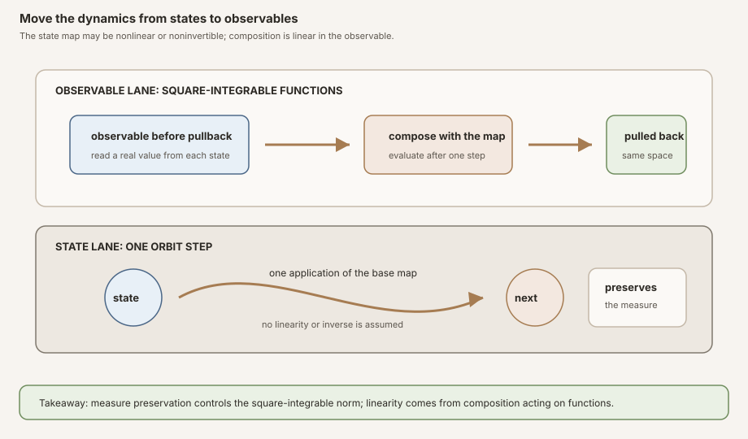
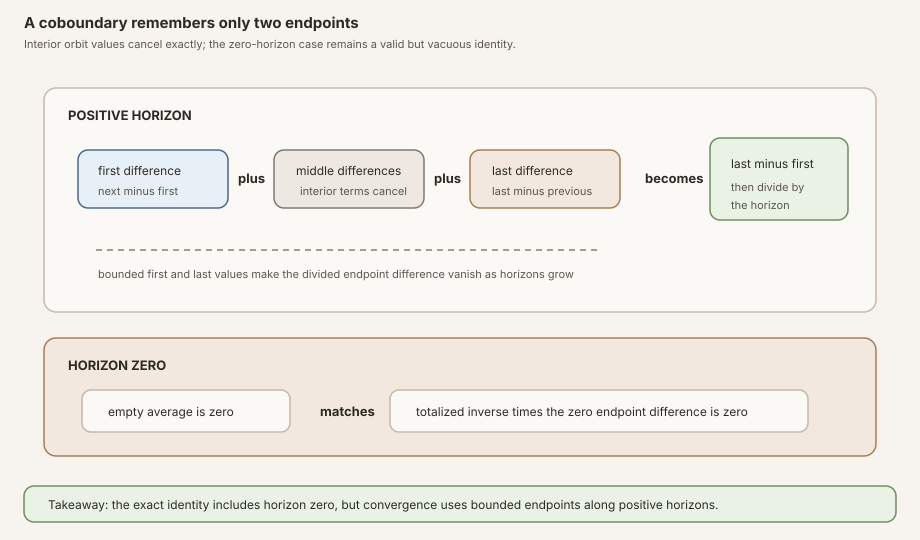
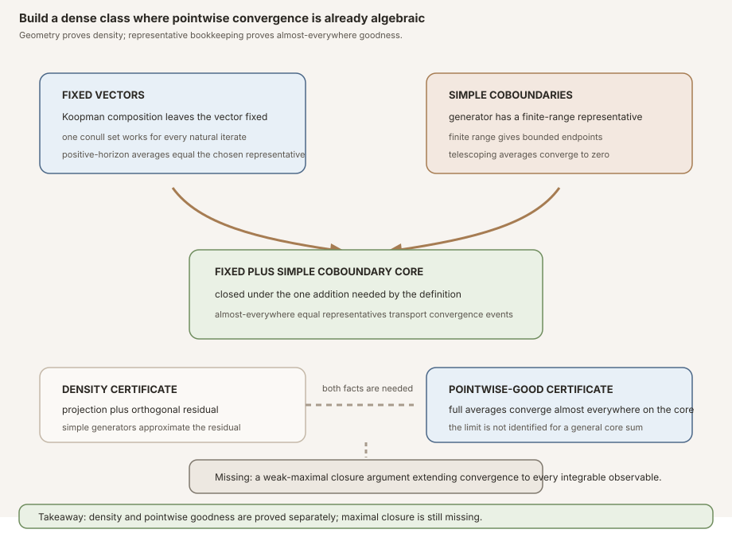
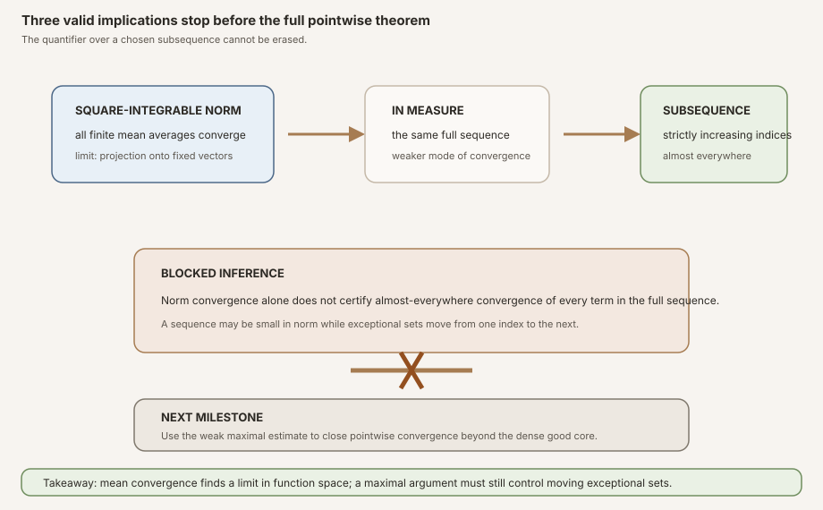


**AI-use disclosure.** Generative-AI tools helped draft, revise, illustrate,
and review this note. The author selected the questions, shaped the
exposition, has inspected the sources and artifacts cited here, and is
responsible for the final text and claims. This is an independent,
non-peer-reviewed Research Note. Verify claims against the cited primary
sources and any released artifacts before relying on them.



**Editorial status.** This teaching chapter remains a draft while human
editorial acceptance and the separate scientific-integrity and zero-context
expert-reader reviews are pending. The checked Lean source is authoritative
for every theorem statement.



**Successor milestone.** RMT-26 now combines this dense pointwise-good core
with absolute weak maximal control to prove full-sequence convergence almost
everywhere for every real integrable observable on a finite measure-preserving
system. Continue with
[The Missing Step Closes: Pointwise Birkhoff by Maximal Control in Lean]().



**Abstract.** Let \(T:\Omega\to\Omega\) preserve a measure \(\mu\). On the real
square-integrable space \(L^2(\mu)\), define the Koopman operator by

\[
U_T f=f\circ T.
\]

Measure preservation makes this composition action a linear isometry before
it is viewed as a continuous linear map. The public theorem records the
operator-norm statement \(\lVert U_T\rVert\le 1\), rather than unconditional
equality, because \(L^2\) over the zero measure is the zero space and the
continuous linear map then has norm zero.

For a square-integrable vector \(f\), the operator averages are

\[
M_n f=\frac1n\sum_{j=0}^{n-1}U_T^j f.
\]

Mathlib's Hilbert-space mean ergodic theorem gives

\[
M_n f\longrightarrow P_{\operatorname{Fix}(U_T)}f
\quad\text{in }L^2,
\]

where the limit is the orthogonal projection onto the closed subspace fixed by
\(U_T\). RMT-25 exposes that limit under both Mathlib's projection name and the
project name <code>koopmanInvariantProjectionL2</code>.

The next implication is deliberately weaker. Square-integrable norm
convergence gives convergence in measure. From convergence in measure, the
checked library extracts a strictly increasing subsequence whose chosen
representatives converge almost everywhere. Nothing in this chain proves that
the original full sequence converges almost everywhere.

RMT-25 therefore develops a second route. A forward coboundary has the form

\[
c=u\circ T-u.
\]

Its finite average telescopes exactly:

\[
A_n c(\omega)=\frac{u(T^n\omega)-u(\omega)}n.
\]

The formal identity includes the totalized case \(n=0\): both sides are zero.
That boundary equality is valid but vacuous. For positive horizons tending to
infinity, boundedness of the range of \(u\) makes the endpoint quotient tend
to zero.

The set of Koopman-fixed vectors plus coboundaries generated by
square-integrable simple functions is dense in \(L^2(\mu)\). Fixed vectors
have every positive-horizon orbit average equal to the initial value almost
everywhere, so their totalized average sequences are eventually constant after
horizon zero. A simple generator has a canonical finite-range, hence bounded,
representative whose coboundary telescopes pointwise. RMT-25 proves the
almost-everywhere representative equalities needed to transport both facts
into the earlier Birkhoff convergence event. Every vector in this dense core
is therefore pointwise-good almost everywhere.

The module assumes only measure preservation for its square-integrable layer.
It does not assume finite total mass, probability normalization, ergodicity,
injectivity, surjectivity, or invertibility. It proves no full pointwise
Birkhoff theorem, no density transfer from \(L^2\) to \(L^1\), no
conditional-expectation identification, no ergodic constant limit, no strong
maximal inequality, no Kingman theorem, no Lyapunov exponent, and no
Oseledets splitting.


This is the proof-to-prose companion for
<code>formalization/NonlinearDynamics/Random/RandomCocycles/KoopmanL2Mean.lean</code>.
It covers all twenty documented public declarations in exact source order,
both private helpers, and all eleven documented anonymous compiled probes.

Its immediate predecessor is
[From Every Finite Horizon to One Infinite Event in Lean]().
That chapter supplies the infinite weak maximal estimate. The present chapter
supplies the Hilbert mean limit and a dense pointwise-good core that the
predecessor explicitly left open.

The reusable operator is introduced in the
[Koopman operator glossary chapter](/knowledge-base/glossary/koopman-operator/),
and the telescoping direction is isolated in the
[Koopman coboundary glossary chapter](/knowledge-base/glossary/koopman-coboundary/).
The parallel textbook treatment is
[Mean Is Not Pointwise: Koopman Geometry, Coboundaries, and the Missing Maximal Step](/knowledge-base/deep-dives/mean-is-not-pointwise-koopman-geometry-coboundaries-and-the-missing-maximal-step/).

## Choose a route up

| Route | Begin | Destination |
|---|---|---|
| First encounter | [Why lift dynamics to observables?](#why-lift-dynamics-to-observables) | See how nonlinear state evolution induces a linear function-space action |
| Algebra route | [A forward coboundary telescopes](#a-forward-coboundary-telescopes) | Derive the exact endpoint identity, including horizon zero |
| Geometry route | [The Koopman Hilbert-space layer](#the-koopman-hilbert-space-layer) | Build the fixed subspace, projection, and coboundary operator |
| Density route | [Why the fixed-plus-coboundary class is dense](#why-the-fixed-plus-coboundary-class-is-dense) | Follow projection plus orthogonal residual into a dense core |
| Mean route | [Von Neumann convergence in the pinned library](#von-neumann-convergence-in-the-pinned-library) | Identify the square-integrable norm limit |
| Warning route | [Norm, measure, subsequence: stop](#norm-measure-subsequence-stop) | Audit the exact pointwise consequence and the missing full-sequence step |
| Representative route | [Almost-everywhere quotients need a bridge](#almost-everywhere-quotients-need-a-bridge) | See why quotient equality cannot be used as pointwise equality |
| API route | [The complete source-order tour](#the-complete-source-order-tour) | Audit all twenty public declarations and both private helpers |
| Boundary route | [Eleven probes patrol the quantifiers](#eleven-probes-patrol-the-quantifiers) | Test time zero, identity, zero measure, infinite measure, and noninjectivity |
| Integrity route | [Premise and nonclaim ledger](#premise-and-nonclaim-ledger) | Separate a dense good core from the full pointwise theorem |

### Learning objectives

By the summit, a reader should be able to:

1. explain why composition is linear in observables even when the state map is nonlinear;
2. define the real square-integrable Koopman operator;
3. distinguish a linear isometry from a surjective unitary equivalence;
4. identify why measure preservation suffices for the composition operator used here;
5. state the exact forward-coboundary endpoint identity;
6. explain why its horizon-zero instance is true but vacuous;
7. prove bounded forward-coboundary averages tend to zero;
8. define the Koopman-fixed subspace and its orthogonal projection;
9. define the Koopman coboundary operator and the simple-coboundary image set;
10. define the fixed-plus-simple-coboundary core;
11. explain why the public operator-norm theorem says at most one rather than exactly one;
12. reconstruct the contraction fixed-orthogonal closure lemma;
13. explain why the closure of the coboundary range need not be the range itself;
14. use density of simple functions through a continuous linear map;
15. decompose an arbitrary vector into its fixed projection and orthogonal residual;
16. state von Neumann mean convergence in the project's notation;
17. distinguish square-integrable norm convergence from convergence in measure;
18. state exactly what the subsequence theorem quantifies;
19. reject the inference from a convergent subsequence to full-sequence convergence;
20. explain why an element of \(L^2\) is an almost-everywhere equivalence class;
21. construct one conull set on which every natural iterate of a fixed vector agrees;
22. extract Mathlib's canonical finite-range representative of a simple vector;
23. transport almost-everywhere equality through a measure-preserving map;
24. transport convergence-event membership between almost-everywhere equal representatives;
25. add two pointwise convergence witnesses using the private helper;
26. prove that every fixed-plus-simple-coboundary vector is almost everywhere pointwise-good;
27. place every assumption at the first declaration that consumes it;
28. explain why no finite-measure or probability premise occurs;
29. audit all eleven probes as executable quantifier tests;
30. list all twenty public declarations in source order; and
31. state the maximal and \(L^1\) steps still required for a full pointwise Birkhoff theorem.

## Why lift dynamics to observables?

A state-space map \(T:\Omega\to\Omega\) may fold, stretch, collapse, or otherwise
move states nonlinearly. If \(f:\Omega\to\mathbb R\) is an observable, the value
seen one step later from the current state is \(f(T\omega)\). This produces a
new observable

\[
U_Tf=f\circ T.
\]

The key shift is that \(T\) acts on the input, while \(U_T\) acts on functions.
For observables \(f,g\) and scalars \(a,b\),

\[
U_T(af+bg)=aU_Tf+bU_Tg.
\]

That identity is true regardless of whether \(T\) itself is linear. Koopman
theory does not make the state map linear. It moves the nonlinear evolution
into a linear, usually infinite-dimensional, space of observables.

<strong>Figure:</strong> The lower lane is the state map, which may be nonlinear and noninvertible. The upper lane is pullback by composition, which preserves addition and scalar multiplication of observables. Measure preservation controls the square-integrable norm. The figure does not claim that every Koopman operator is surjective or that the state dynamics are linearized by a finite coordinate change.

### The physical lineage and the scope here

Koopman's 1931 paper placed continuous Hamiltonian evolution into a complex
Hilbert space of functions and described the resulting one-parameter unitary
group on pages 315–316
([Koopman, 1931](#ref-rmt25-koopman)). The motivating physics is classical:
Hamiltonian flow preserves phase volume, and observables evolve by composition
with that flow.

RMT-25 is not a formalization of Hamiltonian mechanics. Its base is an
arbitrary measurable space with an arbitrary measure and one discrete-time map
that preserves that measure. The observable space is real \(L^2\), not
Koopman's complex continuous-time setting. The map need not be invertible, so
the resulting composition embedding is not advertised as a unitary
equivalence. The historical source warrants the viewpoint, not a claim of
verbatim formalization.

### Iteration becomes operator iteration

The identity

\[
U_T^n f=f\circ T^n
\]

is the bridge between state orbits and operator averages. In Lean, the theorem
<code>iterate_koopmanL2_apply</code> does not prove this by an informal
induction over chosen representatives. It reuses Mathlib's exact theorem for
iterating measure-preserving composition, preserving all quotient bookkeeping.

Consequently the operator average

\[
\frac1n\sum_{j=0}^{n-1}U_T^j f
\]

is the \(L^2\) class corresponding almost everywhere to the ordinary Birkhoff
average along the orbit of \(T\). RMT-25 uses the operator expression for mean
convergence and returns to chosen representatives only for the pointwise-good
core.

## Prior work, this milestone, and what is not claimed

### Koopman: observables as a Hilbert-space dynamical system

Koopman's 1931 note begins with Hamiltonian equations whose Hamiltonian is
analytic on a \(2n\)-dimensional region of real phase space. On pages 315–316
it associates the phase evolution with transformations of square-integrable
complex functions and records a unitary one-parameter group
([Koopman, 1931, pp. 315–316](#ref-rmt25-koopman)). The paper supplies the
historical operator viewpoint. RMT-25 uses a discrete real composition
operator and allows noninvertible preserving maps, so it proves a contraction
interface rather than importing the historical unitary group wholesale.

### Von Neumann: convergence in the strong Hilbert-space sense

Von Neumann's 1932 paper explicitly defines strong convergence as norm
convergence on page 71. Pages 72–74 develop interval averages and a spectral
projection, including the projection formula labeled \(6''\). Pages 77–78,
item B, discuss the route from mean convergence to an almost-everywhere
convergent subsequence rather than the full pointwise sequence
([von Neumann, 1932, pp. 70–78](#ref-rmt25-von-neumann)).

The project theorem is a modern Hilbert-space contraction theorem already
packaged by Mathlib. Its averages are natural-number Cesàro averages of one
discrete composition operator, and its limit is Mathlib's orthogonal
projection onto the fixed subspace. That is closely aligned with the mean
ergodic architecture, but it is not a line-by-line encoding of von Neumann's
paper or notation.

### Birkhoff: the pointwise theorem is stronger

Birkhoff's 1931 paper says on page 656 that von Neumann's then-unpublished work
showed convergence in the mean but did not establish the claimed limit for an
individual point. Birkhoff then proves an almost-everywhere trajectory result,
with continuous-time occupation-fraction conclusions on pages 659–660
([Birkhoff, 1931, pp. 656–660](#ref-rmt25-birkhoff)).

The PNAS landing page lists the paper in volume 17, issue 12, pages 656–660,
but its publisher-assigned DOI is
<code>10.1073/pnas.17.2.656</code>. The <code>17.2</code> segment must not be
silently read as the issue number. This chapter preserves that identifier
oddity explicitly.

RMT-25 formalizes neither Birkhoff's continuous-time argument nor the complete
modern pointwise theorem. It demonstrates precisely why the mean theorem does
not settle the pointwise question and proves only a dense pointwise-good core.

### Keane and Petersen: the future maximal closure route

Keane and Petersen work on a probability space with an integrable real
observable and a possibly noninvertible measure-preserving transformation.
Pages 248–250 place finite and infinite maximal estimates beside the argument
that produces pointwise convergence
([Keane and Petersen, 2006, pp. 248–250](#ref-rmt25-keane-petersen)). Their
short proof is the closest source here for the next bridge, not for the
Hilbert-space density theorem proved in this module.

RMT-26 is expected to combine a finite-measure \(L^1\) approximation route,
the already formalized weak maximal control, and an oscillation or Cauchy-event
closure argument. RMT-25 does not claim that Keane and Petersen's proof has
already been formalized.

### This milestone's formal contribution

- It proves an exact raw endpoint formula for every forward coboundary,
  including the totalized horizon-zero case.
- It proves pointwise convergence to zero for every bounded-potential forward
  coboundary without measurable structure or measure.
- It defines the real square-integrable Koopman continuous linear map under
  measure preservation.
- It defines the fixed subspace, invariant projection, coboundary operator,
  simple-coboundary set, and fixed-plus-simple core.
- It proves the Koopman map is a contraction, retaining the zero-measure
  boundary.
- It proves the fixed orthogonal complement lies in the closed coboundary
  range and that simple generators suffice densely there.
- It proves the fixed-plus-simple core is dense in real \(L^2\).
- It specializes Mathlib's mean ergodic theorem to Koopman averages and names
  the orthogonal-projection limit.
- It derives the exact norm-to-measure-to-almost-everywhere-subsequence
  consequence.
- It proves fixed, simple-coboundary, and fixed-plus-simple representatives
  belong almost everywhere to the earlier Birkhoff convergence event.
- It compiles eleven boundary probes that patrol the theorem's quantifiers.

### Not claimed

- No theorem says the full Birkhoff-average sequence converges almost
  everywhere for every \(L^2\) vector.
- No theorem extends the dense-core result to every \(L^1\) observable.
- No theorem identifies the pointwise limit with a conditional expectation.
- No theorem says an invariant projection is constant under ergodicity.
- No theorem assumes or concludes mixing, weak mixing, chaos, or spectral
  decay.
- No theorem makes a noninvertible Koopman embedding into a unitary
  equivalence.
- No theorem asserts unconditional operator norm equality with one.
- No theorem says the coboundary range is closed or that every orthogonal
  residual is an exact coboundary.
- No theorem proves a strong square-integrable maximal inequality.
- No Kingman theorem, samplewise cocycle growth rate, Lyapunov exponent, or
  Oseledets splitting follows.

## A forward coboundary telescopes

The first two public declarations are more general than the rest of the file.
They do not need a measurable space, a measure, or any property of \(T\). They
are finite-orbit algebra for arbitrary types and functions.

Let \(u:\Omega\to\mathbb R\). Its forward coboundary is

\[
c(x)=u(Tx)-u(x).
\]

At horizon \(n\), the Birkhoff sum is

\[
\begin{aligned}
S_nc(\omega)
&=\sum_{j=0}^{n-1}\left(u(T^{j+1}\omega)-u(T^j\omega)\right)\\
&=u(T^n\omega)-u(\omega).
\end{aligned}
\]

Every interior term appears once positively and once negatively. Dividing by
the horizon gives the exact public identity

\[
A_nc(\omega)=n^{-1}\left(u(T^n\omega)-u(\omega)\right).
\]

Here \(n^{-1}\) is Lean's totalized real inverse of the natural scalar. This
notation matters at the boundary.

<strong>Figure:</strong> At a positive horizon, all interior potential values cancel and only the final minus initial value remains. At horizon zero, the empty average and the totalized endpoint expression are both zero. The zero case validates a uniform identity but carries no positive-time averaging information.

### Declaration 1: the exact endpoint identity

<code>birkhoffAverage_forwardCoboundary</code> states the identity at every
natural horizon. Its proof first rewrites the coboundary average as the
difference between two averages of \(u\), one based at \(T\omega\) and one at
\(\omega\). It aligns the two finite sums by the two standard iterate-successor
identities. The earlier Mathlib endpoint lemma then turns their difference
into the endpoint quotient.

The theorem is not restricted to positive \(n\). At \(n=0\), the left side is
the inverse of zero times an empty sum, hence zero. On the right,
\(T^0\omega=\omega\), the endpoint difference is zero, and the totalized
inverse of zero is zero. The equality is therefore \(0=0\).


**Do not overread horizon zero.** The theorem is genuinely uniform in the
natural horizon, but its zero-horizon instance is vacuous. It does not show
that division by an ordinary positive time took place, and it supplies no
decay estimate. Convergence comes from positive horizons tending to infinity.


### Declaration 2: bounded endpoints vanish after division

<code>tendsto_birkhoffAverage_forwardCoboundary</code> assumes the range of
\(u\) is bounded. Then the orbit-restricted range

\[
\{u(T^n\omega):n\in\mathbb N\}
\]

is bounded for each \(\omega\). The numerator
\(u(T^n\omega)-u(\omega)\) therefore remains bounded while the positive
horizon grows. The average converges to zero at every point:

\[
A_n(u\circ T-u)(\omega)\longrightarrow0.
\]

The proof reuses Mathlib's convergence theorem for the difference of the two
shifted Birkhoff averages and identifies each term with the project's exact
endpoint formula
([Mathlib's normed-space Birkhoff-average API](#ref-rmt25-birkhoff-normed)).
No measurable structure is smuggled into this raw theorem.

### Why simple functions arrive later

A generic vector of \(L^2(\mu)\) need not have a bounded chosen representative.
RMT-25 does not claim that every square-integrable coboundary telescopes with
bounded endpoints pointwise. Instead it chooses coboundaries generated by the
subtype <code>Lp.simpleFunc ℝ 2 μ</code>. Mathlib can extract an ordinarily
simple representative from such a vector. That representative has finite
range, and finite subsets of the real line are bounded. This is the exact link
from simple-function density to the raw telescoping theorem
([Mathlib's simple-function representative and density interfaces](#ref-rmt25-simple-density)).

## The Koopman Hilbert-space layer

From this point onward, the file has a measurable space on \(\Omega\), a measure
\(\mu\), and a proof

~~~lean
hT : MeasurePreserving T μ μ
~~~

Measure preservation packages two facts: \(T\) is measurable and its
pushforward sends \(\mu\) back to \(\mu\). It does not package finite mass,
probability normalization, ergodicity, injectivity, surjectivity, or an inverse.

### Declaration 3: <code>koopmanL2</code>

The project operator is

~~~lean
def koopmanL2 (hT : MeasurePreserving T μ μ) :
    Lp ℝ 2 μ →L[ℝ] Lp ℝ 2 μ :=
  (Lp.compMeasurePreservingₗᵢ ℝ T hT).toContinuousLinearMap
~~~

Mathlib first supplies composition as a linear isometry. RMT-25 forgets down
to a continuous linear map because that is the interface consumed by the mean
ergodic theorem. For a vector \(f\), the chosen representative of
<code>koopmanL2 hT f</code> agrees almost everywhere with \(f\circ T\).
The constructor, coercion equality, and iterate rule are all pinned library
interfaces
([Mathlib's measure-preserving composition API](#ref-rmt25-lp-composition)).

### Declaration 4: <code>koopmanFixedSubspaceL2</code>

The fixed subspace is the equal locus of \(U_T\) and the identity:

\[
\operatorname{Fix}(U_T)=\{f\in L^2:U_Tf=f\}.
\]

The equality is equality in \(L^2\), hence equality of almost-everywhere
classes. It is not literal equality of every chosen function value. The equal
locus of continuous linear maps is a closed submodule, which is precisely the
kind of subspace onto which a Hilbert space admits an orthogonal projection.

### Declaration 5: <code>koopmanInvariantProjectionL2</code>

This definition is the continuous linear orthogonal projection

\[
P:L^2(\mu)\to\operatorname{Fix}(U_T).
\]

The word *invariant* in the project name means Koopman-fixed. It does not mean
that the projection has already been identified with conditional expectation
onto an invariant sigma-algebra. That classical identification needs its own
formal bridge and is outside this module. The construction and orthogonal
residual facts come from Mathlib's projection APIs
([Mathlib orthogonal projection](#ref-rmt25-projection)).

### Declaration 6: <code>koopmanCoboundaryL2</code>

The \(L^2\) coboundary operator is

\[
U_T-I.
\]

Its image consists of square-integrable equivalence classes represented almost
everywhere by expressions of the form \(u\circ T-u\). Calling this an
operator image does not select a bounded representative and does not say the
range is closed.

### Declarations 7 and 8: the dense-core sets

<code>simpleKoopmanCoboundarySetL2 hT</code> is the image of the
coboundary operator restricted to Mathlib's square-integrable simple-function
subtype. It is a set, not declared as a submodule.

<code>fixedPlusSimpleCoboundarySetL2 hT</code> consists of vectors admitting a
decomposition

\[
f=h+c,
\qquad
h\in\operatorname{Fix}(U_T),
\qquad
c\in(U_T-I)(\text{simple }L^2\text{ vectors}).
\]

The definition stores one witness \(h\), one witness \(c\), their membership
proofs, and the equality \(f=h+c\). It does not assert uniqueness of this
decomposition.

### Declarations 9 and 10: application and iteration

The simplification theorem <code>koopmanL2_apply</code> records that the
project definition is exactly Mathlib's measure-preserving composition. It is
reflexive, but it creates a stable public rewrite boundary.

<code>iterate_koopmanL2_apply</code> then proves

\[
U_T^n f=U_{T^n}f.
\]

On the right, the preservation proof is <code>hT.iterate n</code>. Tracking the
proof for the powered map is important: a base map's measure preservation does
pass to every iterate. No corresponding ergodicity premise is present or
needed.

### Declaration 11: why the norm theorem is an inequality

The theorem <code>norm_koopmanL2_le</code> states

\[
\lVert U_T\rVert\le1.
\]

At the linear-isometry level, composition preserves the norm of each vector.
Why not publish \(\lVert U_T\rVert=1\)? Because the zero measure makes every
\(L^2\) vector equal to zero. The function space is then trivial and the
continuous linear map has operator norm zero. The weaker public inequality is
uniformly true and is exactly what the contraction mean ergodic theorem
requires.

This is not a loss caused by proof automation. It is a theorem-design choice
forced by a compiled boundary model.

## Why the fixed-plus-coboundary class is dense

The density proof has two levels. A general Hilbert-space lemma first relates
fixed vectors to the closure of an operator range. The Koopman specialization
then replaces arbitrary generators by simple ones.

### Private helper 1: the contraction geometry

The private theorem
<code>fixedOrthogonal_le_closure_range_sub_one</code> takes a contraction
\(L\) on a complete real inner-product space and proves

\[
\operatorname{Fix}(L)^\perp
\subseteq
\overline{\operatorname{range}(L-I)}.
\]

The proof is easiest to understand by taking orthogonal complements. Suppose
\(x\) is perpendicular to every vector in the range of \(L-I\). Then for every
\(y\),

\[
\langle Ly,x\rangle=\langle y,x\rangle.
\]

Set \(y=x\). The contraction bound gives
\(\lVert Lx\rVert\le\lVert x\rVert\), while the inner-product identity gives
\(\langle Lx,x\rangle=\lVert x\rVert^2\). The equality case encoded by
Mathlib's inner-product lemma forces \(Lx=x\). Thus every vector orthogonal to
the range lies in the fixed subspace. Taking orthogonals again, and using the
double-orthogonal closure theorem, gives the desired inclusion.

The closure is essential. The proof does not show the range of \(L-I\) is
closed, and the public API does not pretend otherwise.

### Declaration 12: specialize the closure theorem to Koopman

<code>fixedOrthogonal_le_closure_range_koopmanL2</code> substitutes
\(L=U_T\), supplies <code>norm_koopmanL2_le</code>, and exposes the target as
the closed range of the named operator
<code>koopmanCoboundaryL2 hT</code>. This public formulation hides no raw
subtraction of continuous linear maps from the reader.

### Declaration 13: simple generators suffice densely

The full coboundary range may use any \(L^2\) generator. Mathlib proves that
its simple-function subtype is dense in \(L^2\) at exponent two. A continuous
map sends approximating simple vectors to approximating coboundaries. Therefore

\[
\operatorname{Fix}(U_T)^\perp
\subseteq
\overline{(U_T-I)(\text{simple }L^2\text{ vectors})}.
\]

This is
<code>fixedOrthogonal_subset_closure_simpleKoopmanCoboundarySetL2</code>.
The theorem says that every orthogonal residual can be approximated by simple
coboundaries. It does not say the residual is exactly one such coboundary.

### Declaration 14: translate the residual approximation

Fix \(f\in L^2\). Let

\[
p=P_{\operatorname{Fix}(U_T)}f,
\qquad
r=f-p.
\]

Orthogonal projection gives \(p\in\operatorname{Fix}(U_T)\) and
\(r\in\operatorname{Fix}(U_T)^\perp\). Declaration 13 places \(r\) in the
closure of the simple-coboundary set. Addition by the fixed vector \(p\) is
continuous, so \(p+r=f\) lies in the closure of fixed vectors plus simple
coboundaries. Since \(f\) was arbitrary, that set is dense.

The theorem <code>dense_fixedPlusSimpleCoboundarySetL2</code> packages exactly
this argument. It neither chooses a canonical approximating sequence nor
claims pointwise convergence for the limit of that sequence.

<strong>Figure:</strong> Hilbert projection proves density, while telescoping and representative transport prove almost-everywhere goodness. These are separate certificates. The dashed last step is intentionally absent: density alone does not extend pointwise convergence to every nearby function.

## Von Neumann convergence in the pinned library

Mathlib's mean ergodic theorem is stated for a continuous linear contraction
on a real or complex Hilbert space. It proves that finite Birkhoff averages of
the operator converge to the orthogonal projection onto its fixed equal locus
([Mathlib mean ergodic theorem](#ref-rmt25-mean-ergodic)). The theorem is more
general than the measure-theoretic application: it knows nothing about sample
points, representatives, or measurable maps.

### Declaration 15: the Mathlib projection spelling

<code>tendsto_birkhoffAverage_koopmanL2</code> applies that theorem to
<code>koopmanL2 hT</code>. For every \(f\in L^2\), it states

\[
M_nf\longrightarrow
\operatorname{orthogonalProjectionOnto}_{\operatorname{Eq}(U_T,I)}f
\quad\text{in }L^2.
\]

The proof supplies only the contraction estimate. Finite mass, probability,
and ergodicity do not appear because the Hilbert theorem does not consume them.

### Declaration 16: the project projection spelling

<code>tendsto_birkhoffAverage_koopmanL2_projection</code> changes only the
name of the limit:

\[
M_nf\longrightarrow\operatorname{koopmanInvariantProjectionL2}(f).
\]

It unfolds the project definitions and Mathlib's relation between the bundled
orthogonal projection and <code>starProjection</code>. No new convergence
argument occurs in this wrapper.

### The exponent two is structural here

The proof uses an inner product, orthogonal complement, and orthogonal
projection. Those are the \(L^2\) Hilbert-space structures. This does not mean
that ergodic averages have no useful theorems in other \(L^p\) spaces. It means
the checked route in this module is specifically the exponent-two
orthogonal-projection route. Replacing two by one or infinity is not a
notational generalization of this proof.

## Norm, measure, subsequence: stop

Modes of convergence form a hierarchy with hypotheses and quantifiers that
cannot be erased. RMT-25 makes one valid chain public:

1. the full sequence converges in \(L^2\) norm;
2. therefore the full sequence converges in measure; and
3. therefore there exists a strictly increasing subsequence whose chosen
   representatives converge almost everywhere.

<strong>Figure:</strong> Every arrow shown in the top lane is checked. The selected subsequence may depend on the vector and sequence. The blocked inference is the tempting but invalid deletion of that subsequence quantifier. RMT-26 must control the full sequence by a maximal closure argument.

### Declaration 17: the exact subsequence theorem

<code>exists_subsequence_ae_tendsto_birkhoffAverage_koopmanL2_projection</code>
states that there exists a function <code>ns : ℕ → ℕ</code> such that:

- <code>ns</code> is strictly increasing; and
- for almost every \(\omega\), the representatives of the averages at indices
  <code>ns i</code> converge to the chosen representative of the invariant
  projection at \(\omega\).

The proof has three lines of architecture. It takes the mean theorem, applies
<code>tendstoInMeasure_of_tendsto_Lp</code>, then applies
<code>exists_seq_tendsto_ae</code>. The brevity records a clean library bridge.
It does not strengthen the output
([Mathlib convergence in measure and subsequence extraction](#ref-rmt25-convergence-measure)).

### Why a moving exceptional set defeats the shortcut

Norm convergence controls the measure and magnitude of each error, but the
location of the error may move with the index. A subsequence can be chosen so
that the exceptional measures are summable, enabling an almost-everywhere
argument. The original indices need not have that property merely because the
norm tends to zero.

Thus the statements

\[
\exists (n_i),\quad M_{n_i}f(\omega)\to Pf(\omega)
\quad\text{for almost every }\omega
\]

and

\[
M_nf(\omega)\to Pf(\omega)
\quad\text{for almost every }\omega
\]

are not interchangeable. RMT-25 proves the first for every \(L^2\) vector. It
proves the second only on the dense fixed-plus-simple-coboundary core.

## Almost-everywhere quotients need a bridge

An element of \(L^2(\mu)\) is not a single function with values fixed at every
point. It is an equivalence class modulo almost-everywhere equality, equipped
with a chosen representative when coerced to a function. If Lean proves
\(U_Th=h\) in \(L^2\), it has not proved

\[
h(T\omega)=h(\omega)
\]

for every \(\omega\). The representative bridge is not clerical noise. It is
the mathematical step that moves from a quotient-space theorem to a statement
about sample points.

### Declaration 18: fixed vectors are almost everywhere pointwise-good

Suppose \(h\in\operatorname{Fix}(U_T)\). Equality in the fixed subspace says
\(U_Th=h\) in \(L^2\). Iterating that fixed-point equality gives
\(U_T^nh=h\) in \(L^2\) for every natural \(n\).

For each one \(n\), Mathlib's coercion theorem says the chosen representative
of composition by \(T^n\) agrees almost everywhere with
\(h(T^n\omega)\). The source combines these countably many conull sets using
<code>ae_all_iff</code>. It obtains one conull set on which

\[
\forall n\in\mathbb N,\quad h(T^n\omega)=h(\omega).
\]

On that single set, every positive-horizon average is the constant
\(h(\omega)\). The time-zero average is totalized to zero, but the convergence
filter eventually excludes zero, so it does not affect the limit. The theorem
<code>ae_mem_birkhoffConvergenceSet_of_mem_koopmanFixedSubspaceL2</code>
concludes that almost every point belongs to the earlier Birkhoff convergence
event for the chosen representative of \(h\).

The theorem states event membership, not a separately named formula for the
limit. The proof witness is \(h(\omega)\).

### Declaration 19: simple coboundaries get bounded representatives

Suppose \(c\) lies in
<code>simpleKoopmanCoboundarySetL2 hT</code>. Its membership witness is a
square-integrable vector \(u\) lying in Mathlib's simple-function subtype such
that

\[
c=(U_T-I)u
\]

in \(L^2\).

The proof performs the following representative ledger.

1. Bundle \(u\) with its simple-subtype membership proof.
2. Extract <code>v := Lp.simpleFunc.toSimpleFunc us</code>, an ordinary
   simple function.
3. Use <code>toSimpleFunc_eq_toFun</code> to show \(v=u\) almost everywhere.
4. Use quasi-measure preservation inherited from <code>hT</code> to transport
   that equality through composition with \(T\).
5. Use Mathlib's coercion theorems for composition and subtraction to show the
   chosen representative of \((U_T-I)u\) agrees almost everywhere with
   \(v\circ T-v\).
6. Use the finite range of \(v\) to obtain boundedness.
7. Apply the raw pointwise coboundary theorem to every \(\omega\).
8. Use RMT-22's
   <code>birkhoffConvergenceSet_ae_eq_of_ae_eq</code> to transport the
   convergence event back to the chosen \(L^2\) representative.

The composition transport in step 4 needs only quasi-measure preservation,
but the public theorem accepts the already required stronger package
<code>MeasurePreserving T μ μ</code>. No finite mass is introduced.

### Private helper 2: add pointwise convergence witnesses

The private theorem <code>mem_birkhoffConvergenceSet_add</code> is again raw
orbit analysis with no measurable structure. If the Birkhoff averages of
\(g\) converge to \(c_g\) at \(\omega\), and those of \(k\) converge to
\(c_k\), linearity of the finite average gives convergence of \(g+k\) to
\(c_g+c_k\).

The helper is private because the milestone needs exactly one closure
operation internally. Its proof is still documented because it is part of the
representative bridge and could become an upstream or project-level reusable
lemma after later canonization.

### Declaration 20: the dense core is pointwise-good

Take

\[
f=h+c
\]

from <code>fixedPlusSimpleCoboundarySetL2 hT</code>. Declaration 18 gives a
conull set where the chosen representative of \(h\) is pointwise-good.
Declaration 19 gives one for \(c\). On their intersection, the private addition
helper proves convergence for the pointwise sum of the two representatives.

There is one final quotient issue. The chosen representative of the \(L^2\)
sum \(h+c\) agrees almost everywhere with the pointwise function
\(\omega\mapsto h(\omega)+c(\omega)\), but it need not be definitionally the
same function. The proof invokes <code>Lp.coeFn_add</code>, then transports
event membership once more with RMT-22's almost-everywhere event theorem.

The result is

~~~lean
theorem ae_mem_birkhoffConvergenceSet_of_mem_fixedPlusSimpleCoboundarySetL2
    (hT : MeasurePreserving T μ μ) {f : Lp ℝ 2 μ}
    (hf : f ∈ fixedPlusSimpleCoboundarySetL2 hT) :
    ∀ᵐ ω ∂μ, ω ∈ birkhoffConvergenceSet T (fun ω ↦ f ω)
~~~

Together with declaration 14, this produces a dense pointwise-good subset of
real \(L^2\). The public conclusion asks only that a finite real limit exists.
It does not name the limit of an arbitrary core decomposition, prove the
decomposition unique, or extend the statement through closure.

## Premise and nonclaim ledger

### Declaration-level assumption floor

| Layer | First relevant declarations | Exact mathematical premises | Deliberately absent |
|---|---|---|---|
| Raw orbit algebra | <code>birkhoffAverage_forwardCoboundary</code>, <code>tendsto_birkhoffAverage_forwardCoboundary</code> | Arbitrary type, map, real potential; bounded range only for convergence | Measurability, measure, preservation, finite mass |
| Koopman definitions | <code>koopmanL2</code> through <code>fixedPlusSimpleCoboundarySetL2</code> | Measurable space, measure, <code>MeasurePreserving T μ μ</code> | Finite mass, probability, ergodicity, inverse |
| Operator identities and contraction | <code>koopmanL2_apply</code>, <code>iterate_koopmanL2_apply</code>, <code>norm_koopmanL2_le</code> | Same preservation proof; natural iterate where relevant | Nontriviality of the measure or function space |
| Hilbert closure and density | declarations 12–14 | Same preservation proof; exponent two supplies Hilbert structure; simple functions are dense | Closed coboundary range, sigma-finiteness premise, probability |
| Mean convergence | declarations 15–16 | Contraction on complete real Hilbert space, supplied by preservation | Pointwise convergence, maximal estimate, ergodicity |
| Subsequence consequence | declaration 17 | The square-integrable norm limit; convergence-in-measure library bridge | Full-sequence almost-everywhere convergence |
| Fixed representative bridge | declaration 18 | Preservation, fixed-subspace membership, countably many iterates | Literal pointwise equality of quotient representatives |
| Simple representative bridge | declaration 19 | Preservation, simple generator, finite-range representative | Boundedness of arbitrary square-integrable representatives |
| Dense core goodness | declaration 20 | Preservation and core membership | Closure stability, all-\(L^2\), all-\(L^1\), pointwise limit identification |

### Measure preservation is not probability or ergodicity

The same measure occurs on both sides of
<code>MeasurePreserving T μ μ</code>. This means the map preserves \(\mu\). It
does not assert \(\mu(\Omega)=1\), or even \(\mu(\Omega)\lt\infty\). The integer
translation probe runs the density and pointwise-good-core theorems on counting
measure, whose total mass is infinite.

Ergodicity is a different condition about invariant measurable sets or
observables. The mean theorem projects onto the full fixed subspace regardless
of its dimension. RMT-25 does not collapse that subspace to constants.

### Isometry is not surjective unitary equivalence

Mathlib's composition constructor is a linear isometry: it preserves vector
norms. A noninvertible preserving map can still induce such an embedding. The
module has no theorem that the operator is onto, no inverse operator, and no
linear isometric equivalence. The Boolean Dirac probe makes noninjectivity of
the base map explicit.

### Dense and pointwise-good do not imply closed

The core has two proved properties:

\[
\overline{\mathcal C}=L^2,
\qquad
\mathcal C\subseteq\{\text{almost-everywhere pointwise-good vectors}\}.
\]

To conclude that every \(L^2\) vector is pointwise-good, one would need an
argument showing the right-hand property survives approximation. Pointwise
convergence is not automatically closed in the \(L^2\) norm. The earlier weak
maximal estimate is intended to control the exceptional set created by the
approximation error, but that argument is not in this file.

### Square-integrable density is not integrable density

On a finite measure space, \(L^2\) embeds into \(L^1\), and square-integrable
functions can be used in an \(L^1\) density argument. On an arbitrary infinite
measure space, that implication fails in general. RMT-25 intentionally keeps
finite mass absent, so it cannot silently claim the \(L^1\) bridge needed by a
full integrable pointwise theorem.

### The theorem really does not claim

1. that norm convergence implies full-sequence pointwise convergence;
2. that a convergent subsequence determines convergence of the original sequence;
3. that the dense good core is closed;
4. that every \(L^2\) coboundary has a bounded generator;
5. that every orthogonal residual is an exact coboundary;
6. that the invariant projection is a conditional expectation;
7. that the invariant projection is constant;
8. that the Koopman operator has norm one on the zero measure;
9. that the Koopman operator is onto for a noninvertible map;
10. that a finite-mass or probability theorem has been proved; or
11. that the additive pointwise theorem needed by the later subadditive program is complete.

## The complete source-order tour

The source contains twenty public names. The two private helpers are included
at their actual positions so the proof architecture remains visible.

| Order | Visibility | Declaration | Role |
|---:|---|---|---|
| 1 | Public theorem | <code>birkhoffAverage_forwardCoboundary</code> | Exact endpoint identity for every natural horizon, including zero |
| 2 | Public theorem | <code>tendsto_birkhoffAverage_forwardCoboundary</code> | Pointwise convergence to zero for bounded-potential forward coboundaries |
| A | Private theorem | <code>fixedOrthogonal_le_closure_range_sub_one</code> | General contraction geometry behind the closed coboundary range |
| 3 | Public definition | <code>koopmanL2</code> | Real square-integrable Koopman continuous linear map |
| 4 | Public definition | <code>koopmanFixedSubspaceL2</code> | Equal locus of Koopman composition and identity |
| 5 | Public definition | <code>koopmanInvariantProjectionL2</code> | Orthogonal projection onto the fixed subspace |
| 6 | Public definition | <code>koopmanCoboundaryL2</code> | Continuous linear operator \(U_T-I\) |
| 7 | Public definition | <code>simpleKoopmanCoboundarySetL2</code> | Image of simple square-integrable generators under \(U_T-I\) |
| 8 | Public definition | <code>fixedPlusSimpleCoboundarySetL2</code> | Sums of fixed vectors and simple coboundaries |
| 9 | Public theorem | <code>koopmanL2_apply</code> | Project operator is Mathlib composition |
| 10 | Public theorem | <code>iterate_koopmanL2_apply</code> | Operator iteration equals composition by the iterated base map |
| 11 | Public theorem | <code>norm_koopmanL2_le</code> | Operator norm is at most one, including the zero-measure boundary |
| 12 | Public theorem | <code>fixedOrthogonal_le_closure_range_koopmanL2</code> | Fixed orthogonal complement lies in the closed named coboundary range |
| 13 | Public theorem | <code>fixedOrthogonal_subset_closure_simpleKoopmanCoboundarySetL2</code> | Simple generators approximate every orthogonal residual |
| 14 | Public theorem | <code>dense_fixedPlusSimpleCoboundarySetL2</code> | The fixed-plus-simple core is dense in real \(L^2\) |
| 15 | Public theorem | <code>tendsto_birkhoffAverage_koopmanL2</code> | Mean convergence with Mathlib's projection spelling |
| 16 | Public theorem | <code>tendsto_birkhoffAverage_koopmanL2_projection</code> | Mean convergence with the project projection spelling |
| 17 | Public theorem | <code>exists_subsequence_ae_tendsto_birkhoffAverage_koopmanL2_projection</code> | Strictly increasing almost-everywhere convergent subsequence |
| 18 | Public theorem | <code>ae_mem_birkhoffConvergenceSet_of_mem_koopmanFixedSubspaceL2</code> | Fixed representatives are almost everywhere pointwise-good |
| 19 | Public theorem | <code>ae_mem_birkhoffConvergenceSet_of_mem_simpleKoopmanCoboundarySetL2</code> | Simple coboundary representatives are almost everywhere pointwise-good |
| B | Private theorem | <code>mem_birkhoffConvergenceSet_add</code> | Adds two pointwise convergence witnesses at one point |
| 20 | Public theorem | <code>ae_mem_birkhoffConvergenceSet_of_mem_fixedPlusSimpleCoboundarySetL2</code> | Every vector in the dense core is almost everywhere pointwise-good |

The public count is six definitions plus fourteen theorems. The private
helpers are not exported under usable public names, but their statements and
roles are part of this chapter's proof audit.

## Eleven probes patrol the quantifiers

The source ends with eleven anonymous examples. Each compiles in the same
environment as the declarations. They are boundary countermodels and
specializations, not a separate theorem API.

### Probe 1: horizon zero is exactly zero

For an arbitrary potential and point, the average of the forward coboundary at
horizon zero simplifies to zero. This checks the left side of declaration 1
directly. It does not turn the vacuous boundary into a positive-time estimate.

### Probe 2: a constant potential generates the zero coboundary

If \(u\equiv a\), then \(u\circ T-u=0\). The full Birkhoff-average sequence
converges to zero for every map and point. The probe checks the raw convergence
theorem without any measurable structure.

### Probe 3: identity dynamics give the identity Koopman operator

Under <code>MeasurePreserving.id μ</code>, the probe proves
\(U_{\mathrm{id}}f=f\) for every \(L^2\) vector by representative extensionality.
This tests the composition orientation.

### Probe 4: identity dynamics give the zero coboundary operator

The next probe proves \(U_{\mathrm{id}}-I=0\) as an equality of continuous
linear maps. It checks the named coboundary definition, not merely its action
on one chosen vector.

### Probe 5: identity dynamics project every vector to itself

When every vector is fixed, the fixed subspace is the whole space and its
orthogonal projection is the identity. The probe proves exactly that project
specialization.

### Probe 6: identity representatives are pointwise-good

For identity dynamics, every chosen \(L^2\) representative belongs almost
everywhere to the Birkhoff convergence event. This exercises declaration 18
rather than appealing to an unformalized informal statement about constant
orbits.

### Probe 7: the zero measure forces operator norm zero

On \((0 : \mathrm{Measure}\,\Omega)\), every \(L^2\) vector is zero almost
everywhere. The Koopman continuous linear map is the zero map and its norm is
zero. This refutes an unconditional public theorem claiming operator norm
exactly one.

### Probe 8: generic square-integrable convergence yields only a subsequence

For an arbitrary sequence \(f_n\to g\) in \(L^2\), the probe composes the
library's convergence-in-measure theorem with its subsequence extraction
theorem. The compiled conclusion contains an existential strictly increasing
index map. The example is a positive API check of the exact implication, not a
counterexample to every possible full-sequence theorem under extra structure.

### Probe 9: integer translation works on infinite counting measure

The map \(z\mapsto z+1\) preserves counting measure on the integers. The probe
obtains both density of the core and almost-everywhere convergence for every
core member. Since counting measure has infinite total mass, this proves the
public results are not secretly probability or finite-measure theorems.

### Probe 10: a noninjective map can preserve a Dirac measure

On the Boolean type, the constant map to <code>false</code> preserves the Dirac
measure at <code>false</code> but is not injective. The probe applies the final
dense-core convergence theorem in that model. Thus invertibility is not hidden
inside the public interface.

### Probe 11: a simple vector exposes the required representative

Given a vector in <code>Lp.simpleFunc ℝ 2 μ</code>, the probe produces an
ordinary simple function that is almost everywhere equal to the chosen
\(L^2\) representative and has bounded range. The finite-range argument is the
exact boundedness input consumed by the pointwise telescope.

### What the probes collectively establish

The probes separate five questions that prose often conflates:

1. Is the algebra totalized correctly at horizon zero? Yes.
2. Does the orientation agree with forward composition? Yes.
3. Is an operator-norm equality valid on every measure? No; zero measure gives zero.
4. Do the theorems need finite mass or invertibility? No; counting translation and a noninjective Dirac-preserving map compile.
5. Does square-integrable convergence directly give the full pointwise sequence? The checked generic bridge gives a subsequence only.

## Proof engineering lessons

### Formalize the convergence mode in the theorem name

The declarations use <code>tendsto</code> with an explicit topology for norm
convergence, a named convergence-in-measure bridge, and an explicit
<code>exists_subsequence_ae</code> result. The names prevent the phrase
"converges" from silently changing meaning across a proof.

### Keep raw telescoping outside measure theory

The first two theorems omit the measurable-space instance. This makes their
actual assumption floor visible and lets later representatives reuse them
without manufacturing irrelevant measurability proofs.

### Name the operator before proving its geometry

The public closure theorem now speaks about
<code>koopmanCoboundaryL2</code>, not an expanded expression involving casts
and subtraction. That surface is easier to reuse and keeps the mathematical
object stable if implementation details change.

### Compile the degenerate model before freezing norm equality

The zero-measure probe is what makes \(\lVert U_T\rVert\le1\) the honest public
statement. Without the probe, the familiar slogan "Koopman is an isometry"
could have led to a false unconditional operator-norm equality on the trivial
space.

### Do not erase quotient boundaries with <code>simp</code>

The representative bridge names each almost-everywhere equality: simple
representative to \(L^2\) coercion, composition transport, Koopman coercion,
subtraction coercion, and addition coercion. This is longer than pretending
the functions are definitionally equal, but it leaves an auditable account of
which null sets are moved and combined.

### Failure modes the source avoids

1. **Mean-to-pointwise collapse.** The subsequence quantifier remains public.
2. **Unitary overclaim.** Noninvertible maps are allowed, so only the needed
   contraction interface is claimed.
3. **Norm-one overclaim.** The zero-measure operator has norm zero.
4. **Closed-range overclaim.** Orthogonal residuals enter a closure, not
   necessarily the raw coboundary range.
5. **Exact-coboundary overclaim.** Simple coboundaries approximate residuals;
   they need not equal them.
6. **Representative collapse.** Equality in \(L^2\) is transported almost
   everywhere before pointwise use.
7. **Uncountable-null-set mistake.** Fixedness across all natural iterates is
   combined through a countable conull intersection.
8. **Bounded-\(L^2\) mistake.** Only the selected simple representative is
   declared bounded.
9. **Density-to-closure shortcut.** The missing maximal closure step remains
   a nonclaim.
10. **Infinite-to-finite mass drift.** Counting measure compiles through the
    whole core theorem.
11. **Historical equivalence inflation.** The discrete modern theorem is
    compared with, not identified as, the original continuous-time papers.

## Worked derivation without Lean syntax

Let \(H=L^2(\mu;\mathbb R)\), let \(T\) preserve \(\mu\), and let
\(U:H\to H\) be \(Uf=f\circ T\).

### Step 1: place the operator in Hilbert geometry

Measure preservation gives

\[
\lVert Uf\rVert_2=\lVert f\rVert_2.
\]

For the continuous linear map, retain the universally valid consequence
\(\lVert U\rVert\le1\). Define the closed fixed subspace

\[
K=\ker(U-I)=\{f:Uf=f\}
\]

and let \(P_K\) be its orthogonal projection.

### Step 2: apply the mean ergodic theorem

For each \(f\in H\), form

\[
M_nf=\frac1n\sum_{j=0}^{n-1}U^jf.
\]

The contraction mean ergodic theorem gives

\[
M_nf\to P_Kf
\quad\text{in }H.
\]

No point \(\omega\) has entered this theorem. It is convergence of vectors in a
Hilbert space.

### Step 3: extract only the pointwise consequence that follows

Norm convergence implies convergence in measure. From that sequence, select
strictly increasing indices \(n_i\) so that

\[
M_{n_i}f(\omega)\to P_Kf(\omega)
\]

for almost every \(\omega\). Stop. The argument has selected indices and has
not proved convergence at every original horizon.

### Step 4: identify a pointwise-good algebraic class

If \(h\in K\), then almost every orbit sees \(h\) as invariant at every natural
iterate, so \(A_nh(\omega)\to h(\omega)\).

If \(v\) is bounded and \(c=v\circ T-v\), then

\[
A_nc(\omega)=\frac{v(T^n\omega)-v(\omega)}n\to0
\]

at every point. Therefore \(h+c\) is pointwise-good wherever the fixed
representative equalities hold.

### Step 5: make the coboundary generators dense enough

For a contraction on a Hilbert space,

\[
K^\perp\subseteq\overline{\operatorname{range}(U-I)}.
\]

Simple vectors are dense in \(H\), and \(U-I\) is continuous, so

\[
K^\perp\subseteq
\overline{(U-I)(\text{simple vectors})}.
\]

Every \(f\) decomposes as \(P_Kf+(f-P_Kf)\), with the residual in \(K^\perp\).
Thus fixed vectors plus simple coboundaries form a dense set.

### Step 6: pay the representative debt

For a simple \(L^2\) vector, choose Mathlib's ordinarily simple representative
\(v\). It agrees with the \(L^2\) coercion almost everywhere and has finite
range. Transport the equality through \(T\), compare the \(L^2\) coboundary
representative with \(v\circ T-v\), and transport the Birkhoff convergence
event. Repeat the transport after adding a fixed representative.

This proves almost-everywhere pointwise convergence on the dense core without
claiming literal pointwise equality between quotient representatives.

### Step 7: name the missing closure argument

Given an arbitrary integrable \(f\), density can produce good approximants
\(g\). To pass convergence from \(g\) to \(f\), one must control

\[
\sup_n\lvert A_n(f-g)\rvert
\]

outside a small exceptional set. That is the job of a maximal inequality and
an oscillation or Cauchy-set argument. RMT-24 supplied a one-sided weak bound;
RMT-25 supplies the good approximants. Their formal assembly belongs to the
next milestone.

## Read the Lean surface directly

The following block is executable after importing the root library. It names
all twenty public declarations without proof ellipses.

~~~lean
import NonlinearDynamics

open MeasureTheory Set Filter Function
open scoped ENNReal Topology
open NonlinearDynamics.Random.RandomCocycles

#check birkhoffAverage_forwardCoboundary
#check tendsto_birkhoffAverage_forwardCoboundary
#check koopmanL2
#check koopmanFixedSubspaceL2
#check koopmanInvariantProjectionL2
#check koopmanCoboundaryL2
#check simpleKoopmanCoboundarySetL2
#check fixedPlusSimpleCoboundarySetL2
#check koopmanL2_apply
#check iterate_koopmanL2_apply
#check norm_koopmanL2_le
#check fixedOrthogonal_le_closure_range_koopmanL2
#check fixedOrthogonal_subset_closure_simpleKoopmanCoboundarySetL2
#check dense_fixedPlusSimpleCoboundarySetL2
#check tendsto_birkhoffAverage_koopmanL2
#check tendsto_birkhoffAverage_koopmanL2_projection
#check exists_subsequence_ae_tendsto_birkhoffAverage_koopmanL2_projection
#check ae_mem_birkhoffConvergenceSet_of_mem_koopmanFixedSubspaceL2
#check ae_mem_birkhoffConvergenceSet_of_mem_simpleKoopmanCoboundarySetL2
#check ae_mem_birkhoffConvergenceSet_of_mem_fixedPlusSimpleCoboundarySetL2
~~~

The private helpers cannot be referenced by those source names from another
module. Their statements are reproduced conceptually in this chapter, and
their compiled uses are visible inside the public closure and dense-core
proofs.

### Reading the mean theorem type

The sequence
<code>birkhoffAverage ℝ (koopmanL2 hT) id · f</code> is a sequence of
\(L^2\) vectors. The neighborhood filter in the conclusion is therefore the
norm topology of \(L^2\). There is no sample point argument in the type.

### Reading the subsequence type

The existential <code>∃ ns : ℕ → ℕ</code> occurs before the
almost-everywhere quantifier. After choosing one strictly increasing sequence
of horizons, almost every sample point sees convergence along that same chosen
subsequence. The theorem does not choose a different subsequence at each
point, and it does not eliminate the chosen subsequence.

### Reading the final dense-core type

The hypothesis is membership in
<code>fixedPlusSimpleCoboundarySetL2 hT</code>, not arbitrary membership in
\(L^2\). The conclusion is almost-everywhere membership in
<code>birkhoffConvergenceSet</code>, not convergence in norm. Both sides of the
bridge are therefore explicit.

## Exercises with solutions

### Exercise 1: test linearity in the right variable

Let \(T\) be nonlinear. Why can \(U_T\) still be linear?

**Solution.** The linearity is in the observable argument:
\((af+bg)\circ T=a(f\circ T)+b(g\circ T)\). No addition or scalar
multiplication of states is used, so \(T\) need not be linear.

### Exercise 2: distinguish an isometry from an equivalence

What extra property would be needed before calling the Koopman map a linear
isometric equivalence?

**Solution.** Surjectivity, together with an inverse interface. A linear
isometry may be an embedding into a proper closed subspace. Measure
preservation alone does not make a noninvertible base map invertible.

### Exercise 3: expand a three-step telescope

Expand the sum of \(u\circ T-u\) through three terms.

**Solution.** It is

\[
[u(T\omega)-u(\omega)]+[u(T^2\omega)-u(T\omega)]
+[u(T^3\omega)-u(T^2\omega)],
\]

which cancels to \(u(T^3\omega)-u(\omega)\).

### Exercise 4: audit horizon zero

Why is the exact endpoint formula true at \(n=0\)?

**Solution.** The finite sum is empty, so the Birkhoff average is zero. Also
\(T^0\omega=\omega\), so the endpoint difference is zero; Lean's totalized
inverse of zero is zero. Both sides reduce to zero.

### Exercise 5: reject a positive-time reading at zero

What decay information does the horizon-zero identity provide?

**Solution.** None. It is the vacuous equality \(0=0\). Bounded-endpoint
decay uses positive horizons tending to infinity.

### Exercise 6: bound the endpoint numerator

If \(\lvert u(x)\rvert\le C\) for all \(x\), bound
\(\lvert u(T^n\omega)-u(\omega)\rvert\).

**Solution.** The triangle inequality gives a bound of \(2C\). Dividing by
positive \(n\) gives at most \(2C/n\), which tends to zero.

### Exercise 7: locate measurability in the raw theorem

Where does measurability appear in
<code>tendsto_birkhoffAverage_forwardCoboundary</code>?

**Solution.** Nowhere. It is a pointwise statement for an arbitrary map and
bounded real potential.

### Exercise 8: identify the fixed subspace

What does membership in <code>koopmanFixedSubspaceL2 hT</code> mean?

**Solution.** It means \(U_Th=h\) as elements of \(L^2(\mu)\), hence the
chosen representatives agree almost everywhere after composition. It does not
mean equality at every sample point.

### Exercise 9: explain closedness

Why is the fixed equal locus suitable for orthogonal projection?

**Solution.** It is the kernel of the continuous linear map \(U_T-I\), hence
a closed subspace of the Hilbert space.

### Exercise 10: compute identity coboundaries

What is \(U_{\mathrm{id}}-I\)?

**Solution.** It is the zero continuous linear map. This is checked by probe
4.

### Exercise 11: preserve an iterate

Why can the right side of <code>iterate_koopmanL2_apply</code> use
<code>hT.iterate n</code>?

**Solution.** Measure preservation composes, so every natural iterate of a
measure-preserving map preserves the same measure.

### Exercise 12: audit norm one

Give the boundary that prevents the theorem
\(\lVert U_T\rVert=1\) from being unconditional.

**Solution.** Under the zero measure, \(L^2\) is the zero space. The Koopman
map is zero and has operator norm zero.

### Exercise 13: recover the private Hilbert argument

If \(x\perp\operatorname{range}(L-I)\), what inner-product identity holds?

**Solution.** For every \(y\),
\(\langle Ly,x\rangle=\langle y,x\rangle\). Setting \(y=x\), together with the
contraction bound, forces \(Lx=x\).

### Exercise 14: explain the closure

Why does the private helper conclude membership in a closed range rather than
the raw range?

**Solution.** The double-orthogonal theorem returns the topological closure of
a subspace. The argument supplies no closed-range theorem for \(L-I\).

### Exercise 15: transport density through the coboundary map

Why do dense simple generators approximate arbitrary coboundaries?

**Solution.** The map \(U_T-I\) is continuous. Applying it to a sequence or
net of simple vectors converging to \(u\) produces coboundaries converging to
\((U_T-I)u\).

### Exercise 16: decompose an arbitrary vector

For \(p=P_Kf\), where does \(r=f-p\) lie?

**Solution.** Orthogonal-projection geometry gives \(p\in K\) and
\(r\in K^\perp\).

### Exercise 17: reject uniqueness

Does membership in the fixed-plus-simple core give a unique pair \(h,c\)?

**Solution.** No. The definition stores existence of witnesses only. No
direct-sum or uniqueness theorem is proved.

### Exercise 18: name the mean limit

What is the limit of the Koopman averages in \(L^2\)?

**Solution.** The orthogonal projection of \(f\) onto the closed subspace
fixed by \(U_T\), named <code>koopmanInvariantProjectionL2 hT f</code> by the
project.

### Exercise 19: identify the role of exponent two

Which parts of the proof specifically use \(L^2\)?

**Solution.** The inner product, orthogonal complement, star projection,
projection-residual decomposition, and the Hilbert contraction mean ergodic
theorem.

### Exercise 20: order the convergence modes

What chain does declaration 17 use?

**Solution.** Full-sequence \(L^2\)-norm convergence, then full-sequence
convergence in measure, then existence of a strictly increasing subsequence
converging almost everywhere.

### Exercise 21: protect the quantifier

Why can the subsequence conclusion not be restated as full-sequence
almost-everywhere convergence?

**Solution.** The existentially chosen index map is part of the conclusion.
Convergence along one subsequence does not imply convergence along omitted
indices.

### Exercise 22: combine the fixed null sets

Why is it legitimate to obtain one conull set where
\(h(T^n\omega)=h(\omega)\) for every natural \(n\)?

**Solution.** There is one conull equality set for each \(n\), and the naturals
are countable. <code>ae_all_iff</code> combines the countable family.

### Exercise 23: inspect the zero average of a fixed vector

At horizon zero, is the Birkhoff average of a fixed representative equal to
that representative?

**Solution.** Not necessarily. The totalized horizon-zero average is zero.
The convergence proof uses that positive horizons occur eventually, so the
single zero term does not affect the limit.

### Exercise 24: obtain boundedness from simplicity

Why is <code>Lp.simpleFunc.toSimpleFunc u</code> bounded?

**Solution.** An ordinary simple function has finite range, and every finite
subset of the real line is bounded.

### Exercise 25: transport through the base map

If \(v=u\) almost everywhere, what property of \(T\) lets the proof conclude
\(v\circ T=u\circ T\) almost everywhere?

**Solution.** Quasi-measure preservation, supplied here by the stronger
measure-preserving hypothesis, transports null sets through preimages.

### Exercise 26: add convergence witnesses

If \(A_ng(\omega)\to a\) and \(A_nk(\omega)\to b\), what is the limit for
\(g+k\)?

**Solution.** Linearity of Birkhoff averages gives
\(A_n(g+k)(\omega)=A_ng(\omega)+A_nk(\omega)\), which tends to \(a+b\).

### Exercise 27: pay the final quotient step

Why does the final theorem use <code>Lp.coeFn_add</code> after proving
pointwise goodness of \(\omega\mapsto h(\omega)+c(\omega)\)?

**Solution.** The chosen representative of the quotient sum \(h+c\) is only
almost everywhere equal to the pointwise sum. Event membership must be
transported across that equality.

### Exercise 28: test infinite measure

Which probe shows finite total mass is absent from the dense-core theorems?

**Solution.** Integer translation on counting measure. Counting measure on
the integers has infinite total mass, yet density and core convergence both
compile.

### Exercise 29: test noninvertibility

Which probe shows an inverse is not needed?

**Solution.** The constant Boolean map preserving a Dirac measure is not
injective, hence not invertible, and still satisfies the final theorem's
interface.

### Exercise 30: distinguish density from closure

Why does a dense set of pointwise-good vectors not immediately make every
vector pointwise-good?

**Solution.** The pointwise-good property has not been proved closed in the
\(L^2\) or \(L^1\) topology. Approximation errors may create moving exceptional
sets, which need maximal control.

### Exercise 31: compare von Neumann and Birkhoff

What is the central difference highlighted by the 1931–1932 sources?

**Solution.** Von Neumann's theorem gives convergence in Hilbert-space norm,
while Birkhoff's theorem gives almost-everywhere convergence along individual
trajectories. The former supplies only an almost-everywhere subsequence without
the additional pointwise argument.

### Exercise 32: explain the DOI oddity

What issue number does the PNAS landing page give for Birkhoff's paper, and why
must the DOI string not override it?

**Solution.** The landing page gives volume 17, issue 12, pages 656–660. The
publisher-assigned DOI contains <code>17.2.656</code>; that identifier segment
does not match the displayed issue and must not be silently reinterpreted as
bibliographic issue 2.

### Exercise 33: place Keane and Petersen

Is the Keane–Petersen paper the source of the Hilbert projection theorem used
here?

**Solution.** No. It is cited for the later maximal-to-pointwise organization
on a probability space with an integrable observable. Mathlib's abstract mean
ergodic theorem supplies the checked Hilbert projection result.

### Exercise 34: design the next closure step

What two ingredients must RMT-26 combine with the dense core?

**Solution.** A weak maximal estimate controlling averages of the
approximation error, and an oscillation or Cauchy-event argument showing that
outside a small exceptional set the full average sequence converges. A
finite-measure \(L^2\)-to-\(L^1\) density bridge is also needed for all
integrable observables.

## Reproducibility and audit ledger

| Artifact | Role | Validation |
|---|---|---|
| <code>KoopmanL2Mean.lean</code> | Twenty public declarations, two private helpers, eleven documented anonymous probes, and five axiom-print commands | Direct warning-fatal Lean check, cocycle-aggregator check, 2,902-job Lake module build, source-order review, boundary audit, and axiom audit |
| <code>RandomCocycles.lean</code> | Aggregator import for the module | Warning-fatal aggregator check |
| This <code>index.md</code> | Declaration-complete, helper-complete, and probe-complete proof-to-prose map | Teaching source hygiene, coverage manifest, and Hugo warnings fatal |
| <code>koopman-lifts-dynamics.svg</code> | State-space to observable-space mental model | UTF-8 XML parse and rendered visual inspection |
| <code>totalized-telescope.svg</code> | Positive-horizon cancellation and the vacuous zero boundary | UTF-8 XML parse and rendered visual inspection |
| <code>dense-good-core.svg</code> | Separate density and pointwise-good certificates | UTF-8 XML parse and rendered visual inspection |
| <code>mean-measure-subsequence-cliff.svg</code> | Exact convergence-mode implication chain and blocked full-sequence inference | UTF-8 XML parse and rendered visual inspection |
| <code>generate-card.sh</code> | Deterministic featured-card generator | Caller-independent <code>--verify</code> byte comparison and exact 1200x630 dimension check |

From the repository root:

~~~sh
source "$HOME/.elan/env"
cd formalization
lake env lean -DwarningAsError=true \
  NonlinearDynamics/Random/RandomCocycles/KoopmanL2Mean.lean
lake build NonlinearDynamics.Random.RandomCocycles.KoopmanL2Mean
lake env lean -DwarningAsError=true \
  NonlinearDynamics/Random/RandomCocycles.lean
lake env lean -DwarningAsError=true NonlinearDynamics/Random.lean
lake env lean -DwarningAsError=true NonlinearDynamics.lean
cd ..
python3 scripts/check_teaching_source_hygiene.py
python3 scripts/check_lean_notebook_coverage.py
make site-check
git diff --check
~~~

Verify the Notebook assets from an unrelated working directory:

~~~sh
repo_root="$(pwd)"
cd /private/tmp
"$repo_root/site/content/development-notebook/2026/07/koopman-l2-mean-convergence-and-a-dense-pointwise-good-core-in-lean/generate-card.sh" --verify
shellcheck "$repo_root/site/content/development-notebook/2026/07/koopman-l2-mean-convergence-and-a-dense-pointwise-good-core-in-lean/generate-card.sh"
xmllint --noout \
  "$repo_root"/site/content/development-notebook/2026/07/koopman-l2-mean-convergence-and-a-dense-pointwise-good-core-in-lean/*.svg
~~~

The frozen Lean source is 491 lines with SHA-256
<code>4041dd4fcbb1353c31fa26072071c2e6ee73626eb5c8b7f59ac4d76219e446ac</code>.
That hash identifies the exact authority informalized by this chapter.

### Axiom ledger

The source prints the axiom footprints of:

1. <code>tendsto_birkhoffAverage_forwardCoboundary</code>;
2. <code>dense_fixedPlusSimpleCoboundarySetL2</code>;
3. <code>tendsto_birkhoffAverage_koopmanL2_projection</code>;
4. <code>exists_subsequence_ae_tendsto_birkhoffAverage_koopmanL2_projection</code>; and
5. <code>ae_mem_birkhoffConvergenceSet_of_mem_fixedPlusSimpleCoboundarySetL2</code>.

Across those prints, the footprint is confined to Mathlib's standard
<code>propext</code>, <code>Classical.choice</code>, and
<code>Quot.sound</code>. The source contains no <code>sorry</code>,
<code>admit</code>, unsafe declaration, or project-specific axiom.

### Provenance and review status

The dependency-ordered checkpoint selected the Koopman mean and dense-core
bridge after the infinite weak maximal estimate. The exact statements and
proofs were developed against Lean 4.32.0 and Mathlib 4.32.0 at pinned commit
<code>81a5d257c8e410db227a6665ed08f64fea08e997</code>. An independent source and
assumption audit checked the twenty public declarations, two private helpers,
eleven probes, historical comparison, representative transport, and boundary
models. The exposition was informalized from the frozen, warning-fatal source.

This page remains <code>draft: true</code> and
<code>pro_reviewed: false</code>. Machine compilation, deterministic assets,
source coverage, source comparison, axiom printing, and visual inspection do
not substitute for the pending human mathematical, historical, accessibility,
and editorial reviews.

## The next ridge

RMT-25 ends at exactly the dense-class boundary. The next milestone must not
rename density as closure. A plausible RMT-26 route has five explicit tasks.

1. Work under finite total measure, the first place where every \(L^2\)
   approximant is also in \(L^1\) and the square-integrable good class can be
   made dense in the integrable norm.
2. Convert the one-sided weak maximal estimate into control of absolute
   average errors, likely by applying the positive estimate to an error and
   its negative with the exact positive-part ledger visible.
3. Define oscillation or Cauchy exceptional sets for the full Birkhoff-average
   sequence, not merely the event that one threshold is ever crossed.
4. Approximate an arbitrary integrable observable by the dense good class and
   make the exceptional-set measure arbitrarily small.
5. Conclude almost-everywhere full-sequence convergence for every integrable
   observable, then separately audit identification and ergodic
   specializations of the limit.

Conditional expectation should enter only when the invariant limit has a
checked interface. Ergodicity can then specialize invariant objects under the
appropriate probability or finite-measure normalization, but it cannot create
convergence by itself.

The subadditive route remains downstream. A complete additive pointwise
theorem can feed the existing centering, phase averaging, interval packing,
finite maximal, and deterministic Fekete layers. It does not by itself settle
negative-tail integrability, samplewise subadditive limits, signed logarithmic
growth, zero products, Lyapunov exponents, or invariant splittings.

## References

Primary-source links and the pinned Mathlib source were checked on 2026-07-21.
The exact Mathlib authority is version 4.32.0 at commit
<code>81a5d257c8e410db227a6665ed08f64fea08e997</code>.

**Bernard O. Koopman.**
[Hamiltonian Systems and Transformation in Hilbert Space](https://doi.org/10.1073/pnas.17.5.315),
*Proceedings of the National Academy of Sciences* 17(5), 315–318, 1931, with
the [archival PDF](https://www.pnas.org/doi/pdf/10.1073/pnas.17.5.315).
Pages 315–316 place a continuous Hamiltonian system and its invariant phase
integral into a complex Hilbert space and describe the induced unitary
one-parameter transformation group. RMT-25 takes the operator viewpoint but
uses a real, discrete-time, possibly noninvertible measure-preserving map. It
does not formalize Hamilton's equations or Koopman's full continuous-time
unitary setting.

**John von Neumann.**
[Proof of the Quasi-Ergodic Hypothesis](https://doi.org/10.1073/pnas.18.1.70),
*Proceedings of the National Academy of Sciences* 18(1), 70–82, 1932, with the
[archival PDF](https://www.pnas.org/doi/pdf/10.1073/pnas.18.1.70).
Page 71 defines strong convergence as Hilbert-space norm convergence. Pages
72–74 develop interval averages and their spectral projection, including
formula \(6''\). Pages 77–78, item B, isolate an almost-everywhere convergent
subsequence consequence rather than full pointwise convergence. RMT-25 uses
Mathlib's modern contraction mean ergodic theorem and its modern
convergence-in-measure subsequence API, not a verbatim encoding of the paper.

**George D. Birkhoff.**
[Proof of the Ergodic Theorem](https://doi.org/10.1073/pnas.17.2.656),
*Proceedings of the National Academy of Sciences* 17(12), 656–660, 1931, with
the [PNAS article page](https://www.pnas.org/doi/10.1073/pnas.17.2.656).
Page 656 explicitly contrasts von Neumann's convergence in the mean with the
missing assertion for individual points. Pages 659–660 state the continuous
trajectory occupation-fraction conclusion. The publisher landing page gives
issue 12 even though the assigned DOI contains <code>17.2.656</code>; this
chapter records that metadata mismatch instead of silently converting the DOI
segment into an issue number. RMT-25 proves no full Birkhoff theorem.

**Michael Keane and Karl Petersen.**
[Easy and Nearly Simultaneous Proofs of the Ergodic Theorem and Maximal Ergodic Theorem](https://doi.org/10.1214/074921706000000266),
*IMS Lecture Notes–Monograph Series* 48, 248–251, 2006, with
[arXiv:math/0608251v1](https://arxiv.org/abs/math/0608251), submitted
2006-08-10. Page 248 fixes a probability space, an integrable observable, and
a possibly noninvertible measure-preserving transformation. Pages 248–250
organize the maximal estimate and pointwise conclusion. The peer-reviewed DOI
is the version of record; arXiv version 1 is linked for open access. RMT-25
formalizes the preceding mean and dense-good-core layer, not their complete
maximal-to-pointwise proof.

**Mathlib contributors.**
[Mean ergodic geometry and the contraction convergence theorem](https://github.com/leanprover-community/mathlib4/blob/81a5d257c8e410db227a6665ed08f64fea08e997/Mathlib/Analysis/InnerProductSpace/MeanErgodic.lean#L47-L108),
Mathlib 4.32.0. Lines 47–75 develop the fixed-orthogonal and closed-range
geometry; lines 89–108 state convergence of finite Birkhoff averages to the
orthogonal projection for a continuous linear contraction. RMT-25 specializes
that theorem to measure-preserving composition.

**Mathlib contributors.**
[Composition by a measure-preserving map on <code>Lp</code>](https://github.com/leanprover-community/mathlib4/blob/81a5d257c8e410db227a6665ed08f64fea08e997/Mathlib/MeasureTheory/Function/LpSpace/Basic.lean#L559-L633),
Mathlib 4.32.0. These lines provide the composition map, its coercion theorem,
the linear isometry, and iteration interface used to define and evaluate
<code>koopmanL2</code>.

**Mathlib contributors.**
[Density and canonical representatives of simple <code>Lp</code> vectors](https://github.com/leanprover-community/mathlib4/blob/81a5d257c8e410db227a6665ed08f64fea08e997/Mathlib/MeasureTheory/Function/SimpleFuncDenseLp.lean#L519-L526)
and
[the dense simple-function subtype](https://github.com/leanprover-community/mathlib4/blob/81a5d257c8e410db227a6665ed08f64fea08e997/Mathlib/MeasureTheory/Function/SimpleFuncDenseLp.lean#L648-L675),
Mathlib 4.32.0. RMT-25 uses the almost-everywhere equal ordinary simple
representative, its finite range, and density at exponent two.

**Mathlib contributors.**
[Orthogonal projection onto complete subspaces](https://github.com/leanprover-community/mathlib4/blob/81a5d257c8e410db227a6665ed08f64fea08e997/Mathlib/Analysis/InnerProductSpace/Projection/Basic.lean#L121-L169)
and
[submodule star projection and orthogonal residual](https://github.com/leanprover-community/mathlib4/blob/81a5d257c8e410db227a6665ed08f64fea08e997/Mathlib/Analysis/InnerProductSpace/Projection/Submodule.lean#L81-L92),
Mathlib 4.32.0. These interfaces supply the fixed projection and the fact that
subtracting it leaves an orthogonal residual.

**Mathlib contributors.**
[Finite Birkhoff averages for normed spaces](https://github.com/leanprover-community/mathlib4/blob/81a5d257c8e410db227a6665ed08f64fea08e997/Mathlib/Dynamics/BirkhoffSum/NormedSpace.lean#L68-L99),
Mathlib 4.32.0. These lines include the endpoint-difference convergence
machinery reused by the bounded forward-coboundary theorem.

**Mathlib contributors.**
[Almost-everywhere subsequences from convergence in measure](https://github.com/leanprover-community/mathlib4/blob/81a5d257c8e410db227a6665ed08f64fea08e997/Mathlib/MeasureTheory/Function/ConvergenceInMeasure.lean#L275-L285)
and
[convergence in <code>Lp</code> implies convergence in measure](https://github.com/leanprover-community/mathlib4/blob/81a5d257c8e410db227a6665ed08f64fea08e997/Mathlib/MeasureTheory/Function/ConvergenceInMeasure.lean#L463-L479),
Mathlib 4.32.0. Their composition proves declaration 17 and deliberately
retains the strictly increasing subsequence.

The exact upstream revision audited for this chapter is commit
[81a5d257](https://github.com/leanprover-community/mathlib4/tree/81a5d257c8e410db227a6665ed08f64fea08e997),
the revision pinned by <code>formalization/lake-manifest.json</code>.
