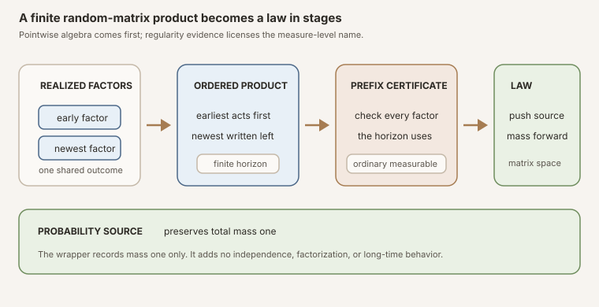


**AI-use disclosure.** Generative-AI tools helped draft, revise, illustrate,
and review this note. The author selected the questions, shaped the
exposition, has inspected the sources and artifacts cited here, and is
responsible for the final text and claims. This is an independent,
non-peer-reviewed Research Note. Verify claims against the cited primary
sources and any released artifacts before relying on them.



**Editorial status.** This teaching chapter is published as an open working
note while human
editorial acceptance and the separate scientific-integrity and zero-context
expert-reader reviews are pending. The checked Lean source is authoritative
for every theorem statement.



**Abstract.** Fix a sample space \(\Omega\), a finite coordinate type
\(\iota\), and a time-indexed family of matrix-valued maps
\(A_j:\Omega\to\operatorname{Matrix}(\iota,\iota,\mathbb C)\). RMT-11 defined
the deterministic forward product with the identity at horizon zero and the
newest factor on the left. RMT-12 evaluates that same product at each outcome,
then proves it measurable whenever every factor in the used prefix is
measurable.

The pointwise layer remains more general than probability: its scalar type is
an arbitrary semiring, and the sample space carries no measurable structure.
The measurable layer specializes to complex matrices because it reuses the
project's checked entrywise measurable-matrix multiplication theorem. Its
hypothesis is local in time: to construct the horizon-\(k\) product law, one
supplies ordinary measurability only for indices \(j\lt k\).

The law constructor deliberately carries that prefix certificate. This design
matters because Mathlib's total <code>Measure.map</code> definition returns the
zero measure when the map is not almost-everywhere measurable. A proof-free
object called a law could therefore disguise a failed regularity condition.
The checked interface instead routes through <code>RandomMatrix.law</code>
with an explicit proof. It computes the probability-source zero-step law as
the Dirac mass at the identity, identifies the one-step law with the law of
the first factor, proves total mass one for every finite horizon, and bundles
that result as a <code>ProbabilityMeasure</code>.

All statements include the empty coordinate type. The module adds no
positive-dimension assumption and no independence, stationarity,
identical-distribution, law factorization, base transformation, cocycle,
integrability, logarithmic growth, Lyapunov exponent, limit, or asymptotic
theorem.


This is the proof-to-prose companion for
<code>formalization/NonlinearDynamics/Random/MatrixProducts/MeasurableFiniteProducts.lean</code>.
It covers all twelve public declarations in source order. There are no private
declarations in the module.

The immediate predecessor,
[Ordered Finite Matrix Products in Lean](),
fixed the product convention and proved deterministic finite-time norm bounds.
The stable textbook treatment is
[Measurable Finite Random-Matrix Products and Proof-Carrying Pushforward Laws]().
Reusable definitions are available under
,
,
,
,
, and
.

## Choose a route up

| Route | Begin | Destination |
|---|---|---|
| First encounter | [One construction, three floors](#one-construction-three-floors) | Separate a sample product, its measurability, and its law |
| Time-order route | [The sample product keeps the RMT-11 convention](#the-sample-product-keeps-the-rmt-11-convention) | Check zero, successor, one-step, and shifted splitting pointwise |
| Measurability route | [Only the used prefix must be measurable](#only-the-used-prefix-must-be-measurable) | Follow the induction that builds regularity factor by factor |
| Measure-theory route | [Why a law carries its certificate](#why-a-law-carries-its-certificate) | Understand the exact <code>Measure.map</code> zero fallback |
| Probability route | [Raw mass-one evidence and the bundled wrapper](#raw-mass-one-evidence-and-the-bundled-wrapper) | Distinguish a measure, a typeclass fact, and a probability subtype |
| Boundary route | [Empty coordinate spaces remain valid](#empty-coordinate-spaces-remain-valid) | Audit dimension zero without adding <code>Nonempty</code> |
| Lean route | [The complete declaration map](#the-complete-declaration-map) | Inspect all twelve names in source order |
| Integrity route | [Strict nonclaims](#strict-nonclaims) | Block independence, factorization, cocycle, and asymptotic overreads |

### Learning objectives

By the summit, a reader should be able to:

1. distinguish a time-indexed random matrix from its finite sample product;
2. distinguish pointwise definition from ordinary measurability;
3. distinguish a measurable sample product from its pushforward law;
4. expand the zero-, one-, two-, and three-step sample products in the correct
   order;
5. state the shifted sample split with the later block on the left;
6. explain why the algebraic layer needs no measurable space;
7. explain why the measurable layer currently specializes to complex matrices;
8. read the prefix hypothesis \(\forall j\lt k\) literally;
9. prove product measurability by natural-number induction;
10. identify the constant-map and pointwise-multiplication lemmas used in that
    proof;
11. state Mathlib's exact almost-everywhere-measurable branch condition for
    <code>Measure.map</code>;
12. explain why <code>forwardProductLaw</code> requires an ordinary
    measurability certificate even though its returned value is only a
    measure;
13. compute the zero-horizon product law under a probability source;
14. identify the one-horizon product law without assuming the source is
    probabilistic;
15. distinguish <code>IsProbabilityMeasure</code> from
    <code>ProbabilityMeasure</code>;
16. explain what the probability wrapper proves and what it does not prove;
17. explain why every theorem remains meaningful for an empty coordinate type;
18. audit all twelve declarations from an import-level Lean file; and
19. state the additional hypotheses needed before any law factorization,
    cocycle, or long-time growth theorem can be attempted.

### Lineage, contribution, and boundary

Finite products of random matrices are classical objects. The asymptotic
literature studies their growth after adding hypotheses such as stationarity,
independence or ergodicity, and logarithmic integrability. Furstenberg and
Kesten's foundational paper is one historical landmark
([Furstenberg and Kesten, 1960](#ref-furstenberg-kesten)). This chapter does
not claim to formalize that theorem or to introduce the underlying
mathematics.

The local contribution is an intentionally narrow Lean bridge from a checked
deterministic product to a checked finite pushforward law. It preserves the
general semiring algebra, makes the minimum used-prefix regularity visible,
refuses to call a proof-free <code>Measure.map</code> expression a law, and
packages the mass-one conclusion without smuggling in probabilistic structure
that was never proved.

## One construction, three floors

Informal probability prose often writes one symbol for three different
objects. Lean forces the distinction, and that pressure is useful.

Fix a finite coordinate type \(\iota\). At each natural time \(j\), let
\(A_j\) assign a square matrix to an outcome \(\omega\in\Omega\). There are
three successive questions.

1. **Pointwise algebra:** for each \(\omega\), what ordered matrix product is
   obtained from the first \(k\) factors?
2. **Measurability:** is the map from \(\omega\) to that product measurable?
3. **Law:** once measurability is known, what measure results from pushing the
   source measure through that map?

The corresponding types are:

\[
\begin{aligned}
A_j &:\Omega\to\operatorname{Matrix}(\iota,\iota,\mathbb C),\\
P_A^{(k)} &:\Omega\to\operatorname{Matrix}(\iota,\iota,\mathbb C),\\
\mathcal L_\mu(P_A^{(k)})
  &:\operatorname{Measure}\bigl(\operatorname{Matrix}(\iota,\iota,\mathbb C)\bigr).
\end{aligned}
\]

The second line is still a function. The third line is a measure on the matrix
space. A proof of measurability is a proposition about the second line, not a
new matrix value and not a probability law by itself.

Figure: every outcome first produces an ordered finite product. A certificate for exactly the used factor prefix then licenses the pushforward-law interface. A probability source adds a mass-one wrapper at the end. The plate states no independence, factorization, stationarity, or long-time result.


**Vocabulary checkpoint.** In this project, <code>RandomMatrix Ω ι ι ℂ</code>
is a matrix-valued function on outcomes. The name does not itself provide a
source measure or prove measurability. Those structures arrive as separate
arguments and theorems.


## The sample product keeps the RMT-11 convention

The first declaration is <code>sampleForwardProduct</code>. It does not invent
a second multiplication convention. It evaluates each random factor at one
outcome, hands the resulting deterministic sequence to RMT-11's
<code>forwardProduct</code>, and returns the resulting matrix-valued map:

~~~lean
def sampleForwardProduct (A : ℕ → RandomMatrix Ω ι ι 𝕜) (k : ℕ) :
    RandomMatrix Ω ι ι 𝕜 :=
  fun ω => forwardProduct (fun j => A j ω) k
~~~

This definition lives in the algebraic section. Its assumptions are exactly
<code>[Fintype ι] [DecidableEq ι] [Semiring 𝕜]</code>. The outcome type
\(\Omega\) is completely arbitrary. There is no <code>MeasurableSpace Ω</code>,
no source measure, and no probability typeclass.

For a fixed outcome, write

\[
  P_A(\omega,k)
  =A_{k-1}(\omega)\cdots A_1(\omega)A_0(\omega).
\]

The first horizons are

\[
\begin{aligned}
P_A(\omega,0) &{}= I,\\
P_A(\omega,1) &{}= A_0(\omega),\\
P_A(\omega,2) &{}= A_1(\omega)A_0(\omega),\\
P_A(\omega,3) &{}= A_2(\omega)A_1(\omega)A_0(\omega).
\end{aligned}
\]

Nothing probabilistic changes the order. Each outcome sees the same
newest-factor-left recursion as the deterministic module.

### Declaration 2: the empty sample product

<code>sampleForwardProduct_zero</code> states

\[
  P_A(\omega,0)=I
\]

for every outcome. At the function level, the theorem says the zero-horizon
sample map equals the constant identity map. It is definitional equality,
proved by <code>rfl</code>, and marked <code>@[simp]</code>.

This result should not yet be called a Dirac law. There is no measure in the
algebraic section. It is only a statement about the value of a function.

### Declaration 3: prepend the newest factor

<code>sampleForwardProduct_succ</code> states

\[
  P_A(\omega,k+1)=A_k(\omega)P_A(\omega,k).
\]

It too is definitional equality. The theorem exposes the recursion at the
function level, so later induction proofs do not need to unfold two nested
definitions manually. The factor at time \(k\) is placed on the left.

### Declaration 4: one step is the first factor

<code>sampleForwardProduct_one</code> simplifies the first nonempty horizon:

\[
  P_A(\omega,1)=A_0(\omega).
\]

The proof uses function extensionality, then simplifies the underlying
deterministic product. This is the first declaration whose proof is not
literally <code>rfl</code>, even though its mathematical content is the
immediate first-step computation.

### Declaration 5: split each realized history

For an initial block of length \(m\) and a later block of length \(k\), define
the shifted random sequence by \(A^{(m)}_j=A_{m+j}\). Then
<code>sampleForwardProduct_add</code> says

\[
  P_A(\omega,m+k)
  =P_{A^{(m)}}(\omega,k)P_A(\omega,m).
\]

The theorem is pointwise. Its Lean statement is an equality of matrix-valued
functions:

~~~lean
theorem sampleForwardProduct_add
    (A : ℕ → RandomMatrix Ω ι ι 𝕜) (m k : ℕ) :
    sampleForwardProduct A (m + k) =
      fun ω => sampleForwardProduct (fun j => A (m + j)) k ω *
        sampleForwardProduct A m ω
~~~

The proof applies function extensionality and then invokes RMT-11's
<code>forwardProduct_add</code> for the deterministic sequence
\(j\mapsto A_j(\omega)\). It does not repeat the induction.

At \(m=2\) and \(k=2\), the identity reads

\[
  A_3(\omega)A_2(\omega)A_1(\omega)A_0(\omega)
  =\bigl(A_3(\omega)A_2(\omega)\bigr)
   \bigl(A_1(\omega)A_0(\omega)\bigr).
\]

The later block belongs on the left because it acts after the earlier prefix.
No factor is commuted.


**Pointwise splitting is not law factorization.** The split theorem says that
two matrices multiply for the same outcome. It does not say that the law of
the full product can be computed from two marginal laws. Those blocks are
functions of the same outcome and may be strongly dependent. A distributional
factorization would need a joint-law construction plus hypotheses such as
independence, none of which appear here.


## Only the used prefix must be measurable

The sixth declaration,
<code>measurable_sampleForwardProduct</code>, crosses from algebra into
analysis. The section adds <code>[MeasurableSpace Ω]</code>, specializes the
scalars to \(\mathbb C\), and assumes

\[
  \forall j\lt k,\qquad \operatorname{Measurable}(A_j).
\]

It concludes that the horizon-\(k\) sample product is an ordinarily measurable
map from outcomes to matrices.

### Why the hypothesis stops at the horizon

The value \(P_A(\omega,k)\) uses exactly the factors with indices
\(0,1,\ldots,k-1\). A condition on \(A_k\) would be unnecessary, and a global
condition on every future factor would make a finite-time interface harder to
reuse. The theorem therefore asks for precisely the finite prefix it consumes.

At \(k=0\), the condition is vacuous. The sample product is the constant
identity map, which is measurable regardless of every factor in the sequence.
At \(k+1\), the needed data split naturally into measurability of \(A_k\) and
measurability of the earlier product.

### The induction in mathematical form

The base case is

\[
  P_A^{(0)}(\omega)=I.
\]

A constant matrix-valued map is measurable. For the successor step, assume
\(P_A^{(k)}\) is measurable and use

\[
  P_A^{(k+1)}(\omega)=A_k(\omega)P_A^{(k)}(\omega).
\]

Finite complex matrix multiplication is measurable entrywise. Each output
entry is a finite sum of products of measurable complex coordinates. Thus the
two measurable matrix maps have a measurable pointwise product.

The Lean proof mirrors this outline:

~~~lean
theorem measurable_sampleForwardProduct
    (A : ℕ → RandomMatrix Ω ι ι ℂ)
    (k : ℕ) (hA : ∀ j < k, Measurable (A j)) :
    Measurable (sampleForwardProduct A k) := by
  induction k with
  | zero =>
      rw [sampleForwardProduct_zero]
      exact RandomMatrix.measurable_const 1
  | succ k ih =>
      rw [sampleForwardProduct_succ]
      exact RandomMatrix.measurable_mul
        (hA k (Nat.lt_succ_self k))
        (ih fun j hj => hA j (Nat.lt_succ_of_lt hj))
~~~

The two natural-number lemmas perform the prefix bookkeeping.
<code>Nat.lt_succ_self k</code> proves that the newest index belongs to the
successor prefix. <code>Nat.lt_succ_of_lt</code> embeds every earlier
\(j\lt k\) into \(j\lt k+1\), so the induction hypothesis receives exactly
what it needs.

### Why complex matrices appear here

The sample-product definition remains available over any semiring. The
measurability proof reuses the project's
<code>RandomMatrix.measurable_mul</code>, whose checked interface is currently
for complex matrices with the entrywise measurable structure. Complex
multiplication and finite summation provide the coordinate proof.

This specialization is an interface choice, not a claim that measurable
finite products make sense only over \(\mathbb C\). A future generic theorem
could weaken the scalar assumptions after a reusable measurable multiplication
interface is available. RMT-12 does not pretend that generalization has already
been checked.

### Ordinary measurability is stronger than source-relative measurability

The theorem proves <code>Measurable</code>, not only
<code>AEMeasurable</code> relative to one source measure. Ordinary
measurability works uniformly for every source measure on \(\Omega\) and feeds
the existing <code>RandomMatrix.law</code> API directly. It is stronger than
the minimum branch condition used internally by <code>Measure.map</code>, but
it is explicit, stable, and compositional.

## Why a law carries its certificate

The seventh declaration is the central design choice:

~~~lean
noncomputable def forwardProductLaw (μ : Measure Ω)
    (A : ℕ → RandomMatrix Ω ι ι ℂ)
    (k : ℕ) (hA : ∀ j < k, Measurable (A j)) :
    Measure (Matrix ι ι ℂ) :=
  RandomMatrix.law (sampleForwardProduct A k)
    (measurable_sampleForwardProduct A k hA) μ
~~~

Mathematically, the returned measure is the pushforward

\[
  \mathcal L_\mu(P_A^{(k)})
  =\mu\circ\bigl(P_A^{(k)}\bigr)^{-1}.
\]

The target is the full ambient space of square complex matrices. The source
does not require the factors or their product to be Hermitian, invertible,
unitary, positive, or normal.

### The exact Mathlib boundary

Mathlib makes <code>Measure.map</code> a total function. Its definition checks
whether the map is almost-everywhere measurable relative to the source
measure. If that branch condition holds, it constructs the pushforward using
a measurable representative. If it fails, the result is the zero measure
([Mathlib measure mapping](#ref-mathlib-map)).

That totality is convenient for theorem proving, but it creates a naming
hazard. The bare expression <code>Measure.map f μ</code> has a value even when
the regularity needed for the expected preimage formula has not been supplied.
Calling every such expression a probability law would hide the possibility
that the value came from the fallback branch.

RMT-12 avoids that hazard in two layers:

1. <code>measurable_sampleForwardProduct</code> proves ordinary measurability
   from the explicit factor-prefix evidence.
2. <code>forwardProductLaw</code> accepts that evidence and routes through
   <code>RandomMatrix.law</code>, whose own interface also requires a
   measurability proof.

The proof argument is not extra probability data stored inside the resulting
measure. Lean erases propositions computationally, and the underlying value
is still a pushforward measure. The point is API discipline: a caller cannot
obtain the object under the name <code>forwardProductLaw</code> without first
discharging the condition that makes the name honest.


**A precise nuance.** Failure of ordinary measurability does not automatically
mean that <code>Measure.map</code> takes its zero branch. A map may still be
almost-everywhere measurable for a particular source. The present interface
chooses the stronger ordinary certificate so one law constructor works
uniformly for arbitrary source measures.


## Boundary laws at horizons zero and one

The next two declarations verify that the law interface agrees with the first
two sample products. They look similar, but their assumptions differ for a
reason.

### Declaration 8: a probability source sends zero steps to a Dirac law

<code>forwardProductLaw_zero</code> assumes
<code>[IsProbabilityMeasure μ]</code> and proves

\[
  \mathcal L_\mu(P_A^{(0)})=\operatorname{dirac}(I).
\]

At horizon zero, the sample map is constant at the identity. Pushing a
probability measure through a constant map concentrates total mass one at that
constant value. The prefix evidence
<code>hA : ∀ j &lt; 0, Measurable (A j)</code> is vacuous, but remains in the
signature because the theorem simplifies the general proof-carrying law
constructor.

Why is the probability assumption visible? For an arbitrary finite source
measure of total mass \(c\), the pushforward of a constant map has total mass
\(c\), not necessarily one. Equality with the ordinary Dirac probability
measure therefore needs the source mass to be one.

### Declaration 9: one step is exactly the first factor's law

<code>forwardProductLaw_one</code> proves

\[
  \mathcal L_\mu(P_A^{(1)})=\mathcal L_\mu(A_0).
\]

No probability assumption is needed. The two sample maps are equal before any
measure is considered, so their pushforwards agree for an arbitrary source
measure. The prefix certificate gives measurability of \(A_0\) by specializing
to index zero and the fact \(0\lt1\).

The exact right side is not a proof-free <code>Measure.map</code>. It is

~~~lean
RandomMatrix.law (A 0) (hA 0 Nat.zero_lt_one) μ
~~~

so both sides remain inside the same disciplined law interface.

### What the source does not prove at horizon two

There is intentionally no theorem saying that the two-step law is a product,
convolution, or multiplication of the laws of \(A_0\) and \(A_1\). Matrix
multiplication is a measurable function of the joint pair
\((A_1,A_0)\), so a joint law could be pushed through multiplication. Marginal
laws alone do not determine that joint law. Independence would provide one
important special case, but no independence structure exists in this module.

## Raw mass-one evidence and the bundled wrapper

The final three declarations separate a property of a raw measure, a bundled
object carrying that property, and the coercion back to the raw measure.

### Declaration 10: the raw law has total mass one

<code>forwardProductLaw_isProbabilityMeasure</code> takes a raw source measure
\(\mu:\operatorname{Measure}(\Omega)\) together with the typeclass assumption
<code>[IsProbabilityMeasure μ]</code>. It proves

~~~lean
IsProbabilityMeasure (forwardProductLaw μ A k hA)
~~~

for every finite horizon and every certified prefix.

The proof delegates to <code>RandomMatrix.law_isProbabilityMeasure</code> with
the already established product measurability. Conceptually, the preimage of
the whole matrix space is the whole sample space, so pushforward preserves
total mass. The theorem says exactly that the law assigns mass one to its
universe.

<code>IsProbabilityMeasure ν</code> is a proposition attached to a raw
measure \(\nu\). It does not change the type of \(\nu\), produce a density,
or add independence or moment fields.

### Declaration 11: package the law as a probability subtype

<code>forwardProductProbabilityLaw</code> starts with a bundled source
<code>μ : ProbabilityMeasure Ω</code> and returns

~~~lean
ProbabilityMeasure (Matrix ι ι ℂ)
~~~

Mathlib defines <code>ProbabilityMeasure X</code> as the subtype of raw
measures on \(X\) satisfying <code>IsProbabilityMeasure</code>
([Mathlib probability measures](#ref-mathlib-probability)). The constructor
therefore packages two fields:

1. the raw value <code>forwardProductLaw (μ : Measure Ω) A k hA</code>; and
2. the mass-one proof from
   <code>forwardProductLaw_isProbabilityMeasure</code>.

This wrapper is useful downstream because any consumer that requests a
probability measure receives the invariant automatically. It prevents each
later theorem from carrying a separate source-law mass calculation.

### Declaration 12: forgetting the wrapper changes nothing

<code>coe_forwardProductProbabilityLaw</code> proves that coercing the bundled
law back to a raw measure recovers <code>forwardProductLaw</code> exactly. The
theorem is marked <code>@[simp]</code> and proved by <code>rfl</code>:

\[
  \bigl(\operatorname{forwardProductProbabilityLaw}(\mu,A,k,h_A)
    :\operatorname{Measure}\bigr)
  =\operatorname{forwardProductLaw}(\mu,A,k,h_A).
\]

The wrapper is thus a proof-bearing view of the same measure, not a
renormalization or a second distribution.


**Mass one is the whole conclusion.** A <code>ProbabilityMeasure</code> value
does not assert absolute continuity, a density, finite moments, support in an
invertible group, independence of time blocks, stationarity, or any asymptotic
property. It records a raw measure together with a proof that its total mass
is one.


## Empty coordinate spaces remain valid

Unlike RMT-11's normalized matrix-norm bounds, RMT-12 has no
<code>[Nonempty ι]</code> assumption. Every declaration permits an empty
finite coordinate type.

There is exactly one matrix indexed by an empty row and column type, because
there are no entries at which two matrices could differ. Its identity and
zero presentations are extensionally equal. Matrix multiplication is still a
total operation, the sample product is still a function, and the entrywise
measurability proof has no coordinates to check.

At horizon zero under a probability source, the law is
\(\operatorname{dirac}(I)\). In empty dimension that is simply the Dirac mass
at the unique empty matrix. The statement is neither exceptional nor
degenerate at the measure level. It is the ordinary law of a constant map into
a one-point target.

The absence of <code>Nonempty</code> is therefore deliberate. Positive
dimension was necessary in RMT-11 only for the selected operator norm's
normalized identity instance. No such norm appears in the measurable or law
layer.

## The complete declaration map

The module exports exactly twelve public declarations and no private helper.
The table follows source order.

| Declaration | Assumption floor | Exact role | Proof engine |
|---|---|---|---|
| <code>sampleForwardProduct</code> | <code>Fintype ι</code>, <code>DecidableEq ι</code>, <code>Semiring 𝕜</code> | Evaluates the deterministic forward product outcome by outcome | Definition through <code>forwardProduct</code> |
| <code>sampleForwardProduct_zero</code> | Same algebraic floor | Identifies the empty sample product with the constant identity map | Definitional equality |
| <code>sampleForwardProduct_succ</code> | Same algebraic floor | Prepends the newest realized factor | Definitional equality |
| <code>sampleForwardProduct_one</code> | Same algebraic floor | Identifies the one-step product map with <code>A 0</code> | Function extensionality and simplification |
| <code>sampleForwardProduct_add</code> | Same algebraic floor | Splits each realized product with the shifted later block on the left | Function extensionality and deterministic <code>forwardProduct_add</code> |
| <code>measurable_sampleForwardProduct</code> | Adds <code>MeasurableSpace Ω</code>, fixes scalars to <code>ℂ</code>, assumes <code>∀ j &lt; k, Measurable (A j)</code> | Proves ordinary measurability of exactly the used finite product | Induction, measurable constant, and measurable pointwise matrix multiplication |
| <code>forwardProductLaw</code> | Same measurable floor plus a raw source measure | Defines the proof-carrying pushforward law | <code>RandomMatrix.law</code> applied to the preceding certificate |
| <code>forwardProductLaw_zero</code> | Adds <code>IsProbabilityMeasure μ</code>; zero-prefix evidence is vacuous | Computes the zero-step law as the Dirac mass at the identity | Simplification of the law of a constant under a probability source |
| <code>forwardProductLaw_one</code> | Measurable first factor; arbitrary raw source measure | Identifies the one-step product law with the law of <code>A 0</code> | Simplification and prefix specialization |
| <code>forwardProductLaw_isProbabilityMeasure</code> | Probability raw source plus certified prefix | Proves the raw product law has total mass one | Existing probability-pushforward theorem |
| <code>forwardProductProbabilityLaw</code> | Bundled probability source plus certified prefix | Packages the raw law and its mass-one proof as a probability measure | Subtype constructor |
| <code>coe_forwardProductProbabilityLaw</code> | Same as the bundled constructor | Recovers the raw law after coercion | Definitional equality |

Every declaration also carries the shared finite square-matrix assumptions
<code>[Fintype ι] [DecidableEq ι]</code>. None carries
<code>[Nonempty ι]</code>.

## Lean proof engineering

### Why the algebraic section is separated

It would be easy to define <code>sampleForwardProduct</code> only for complex
matrices on a measurable sample space, because that is the immediate random
application. Doing so would conflate a value-level construction with a
regularity theorem. The source instead keeps the first five declarations in a
section requiring only <code>Semiring 𝕜</code>.

That split pays off in three ways. First, nonmeasurable examples can still use
the algebra. Second, future real-valued random products reuse the pointwise
theorems even before their measurable interface is generalized. Third, any
downstream proof reveals the moment it crosses from algebra into measure
theory because the assumptions visibly change.

### Why the law constructor repeats the prefix hypothesis

Lean proofs are not fields that can be recovered automatically from arbitrary
functions. The type

~~~lean
∀ j < k, Measurable (A j)
~~~

is the reusable evidence from which product measurability is derived. Carrying
it directly in <code>forwardProductLaw</code> makes the dependency inspectable
at every call site. A bundled measurable process could hide the evidence in a
structure, but this milestone has not introduced such a process type.

The proof argument also keeps the law local in time. A structure demanding
measurability of every factor would be convenient for infinite processes but
strictly stronger than the finite theorem needs. The present function accepts
both globally measurable sequences and partial sequences whose first \(k\)
factors alone have been certified.

### Why <code>noncomputable</code> appears

Both law constructors are marked <code>noncomputable</code>. Mathlib's measure
mapping operation uses classical choice to select a measurable representative
in its almost-everywhere-measurable branch. The declarations are mathematical
objects for proof and integration, not algorithms that sample matrices or
numerically approximate distributions.

The marker does not weaken the theorem, add an axiom local to this project, or
mean the sample product itself is noncomputable. The pointwise product remains
an ordinary definition over a semiring. Noncomputability begins at the
measure-valued interface.

### Why the zero-law theorem keeps an impossible prefix argument

No natural number satisfies \(j\lt0\), so the evidence required at horizon
zero can be produced by eliminating that impossible inequality. It may seem
cleaner to define a separate zero law with no certificate. That would fracture
the API. Keeping the general argument lets simplification reduce the same
<code>forwardProductLaw</code> object at every horizon.

This is a recurring Lean design pattern: a uniform indexed definition can
have a vacuous boundary hypothesis, while a boundary theorem explains that
the hypothesis contributes no mathematical content there.

### Why the one-law theorem does not use a map-composition theorem

At one step, <code>sampleForwardProduct A 1 = A 0</code> is already an equality
of functions. Simplification can rewrite the map itself before reasoning about
pushforwards. There is no need to construct an identity measurable map on the
matrix target or invoke a general composition theorem.

This shorter proof is also the stronger diagnostic. If the one-step law failed
to simplify, the likely defect would be in the product convention or its simp
lemmas, not in measure theory.

### Why the probability theorem is separate from the wrapper

Some downstream Mathlib lemmas consume a raw
<code>Measure (Matrix ι ι ℂ)</code> together with a typeclass instance. Others
take a bundled <code>ProbabilityMeasure</code>. Exporting both interfaces avoids
forcing every consumer through coercion gymnastics.

The raw theorem is the mathematical fact. The bundled definition is a data
packaging decision. The coercion theorem then promises that moving between
the two presentations does not change the underlying measure.

## Reading the law as a pushforward, not as an expectation

A law tells how source mass is redistributed across the matrix space. For a
measurable set \(S\) of matrices, the intended evaluation is

\[
  \mathcal L_\mu(P_A^{(k)})(S)
  =\mu\bigl(\{\omega\mid P_A(\omega,k)\in S\}\bigr).
\]

This equation is about event probabilities or masses. It is not an expected
matrix. Matrix-valued expectation would require integrability in a suitable
normed space and a Bochner integral. Expected norm growth would require
integrability of a real observable. Expected logarithmic growth would
additionally require a convention at zero and integrability of a logarithm.
RMT-12 proves none of those bridges.

Likewise, the product law does not store the source outcome, the individual
factors, or their joint history. A pushforward forgets distinctions between
outcomes that produce the same product. This is exactly what a law should do,
but it means the law alone cannot reconstruct timewise dependence.

### A deterministic sequence as a boundary example

Suppose every \(A_j\) is constant as a function of \(\omega\). Then every
factor is measurable and the sample product is constant. Under a probability
source, its law is a Dirac measure at the corresponding deterministic forward
product. RMT-12 explicitly proves only the zero-step instance of this pattern.

The general constant-sequence Dirac theorem is a short consequence of the
existing law-of-Dirac or map-of-constant infrastructure, but it is not a named
declaration in this module. It should not be added to the declaration count or
reported as an exported theorem.

### A dependent sequence as the default example

Let all factors be functions of the same outcome, perhaps even
\(A_j(\omega)=B(\omega)\) for every time. The finite product law still exists
when \(B\) is measurable. Nothing in the construction treats the repeated
factors as independent copies. They are perfectly coupled because they are
the same random variable.

This example explains why measurability is enough for the present law but not
for a product-of-marginals formula. The interface correctly supports dependent
and independent sequences alike while asserting neither relation.

## How to run the checked source

Compile the module directly with every warning promoted to an error:

~~~sh
source "$HOME/.elan/env"
cd formalization
lake env lean -DwarningAsError=true \
  NonlinearDynamics/Random/MatrixProducts/MeasurableFiniteProducts.lean
~~~

Build the complete Lean library:

~~~sh
source "$HOME/.elan/env"
cd formalization
lake build
~~~

From the repository root, check the public teaching content:

~~~sh
make content-hygiene
make site-check
~~~

This import-level snippet checks all twelve public declarations in source
order:

~~~lean
import NonlinearDynamics.Random.MatrixProducts.MeasurableFiniteProducts

open NonlinearDynamics.Random.MatrixProducts

#check sampleForwardProduct
#check sampleForwardProduct_zero
#check sampleForwardProduct_succ
#check sampleForwardProduct_one
#check sampleForwardProduct_add
#check measurable_sampleForwardProduct
#check forwardProductLaw
#check forwardProductLaw_zero
#check forwardProductLaw_one
#check forwardProductLaw_isProbabilityMeasure
#check forwardProductProbabilityLaw
#check coe_forwardProductProbabilityLaw
~~~

Save the snippet inside <code>formalization</code> and run
<code>lake env lean path/to/Scratch.lean</code>.

Useful local Mathlib reconnaissance:

~~~sh
rg -n "irreducible_def map|map_apply|isProbabilityMeasure_map" \
  .lake/packages/mathlib/Mathlib/MeasureTheory/Measure

rg -n "def ProbabilityMeasure|instance.*IsProbabilityMeasure|coe_mk" \
  .lake/packages/mathlib/Mathlib/MeasureTheory/Measure/ProbabilityMeasure.lean

rg -n "measurable_const|measurable_mul|def law|law_isProbabilityMeasure" \
  NonlinearDynamics/Random/RandomMatrices
~~~

Run those searches from <code>formalization</code>. The pinned local
[Mathlib 4.32.0 release](#ref-mathlib-release) checkout is the exact API
authority. Online documentation helps navigation, but only the selected source
and compiler determine what this project proves.

## Common failure modes

### Reversing time while lifting to samples

The correct definition evaluates the deterministic
<code>forwardProduct</code> at each outcome. Reimplementing the recursion as
right multiplication would silently switch conventions. Expand the
three-horizon product and verify that \(A_0(\omega)\) acts first on a column
vector.

### Requiring measurability of the whole infinite sequence

The theorem needs only \(A_j\) for \(j\lt k\). A global hypothesis is a valid
way to discharge the prefix condition, but it is not an assumption of the
exported declaration. Reporting it as necessary would overstate the result.

### Forgetting that <code>RandomMatrix</code> is only a function alias

The type name does not imply measurability and does not include a source
probability measure. Treating the input as already bundled would erase the
very distinction this module formalizes.

### Naming a bare map expression a law

Writing <code>Measure.map (sampleForwardProduct A k) μ</code> requires no proof
argument at the call site. Mathlib can therefore return its fallback value if
the map is not almost-everywhere measurable. Use
<code>forwardProductLaw</code> when the semantic intent is a certified law.

### Saying the fallback triggers whenever ordinary measurability is absent

The internal branch tests almost-everywhere measurability relative to
\(\mu\), not ordinary measurability. The module's prefix theorem gives a
stronger sufficient condition. These claims must not be collapsed.

### Dropping the probability assumption from the zero-law theorem

The pushforward of a constant map preserves the source's total mass. It is the
standard Dirac probability measure only when that mass is one. For an
arbitrary raw measure, a scaled Dirac description would be needed.

### Adding a probability assumption to the one-law theorem

The one-step identity is functorial at the level of arbitrary measures. It
comes from equality of sample maps and does not need total mass one.

### Treating sample splitting as independence

The earlier and later blocks are evaluated at the same \(\omega\). The split
is an algebraic equality inside each fiber, not a statement about their joint
distribution.

### Treating the wrapper as normalization

<code>forwardProductProbabilityLaw</code> does not divide a finite measure by
its mass. The source is already a probability measure, and pushforward has
already been proved mass preserving. The wrapper merely records that proof.

### Importing RMT-11's positive-dimension assumption

No norm is used here. Empty matrices form a one-point target, and all
measurability and law statements remain valid. Adding <code>Nonempty ι</code>
would be unnecessary restriction.

### Calling the finite law a stochastic process theorem

The module constructs a law separately at each finite horizon. It does not
construct a measure on path space, prove consistency of finite-dimensional
distributions, or invoke an extension theorem. A family of finite laws is not
automatically a process-level law.

## Strict nonclaims

This module formalizes certified finite-time pushforward laws. It does not
define or prove:

- independence, pairwise independence, conditional independence, or any
  factorization of joint or marginal laws;
- identical distribution, stationarity, exchangeability, mixing, or
  ergodicity of the factor sequence;
- a product measure for the factor history or a canonical independent source;
- a convolution or multiplication operation on matrix laws;
- a base dynamical system, measurable shift, skew product, or cocycle equation;
- invertibility of any factor, group-valued support, negative time, or a
  two-sided product;
- Hermiticity, normality, unitarity, positivity, symplecticity, or determinant
  constraints on factors or products;
- a path-space random process or consistency theorem for all horizons;
- integrability of a matrix, matrix norm, logarithmic norm, trace, determinant,
  singular value, or spectral observable;
- an expectation, variance, covariance, concentration inequality, tail bound,
  or large-deviation estimate;
- an expected product formula or equality between the product of expectations
  and the expectation of a product;
- a density, support characterization, absolute continuity statement, or
  regular conditional distribution;
- a finite-time norm estimate beyond those already proved in the deterministic
  RMT-11 module;
- a lower growth bound, sharpness statement, or stability conclusion;
- a logarithmic growth rate, Lyapunov exponent, Oseledets splitting,
  Furstenberg-Kesten limit, subadditive limit, or multiplicative ergodic
  theorem; or
- any limit as time or matrix dimension tends to infinity.

The word "random" describes dependence on an outcome. The word "law"
describes a certified pushforward measure. Neither word supplies the missing
dependence, integrability, dynamical, or asymptotic hypotheses.

## Exercises with solutions

### Exercise 1: expand a sample product

Write <code>sampleForwardProduct A 3 ω</code> without the helper definition.

**Solution.**
\[
  A_2(\omega)A_1(\omega)A_0(\omega).
\]
The newest realized factor is on the left.

### Exercise 2: inspect the zero prefix

What factor measurability must be proved to use
<code>measurable_sampleForwardProduct A 0</code>?

**Solution.** None. The hypothesis asks for every \(j\lt0\), and there is no
such natural number. The product map is constant at the identity.

### Exercise 3: inspect the successor prefix

Suppose measurability is known for every \(j\lt k+1\). Which two pieces feed
the successor multiplication theorem?

**Solution.** Specializing at \(j=k\) proves measurability of the newest
factor. Restricting the same hypothesis along \(j\lt k\Rightarrow j\lt k+1\)
feeds the induction hypothesis for the earlier product.

### Exercise 4: test the sample split

Expand <code>sampleForwardProduct_add A 1 2</code> at an outcome \(\omega\).

**Solution.**
\[
  A_2(\omega)A_1(\omega)A_0(\omega)
  =\bigl(A_2(\omega)A_1(\omega)\bigr)A_0(\omega).
\]
The shifted two-step block starts at time one and stays on the left.

### Exercise 5: locate the proof boundary

Does <code>forwardProductLaw</code> accept only a proof that the final product
map is measurable?

**Solution.** Its public argument is the stronger structured certificate that
every used factor \(A_j\), for \(j\lt k\), is measurable. The constructor then
derives product measurability with
<code>measurable_sampleForwardProduct</code>. A caller does not pass an
unrelated direct proof of the final map.

### Exercise 6: distinguish two notions of measurability

Could a map fail ordinary measurability but still avoid the zero fallback of
<code>Measure.map</code> for one source measure?

**Solution.** Yes. The branch condition is almost-everywhere measurability
relative to that source. The RMT-12 interface uses ordinary measurability as a
stronger condition that works for every source measure.

### Exercise 7: change the source mass

If a constant sample product is pushed forward from a source measure of mass
five, is the result the ordinary Dirac probability measure?

**Solution.** No. Pushforward preserves total mass, so the target measure also
has mass five. This is why <code>forwardProductLaw_zero</code> assumes a
probability source before concluding equality with <code>Measure.dirac 1</code>.

### Exercise 8: read the one-step theorem

Why can <code>forwardProductLaw_one</code> use an arbitrary raw measure?

**Solution.** The one-step sample map equals \(A_0\) as a function. Equal
functions have equal pushforwards under any source measure. Total mass plays no
role.

### Exercise 9: unpack the wrapper

What extra mathematical datum distinguishes
<code>forwardProductProbabilityLaw μ A k hA</code> from its coerced raw
measure?

**Solution.** A proof that the raw measure has total mass one. The underlying
measure is definitionally the same, as
<code>coe_forwardProductProbabilityLaw</code> records.

### Exercise 10: audit empty dimension

What is the target of the zero-step law when \(\iota\) is empty?

**Solution.** The target matrix type has one element. The identity matrix is
that unique element, so the law is its Dirac mass. No positive-dimension
hypothesis is needed.

### Exercise 11: reject a factorization

Suppose \(A_0(\omega)=A_1(\omega)\). Can the two-step product law be computed
from two independent copies of the one-step law?

**Solution.** Not for this sequence. The two factors are perfectly dependent,
not independent copies. Their marginal laws do not encode that coupling.

### Exercise 12: identify the next missing observable

Does a probability law for \(P_A^{(k)}\) make
\(\log\lVert P_A^{(k)}\rVert\) integrable?

**Solution.** No. One must first choose a norm and a convention when the norm
vanishes, prove measurability of the resulting extended or real-valued
observable, and establish an integrability hypothesis. Total mass one alone
does none of this.

## The next ridge

RMT-12 supplies a measurable finite product and an honest law at every finite
horizon. That interface can support a later module that bundles a measurable
matrix sequence, relates a time shift on outcomes to a shift of factor
indices, and proves a finite cocycle equation from
<code>sampleForwardProduct_add</code>.

The dependency order still matters. A random cocycle needs a specified base
transformation and an equivariance law. A Lyapunov-growth interface needs a
chosen norm, zero handling for logarithms, and integrability. An asymptotic
theorem additionally needs stationarity or measure preservation and an
appropriate subadditive or multiplicative ergodic result. Independence may be
useful for other random-product theorems, but it should be introduced only
where a checked result actually consumes it.

Nothing in the present probability wrapper shortcuts those steps. It gives the
next module a sound finite law to consume, not a long-time theorem in disguise.

The immediate successor,
[One-Sided Discrete Matrix Cocycles in Lean](),
uses one base map and one measurable matrix generator to produce the factor
sequence. It proves the exact later-block-left cocycle identity, bundles a
measure-preserving base, and shows that every finite value is measurable while
every natural base iterate preserves the same raw measure. It adds no
ergodicity, independence, invertibility, logarithmic growth, or asymptotic
claim.

## References

The links below were checked on 2026-07-21. The pinned local Mathlib 4.32.0
checkout remains the exact API authority for the Lean proof.

**Mathlib contributors.**
[Mathlib 4.32.0 release](https://github.com/leanprover-community/mathlib4/releases/tag/v4.32.0),
2026. This is the dependency release selected by
<code>formalization/lakefile.toml</code>.

**Mathlib contributors.**
[Mapping a measure](https://leanprover-community.github.io/mathlib4_docs/Mathlib/MeasureTheory/Measure/Map.html),
Mathlib 4 documentation. This official page documents
<code>Measure.map</code>, its almost-everywhere-measurable branch, the zero
fallback, measurable-set evaluation, composition, and preservation of
probability mass.

**Mathlib contributors.**
[Bundled probability measures](https://leanprover-community.github.io/mathlib4_docs/Mathlib/MeasureTheory/Measure/ProbabilityMeasure.html),
Mathlib 4 documentation. This official page defines
<code>ProbabilityMeasure</code> as a subtype of measures satisfying
<code>IsProbabilityMeasure</code> and provides the coercion back to raw
measures.

**Harry Furstenberg and Harry Kesten.**
["Products of Random Matrices"](https://doi.org/10.1214/aoms/1177705909),
*The Annals of Mathematical Statistics* 31(2), 457-469, 1960. This original
paper is cited only as historical context for the later random-product and
asymptotic program. RMT-12 proves no theorem from it.
