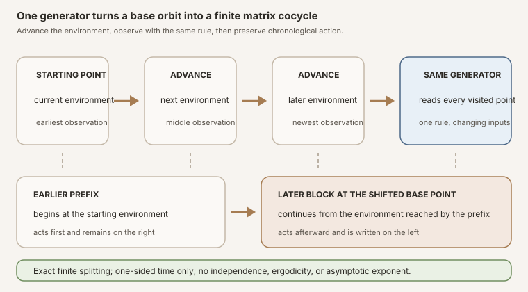


**AI-use disclosure.** Generative-AI tools helped draft, revise, illustrate,
and review this note. The author selected the questions, shaped the
exposition, has inspected the sources and artifacts cited here, and is
responsible for the final text and claims. This is an independent,
non-peer-reviewed Research Note. Verify claims against the cited primary
sources and any released artifacts before relying on them.



**Editorial status.** This teaching chapter is published as an open working
note while human
editorial acceptance and the separate scientific-integrity and zero-context
expert-reader reviews are pending. The checked Lean source is authoritative
for every theorem statement.



**Abstract.** Let \(T:\Omega\to\Omega\) advance an environment and let
\(A:\Omega\to\operatorname{Matrix}(\iota,\iota,\mathbb K)\) observe one
matrix at the current environment. At time \(j\), the observed factor is
\(A(T^j\omega)\). RMT-13 forms the finite newest-factor-left product of those
observations and proves the generator-presented cocycle identity

\[
  \Phi(m+k,\omega)
  =\Phi(k,T^m\omega)\Phi(m,\omega).
\]

The later block starts from the base point reached after \(m\) steps and is
written on the left because it acts later. The identity is pointwise and needs
only a semiring of scalars. No commutativity, topology, measure, probability,
or invertibility is used in the algebraic layer.

The measurable layer specializes to complex matrices. Ordinary measurability
of \(T\) and \(A\) makes every orbit observation measurable, then RMT-12's
prefix theorem makes every finite product measurable. The structure
<code>DiscreteMatrixCocycle</code> packages a raw measure, a base that
preserves that measure, and a measurable generator. Its finite values inherit
zero, one, successor, addition, and measurability laws, while every natural
iterate of the base remains measure preserving.

The presentation is deliberately one-sided and generator based. It includes
natural times only, stores no inverse, and derives values rather than accepting
an arbitrary cocycle-valued function. It asserts no probability normalization,
ergodicity, mixing, independence, identical distribution, skew-product
invariance, law factorization, norm or log-norm integrability, Lyapunov
exponent, Oseledets splitting, asymptotic limit, or random-Jacobian bridge.


This is the proof-to-prose companion for
<code>formalization/NonlinearDynamics/Random/RandomCocycles/Discrete.lean</code>.
It covers all sixteen public declarations in source order. There are no private
declarations in the module.

The immediate predecessor,
[Measurable Finite Matrix Products in Lean](),
separated pointwise products, ordinary measurability, and proof-carrying
pushforward laws. RMT-13 consumes its first two floors. Existing glossary
foundations include
,
,
,
, and
.
The parallel textbook treatment is
[Generator-Presented One-Sided Discrete Matrix Cocycles]().

## Choose a route up

| Route | Begin | Destination |
|---|---|---|
| First encounter | [One generator creates a time sequence](#one-generator-creates-a-time-sequence) | See how a base orbit turns one observation rule into changing matrices |
| Convention route | [The first four cocycle values](#the-first-four-cocycle-values) | Audit natural iterates and newest-factor-left multiplication |
| Algebra route | [The exact later-block-left identity](#the-exact-later-block-left-identity) | Split time without reversing the base shift or matrix order |
| Measurability route | [Measurability climbs through the orbit](#measurability-climbs-through-the-orbit) | Compose the generator with base iterates and reuse finite-product closure |
| Bundling route | [What the cocycle structure actually stores](#what-the-cocycle-structure-actually-stores) | Separate stored generator data from derived cocycle values |
| Measure route | [Every base iterate preserves the measure](#every-base-iterate-preserves-the-measure) | Read <code>MeasurePreserving</code> without assuming probability or ergodicity |
| Boundary route | [Empty matrix dimension remains valid](#empty-matrix-dimension-remains-valid) | Understand why no <code>Nonempty</code> hypothesis appears |
| Lean route | [The complete declaration map](#the-complete-declaration-map) | Inspect all sixteen declarations in source order |
| Integrity route | [Strict nonclaims](#strict-nonclaims) | Separate finite cocycle algebra from stochastic and asymptotic theory |

### Learning objectives

By the summit, a reader should be able to:

1. distinguish a base map from a matrix generator;
2. state Mathlib's natural-number iterate convention at times zero and one;
3. explain how one generator produces a time-indexed orbit matrix sequence;
4. expand the first four finite cocycle values without reversing a factor;
5. explain why the newest observation is written on the left;
6. state the exact cocycle identity at times \(m\) and \(k\);
7. explain why the later block is evaluated at \(T^m\omega\);
8. audit the identity at both zero-length boundaries;
9. distinguish the assumption-free orbit observation from the finite-semiring
   product floor used by declarations two through six;
10. prove measurability of each observed factor by composition;
11. prove measurability of every finite cocycle value by the RMT-12 prefix
    theorem;
12. list all four fields stored by <code>DiscreteMatrixCocycle</code>;
13. explain why the structure is generator presented rather than an arbitrary
    cocycle-law bundle;
14. distinguish measure preservation from probability normalization;
15. distinguish measure preservation from ergodicity, mixing, and
    invertibility;
16. derive the structure's zero, one, successor, and addition laws;
17. derive ordinary measurability of every bundled value;
18. explain why every base iterate preserves the same measure;
19. explain why the matrix index type is irrelevant to the base-iterate
    theorem;
20. interpret the complete interface in empty matrix dimension; and
21. identify every hypothesis still missing before logarithmic growth or a
    multiplicative ergodic theorem.

### Lineage, contribution, and boundary

Matrix cocycles are standard in random dynamical systems, derivative dynamics,
and products of random matrices. Classical asymptotic work adds measure-theory
and integrability hypotheses to study growth, with Furstenberg and Kesten's
random-product paper as one early landmark
([Furstenberg and Kesten, 1960](#ref-furstenberg-kesten)). This chapter does
not claim to invent cocycles or to formalize that asymptotic theorem.

The local contribution is a small generator-presented Lean interface whose
time and multiplication conventions are frozen and testable. It derives the
cocycle identity directly from base iteration, separates algebra from
measurability, and packages precisely a measure-preserving base plus a
measurable complex matrix generator. The result is finite-time infrastructure,
not an ergodic conclusion.

## One generator creates a time sequence

Begin with two functions on the same environment space \(\Omega\):

\[
  T:\Omega\to\Omega,
  \qquad
  A:\Omega\to\operatorname{Matrix}(\iota,\iota,\mathbb K).
\]

The base map \(T\) advances the environment. The generator \(A\) reads a
matrix from whichever environment point it receives. Starting from
\(\omega\), the forward base orbit is

\[
  \omega,\quad T\omega,\quad T^2\omega,\quad T^3\omega,\quad\ldots
\]

and the corresponding matrix observations are

\[
  A(\omega),\quad A(T\omega),\quad A(T^2\omega),\quad
  A(T^3\omega),\quad\ldots
\]

This is different from supplying an arbitrary time-indexed sequence
\(A_0,A_1,A_2,\ldots\). Every time slice is generated by the same observation
rule after advancing the same base dynamics.

Figure: the base advances the environment, while one reusable generator observes a matrix at each visited point. The finite value multiplies later observations on the left, so a time split evaluates the later block at the shifted base point. The plate asserts no inverse time, ergodicity, independence, or asymptotic exponent.

### Declaration 1: <code>orbitMatrixSequence</code>

The source encodes the observation sequence as

~~~lean
def orbitMatrixSequence (T : Ω → Ω)
    (A : RandomMatrix Ω ι ι 𝕜) :
    ℕ → RandomMatrix Ω ι ι 𝕜 :=
  fun j ω => A (T^[j] ω)
~~~

Mathlib writes the \(j\)-fold iterate as <code>T^[j]</code>. Its base cases
are

\[
  T^0\omega=\omega,
  \qquad
  T^1\omega=T\omega.
\]

The output at each \(j\) is still a matrix-valued function on \(\Omega\).
No measure or measurability proof is involved in this definition.

### Declaration 2: <code>cocycleProduct</code>

The second definition hands that sequence to RMT-12's pointwise finite product:

~~~lean
def cocycleProduct (T : Ω → Ω)
    (A : RandomMatrix Ω ι ι 𝕜) (k : ℕ) :
    RandomMatrix Ω ι ι 𝕜 :=
  MatrixProducts.sampleForwardProduct (orbitMatrixSequence T A) k
~~~

Write its value as \(\Phi_{T,A}(k,\omega)\). Then

\[
  \Phi_{T,A}(k,\omega)
  =A(T^{k-1}\omega)\cdots A(T\omega)A(\omega).
\]

The definition does not store a separate sequence of matrices. It regenerates
each factor from \(T\), \(A\), the time index, and the initial environment.

## The first four cocycle values

Unfolding the definitions gives

\[
\begin{aligned}
\Phi(0,\omega) &{}=I,\\
\Phi(1,\omega) &{}=A(\omega),\\
\Phi(2,\omega) &{}=A(T\omega)A(\omega),\\
\Phi(3,\omega) &{}=A(T^2\omega)A(T\omega)A(\omega).
\end{aligned}
\]

The orbit moves forward from left to right in the list of observations. Matrix
action is read from right to left, so the earliest observation sits nearest a
column vector and the newest observation is written on the left.

### Declaration 3: zero time

<code>cocycleProduct_zero</code> says the time-zero value is the constant
identity map. The proof is <code>rfl</code> because both the orbit sequence and
sample-product conventions have identity at the empty horizon.

### Declaration 4: one more observation

<code>cocycleProduct_succ</code> exposes the recursion

\[
  \Phi(k+1,\omega)
  =A(T^k\omega)\Phi(k,\omega).
\]

The factor at the newly visited base point is prepended. This theorem is also
definitional equality and marked <code>@[simp]</code>.

### Declaration 5: one step

<code>cocycleProduct_one</code> proves equality of matrix-valued functions:

\[
  \Phi(1,\cdot)=A.
\]

At one step, the iterate has exponent zero, so the generator is evaluated at
the original environment. The Lean proof uses function extensionality and
simplification of <code>cocycleProduct</code> and
<code>orbitMatrixSequence</code>.


**Iterate notation trap.** The exponent on \(T\) counts applications of the
base map. It is not a matrix power and it is not a probability-law exponent.
At factor time \(j\), Lean evaluates the generator at <code>T^[j] ω</code>.


## The exact later-block-left identity

Declaration 6, <code>cocycleProduct_add</code>, is the algebraic summit of the
module. Split a total horizon after \(m\) steps, then run for another \(k\)
steps. The theorem is

\[
  \Phi(m+k,\omega)
  =\Phi(k,T^m\omega)\Phi(m,\omega).
\]

The earlier block \(\Phi(m,\omega)\) acts first and remains on the right. The
later block begins from the environment reached after those \(m\) steps, so it
is \(\Phi(k,T^m\omega)\), and it acts afterward from the left.

For \(m=2\) and \(k=3\), the equality expands to

\[
\begin{aligned}
&A(T^4\omega)A(T^3\omega)A(T^2\omega)
 A(T\omega)A(\omega)\\
&\qquad{}=
\bigl(A(T^4\omega)A(T^3\omega)A(T^2\omega)\bigr)
\bigl(A(T\omega)A(\omega)\bigr).
\end{aligned}
\]

This concrete audit checks both moving pieces. The shifted later block starts
at \(T^2\omega\), and that entire block is on the left.

### Both boundary cases

If \(k=0\), the later block is the identity at \(T^m\omega\):

\[
  \Phi(m+0,\omega)=I\Phi(m,\omega).
\]

If \(m=0\), the base shift is the identity and the earlier block is the
identity matrix:

\[
  \Phi(0+k,\omega)=\Phi(k,\omega)I.
\]

Neither boundary needs a separate convention.

### The proof architecture

The Lean theorem is pointwise in \(\omega\) and inducts on the later length
\(k\). At zero, simplification closes the identity. At a successor, the proof
unfolds both successor products and uses the induction hypothesis. The only
nontrivial base-orbit bookkeeping is

\[
  T^{m+k}\omega=T^k(T^m\omega).
\]

Mathlib's <code>Function.iterate_add_apply</code> presents the iterate sum in
one order. The proof first commutes the natural-number addition indices, then
applies that theorem. Finally, matrix associativity aligns the newly prepended
factor with the product of the later and earlier blocks.

No matrix factors commute. The use of <code>Nat.add_comm</code> rearranges time
indices in an iterate identity, not matrix multiplication.


**The cocycle identity is not a law factorization.** Both blocks are evaluated
from the same initial outcome and the same base orbit. The equality is
pointwise matrix algebra. It gives no independence and no formula that
reconstructs the full product distribution from two marginal laws.


## The algebraic assumption floor

The first declaration, <code>orbitMatrixSequence</code>, uses no typeclass
assumption at all. It only composes the generator with a natural iterate of the
base map; at this point a matrix is simply an indexed function of two
coordinates.

Declarations two through six add
<code>[Fintype ι] [DecidableEq ι] [Semiring 𝕜]</code>. The finite coordinate
type and decidable equality support square matrix identity and multiplication.
The scalar semiring supplies addition, multiplication, and one.

There is no measurable space on \(\Omega\), no topology, no norm, no field
division, and no measure. The base map need not be injective, surjective,
continuous, or invertible. At this floor, it is simply a function used to
generate a forward orbit.

The separation matters. The cocycle identity is a consequence of function
iteration and associativity. It should not inherit probability or analytic
hypotheses merely because later applications will use them.

## Measurability climbs through the orbit

The second section adds <code>[MeasurableSpace Ω]</code> and fixes the matrix
scalars to \(\mathbb C\). Its two unbundled theorems build measurability in the
same order as the definitions.

### Declaration 7: every orbit observation is measurable

<code>measurable_orbitMatrixSequence</code> assumes ordinary measurability of
the base \(T\) and generator \(A\). For every natural \(j\), it proves

\[
  \omega\longmapsto A(T^j\omega)
\]

is measurable. The proof is a one-line composition:

~~~lean
hA.comp (hT.iterate j)
~~~

Mathlib proves that every finite iterate of a measurable self-map is
measurable. Composing the measurable generator with that iterate gives the
observed factor.

The theorem explicitly omits <code>[Fintype ι]</code> and
<code>[DecidableEq ι]</code>. No matrices are multiplied here. It only composes
functions into the already equipped matrix measurable space.

### Declaration 8: every finite product is measurable

<code>measurable_cocycleProduct</code> restores the shared finite-matrix
assumptions and proves measurability of \(\Phi(k,\cdot)\) for every \(k\).
It calls RMT-12's <code>measurable_sampleForwardProduct</code> on
<code>orbitMatrixSequence T A</code>.

That imported theorem asks only for factors with \(j\lt k\). RMT-13 can supply
each one with <code>measurable_orbitMatrixSequence</code>. In fact, the base and
generator hypotheses prove every orbit factor measurable, so the finite prefix
condition is discharged uniformly.

The theorem remains measure free. Ordinary measurability is a property of the
maps and measurable spaces. No source measure, probability normalization, or
almost-everywhere qualification is needed.

### Why complex matrices appear only now

The pointwise cocycle works over an arbitrary semiring. The measurable product
reuses the project's checked entrywise multiplication closure for complex
matrices. A more general scalar theorem may be possible under suitable
measurable algebra hypotheses, but RMT-13 states only the interface compiled
against the current project library.

## What the cocycle structure actually stores

Declaration 9 introduces
<code>DiscreteMatrixCocycle</code>. For a raw measure \(\mu\) on \(\Omega\),
the structure stores four fields:

| Field | Type-level job | Mathematical meaning |
|---|---|---|
| <code>base</code> | <code>Ω → Ω</code> | Advances the environment by one discrete step |
| <code>generator</code> | <code>RandomMatrix Ω ι ι ℂ</code> | Reads the one-step matrix at an environment point |
| <code>base_preserving</code> | <code>MeasurePreserving base μ μ</code> | Proves the base is measurable and pushes \(\mu\) to itself |
| <code>measurable_generator</code> | <code>Measurable generator</code> | Gives ordinary regularity of the matrix observation |

The structure does not store a separate value for every time and then demand a
cocycle axiom. It stores the smaller generator presentation. The finite values
and their identity law are derived from <code>base</code> and
<code>generator</code>.

This choice prevents incoherent data. An arbitrary family
\(\Psi(k,\omega)\) could fail at time zero, multiply in the wrong order, or
violate the time split. A generator-presented value satisfies those facts by
construction and proof.

### Measure preserving is two facts, not a slogan

Mathlib's <code>MeasurePreserving T μ μ</code> is a proposition with two
components ([official documentation](#ref-mathlib-preserving)):

1. \(T\) is measurable; and
2. <code>Measure.map T μ = μ</code>.

The second component says the base redistributes \(\mu\) without changing the
measure. It does not say that \(\mu\) has total mass one. The zero measure, an
infinite invariant measure, or a finite nonnormalized invariant measure can all
fit the type when the map and equality are appropriate.

Measure preservation also does not mean ergodicity. An invariant measurable
set may still have intermediate mass. It does not mean mixing. It does not mean
the base is invertible. The structure deliberately records only the two facts
in Mathlib's predicate.

## Derived values inherit the cocycle interface

Inside the <code>DiscreteMatrixCocycle</code> namespace, the remaining seven
declarations turn the stored fields into a usable public API.

### Declaration 10: <code>value</code>

The finite value is simply the unbundled cocycle product generated by the
stored base and generator:

~~~lean
def value (C : DiscreteMatrixCocycle (ι := ι) μ) (k : ℕ) :
    RandomMatrix Ω ι ι ℂ :=
  cocycleProduct C.base C.generator k
~~~

The name <code>value</code> emphasizes that this is the matrix-valued map at one
finite time. It is not a pushforward law, norm, logarithm, or expectation. For
each \(\omega\), <code>C.value k ω</code> is one concrete matrix.

### Declaration 11: <code>value_zero</code>

The bundled time-zero value is the constant identity map:

\[
  C.\operatorname{value}(0,\omega)=I.
\]

The theorem is <code>rfl</code> and marked <code>@[simp]</code>. The structure
stores no separate identity axiom because the generator presentation already
forces it.

### Declaration 12: <code>value_one</code>

At one step, the value equals the stored generator:

\[
  C.\operatorname{value}(1,\cdot)=C.\operatorname{generator}.
\]

The proof delegates to <code>cocycleProduct_one</code>. This theorem is the
bridge between the abstract word "generator" and its exact operational role:
it is the one-step cocycle value at the current environment.

### Declaration 13: <code>value_succ</code>

The bundled successor recursion is

\[
  C.\operatorname{value}(k+1,\omega)
  =C.\operatorname{generator}(C.\operatorname{base}^k\omega)
   C.\operatorname{value}(k,\omega).
\]

It is definitional equality. The newest generator observation appears on the
left, exactly as in the unbundled product. Marking the theorem
<code>@[simp]</code> makes finite-horizon reductions discoverable to later
proofs.

### Declaration 14: <code>value_add</code>

The bundled cocycle identity is

\[
  C.\operatorname{value}(m+k,\omega)
  =C.\operatorname{value}(k,C.\operatorname{base}^m\omega)
   C.\operatorname{value}(m,\omega).
\]

Its proof is exactly <code>cocycleProduct_add</code> specialized to the stored
base and generator. The structure does not make the identity stronger. It
packages the data needed to reuse it without passing four arguments manually.

### Declaration 15: <code>measurable_value</code>

Every finite bundled value is ordinarily measurable:

\[
  \operatorname{Measurable}\bigl(C.\operatorname{value}(k,\cdot)\bigr).
\]

The proof calls <code>measurable_cocycleProduct</code>. Its base measurability
comes from <code>C.base_preserving.measurable</code>, while generator
measurability comes from the field <code>C.measurable_generator</code>.

Notice what is reused. The structure does not store both
<code>Measurable C.base</code> and <code>MeasurePreserving C.base μ μ</code>.
The latter already contains the former, so the theorem projects it instead of
duplicating evidence.

<code>measurable_value</code> is the bridge needed to define a proof-carrying
pushforward law of a cocycle value in a later file. RMT-13 itself stops before
naming such a law.

## Every base iterate preserves the measure

Declaration 16, <code>base_iterate_preserving</code>, proves

\[
  \operatorname{MeasurePreserving}(C.\operatorname{base}^k,\mu,\mu)
\]

for every natural \(k\). It delegates to Mathlib's
<code>MeasurePreserving.iterate</code>, which proves the statement by repeated
composition and uses the identity map at zero.

At \(k=0\), the base iterate is the identity and trivially preserves
\(\mu\). At \(k+1\), composition of the already preserving \(k\)-fold iterate
with the preserving base remains measure preserving. Both measurability and
the pushforward equality travel through composition.

The theorem explicitly omits <code>[Fintype ι]</code> and
<code>[DecidableEq ι]</code>. Although it is a method on a matrix-cocycle
structure, its conclusion talks only about the base and the measure. Matrix
dimension, entries, and multiplication are irrelevant to the proof.

### What this theorem permits and what it does not supply

The iterate theorem confirms that the environment distribution is invariant
under every finite time advance. It does not prove that time averages
converge. It does not prove invariant events are trivial. It does not prove
decorrelation. Those are ergodic or mixing conclusions requiring separate
hypotheses and theorems.

Nor does the theorem say the generator observations are independent. In fact,
they are all deterministic functions of one initial \(\omega\). Measure
preservation can make their one-time distributions compatible across shifts,
but dependence between times remains entirely open, and RMT-13 exports no
distributional theorem about them.

## Empty matrix dimension remains valid

No declaration assumes <code>[Nonempty ι]</code>. If \(\iota\) is empty, the
square matrix type has one element because there are no entries at which
matrices can differ. Its identity, zero, and every product presentation are
extensionally the same unique matrix.

The orbit sequence still exists. The cocycle product still has a time-zero
identity and satisfies the successor and addition equations. The unique
matrix-valued generator is measurable, and every finite value is measurable.
All measure-preserving content belongs to the base space and is unchanged by
the empty matrix target.

This boundary is consistent with RMT-12. Positive matrix dimension was needed
only for RMT-11's selected normalized operator-norm interface. RMT-13 uses no
matrix norm, so importing <code>Nonempty ι</code> would be an unjustified
restriction.

The sample space \(\Omega\) is not assumed nonempty either. The structure is
parameterized by whatever raw measure and measurable self-map are supplied.
There is no hidden probability-space assumption that would force positive
mass or a realized outcome.

## The complete declaration map

The module exports exactly sixteen public declarations and no private helper.
The table follows source order.

| Declaration | Assumption floor | Exact role | Proof engine |
|---|---|---|---|
| <code>orbitMatrixSequence</code> | No typeclass assumptions | Observes one generator along natural iterates of a base map | Definition by function iteration |
| <code>cocycleProduct</code> | <code>Fintype ι</code>, <code>DecidableEq ι</code>, <code>Semiring 𝕜</code> | Forms the newest-factor-left finite product of orbit observations | RMT-12 <code>sampleForwardProduct</code> |
| <code>cocycleProduct_zero</code> | Same algebraic floor | Makes the empty product the constant identity map | Definitional equality |
| <code>cocycleProduct_succ</code> | Same algebraic floor | Prepends the generator observed at the newest base iterate | Definitional equality |
| <code>cocycleProduct_one</code> | Same algebraic floor | Identifies the one-step product with the generator | Function extensionality and simplification |
| <code>cocycleProduct_add</code> | Same algebraic floor | Proves the shifted later-block-left cocycle identity | Induction on later length, iterate addition, and matrix associativity |
| <code>measurable_orbitMatrixSequence</code> | <code>MeasurableSpace Ω</code>, complex target; matrix finiteness assumptions omitted | Proves every orbit observation measurable | Measurable iterate and composition |
| <code>measurable_cocycleProduct</code> | Restores finite square complex matrices | Proves every finite cocycle product ordinarily measurable | RMT-12 measurable prefix product theorem |
| <code>DiscreteMatrixCocycle</code> | <code>MeasurableSpace Ω</code> only; arbitrary matrix index type and raw measure parameter | Bundles a base, generator, preserving proof, and generator measurability | Structure declaration |
| <code>DiscreteMatrixCocycle.value</code> | Bundled cocycle | Defines the finite value from the stored base and generator | <code>cocycleProduct</code> |
| <code>DiscreteMatrixCocycle.value_zero</code> | Bundled cocycle | Exposes identity at time zero | Definitional equality |
| <code>DiscreteMatrixCocycle.value_one</code> | Bundled cocycle | Exposes the generator as the one-step value | Unbundled one-step theorem |
| <code>DiscreteMatrixCocycle.value_succ</code> | Bundled cocycle | Exposes the newest-observation-left recurrence | Definitional equality |
| <code>DiscreteMatrixCocycle.value_add</code> | Bundled cocycle | Exposes the exact shifted cocycle identity | Unbundled addition theorem |
| <code>DiscreteMatrixCocycle.measurable_value</code> | Bundled cocycle | Proves every finite value ordinarily measurable | Base and generator field projections plus unbundled measurability |
| <code>DiscreteMatrixCocycle.base_iterate_preserving</code> | Matrix finiteness assumptions omitted | Proves every natural base iterate preserves the raw measure | Mathlib <code>MeasurePreserving.iterate</code> |

The namespace is
<code>NonlinearDynamics.Random.RandomCocycles</code>. The word
<code>Random</code> marks the application branch. It does not add probability
normalization, independence, or a law to the algebraic declarations.

## Lean proof engineering

### Why generate the sequence instead of accepting one

RMT-12 already accepts an arbitrary time-indexed random matrix sequence. RMT-13
adds mathematical structure by restricting that sequence to
\(j\mapsto A\circ T^j\). This restriction makes the shifted block at
\(T^m\omega\) derive from function iteration. Without it, there is no base
point to shift and no generator-presented cocycle semantics.

The old generality is not lost. Arbitrary measurable sequences remain
available through RMT-12. The cocycle layer is a specialized interface for
applications where time dependence comes from a dynamical environment.

### Why prove <code>cocycleProduct_add</code> directly

RMT-12's <code>sampleForwardProduct_add</code> already splits an arbitrary
sequence. One could instantiate that result and then prove that its shifted
sequence agrees with observation from \(T^m\omega\). The source instead uses a
compact induction on \(k\), keeping the base-iterate identity and matrix
associativity together.

This proof makes the cocycle mechanism explicit. Each successor adds the next
observation at time \(m+k\), identifies that environment with the \(k\)-th
iterate from \(T^m\omega\), and reassociates multiplication. No extensional
equality between whole shifted sequences must be manufactured.

### Why the addition theorem is pointwise

The right side evaluates the later value at a shifted outcome. A pointwise
statement exposes that dependence directly:

~~~lean
C.value (m + k) ω =
  C.value k (C.base^[m] ω) * C.value m ω
~~~

An equality of functions could wrap the same fact in lambdas, but the
pointwise form is closer to the standard cocycle equation and more convenient
when a downstream proof has a fixed initial environment.

### Why measure preservation belongs in the bundle but not the algebra

The cocycle identity is valid for every base function. Measure preservation is
needed only when later random-dynamical arguments compare quantities along the
base orbit under a fixed measure. Keeping it out of the first six declarations
preserves the true assumption floor.

Once the project chooses a reusable probabilistic cocycle object, storing the
preserving proof is valuable: it supplies base measurability now and finite
iterate preservation later. The structure still accepts a raw measure because
mass one is irrelevant to those two facts.

### Why no law field appears

RMT-12 can define the pushforward law of any certified finite product. RMT-13
proves <code>C.measurable_value k</code>, so a later law constructor can be a
short definition. This file does not add it because the milestone's new content
is the cocycle and base interface, not a second copy of generic law machinery.

The omission also keeps distinctions sharp. A cocycle value is a function on
outcomes. Its law depends on a chosen source measure. The bundle carries one
measure for preservation, but RMT-13 does not assert probability mass or name
the pushed measure.

### Why the base iterate theorem omits matrix assumptions

Lean's <code>omit</code> command documents dependency. The receiver structure
mentions matrices, but the proof and conclusion do not inspect them. Removing
<code>Fintype ι</code> and <code>DecidableEq ι</code> from the local theorem
context shows that iterate preservation belongs entirely to the base-dynamics
layer.

## How to run the checked source

Compile the module directly with every warning promoted to an error:

~~~sh
source "$HOME/.elan/env"
cd formalization
lake env lean -DwarningAsError=true \
  NonlinearDynamics/Random/RandomCocycles/Discrete.lean
~~~

Build the complete Lean library:

~~~sh
source "$HOME/.elan/env"
cd formalization
lake build
~~~

From the repository root, check the public teaching content:

~~~sh
make content-hygiene
make site-check
~~~

This import-level snippet checks all sixteen declarations in source order:

~~~lean
import NonlinearDynamics.Random.RandomCocycles.Discrete

open NonlinearDynamics.Random.RandomCocycles

#check orbitMatrixSequence
#check cocycleProduct
#check cocycleProduct_zero
#check cocycleProduct_succ
#check cocycleProduct_one
#check cocycleProduct_add
#check measurable_orbitMatrixSequence
#check measurable_cocycleProduct
#check DiscreteMatrixCocycle
#check DiscreteMatrixCocycle.value
#check DiscreteMatrixCocycle.value_zero
#check DiscreteMatrixCocycle.value_one
#check DiscreteMatrixCocycle.value_succ
#check DiscreteMatrixCocycle.value_add
#check DiscreteMatrixCocycle.measurable_value
#check DiscreteMatrixCocycle.base_iterate_preserving
~~~

Save the snippet inside <code>formalization</code> and run
<code>lake env lean path/to/Scratch.lean</code>.

Useful local Mathlib reconnaissance:

~~~sh
rg -n "iterate_zero_apply|iterate_add_apply|iterate_succ_apply" \
  .lake/packages/mathlib/Mathlib/Logic/Function/Iterate.lean

rg -n "structure MeasurePreserving|protected theorem iterate" \
  .lake/packages/mathlib/Mathlib/Dynamics/Ergodic/MeasurePreserving.lean

rg -n "sampleForwardProduct_add|measurable_sampleForwardProduct" \
  NonlinearDynamics/Random/MatrixProducts
~~~

Run those searches from <code>formalization</code>. The pinned local
[Mathlib 4.32.0 release](#ref-mathlib-release) checkout is the exact API
authority.

## Common failure modes

### Reading the generator as a time-indexed family

The generator takes an environment, not a natural-number time. Time enters by
precomposing it with base iterates. Writing \(A_j\) without explaining
\(A_j(\omega)=A(T^j\omega)\) hides the defining structure.

### Advancing the base after observing the factor

At time zero, the factor is \(A(\omega)\), not \(A(T\omega)\). The orbit
sequence uses <code>T^[j]</code>, so exponent zero is the identity. Expanding
the one-step theorem catches an off-by-one design immediately.

### Appending the newest factor on the right

The recurrence is
\(\Phi(k+1,\omega)=A(T^k\omega)\Phi(k,\omega)\). Right appending would reverse
chronological column-vector action and contradict the inherited RMT-11
convention.

### Forgetting to shift the later block's base point

The wrong formula \(\Phi(m+k,\omega)=\Phi(k,\omega)\Phi(m,\omega)\) restarts
the later block from the original environment. The correct block begins at
\(T^m\omega\).

### Putting the shifted later block on the right

The earlier block acts first, so it is written nearest the vector on the
right. The later block acts afterward from the left. Expand \(m=2,k=3\) before
trusting a symbolic identity.

### Confusing natural-number commutativity with matrix commutativity

The proof rewrites \(m+k\) as \(k+m\) only to use an iterate theorem in the
desired orientation. It never swaps matrix factors.

### Assuming a measure-preserving base is invertible

Mathlib's predicate stores measurability and pushforward equality. No inverse
function or measurable equivalence is present. One-sided iterates need no
inverse.

### Assuming the raw measure is a probability measure

The structure takes <code>μ : Measure Ω</code> with no
<code>IsProbabilityMeasure μ</code>. Invariance of total mass under the base
does not determine what that mass is.

### Upgrading invariance to ergodicity or mixing

Preserving the measure says the distribution is unchanged by the base map. It
does not say invariant sets are trivial or correlations decay. Those are
strictly stronger properties.

### Inferring independence of observations

All observations are functions of the same initial outcome. A deterministic
base orbit often creates strong temporal dependence. RMT-13 includes no
independence predicate or theorem.

### Treating <code>measurable_value</code> as a law

Measurability licenses a later pushforward. It is not itself a measure and does
not assert mass one. This module never defines <code>valueLaw</code> or a
probability wrapper.

### Importing a positive-dimension hypothesis

No matrix norm occurs. The entire API is valid for the unique empty square
matrix, so <code>Nonempty ι</code> is unnecessary.

### Calling the structure two-sided

Every time parameter is a natural number. The base need not be invertible, and
no negative iterate or inverse cocycle value exists.

## Strict nonclaims

RMT-13 formalizes a finite-time, one-sided, generator-presented matrix cocycle.
It does not define or prove:

- a probability-space normalization or a bundled probability measure;
- a pushforward law for <code>C.value k</code>, even though its measurability is
  now available;
- independence, conditional independence, identical distribution,
  exchangeability, stationarity of a process, or factorization of laws;
- ergodicity, weak or strong mixing, exactness, recurrence, or decay of
  correlations;
- invertibility of the base, a measurable equivalence, negative base iterates,
  or a two-sided cocycle;
- invertibility of the generator or cocycle values, or support in a matrix
  group;
- a skew-product transformation or invariance of a measure on an environment
  and state product space;
- a path-space process, consistent finite-dimensional laws, or an extension
  theorem;
- norm measurability, norm integrability, logarithmic zero handling, or
  log-norm integrability;
- an expected product, expected norm, subadditive expectation, concentration
  bound, tail estimate, or large-deviation principle;
- a finite-time growth bound specialized from RMT-11 to cocycle values;
- a Lyapunov exponent, upper or lower growth rate, subadditive limit,
  Furstenberg-Kesten theorem, Oseledets splitting, or multiplicative ergodic
  theorem;
- an invariant subspace, stable or unstable bundle, dominated splitting, or
  hyperbolicity statement;
- a derivative or Jacobian cocycle arising from a nonlinear map;
- a continuous-time cocycle, flow, stochastic differential equation, or
  differential equation;
- Hermiticity, normality, unitarity, positivity, determinant constraints, or
  symplectic structure of any matrix; or
- any limit as time or matrix dimension tends to infinity.

The exact achievement is smaller and foundational: the base orbit, generator,
finite product, cocycle identity, measurability, and preservation of every
finite base iterate now agree in one checked convention.

## Exercises with solutions

### Exercise 1: read the first observation

What is <code>orbitMatrixSequence T A 0 ω</code>?

**Solution.** It is \(A(\omega)\), because the zero-fold iterate of \(T\) is
the identity.

### Exercise 2: expand three steps

Write <code>cocycleProduct T A 3 ω</code> explicitly.

**Solution.**
\[
  A(T^2\omega)A(T\omega)A(\omega).
\]
The earliest factor acts first from the right.

### Exercise 3: test one step

Why does <code>cocycleProduct_one</code> return \(A\), not \(A\circ T\)?

**Solution.** The only factor has index zero and is observed at
\(T^0\omega=\omega\). The base advances before the next factor, not before the
first one.

### Exercise 4: split a horizon

Expand the cocycle identity at \(m=1\) and \(k=2\).

**Solution.**
\[
  A(T^2\omega)A(T\omega)A(\omega)
  =\bigl(A(T^2\omega)A(T\omega)\bigr)A(\omega).
\]
The later two-step block begins at \(T\omega\).

### Exercise 5: identify the shifted initial point

Why is the later value \(\Phi(k,T^m\omega)\) rather than
\(\Phi(k,\omega)\)?

**Solution.** The first \(m\) base steps have already moved the environment to
\(T^m\omega\). The next \(k\) observations must continue from there.

### Exercise 6: separate two commutativities

Does the use of <code>Nat.add_comm</code> in the proof imply
\(A(T^i\omega)A(T^j\omega)=A(T^j\omega)A(T^i\omega)\)?

**Solution.** No. It reorients addition in the exponent of a repeated function.
Matrix multiplication remains noncommutative and factor order is preserved.

### Exercise 7: weaken the measurable theorem

Does <code>measurable_orbitMatrixSequence</code> need finite matrix dimension?

**Solution.** Not in its exported signature. It composes a measurable
generator with a measurable base iterate and explicitly omits the matrix
finiteness assumptions.

### Exercise 8: unpack the bundle

Which field proves the base is measurable?

**Solution.** <code>base_preserving</code> contains it as
<code>base_preserving.measurable</code>. There is no duplicate base
measurability field.

### Exercise 9: inspect mass

If \(\mu\) has total mass seven and the base preserves \(\mu\), does the
structure turn it into a probability measure?

**Solution.** No. Every base iterate still preserves a measure of mass seven.
The structure never normalizes it.

### Exercise 10: reject ergodicity

Does <code>base_iterate_preserving</code> show time averages converge?

**Solution.** No. It proves only measurable pushforward invariance for each
finite iterate. An ergodic theorem needs additional hypotheses and a separate
result.

### Exercise 11: reject independence

Suppose \(T\) is the identity. What does the observed sequence look like?

**Solution.** Every factor is the same random matrix \(A(\omega)\). This is a
maximally dependent example supported by the interface, demonstrating that
measure preservation does not imply independence.

### Exercise 12: inspect empty dimension

What happens to <code>C.value k ω</code> when \(\iota\) is empty?

**Solution.** It is the unique empty square matrix at every time. All value and
measurability theorems remain valid.

### Exercise 13: locate the missing law

Can one define a pushforward law of <code>C.value k</code> after RMT-13?

**Solution.** Yes, because <code>C.measurable_value k</code> supplies the
certificate needed by the existing law interface. RMT-13 itself does not
export that definition or prove it is a probability measure.

### Exercise 14: locate the missing exponent

Does the cocycle identity prove that
\(k^{-1}\log\lVert C.\operatorname{value}(k,\omega)\rVert\) converges?

**Solution.** No. A later layer must choose a norm, handle zero values, prove
measurability and integrability of the logarithmic observable, and invoke a
checked limit theorem under suitable base hypotheses.

## The next ridge

RMT-13 now has the finite cocycle equation, measurable values, and a base whose
every natural iterate preserves the chosen raw measure. The next responsible
growth layer can choose the maximum-row-sum norm already used in RMT-11,
define a finite-time logarithmic observable with an explicit zero convention,
and state the exact measurability and integrability assumptions it needs.

Only after that finite observable is stable should the project select and
formalize a subadditive or multiplicative ergodic theorem. Ergodicity must be
added explicitly if the intended conclusion needs a deterministic almost-sure
exponent. Invertibility must be added explicitly if a two-sided cocycle or
invariant splitting needs negative time. A nonlinear derivative application
must separately prove that its Jacobian generator fits this interface.

The present module is the algebraic and measurable hinge. It makes those later
questions stateable without answering them prematurely.

The immediate successor,
[Finite-Time Cocycle Norms in Lean](),
selects the maximum absolute row-sum norm, proves its coordinate formula and
ordinary measurability, and defines an extended-real log norm that sends a zero
cocycle value exactly to bottom. It proves finite-time submultiplicativity and
subadditivity, including the empty-dimensional branch, while adding no
integrability, normalized limit, Lyapunov exponent, or Oseledets conclusion.

## References

The links below were checked on 2026-07-21. The pinned local Mathlib 4.32.0
checkout remains the exact API authority for the Lean proof.

**Mathlib contributors.**
[Mathlib 4.32.0 release](https://github.com/leanprover-community/mathlib4/releases/tag/v4.32.0),
2026. This is the dependency release selected by
<code>formalization/lakefile.toml</code>.

**Mathlib contributors.**
[Function iteration](https://leanprover-community.github.io/mathlib4_docs/Mathlib/Logic/Function/Iterate.html),
Mathlib 4 documentation. This official page defines natural-number function
iteration and supplies the zero, successor, and addition identities used to
generate and split the base orbit.

**Mathlib contributors.**
[Measure-preserving maps](https://leanprover-community.github.io/mathlib4_docs/Mathlib/Dynamics/Ergodic/MeasurePreserving.html),
Mathlib 4 documentation. This official page defines
<code>MeasurePreserving</code> as measurability plus pushforward equality and
proves preservation under natural-number iteration.

**Harry Furstenberg and Harry Kesten.**
["Products of Random Matrices"](https://doi.org/10.1214/aoms/1177705909),
*The Annals of Mathematical Statistics* 31(2), 457-469, 1960. This original
paper is cited only as historical context for later random-product growth.
RMT-13 proves no theorem from it.
