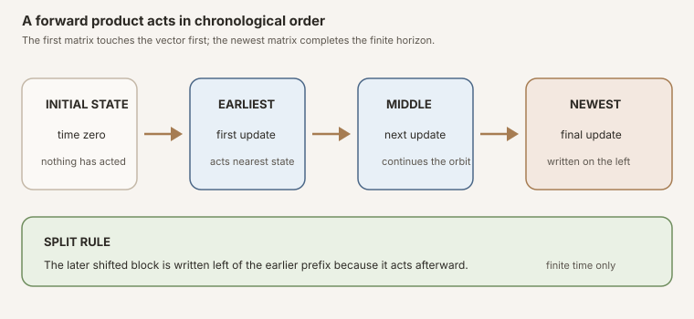


**AI-use disclosure.** Generative-AI tools helped draft, revise, illustrate,
and review this note. The author selected the questions, shaped the
exposition, has inspected the sources and artifacts cited here, and is
responsible for the final text and claims. This is an independent,
non-peer-reviewed Research Note. Verify claims against the cited primary
sources and any released artifacts before relying on them.



**Editorial status.** This teaching chapter remains a draft while human
editorial acceptance and the separate scientific-integrity and zero-context
expert-reader reviews are pending. The checked Lean source is authoritative
for every theorem statement.



**Abstract.** Consider a time-dependent linear recurrence
\(x_{k+1}=A_kx_k\). The matrix carrying \(x_0\) to time \(k\) is not written
\(A_0A_1\cdots A_{k-1}\). It is
\(A_{k-1}\cdots A_1A_0\), because the first factor to act sits nearest the
vector. The module fixes this forward convention with an identity at time
zero, computes its first steps, proves an exact shifted split, recovers
ordinary powers for constant systems, and records the corresponding
matrix-vector recursion.

The algebraic layer needs only a finite index type, decidable equality, and a
semiring of scalars. The analytic layer is separate. For a real-or-complex
scalar type and a nonempty finite index type, the scope
<code>Matrix.Norms.Operator</code> gives matrices the maximum-row-sum norm
induced by the vector supremum norm. Submultiplicativity yields a product of
factor norms. A uniform bound on the prefix \(0,\ldots,k-1\) yields \(C^k\),
and the induced-norm inequality transfers both estimates to every vector.

The source exports thirteen declarations. It introduces no random matrices,
measurability, independence, base transformation, logarithmic growth,
Lyapunov exponent, subadditive limit, or multiplicative ergodic theorem.


This is the proof-to-prose companion for
<code>formalization/NonlinearDynamics/Random/MatrixProducts/FiniteProducts.lean</code>.
It covers all thirteen public declarations in source order. There are no
private declarations in the module.

The preceding chapter,
[Finite Gaussian Unitary Ensemble Spectral Laws in Lean](),
completed the first finite random-matrix spectral-law interface. This chapter
begins a different dependency branch: deterministic products first, then
measurable random products and cocycles. The stable textbook treatments are
[Forward Matrix Product](),
[Induced Infinity Operator Norm](),
and
[Ordered Finite Matrix Products and Operator-Norm Growth]().

## Choose a route up

| Route | Begin | Destination |
|---|---|---|
| First encounter | [The recurrence behind the product](#the-recurrence-behind-the-product) | See why written order and action order point in opposite directions |
| Algebra route | [The first four horizons](#the-first-four-horizons) | Read the recursion, split law, and constant-system power law |
| Dynamics route | [Vectors experience chronological time](#vectors-experience-chronological-time) | Connect matrix products to a nonautonomous orbit |
| Analysis route | [Which norm is actually active?](#which-norm-is-actually-active) | Derive the maximum-row-sum induced norm and all four estimates |
| Lean route | [The complete declaration map](#the-complete-declaration-map) | Audit every public name and proof engine |
| Integrity route | [Strict nonclaims](#strict-nonclaims) | Separate finite deterministic control from random and asymptotic theory |

### Learning objectives

By the summit, a reader should be able to:

1. state the forward-product recurrence and its time-zero value;
2. expand the horizons zero through three without reversing a factor;
3. explain why the newest factor is written on the left;
4. connect the written product to chronological matrix-vector action;
5. state the shifted add-split theorem with the later block on the left;
6. test that split at both boundary cases;
7. recover ordinary matrix powers from a constant sequence;
8. explain why the identity sequence stays the identity;
9. distinguish the semiring assumptions from the analytic assumptions;
10. identify the matrix norm selected by
    <code>Matrix.Norms.Operator</code>;
11. distinguish that norm from Frobenius, spectral, and entrywise norms;
12. explain exactly where positive dimension enters the current interface;
13. prove a product-of-factor-norms upper bound by induction;
14. pass from pointwise factor control to a power bound;
15. explain why the power theorem needs no separate hypothesis
    \(0\le C\);
16. transfer both matrix estimates to vector orbits;
17. identify which real Jacobian and complex transfer-matrix applications
    share this interface;
18. inspect all thirteen Lean declarations at the command line; and
19. state what additional structure random or asymptotic theorems still need.

### Lineage, contribution, and boundary

Ordered products of linear maps are standard in nonautonomous dynamics,
derivative chains, transfer matrices, and random matrix theory. The classical
random-product literature asks what happens after randomness, integrability,
and long-time limits are added; Furstenberg and Kesten's original product
paper is one landmark ([Furstenberg and Kesten, 1960](#ref-furstenberg-kesten)).
This chapter does not claim to invent finite product estimates or to formalize
that asymptotic theory.

The local contribution is a small, declaration-complete Lean interface with
one frozen time-order convention. It deliberately generalizes the algebraic
core to arbitrary semiring scalars, so later real Jacobian chains and complex
transfer matrices can share it. It then chooses one precise analytic norm and
proves four finite-time upper bounds. The result is infrastructure, not a
random-product theorem.

## The recurrence behind the product

Let \(\iota\) be a finite coordinate type and let
\(A_k\) be a square matrix whose rows and columns are indexed by \(\iota\).
The source defines

\[
  P_A(0)=I,
  \qquad
  P_A(k+1)=A_kP_A(k).
\]

The identity at zero is essential. It makes an empty product total, gives
induction a clean base case, and says that advancing through no time steps
changes no state. The successor rule prepends the newest factor. It does not
append that factor on the right.

In Lean, the entire definition is a recursion on the horizon:

~~~lean
def forwardProduct (A : ℕ → Matrix ι ι 𝕜) : ℕ → Matrix ι ι 𝕜
  | 0 => 1
  | k + 1 => A k * forwardProduct A k
~~~

This definition uses no topology, norm, probability, or field division. A
<code>Semiring 𝕜</code> supplies zero, one, addition, multiplication, and the
laws needed for finite matrix multiplication. Matrix multiplication can still
be noncommutative even when the scalar semiring is commutative.

Figure: action proceeds from the initial vector through the earliest factor to the newest one. Written matrix composition therefore places the shifted later block on the left. The plate communicates order only; it does not assert randomness, invertibility, or long-time behavior.

## The first four horizons

Unfolding the recursion once at a time gives the safest order audit:

\[
\begin{aligned}
P_A(0) &{}= I,\\
P_A(1) &{}= A_0,\\
P_A(2) &{}= A_1A_0,\\
P_A(3) &{}= A_2A_1A_0.
\end{aligned}
\]

Read the last line from right to left when it acts on a vector. The vector
meets \(A_0\) first, then \(A_1\), then \(A_2\). The leftmost matrix is newest
in time but last in action.

The first three public facts are almost definitionally exact:

- <code>forwardProduct_zero</code> exposes \(P_A(0)=I\);
- <code>forwardProduct_succ</code> exposes
  \(P_A(k+1)=A_kP_A(k)\); and
- <code>forwardProduct_one</code> simplifies the first nonempty horizon to
  \(A_0\).

The zero and successor theorems are marked <code>@[simp]</code>. They let
Lean's simplifier reduce boundary values without reopening the definition in
every downstream proof.


**Notation trap.** The subscript labels time, not a matrix entry. In
\(A_2A_1A_0\), the factor with the largest time index is on the left. Replacing
the recurrence by \(P_A(k+1)=P_A(k)A_k\) would describe a different convention
and reverse the state-action story.


## Vectors experience chronological time

Suppose a state follows

\[
  x_{k+1}=A_kx_k.
\]

Then the first steps are

\[
  x_1=A_0x_0,
  \qquad
  x_2=A_1(A_0x_0),
  \qquad
  x_3=A_2(A_1(A_0x_0)).
\]

Associativity of matrix action turns the last expression into
\((A_2A_1A_0)x_0\). The theorem
<code>forwardProduct_mulVec_succ</code> records the one-step mechanism:

~~~lean
theorem forwardProduct_mulVec_succ
    (A : ℕ → Matrix ι ι 𝕜) (k : ℕ) (x : ι → 𝕜) :
    forwardProduct A (k + 1) *ᵥ x =
      A k *ᵥ (forwardProduct A k *ᵥ x)
~~~

The proof rewrites the successor product and then applies
<code>Matrix.mulVec_mulVec</code>, Mathlib's matrix-action associativity law
([Mathlib matrix multiplication](#ref-mathlib-mul)). Its companion
<code>forwardProduct_mulVec_zero</code> says that the zero-horizon identity
matrix leaves every vector fixed.

The source does not define a separate orbit object here. It gives later orbit
modules the exact algebraic facts needed to build one without committing this
foundational file to a particular state-space abstraction.

## Splitting time without reversing it

A useful product must be splittable. Fix an earlier horizon \(m\), then take
another \(k\) steps. Define the shifted sequence

\[
  A^{(m)}_j=A_{m+j}.
\]

The exact concatenation law is

\[
  P_A(m+k)=P_{A^{(m)}}(k)P_A(m).
\]

The earlier prefix \(P_A(m)\) sits on the right because it acts first. The
later shifted block sits on the left because it acts afterward. For
\(m=2\) and \(k=3\), the theorem reads

\[
  A_4A_3A_2A_1A_0 =
  (A_4A_3A_2)(A_1A_0).
\]

This concrete expansion is the quickest test of any proposed split formula.
A formula placing \(P_A(m)\) on the left is wrong for the chosen convention
unless all factors happen to commute.

The public theorem is <code>forwardProduct_add</code>:

~~~lean
theorem forwardProduct_add (A : ℕ → Matrix ι ι 𝕜) (m k : ℕ) :
    forwardProduct A (m + k) =
      forwardProduct (fun j => A (m + j)) k * forwardProduct A m
~~~

The name follows the natural-number argument being split. Its documentation
states the semantic content: split after \(m\) steps, shift the later block,
and keep that block on the left.

### Both boundary tests matter

If \(k=0\), the later block is the identity:

\[
  P_A(m+0)=IP_A(m)=P_A(m).
\]

If \(m=0\), the shifted sequence is the original sequence:

\[
  P_A(0+k)=P_A(k)I=P_A(k).
\]

The Lean proof inducts on \(k\). The base case is simplification. The successor
case uses <code>Nat.add_succ</code>, unfolds both successor products, substitutes
the induction hypothesis, and closes with associativity. It never commutes
matrix factors.

The split theorem and <code>Matrix.mulVec_mulVec</code> immediately derive the
useful vector identity

\[
  P_A(m+k)x =
  P_{A^{(m)}}(k)\bigl(P_A(m)x\bigr).
\]

That identity is intentionally not another public theorem in this minimal
slice. It is an exercise in composing the two exported interfaces.

## Constant systems recover powers

If every time step uses one fixed matrix \(B\), the nonautonomous notation
should collapse to the familiar autonomous one. The theorem
<code>forwardProduct_const</code> proves

\[
  P_{j\mapsto B}(k)=B^k.
\]

The proof is another induction. Its successor step has the left-recursive
shape \(BB^k\), so it uses Mathlib's <code>pow_succ'</code> orientation. No
commutativity of arbitrary matrices is assumed; every factor is the same
matrix.

Setting \(B=I\) gives

\[
  P_{j\mapsto I}(k)=I.
\]

The source keeps that corollary as the named theorem
<code>forwardProduct_const_one</code>. Although simplification can already
derive it from <code>forwardProduct_const</code>, the explicit name is a useful
sanity check and a discoverable interface for identity dynamics.

## An assumption ledger with two floors

The file is organized so algebra does not inherit analysis accidentally.

| Layer | Lean assumptions | What they buy | What they do not buy |
|---|---|---|---|
| Shared matrix shape | <code>[Fintype ι] [DecidableEq ι]</code> | Finite index enumeration and decidable diagonal equality used by multiplication and identity | A chosen numerical dimension or an ordering of coordinates |
| Algebra | <code>[Semiring 𝕜]</code> | Products, powers, identities, and matrix-vector action | Subtraction, division, topology, norms, probability |
| Analysis | <code>[RCLike 𝕜] [Nonempty ι]</code> | Real-or-complex normed-field structure and normalized identity norm in positive finite dimension | Randomness, measurability, invertibility, limits |

The generic scalar parameter matters. Real Jacobian chains naturally use
\(\mathbb R\), while quantum or wave transfer matrices often use
\(\mathbb C\). Both share the same algebraic recursion. The
<code>RCLike</code> typeclass covers precisely those two analytic scalar
settings for this module's norm proofs.

The source also does not force \(\iota=\operatorname{Fin}(n)\). Any finite
coordinate type works. That flexibility lets later modules use structured
finite indices without reindexing every matrix before taking a product.

## Which norm is actually active?

Matrix notation such as \(\lVert A\rVert\) is ambiguous until a norm scope is
fixed. This file opens

~~~lean
open scoped BigOperators Matrix Matrix.Norms.Operator
~~~

The final scope selects Mathlib's induced infinity operator norm. For a vector
\(x:\iota\to\mathbb K\), the function-space norm is the supremum norm

\[
  \lVert x\rVert_\infty=\max_{i\in\iota}|x_i|.
\]

For a matrix \(A\), the induced norm is the maximum absolute row sum

\[
  \lVert A\rVert_{\infty\to\infty} =
  \max_{i\in\iota}\sum_{j\in\iota}|A_{ij}|.
\]

Mathlib implements the same quantity as an outer finite supremum of inner row
sums and proves that it agrees with the operator norm of the corresponding
continuous linear map. The exact pinned API lives in
<code>Mathlib.Analysis.Matrix.Normed</code>
([official documentation](#ref-mathlib-normed)).

### Four nearby norms that are not interchangeable

| Name | Typical expression | Is it active here? |
|---|---|---|
| Maximum-row-sum induced norm | \(\max_i\sum_j|A_{ij}|\) | Yes |
| Euclidean spectral operator norm | largest singular value | No |
| Frobenius norm | \((\sum_{i,j}|A_{ij}|^2)^{1/2}\) | No |
| Entrywise maximum | \(\max_{i,j}|A_{ij}|\) | No |

The words "operator norm" alone are not enough. An operator norm depends on
the vector norms in its domain and codomain. Here both are supremum norms, so
the resulting matrix formula is a maximum row sum. A future theorem under a
Euclidean operator-norm scope would be a distinct result and should have a
distinct name.


**Do not read singular values into these theorems.** The source proves
maximum-row-sum control. It neither computes nor bounds the largest singular
value by a named theorem, and it does not switch to the Frobenius norm used by
the earlier Gaussian ensemble geometry modules.


## Why positive dimension is visible

The analytic section assumes <code>[Nonempty ι]</code>. In a nonempty finite
coordinate space, the identity operator has norm one:

\[
  \lVert I\rVert_{\infty\to\infty}=1.
\]

That normalization closes the time-zero base case of the product bound. In
Mathlib, the relevant <code>NormOneClass</code> instance for this matrix norm
also carries the <code>Nonempty</code> assumption, so the Lean interface makes
it visible rather than relying on a hidden dimension convention.

An empty index type behaves differently. There is only one empty square
matrix; its identity and zero matrices coincide, and the finite row supremum
is zero. The upper inequalities are not thereby mathematically false. Rather,
the current analytic API chooses the familiar normalized identity statement
\(\lVert I\rVert=1\), so it works in positive finite dimension. This chapter
does not claim <code>Nonempty</code> is the weakest conceivable assumption for
every inequality.

## Bound one: multiply the factor norms

Submultiplicativity says

\[
  \lVert AB\rVert_{\infty\to\infty}
  \le
  \lVert A\rVert_{\infty\to\infty}
  \lVert B\rVert_{\infty\to\infty}.
\]

Induction on the recurrence then yields

\[
  \lVert P_A(k)\rVert_{\infty\to\infty}
  \le
  \prod_{j\lt k}\lVert A_j\rVert_{\infty\to\infty}.
\]

This is <code>linfty_opNorm_forwardProduct_le_prod</code>. Its proof has four
moves:

1. at zero, simplify the identity norm and the empty scalar product to one;
2. at a successor, rewrite \(P_A(k+1)=A_kP_A(k)\);
3. apply matrix-norm submultiplicativity and the induction hypothesis; and
4. commute only the two nonnegative real norm factors so the expression
   matches <code>Finset.prod_range_succ</code>.

The fourth move is easy to misread. The proof never claims
\(A_kP_A(k)=P_A(k)A_k\). Matrices remain ordered. Their norms are real numbers,
and multiplication of those scalar bounds is commutative.

## Bound two: a uniform prefix budget becomes a power

Assume every factor used before horizon \(k\) obeys

\[
  \forall j\lt k,\qquad \lVert A_j\rVert_{\infty\to\infty}\le C.
\]

Termwise comparison of the finite scalar products gives

\[
  \prod_{j\lt k}\lVert A_j\rVert_{\infty\to\infty}
  \le
  \prod_{j\lt k} C
  = C^k.
\]

Composing this with the first bound produces

\[
  \lVert P_A(k)\rVert_{\infty\to\infty}\le C^k.
\]

The theorem is <code>linfty_opNorm_forwardProduct_le_pow</code>. Notice that
its hypothesis controls only the prefix actually used. It does not require a
global assertion about \(A_j\) for all future times.

### Why there is no separate nonnegativity hypothesis on \(C\)

The theorem does not ask for \(0\le C\). That omission is mathematically
sound.

- If \(k=0\), the factor hypothesis is vacuous and \(C^0=1\) for every real
  \(C\). The claim is \(\lVert I\rVert\le1\).
- If \(k\gt0\), then \(j=0\) lies in the controlled prefix. Since norms are
  nonnegative and \(\lVert A_0\rVert\le C\), the hypothesis itself forces
  \(C\ge0\).

Lean's proof can pass directly through <code>Finset.prod_le_prod</code> using
factor nonnegativity and the supplied pointwise inequalities. Adding a
separate <code>0 ≤ C</code> argument would be redundant for positive horizons
and unnecessarily restrictive at the empty horizon.

## Bounds three and four: control every vector orbit

The induced norm is designed to control action:

\[
  \lVert Ax\rVert_\infty
  \le
  \lVert A\rVert_{\infty\to\infty}\lVert x\rVert_\infty.
\]

Apply that inequality with \(A=P_A(k)\), then substitute either matrix bound.
The result is

\[
  \lVert P_A(k)x\rVert_\infty
  \le
  \left(\prod_{j\lt k}\lVert A_j\rVert_{\infty\to\infty}\right)
  \lVert x\rVert_\infty,
\]

exported as
<code>linfty_opNorm_forwardProduct_mulVec_le_prod</code>, and

\[
  \lVert P_A(k)x\rVert_\infty
  \le C^k\lVert x\rVert_\infty,
\]

exported as
<code>linfty_opNorm_forwardProduct_mulVec_le_pow</code> under the same prefix
hypothesis.

Both proofs begin with <code>Matrix.linfty_opNorm_mulVec</code>. They multiply
the previously established matrix inequality by the nonnegative number
\(\lVert x\rVert\). Nothing in either theorem supplies a matching lower bound
or says that the estimate is sharp.

### What the bounds mean for dynamics

For a differentiable discrete system, a derivative along an orbit often
forms a chain

\[
  Df(x_{k-1})\cdots Df(x_1)Df(x_0).
\]

The order is exactly the forward convention. The finite product estimates can
therefore become one ingredient in later stability or sensitivity theorems.
But this module does not define derivatives, choose an orbit, or infer
stability from an upper bound. In particular, \(C\gt1\) permits growth, and an
upper estimate with \(C\lt1\) becomes a contraction statement only after the
later theorem supplies the relevant hypotheses and interpretation.

For a constant matrix \(B\), the power theorem reduces to the familiar
estimate \(\lVert B^k\rVert\le\lVert B\rVert^k\). For a genuinely
time-dependent system, the product-of-norms theorem retains the individual
finite-time budget and can be much more informative than replacing every
factor by one worst-case constant.

## The complete declaration map

The module exports exactly thirteen public declarations and no private helper.
The table follows source order.

| Declaration | Assumption floor | Exact role | Proof engine |
|---|---|---|---|
| <code>forwardProduct</code> | <code>Semiring 𝕜</code> | Defines the identity-at-zero, newest-factor-left product | Recursion on the natural horizon |
| <code>forwardProduct_zero</code> | <code>Semiring 𝕜</code> | Exposes the empty product as the identity | Definitional equality |
| <code>forwardProduct_succ</code> | <code>Semiring 𝕜</code> | Exposes the successor recurrence | Definitional equality |
| <code>forwardProduct_add</code> | <code>Semiring 𝕜</code> | Splits after \(m\) steps with the shifted later block on the left | Induction on the later length and associativity |
| <code>forwardProduct_one</code> | <code>Semiring 𝕜</code> | Computes the one-step product as \(A_0\) | Simplification of the recurrence |
| <code>forwardProduct_const</code> | <code>Semiring 𝕜</code> | Identifies a constant matrix sequence with ordinary powers | Induction and <code>pow_succ'</code> |
| <code>forwardProduct_const_one</code> | <code>Semiring 𝕜</code> | Shows the identity sequence stays identity | Constant theorem and simplification |
| <code>forwardProduct_mulVec_zero</code> | <code>Semiring 𝕜</code> | Shows the zero-horizon product fixes every vector | Identity matrix action |
| <code>forwardProduct_mulVec_succ</code> | <code>Semiring 𝕜</code> | Reassociates successor product action into chronological action | <code>Matrix.mulVec_mulVec</code> |
| <code>linfty_opNorm_forwardProduct_le_prod</code> | <code>RCLike 𝕜</code>, <code>Nonempty ι</code> | Bounds product norm by the finite product of factor norms | Induction, submultiplicativity, and scalar monotonicity |
| <code>linfty_opNorm_forwardProduct_le_pow</code> | <code>RCLike 𝕜</code>, <code>Nonempty ι</code> | Converts a uniform prefix bound into \(C^k\) | Finite-product comparison |
| <code>linfty_opNorm_forwardProduct_mulVec_le_prod</code> | <code>RCLike 𝕜</code>, <code>Nonempty ι</code> | Transfers the factor-product estimate to every vector | Induced operator-norm action bound |
| <code>linfty_opNorm_forwardProduct_mulVec_le_pow</code> | <code>RCLike 𝕜</code>, <code>Nonempty ι</code> | Transfers the uniform power estimate to every vector | Induced action bound and the preceding power theorem |

The namespace is
<code>NonlinearDynamics.Random.MatrixProducts</code>. The presence of
<code>Random</code> in the namespace locates the future application branch; it
does not make any declaration in this file probabilistic.

## Lean proof engineering

### Why recurse on the horizon rather than a finite list?

The intended downstream object is a time-indexed family \(A:\mathbb N\to
\operatorname{Matrix}\). Recursion on \(k\) makes the factor at the newest
time available exactly where the successor equation needs it. A list product
could encode the same finite sequence, but it would require repeated
conversion between natural-time indexing, prefixes, and list reversal.

### Why is the split theorem proved by induction on the later block?

Holding \(m\) fixed makes the shift \(j\mapsto m+j\) stable. Each successor
adds exactly the next matrix \(A_{m+k}\) to the left. Inducting on the earlier
block would obscure that chronological step and complicate the shifted index.

### Why are the norm theorem names long?

The prefix <code>linfty_opNorm</code> is claim discipline. Matrix norms are not
unique, and later work may need Frobenius or Euclidean spectral estimates. The
name prevents a downstream reader from silently importing a stronger norm
interpretation than Lean proved.

### Why use <code>RCLike</code> rather than hard-code complex matrices?

The algebraic recursion is shared by real and complex dynamics. The analytic
proofs need standard absolute values, normed-field structure, and the Mathlib
matrix norm instances. <code>RCLike</code> supplies that common real-or-complex
surface without duplicating four theorems.

### Why does the product proof commute something at the end?

<code>Finset.prod_range_succ</code> presents the new scalar factor at one end,
while submultiplicativity naturally produces it at the other. The proof uses
<code>mul_comm</code> only after matrices have become real norms. Matrix order
never changes.

### Why not export every easy corollary?

Two-step expansion, vector splitting, the zero-horizon norm, and constant
vector bounds are all short consequences. Keeping them out of this first API
reduces maintenance while the foundational convention settles. A later module
should add a named corollary when a real downstream proof repeatedly needs it,
not merely because it is provable.

## How to run the checked source

Compile the module directly with every warning promoted to an error:

~~~sh
source "$HOME/.elan/env"
cd formalization
lake env lean -DwarningAsError=true \
  NonlinearDynamics/Random/MatrixProducts/FiniteProducts.lean
~~~

Build the complete Lean library:

~~~sh
source "$HOME/.elan/env"
cd formalization
lake build
~~~

From the repository root, run the proof-to-prose and Hugo gates:

~~~sh
make check
~~~

This import-level snippet checks all thirteen public declarations:

~~~lean
import NonlinearDynamics.Random.MatrixProducts.FiniteProducts

open scoped BigOperators Matrix Matrix.Norms.Operator
open NonlinearDynamics.Random.MatrixProducts

#check forwardProduct
#check forwardProduct_zero
#check forwardProduct_succ
#check forwardProduct_add
#check forwardProduct_one
#check forwardProduct_const
#check forwardProduct_const_one
#check forwardProduct_mulVec_zero
#check forwardProduct_mulVec_succ
#check linfty_opNorm_forwardProduct_le_prod
#check linfty_opNorm_forwardProduct_le_pow
#check linfty_opNorm_forwardProduct_mulVec_le_prod
#check linfty_opNorm_forwardProduct_mulVec_le_pow
~~~

Save the snippet inside <code>formalization</code> and run
<code>lake env lean path/to/Scratch.lean</code>.

Useful local Mathlib reconnaissance:

~~~sh
rg -n "linfty_opNorm_def|linfty_opNorm_mul|linfty_opNorm_mulVec" \
  formalization/.lake/packages/mathlib/Mathlib/Analysis/Matrix/Normed.lean

rg -n "mulVec_mulVec" \
  formalization/.lake/packages/mathlib/Mathlib/Data/Matrix/Mul.lean
~~~

The pinned local
[Mathlib 4.32.0 release](#ref-mathlib-release) checkout is the exact API
authority. Online documentation is a navigation aid, not a replacement for
compiling against the selected source.

## Common failure modes

### Appending the newest factor on the right

Defining \(P_A(k+1)=P_A(k)A_k\) is internally consistent but does not match the
chronological column-vector action used here. It makes \(A_k\) act first on a
vector. Audit \(P_A(3)\) before proving anything downstream.

### Putting the earlier prefix on the left in the split

The wrong formula often looks plausible because scalar multiplication is
commutative. Matrix multiplication is not. Expand the \(m=2,k=3\) example:
the later block must be \(A_4A_3A_2\) on the left.

### Commuting matrices because their norms commute

The norm proof ends with a scalar <code>mul_comm</code>. That licenses only a
reordering of real upper-bound factors. It says nothing about the underlying
matrices.

### Calling the active norm spectral or Frobenius

The selected norm is maximum row sum, induced by vector supremum norms.
Singular-value and Frobenius arguments live under different definitions and
scopes.

### Hiding the empty-index boundary

The analytic theorems assume <code>Nonempty ι</code> so the identity norm is
one. Deleting that hypothesis without redesigning the base case confuses the
empty matrix space with ordinary positive dimension.

### Adding a redundant hypothesis \(0\le C\)

The existing theorem is stronger at horizon zero and already forces
nonnegativity at every positive horizon. A downstream corollary may carry
<code>0 ≤ C</code> because it is convenient, but it should not be reported as
an assumption of this declaration.

### Reading the prefix hypothesis globally

<code>∀ j &lt; k, ‖A j‖ ≤ C</code> controls exactly the factors appearing in
\(P_A(k)\). It makes no statement about \(A_k,A_{k+1},\ldots\).

### Turning an upper bound into an exponent

A finite inequality is not a limit. Taking logarithms may fail when a product
norm is zero, and dividing by time does not prove convergence. Random and
ergodic hypotheses are entirely absent.

### Treating the namespace as a theorem assumption

The file lives under <code>Random.MatrixProducts</code> because that is one
planned consumer. Its inputs are ordinary deterministic matrix sequences.
No sample space appears in any declaration.

## Strict nonclaims

This module proves a deterministic finite-time interface. It does not prove or
define:

- a random matrix sequence, probability law, measurable matrix process,
  independence, stationarity, or expectation;
- a base dynamical system, shift map, or measurable cocycle equation;
- invertibility, negative time, or a two-sided product;
- logarithms of norms, including any convention for a zero product;
- a subadditive limit, limsup formula, or almost-sure growth rate;
- a Lyapunov exponent, Lyapunov splitting, Furstenberg-Kesten theorem, or
  multiplicative ergodic theorem;
- a lower growth bound, equality case, sharpness result, contraction theorem,
  or stability conclusion;
- spectral-radius, eigenvalue, singular-value, determinant, or trace control;
- a Frobenius-norm or Euclidean spectral-norm estimate;
- an equivalence between different finite-dimensional norms;
- convergence of an infinite product;
- rectangular matrix products with changing intermediate index types;
- commutativity, Hermiticity, normality, unitarity, positivity, or symplectic
  structure of the factors; or
- a numerical multiplication algorithm, conditioning estimate, or rounding
  error analysis.

The four exported inequalities are upper bounds in one named norm. They are
building blocks for later theorems, not substitutes for those theorems.

## Exercises with solutions

### Exercise 1: expand the recurrence

Write \(P_A(4)\) without product notation.

**Solution.**
\[
  P_A(4)=A_3A_2A_1A_0.
\]
Each successor adds the newest factor on the left.

### Exercise 2: follow a vector

In what order do the factors of \(P_A(4)\) act on \(x\)?

**Solution.** \(A_0\) acts first, then \(A_1\), then \(A_2\), then \(A_3\).
Written order is the reverse of action order.

### Exercise 3: audit a shifted split

Expand the split theorem at \(m=1\) and \(k=3\).

**Solution.**
\[
  P_A(4)=(A_3A_2A_1)A_0.
\]
The shifted sequence begins at time one, and its three-step product is the
left block.

### Exercise 4: derive vector splitting

Combine <code>forwardProduct_add</code> with
<code>Matrix.mulVec_mulVec</code>.

**Solution.** If \(A^{(m)}_j=A_{m+j}\), then
\[
  P_A(m+k)x=P_{A^{(m)}}(k)(P_A(m)x).
\]
The earlier prefix acts first.

### Exercise 5: specialize to a constant matrix

What does the split theorem become when \(A_j=B\) for every \(j\)?

**Solution.** It becomes
\[
  B^{m+k}=B^kB^m.
\]
Because both factors are powers of the same matrix, this agrees with the usual
power law.

### Exercise 6: compute the active norm

For the real matrix
\[
  A=\begin{pmatrix}1&-2\\3&4\end{pmatrix},
\]
what is the maximum-row-sum operator norm?

**Solution.** The absolute row sums are \(1+2=3\) and \(3+4=7\), so
\(\lVert A\rVert_{\infty\to\infty}=7\). This calculation does not compute the
Euclidean spectral norm.

### Exercise 7: apply the product bound

Suppose the first three factor norms are at most \(2\), \(1/2\), and \(3\).
What finite-time upper bound follows for \(\lVert P_A(3)\rVert\)?

**Solution.** The product theorem gives at most
\(2\cdot(1/2)\cdot3=3\). Replacing every factor by the worst bound \(3\) would
give \(27\), which is valid but less informative.

### Exercise 8: explain the sign of \(C\)

Could the hypotheses of the power theorem hold with \(k=2\) and \(C=-1\)?

**Solution.** No. They would include \(\lVert A_0\rVert\le-1\), contradicting
nonnegativity of norms. At \(k=0\), however, the factor hypothesis is empty and
the theorem correctly allows any \(C\).

### Exercise 9: transfer to a state

If \(\lVert A_j\rVert\le0.9\) for every \(j\lt k\), what does the final theorem
say about a vector \(x\)?

**Solution.** It says
\[
  \lVert P_A(k)x\rVert_\infty\le0.9^k\lVert x\rVert_\infty.
\]
The module itself does not package this as a nonlinear stability theorem.

### Exercise 10: identify the assumption floor

Which declarations remain available for matrices over the natural numbers?

**Solution.** All nine algebraic declarations, from
<code>forwardProduct</code> through <code>forwardProduct_mulVec_succ</code>, use
only a semiring. The four analytic norm declarations require
<code>RCLike</code>, so they do not apply to natural-number scalars as stated.

### Exercise 11: inspect dimension zero

Why is <code>Nonempty ι</code> not present on <code>forwardProduct_zero</code>?

**Solution.** The algebraic identity exists even for the empty matrix type.
Positive dimension is introduced only when the analytic layer wants the
standard normalized identity norm at its induction base.

### Exercise 12: test an overclaim

Does \(\lVert P_A(k)\rVert\le C^k\) prove that
\(k^{-1}\log\lVert P_A(k)\rVert\) converges?

**Solution.** No. The norm may vanish, the logarithm then needs a convention,
and one upper estimate gives neither existence nor identification of a limit.
Random-product and ergodic theorems require substantial additional structure.

## The next ridge

The ordered finite product is now stable enough to serve several branches.
One branch can define matrix cocycles over a base transformation and prove the
finite cocycle equation from <code>forwardProduct_add</code>. Another can make
the matrix sequence random, prove measurability of every finite product, and
state integrability hypotheses for logarithmic norms. The deterministic branch
can reuse the same order for Jacobian chains in finite-time stability and
sensitivity estimates.

The dependency order matters. A measurable random product needs this product
map first. A Lyapunov-growth theorem additionally needs a logarithmic
observable, zero handling, integrability, and a limit theorem. A
multiplicative ergodic theorem needs still more, including a base dynamical
system and the hypotheses that support invariant asymptotic subspaces. None of
those layers should be inferred from the four bounds proved here.

## References

The links below were checked on 2026-07-21. The pinned local Mathlib 4.32.0
checkout remains the exact API authority for the Lean proof.

**Mathlib contributors.**
[Mathlib 4.32.0 release](https://github.com/leanprover-community/mathlib4/releases/tag/v4.32.0),
2026. This is the dependency release selected by
<code>formalization/lakefile.toml</code>.

**Mathlib contributors.**
[Matrix multiplication](https://leanprover-community.github.io/mathlib4_docs/Mathlib/Data/Matrix/Mul.html),
Mathlib 4 documentation. This official page defines matrix multiplication,
<code>Matrix.mulVec</code>, and <code>Matrix.mulVec_mulVec</code>, the action
associativity theorem used by the vector recursion.

**Mathlib contributors.**
[Matrices as normed spaces](https://leanprover-community.github.io/mathlib4_docs/Mathlib/Analysis/Matrix/Normed.html),
Mathlib 4 documentation. This official page defines the maximum-row-sum matrix
norm under <code>Matrix.Norms.Operator</code>, proves matrix
submultiplicativity and the matrix-vector estimate, supplies the positive-
dimension identity normalization, and identifies the matrix norm with the
corresponding continuous-linear-map operator norm.

**Harry Furstenberg and Harry Kesten.**
["Products of Random Matrices"](https://doi.org/10.1214/aoms/1177705909),
*The Annals of Mathematical Statistics* 31(2), 457-469, 1960. This original
paper is cited only as historical context for the later random and asymptotic
program. The present Lean module proves no theorem from that paper.
